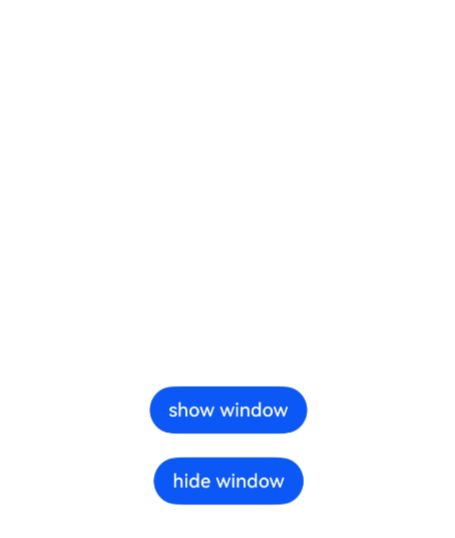
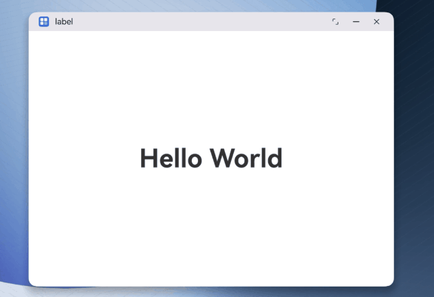

# Setting Window Animation Effects (ArkTS)

<!--Kit: ArkUI-->
<!--Subsystem: Window-->
<!--Owner: @gcw_bkPrirku-->
<!--Designer: @shinmy-->
<!--Tester: @qinliwen0417-->
<!--Adviser: @ge-yafang-->
<!-- md-trans-meta sourceCommit=58ff40ad92758153f7b55166a9e6e0a0e9be5d28 translatedAt=2026-07-13T09:19:26.328Z pushedAt=2026-07-13T10:25:59.924Z -->

## When to Use

Window animation effects refer to the transition animation effects during window display, hiding, and switching processes. To make these processes more natural and smooth, and to avoid abrupt interface switching, the system provides transition animation support. At the same time, to meet your customization needs, the system also provides the ability to customize window animation effects.

The following are several typical scenarios that support custom window animation effects:

<!--Del-->

- [Setting Window Show/Hide Animation Effects](#setting-window-showhide-animation-effects)

<!--DelEnd-->

- [Setting the fade in/out animation effect for UIAbility component startup within the Settings app](#setting-the-fade-inout-animation-effect-for-uiability-component-startup-within-the-settings-app)

- [Setting the Transition Animation When the Main Window Is Destroyed](#setting-the-transition-animation-when-the-main-window-is-destroyed)

<!--Del-->

## Setting Window Show/Hide Animation Effects

Window show/hide animation effects are supported. Currently supported window types are as follows:

- Global floating window

- Modal window

- System window: includes volume bar, wallpaper, notification panel, navigation bar windows, etc. For details about system window types, see [WindowType](../reference/apis-arkui/js-apis-window-sys.md#windowtype7).

Here, taking the creation of a "system window with configurable window level" as an example, set the combined animation effect during its show/hide process.

1. Obtain the window property transition controller.

   Obtain the controller through the [getTransitionController()](../reference/apis-arkui/js-apis-window-sys.md#gettransitioncontroller9) API. Subsequent animation operations are all completed by the property controller.

   <!-- @[window_animation_config](https://gitcode.com/openharmony/applications_app_samples/blob/master/code/DocsSample/ArkUISample/ArkUIWindowSamples/WindowAnimationSample/entry/src/main/ets/pages/AnimationConfig.ts) --> 

   ``` TypeScript
   import { window } from '@kit.ArkUI';
   
   export class AnimationConfig {
     private animationForShownCallFunc_: ((context : window.TransitionContext) => void) | undefined = undefined;
     private animationForHiddenCallFunc_: ((context : window.TransitionContext) => void) | undefined = undefined;
   
     ShowWindowWithCustomAnimation(windowClass: window.Window, callback: (context : window.TransitionContext) => void) {
       if (!windowClass) {
         console.error('windowClass is undefined');
         return false;
       }
       this.animationForShownCallFunc_ = callback;
       // 1. Obtain the window property transition controller.
       let controller: window.TransitionController = windowClass.getTransitionController();
       // Custom animation configuration when the window is shown.
       controller.animationForShown = (context : window.TransitionContext)=> {
         this.animationForShownCallFunc_(context);
       };
       // ...
     }
   
     // ...
   }
   ```

2. Configure the animation when the window is shown/hidden.

   Configure specific property animations via the animation function [animateTo()](../reference/apis-arkui/arkts-apis-uicontext-uicontext.md#animateto). You can set the window opacity via [opacity()](../reference/apis-arkui/js-apis-window-sys.md#opacity9), set scaling parameters via [scale()](../reference/apis-arkui/js-apis-window-sys.md#scale9), set rotation parameters via [rotate()](../reference/apis-arkui/js-apis-window-sys.md#rotate9), and set translation parameters via [translate()](../reference/apis-arkui/js-apis-window-sys.md#translate9).

   <!-- @[window_animation_show](https://gitcode.com/openharmony/applications_app_samples/blob/master/code/DocsSample/ArkUISample/ArkUIWindowSamples/WindowAnimationSample/entry/src/main/ets/pages/WindowAnimationDemo.ets) --> 

   ``` TypeScript
   import { window } from '@kit.ArkUI';
   import { common } from '@kit.AbilityKit';
   import { AnimationConfig } from './AnimationConfig';
   
   @Entry
   @Component
   struct WindowAnimationDemo {
     // ...
     showWindow() {
       let systemTypeWindow = window.findWindow('dynamicWindow'); // A system window needs to be obtained here.
       let animationConfig = new AnimationConfig();
       try {
         // Set the animation effect for the window display process.
         animationConfig?.ShowWindowWithCustomAnimation(systemTypeWindow, (context : window.TransitionContext)=>{
           let toWindow = context.toWindow;
           let sysWindowUIContext = systemTypeWindow.getUIContext();
           // 2. Configure specific property animations.
           sysWindowUIContext.animateTo({
             // ...
           }, () => {
             let translateObj : window.TranslateOptions = {
               x : 400.0,
               y : 400.0,
               z : 0.0
             };
             toWindow?.translate(translateObj); // Set translation parameters
             let rotateObj: window.RotateOptions = {
               x: 1.0,
               y: 1.0,
               z: 360.0,
               pivotX: 0.5,
               pivotY: 0.5
             };
             toWindow?.rotate(rotateObj); // Set rotation parameters
             let scaleObj: window.ScaleOptions = {
               x: 2.0,
               y: 2.0,
               pivotX: 0.5,
               pivotY: 0.5
             };
             toWindow?.scale(scaleObj); // Set scale parameters
             toWindow?.opacity(1); // Set opacity parameters
             console.info('animation end');
           });
           console.info('complete transition end');
         });
       } catch (error) {
         console.error(`ShowWindowWithCustomAnimation error code: ${error.code}, message: ${error.message}` );
       }
     }
     // ...
   }
   ```

3. Set the property transition to complete.

   Pass **true** to [completeTransition()](../reference/apis-arkui/js-apis-window-sys.md#completetransition9) to set the final completion state of the property transition. If **false** is passed, it means the transition is canceled.

   <!-- @[window_animation_complete_transition](https://gitcode.com/openharmony/applications_app_samples/blob/master/code/DocsSample/ArkUISample/ArkUIWindowSamples/WindowAnimationSample/entry/src/main/ets/pages/WindowAnimationDemo.ets) --> 

   ``` TypeScript
   struct WindowAnimationDemo {
     // ...
     showWindow() {
       // ...
       try {
         // Set the animation effect for the window display process.
         animationConfig?.ShowWindowWithCustomAnimation(systemTypeWindow, (context : window.TransitionContext)=>{
           let toWindow = context.toWindow;
           let sysWindowUIContext = systemTypeWindow.getUIContext();
           // 2. Configure specific property animations.
           sysWindowUIContext.animateTo({
             // ...
             onFinish: () => {
               console.info('onFinish in animation');
               // 3. Set the final completion state of the property transition.
               context.completeTransition(true);
             }
           }, () => {
             // ...
           });
           console.info('complete transition end');
         });
       } catch (error) {
         console.error(`ShowWindowWithCustomAnimation error code: ${error.code}, message: ${error.message}` );
       }
     }
     // ...
   }
   ```

4. Show or hide the current window, playing the animation during the process.

   Call the [showWithAnimation()](../reference/apis-arkui/js-apis-window-sys.md#showwithanimation9) API to show the window and play the animation. Call the [hideWithAnimation()](../reference/apis-arkui/js-apis-window-sys.md#hidewithanimation9) API to hide the window and play the animation.

   <!-- @[window_animation_play](https://gitcode.com/openharmony/applications_app_samples/blob/master/code/DocsSample/ArkUISample/ArkUIWindowSamples/WindowAnimationSample/entry/src/main/ets/pages/AnimationConfig.ts) --> 

   ``` TypeScript
   import { window } from '@kit.ArkUI';
   
   export class AnimationConfig {
     private animationForShownCallFunc_: ((context : window.TransitionContext) => void) | undefined = undefined;
     private animationForHiddenCallFunc_: ((context : window.TransitionContext) => void) | undefined = undefined;
   
     ShowWindowWithCustomAnimation(windowClass: window.Window, callback: (context : window.TransitionContext) => void) {
       // ...
       // Custom animation configuration when the window is shown.
       controller.animationForShown = (context : window.TransitionContext)=> {
         this.animationForShownCallFunc_(context);
       };
       // 4. Show the window and play the animation.
       windowClass.showWithAnimation(()=>{
         console.info('Show with animation success');
       });
     }
   
     // ...
   }
   ```



<!--DelEnd-->

## Setting the fade in/out animation effect for UIAbility component startup within the Settings app

When using the [startAbility()](../reference/apis-ability-kit/js-apis-inner-application-uiAbilityContext.md#startability-2) API to launch another UIAbility component within the same app, you can configure the window startup animation through [WindowCreateParams](../reference/apis-arkui/arkts-apis-window-i.md#windowcreateparams20) in [StartOptions](../reference/apis-ability-kit/js-apis-app-ability-startOptions.md).

Currently, the window startup animation can be configured as the fade in/out animation effect [FADE_IN_OUT](../reference/apis-arkui/arkts-apis-window-e.md#animationtype20).

The sample code is as follows:

<!-- @[window_animation_start_ability](https://gitcode.com/openharmony/applications_app_samples/blob/master/code/DocsSample/ArkUISample/ArkUIWindowSamples/StartAbilityWithFadeinoutSample/entry/src/main/ets/pages/Index.ets) --> 

``` TypeScript
import { Want, StartOptions, common } from '@kit.AbilityKit';
import { window } from '@kit.ArkUI';
import { BusinessError } from '@kit.BasicServicesKit';

@Entry
@Component
struct Index {
  private context = AppStorage.get('context') as common.UIAbilityContext;

  openAbility():void {
    let want: Want = {
      deviceId: '',
      bundleName: 'com.example.startabilitywithfadeinout',
      abilityName: 'FadeInOutAbility',
      moduleName: 'entry'
    };
    let options: StartOptions = {
      // Pass in the startup animation effect parameters.
      windowCreateParams: {
        animationParams : { type: window.AnimationType.FADE_IN_OUT },
      }
    }
    try {
      this.context.startAbility(want, options, (err: BusinessError) => {
        if (err.code) {
          // Handle service logic errors.
          console.error(`startAbility failed, code is ${err.code}, message is ${err.message}`);
          return;
        }
        // Execute normal service logic.
        console.info('startAbility succeed');
      });
    } catch (err) {
      // Handle input parameter error exceptions.
      let code = (err as BusinessError).code;
      let message = (err as BusinessError).message;
      console.error(`startAbility failed, code is ${code}, message is ${message}`);
    }
  }
  build() {
    RelativeContainer() {
      Column() {
        Button('startAbility').onClick(() => this.openAbility())
      }
      .height('100%')
      .width('100%')
      .justifyContent(FlexAlign.Center);
    }
    .height('100%')
    .width('100%')
  }
}
```


## Setting the Transition Animation When the Main Window Is Destroyed

In the [freeform window](window-terminology.md#freeform-window) state, the app uses [getWindowTransitionAnimation()](../reference/apis-arkui/arkts-apis-window-Window.md#getwindowtransitionanimation20) to obtain the animation configuration for the main window transition. When the current transition animation configuration does not meet service requirements, you can use the [setWindowTransitionAnimation()](../reference/apis-arkui/arkts-apis-window-Window.md#setwindowtransitionanimation20) API to configure the animation for window transitions. Currently, only the transition animation for window destruction is supported.

The sample code is as follows:

<!-- @[window_destroy_transition_animation](https://gitcode.com/openharmony/applications_app_samples/blob/master/code/DocsSample/ArkUISample/ArkUIWindowSamples/AppTransitionAnimationSample/entry/src/main/ets/entryability/EntryAbility.ets) --> 

``` TypeScript
import { UIAbility } from '@kit.AbilityKit';
import { hilog } from '@kit.PerformanceAnalysisKit';
import { window } from '@kit.ArkUI';

const DOMAIN = 0x0000;

export default class EntryAbility extends UIAbility {
  async onWindowStageCreate(windowStage: window.WindowStage): Promise<void> {
    try {
      // Get the main window.
      const windowClass = await windowStage.getMainWindow();

      // Configure the window destruction animation.
      this.setupWindowDestroyAnimation(windowClass);

      // Load the page.
      windowStage.loadContent('pages/Index', (err) => {
        if (err.code) {
          hilog.error(DOMAIN, 'testTag', 'Failed to load the content. Cause: %{public}s', JSON.stringify(err));
          return;
        }
        hilog.info(DOMAIN, 'testTag', 'Succeeded in loading the content.');
      });
    } catch (err) {
      console.error(`Failed to obtain the main window. Cause code: ${err.code}, message: ${err.message}`);
    }
  }

  private setupWindowDestroyAnimation(windowClass: window.Window): void {
    try {
      // Check if a destruction animation configuration already exists.
      const existingAnimation = windowClass.getWindowTransitionAnimation(
        window.WindowTransitionType.DESTROY
      );

      if (existingAnimation) {
        return;
      }

      // Configure the animation.
      const animationConfig: window.WindowAnimationConfig = {
        duration: 1000,
        curve: window.WindowAnimationCurve.LINEAR,
      };

      const transitionAnimation: window.TransitionAnimation = {
        opacity: 0.0,
        config: animationConfig
      };

      // Set an animation.
      windowClass.setWindowTransitionAnimation(
        window.WindowTransitionType.DESTROY,
        transitionAnimation
      ).then(() => {
        console.info('Succeeded in setting window transition animation');
      }).catch((err: BusinessError) => {
        console.error(`Failed to set window transition animation. Cause: ${err.message}`);
      });
    } catch (exception) {
      console.error(`Failed to setup window animation. Cause: ${exception.message}`);
    }
  }
}
```

