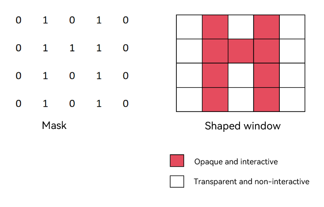
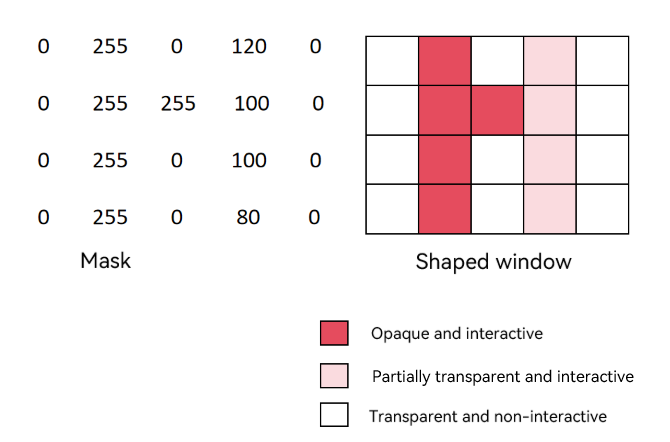

# Controlling Window Appearance (ArkTS)

<!--Kit: ArkUI-->
<!--Subsystem: Window-->
<!--Owner: @liu_hongxian-->
<!--Designer: @shinmy; @qinliwen0417-->
<!--Tester: @qinliwen0417-->
<!--Adviser: @ge-yafang-->
<!-- md-trans-meta sourceCommit=58ff40ad92758153f7b55166a9e6e0a0e9be5d28 translatedAt=2026-07-13T09:33:33.311Z pushedAt=2026-07-13T11:30:17.981Z -->

## When to Use

Window appearance describes the display form and visual effect of a window on the screen. Currently, you can set the window appearance by configuring shaped windows, window shadows, window rounded corners<!--Del--> and blur effects<!--DelEnd-->, as well as the window background color.

You can customize the window appearance based on UI design and interaction requirements. For example:

- Display a subwindow or global floating window as a shaped window by setting the window mask.

- Adjust the shadow effect of a subwindow or global floating window by setting the blur radius of the window edge shadow.<!--Del--> System apps can also set the color and offset of the window edge shadow.<!--DelEnd-->

- Adjust the edge display effect of a subwindow or global floating window by setting window rounded corners. <!--Del-->System apps can also set the blur radius of the window content and the blur radius of the window background. <!--DelEnd-->

- Make the window background consistent with the app page or theme style by setting the window background color.

## Shaped Window

A shaped window is a window with a non-rectangular shape, and a mask is used to describe the shape of the shaped window. Only app subwindows and global floating windows can be set as shaped windows.

You can set the mask of a shaped window through the [setWindowMask()](../reference/apis-arkui/arkts-apis-window-Window.md#setwindowmask12) or [setWindowMaskWithAlpha()](../reference/apis-arkui/arkts-apis-window-Window.md#setwindowmaskwithalpha) API to define the visible region of the window.

After setting the mask, the window will be displayed according to the mask shape, the [window shadow](#window-shadow) will be disabled, and the corner radius of the window will become **0**.

- Use the [setWindowMask()](../reference/apis-arkui/arkts-apis-window-Window.md#setwindowmask12) API to set the mask for a shaped window.

  The mask only supports a two-dimensional array input with integer values of **0** and **1**. The number of rows in the array corresponds to the window height, and the number of columns corresponds to the window width. **0** indicates that the corresponding pixel is transparent and non-interactive, while **1** indicates that the corresponding pixel is opaque and interactive.

  

- Starting from API version 26.0.0, the [setWindowMaskWithAlpha()](../reference/apis-arkui/arkts-apis-window-Window.md#setwindowmaskwithalpha) API is supported for setting the mask of a shaped window.

The mask supports array input with values in the range [0, 255], where the array length equals the window width multiplied by the window height. An integer value of **0** indicates that the corresponding pixel is transparent and non-interactive, **255** indicates that the corresponding pixel is opaque and interactive, and values between **0** and **255** indicate that the corresponding pixel is partially transparent and interactive. This API offers better performance than [setWindowMask()](../reference/apis-arkui/arkts-apis-window-Window.md#setwindowmask12) and is recommended.



The following takes setting a shaped window for a subwindow as an example.

1. Tap **Create Sub Window** to create a subwindow.

2. After the subwindow is created, tap **setWindowMask for Sub Window** to set the subwindow mask using the [setWindowMaskWithAlpha()](../reference/apis-arkui/arkts-apis-window-Window.md#setwindowmaskwithalpha) API. The subwindow undergoes the following changes:

     - The subwindow becomes a triangle.

     - The shadow and rounded corners of the subwindow disappear.

     - The upper-left part of the subwindow's rectangular area becomes transparent and non-interactive. Tapping the **Create Test Window** button allows the event to pass through to that button, creating a green test window.

<!-- @[setWindowMaskSample](https://gitcode.com/openharmony/applications_app_samples/blob/master/code/DocsSample/ArkUISample/ArkUIWindowSamples/EventDistribution/setWindowMask/entry/src/main/ets/pages/Index.ets) -->

``` TypeScript
import { window } from '@kit.ArkUI';
import { BusinessError } from '@kit.BasicServicesKit';

@Entry
@Component
struct Index {
  // ...
  private windowMaskSub: window.Window | undefined = undefined;

  // ...
  setWindowMask(window: window.Window) {
    let windowMask: Uint8Array = new Uint8Array(this.winWidth * this.winHeight);
    for (let i = 0; i < this.winHeight; i++) {
      for (let k = 0; k < this.winWidth; k++) {
        if ((i + k) < (this.winHeight + this.winWidth) / 2) {
          windowMask[i * this.winWidth + k] = 0;
        } else {
          windowMask[i * this.winWidth + k] = 255;
        }
      }
    }
    window.setWindowMaskWithAlpha(windowMask, this.winWidth, this.winHeight);
  }

  build() {
    Row() {
      Scroll(){
        Column() {
          // ...
          Row() {
            Button('setWindowMask for Sub Window')
              .width('90%')
              .type(ButtonType.Capsule)
              .margin({
                top: 10
              }).fontSize(18)
              .onClick(() => {
                if(this.windowMaskSub) {
                  this.setWindowMask(this.windowMaskSub);
                }
              })
          }
        }
        .width('100%')
      }
    }
    .height('100%')
  }

}
```


## Window Shadow

A window shadow is a projection effect displayed at the window edge, which enhances the sense of depth between the window and the background, creating a visual effect of the window floating above the background.

<!--Del-->

- For system apps, you can use the [setShadow()](../reference/apis-arkui/js-apis-window-sys.md#setshadow9) API to set the window edge shadow. This API supports setting the blur radius, color, X-axis offset, and Y-axis offset of the window edge shadow. It is only supported for system windows, app subwindows, global floating windows, and dialog windows.

  The following takes a subwindow as an example to call **setShadow()** to set the window shadow.

  <!-- @[windowShadowSample](https://gitcode.com/openharmony/applications_app_samples/blob/master/code/DocsSample/ArkUISample/ArkUIWindowSamples/WindowShadowSample/entry/src/main/ets/pages/Index.ets) --> 

  ``` TypeScript
  // Index.ets
  import { BusinessError } from '@kit.BasicServicesKit';
  import { window } from '@kit.ArkUI';
  
  let subWindowClass: window.Window | undefined = undefined;
  
  @Entry
  @Component
  struct Index {
    // ...
  
    build() {
      // ...
    }
  
    private async showShadowSubWindow(): Promise<void> {
      let windowStage = AppStorage.get<window.WindowStage>('windowStage');
      if (!windowStage) {
        this.prompt = 'WindowStage is unavailable.';
        return;
      }
  
      try {
        if (!subWindowClass) {
          subWindowClass = await windowStage.createSubWindow('shadowSubWindow');
          await subWindowClass.moveWindowTo(220, 240);
          await subWindowClass.resize(800, 600);
          // Set the window edge shadow: blur radius of 48px, semi-transparent black, offset 20px to the bottom right.
          subWindowClass.setShadow(48, '#B0000000', 20, 20);
          await subWindowClass.setUIContent('pages/SubWindow');
        }
        await subWindowClass.showWindow();
        this.prompt = 'The subwindow is displayed with a shadow.';
      } catch (exception) {
        let err = exception as BusinessError;
        this.prompt = `Failed to set shadow: ${err.code}`;
        console.error(`Failed to show shadow subwindow. Cause code: ${err.code}, message: ${err.message}`);
      }
    }
  }
  ```

  

<!--DelEnd-->

- You can use the [setWindowShadowRadius()](../reference/apis-arkui/arkts-apis-window-Window.md#setwindowshadowradius17) API to set the blur radius of the window edge shadow. This is only supported for subwindows and global floating windows.

  Here, a global floating window is used as an example to set the blur radius of its window shadow.

  <!-- @[window_shadow_radius](https://gitcode.com/openharmony/applications_app_samples/blob/master/code/DocsSample/ArkUISample/ArkUIWindowSamples/WindowShadowRadiusSample/entry/src/main/ets/pages/Page1.ets) --> 

  ``` TypeScript
  // pages/page1.ets
  import { window } from '@kit.ArkUI';
  
  @Entry
  @Component
  struct SliderDemo {
    // ...
  
    // Set the blur radius of the window edge shadow.
    setShadowRadius(val: number) {
      const floatWindowObj = AppStorage.get<window.Window>('floatWindow');
      floatWindowObj?.setWindowShadowRadius(val);
    }
  
    build() {
      // ...
    }
  }
  ```

  

## Setting Window Corner Radius<!--Del--> and Blur Effect<!--DelEnd-->

- You can use the [setWindowCornerRadius()](../reference/apis-arkui/arkts-apis-window-Window.md#setwindowcornerradius17) API to set the corner radius of a window. This is only supported for subwindows and global floating windows.

  Here, a global floating window is used as an example to set its window corner radius.

  <!-- @[window_corner_radius](https://gitcode.com/openharmony/applications_app_samples/blob/master/code/DocsSample/ArkUISample/ArkUIWindowSamples/WindowCornerRadiusSample/entry/src/main/ets/pages/Page1.ets) --> 

  ``` TypeScript
  // pages/page1.ets
  import { window } from '@kit.ArkUI';
  
  @Entry
  @Component
  struct SliderDemo {
    // ...
  
    // Set the corner radius.
    setCornerRadius(val: number) {
      const floatWindowObj = AppStorage.get<window.Window>('floatWindow');
      floatWindowObj?.setWindowCornerRadius(val);
    }
  
    build() {
      // ...
    }
  }
  ```

  

<!--Del-->

- For system apps, you can use the [setBlur()](../reference/apis-arkui/js-apis-window-sys.md#setblur9) API to set the blur radius of the window content. This is only supported for system windows, global floating windows, and dialog windows.

- For system apps, you can use the [setBackdropBlur()](../reference/apis-arkui/js-apis-window-sys.md#setbackdropblur9) API to set the blur radius of the window background. This is only supported for system windows, global floating windows, and dialog windows.

Here, a global floating window is used as an example to set its window blur effect (blur radius of window content and blur radius of window background).

<!-- @[window_blur_effect](https://gitcode.com/openharmony/applications_app_samples/blob/master/code/DocsSample/ArkUISample/ArkUIWindowSamples/WindowBlurSample/entry/src/main/ets/pages/Page1.ets) --> 

``` TypeScript
// pages/page1.ets
import { window } from '@kit.ArkUI';

@Entry
@Component
struct SliderDemo {
  // ...

  // Set the blur radius of the window content.
  setBlur(val: number) {
    this.setColumnBg();
    const floatWindowObj = AppStorage.get<window.Window>('floatWindow');
    floatWindowObj?.setBlur(val);
  }
  // Set the blur radius of the window background.
  setBackdropBlur(val: number) {
    this.columnBg = Color.Transparent;
    const floatWindowObj = AppStorage.get<window.Window>('floatWindow');
    floatWindowObj?.setWindowBackgroundColor('#00FFFFFF');
    floatWindowObj?.setBackdropBlur(val);
  }

  build() {
    // ...
  }
}
```


<!--DelEnd-->

## Window Background Color

The window background color is used to control the background display effect of the window content area or the window container area.

You can choose to set the background color of the app content area or the window container area including the title bar based on business scenarios, to achieve effects such as transparent page backgrounds and unified overall window color schemes.

- You can use the [setWindowBackgroundColor()](../reference/apis-arkui/arkts-apis-window-Window.md#setwindowbackgroundcolor9) API to adjust the background color of the window content area, which primarily affects the part of the window that carries UI content. You can pass a case-insensitive hexadecimal RGB or ARGB color to adjust the background color. Starting from API version 18, the [ColorMetrics](../reference/apis-arkui/js-apis-arkui-graphics.md#colormetrics12) type is supported.

- You can use the [setWindowContainerColor()](../reference/apis-arkui/arkts-apis-window-Window.md#setwindowcontainercolor20) API to set the background color of the main window container area on PCs, 2-in-1 devcies, or tablets. The window container background color covers the entire window area, including the title bar and content area. If not in the [freeform window](window-terminology.md#freeform-window) state, the effect is equivalent to [setWindowBackgroundColor()](../reference/apis-arkui/arkts-apis-window-Window.md#setwindowbackgroundcolor9). This API does not support setting the main window background to transparent when it is not in focus.

- When both [setWindowContainerColor()](../reference/apis-arkui/arkts-apis-window-Window.md#setwindowcontainercolor20) and [setWindowBackgroundColor()](../reference/apis-arkui/arkts-apis-window-Window.md#setwindowbackgroundcolor9) are used, the content area displays the color set by [setWindowBackgroundColor()](../reference/apis-arkui/arkts-apis-window-Window.md#setwindowbackgroundcolor9), while the title bar displays the color set by [setWindowContainerColor()](../reference/apis-arkui/arkts-apis-window-Window.md#setwindowcontainercolor20).

- Starting from API version 26.0.0, the [setWindowContainerModalColor()](../reference/apis-arkui/arkts-apis-window-Window.md#setwindowcontainermodalcolor) interface is supported for setting the background color of the main window container area on PCs or 2-in-1 devices to accommodate different UI design requirements. The background color set through this API applies to the entire window container area, including the title bar and content area. This API supports setting the main window background to transparent when it is not in focus.

> **NOTE**
>
> - When the [setWindowContainerColor()](../reference/apis-arkui/arkts-apis-window-Window.md#setwindowcontainercolor20) or [setWindowContainerModalColor()](../reference/apis-arkui/arkts-apis-window-Window.md#setwindowcontainermodalcolor) API is not called to set the window content area background color, the content area background color defaults to following the system color mode: '#FFF0F0F0' in light mode and '#FF1A1A1A' in dark mode.
>
> - The background color can only be set after [loadContent()](../reference/apis-arkui/arkts-apis-window-Window.md#loadcontent9-1) or [setUIContent()](../reference/apis-arkui/arkts-apis-window-Window.md#setuicontent9-1) takes effect.


The sample code is as follows:

<!--@[backgroundColor_start](https://gitcode.com/openharmony/applications_app_samples/blob/master/code/DocsSample/ArkUISample/ArkUIWindowSamples/backgroundColor/entry/src/main/ets/pages/Index.ets) -->

``` TypeScript
import { ColorMetrics, window } from '@kit.ArkUI';
import { hilog } from '@kit.PerformanceAnalysisKit';

const DOMAIN = 0x0000;

@Entry
@Component
struct Index {
  @StorageLink('mainWindow') mainWindow: window.Window | undefined = undefined;

  @State alpha: number = 0;
  @State red: number = 0;
  @State green: number = 0;
  @State blue: number = 0;
  @State statusText: string = 'Move the sliders to change the current window background color.';
  @State applyModeText: string = 'Current mode: string (#AARRGGBB)';

  aboutToAppear(): void {
    this.applyWindowBackgroundColor();
  }

  // Convert channel values from 0 to 255 into two-digit hexadecimal strings for concatenating #AARRGGBB.
  private toHex(value: number): string {
    return Math.round(value).toString(16).padStart(2, '0').toUpperCase();
  }

  // Generate a hexadecimal string of the current window background color in ARGB order.
  private getColorValue(): string {
    return `#${this.toHex(this.alpha)}${this.toHex(this.red)}${this.toHex(this.green)}${this.toHex(this.blue)}`;
  }
 // ...
  // Set the window background color directly using ColorMetrics.rgba(...).
  private applyByColorMetrics(): void {
    if (!this.mainWindow) {
      this.statusText = 'Current window is unavailable.';
      return;
    }

    try {
      const alpha = Math.round(this.alpha) / 255;
      const colorMetrics = ColorMetrics.rgba(Math.round(this.red), Math.round(this.green), 
                            Math.round(this.blue), alpha);
      this.mainWindow.setWindowBackgroundColor(colorMetrics);
      this.applyModeText = 'Current mode: ColorMetrics.rgba(...)';
      this.statusText = `setWindowBackgroundColor(ColorMetrics.rgba(${Math.round(this.red)}, ${Math.round(this.green)}, ${Math.round(this.blue)}, ${alpha.toFixed(2)})) success`;
      hilog.info(DOMAIN, 'backgroundColor', this.statusText);
    } catch (err) {
      this.statusText = `setWindowBackgroundColor by ColorMetrics failed: ${JSON.stringify(err)}`;
      hilog.error(DOMAIN, 'backgroundColor', this.statusText);
    }
  }

 // ...
}
```

<!--no_check-->