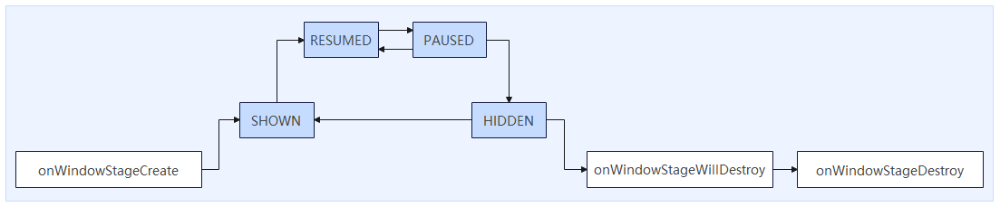

# Window Lifecycle

<!--Kit: ArkUI-->
<!--Subsystem: Window-->
<!--Owner: @fei_1007-->
<!--Designer: @gcw_sPCsris4-->
<!--Tester: @qinliwen0417-->
<!--Adviser: @ge-yafang-->
<!-- md-trans-meta sourceCommit=084bf627297e60b1f406ce34f5b473174466f7b3 translatedAt=2026-07-14T07:16:19.594Z pushedAt=2026-07-14T08:36:32.048Z -->

## Overview

In OpenHarmony, the lifecycle of the main window is tightly coupled with the lifecycle of the app's UIAbility, while secondary windows (such as global floating windows) are managed by the app itself, allowing developers to flexibly control their display and hiding as needed.

In the stage model, one **UIAbility** corresponds to one **WindowStage**, and one **WindowStage** corresponds to one app main window (**MainWindow**). The relationship among **UIAbility**, **WindowStage**, and the app main window is shown in the following figure.

Each **UIAbility** instance is bound to a **WindowStage** instance. **WindowStage** is the window manager within the app process, responsible for managing the lifecycle and display logic of the main window. The main window is the drawing area of ArkUI, which can load different ArkUI pages to provide an interactive UI for users.

**UIAbility** manages the main window through **WindowStage**, ensuring that the window state is synchronized with the app logic. The lifecycle of **WindowStage** is managed by **UIAbility**.

## Managing the Lifecycle of an App's Main Window

In the stage model, the app's main window is managed by the **UIAbility** through **WindowStage**, which maintains its lifecycle. You can receive notifications of main window creation and destruction through [onWindowStageCreate](../reference/apis-ability-kit/js-apis-app-ability-uiAbility.md#onwindowstagecreate) and [onWindowStageDestroy](../reference/apis-ability-kit/js-apis-app-ability-uiAbility.md#onwindowstagedestroy). For details, see [UIAbility Lifecycle](../application-models/uiability-lifecycle.md).

In addition, **WindowStage** and the main window provide the following means for listening to and managing lifecycle states:

- Use the [on('windowStageLifecycleEvent')](../reference/apis-arkui/arkts-apis-window-WindowStage.md#onwindowstagelifecycleevent20) API of **WindowStage** to listen for **WindowStage** lifecycle changes.

- Obtain the main window through the [getMainWindow()](../reference/apis-arkui/arkts-apis-window-WindowStage.md#getmainwindow9-1) API of **WindowStage**, and then use the [on('windowEvent')](../reference/apis-arkui/arkts-apis-window-Window.md#onwindowevent10) API to listen for events such as main window displaying and hiding.

### Lifecycle States of an App's Main Window

When the main window enters the foreground, switches between foreground and background, or exits to the background, the corresponding lifecycle state changes are triggered.

In the stage model, the lifecycle states of the main window include the foreground state (**SHOWN**), foreground interactive state (**RESUMED**), foreground non-interactive state (**PAUSED**), background state (**HIDDEN**), focused state (**ACTIVE**), and unfocused state (**INACTIVE**).

| Lifecycle State | Description | Trigger Scenario Example |
| -------- | -------- | -------- |
| SHOWN | Foreground state. The **SHOWN** event is triggered when the app is launched for the first time or switches from the background to the foreground. | Tap the app icon to launch. |
| RESUMED | Foreground interactive state. The window enters this state after it reaches the foreground and becomes interactive. | After opening the app, the app is in the foreground and interactive with the user. |
| PAUSED | Foreground non-interactive state. The **PAUSED** event is triggered when the window is visible in the foreground but not interactive. The window remains in this state until it resumes or moves to the background. If the window resumes, the **RESUMED** event is triggered and it enters the interactive state. | When the app is in the foreground and the user enters the multitasking UI, the app remains in the foreground but is not interactive with the user. |
| HIDDEN | Background state. The **HIDDEN** event is triggered when the app switches from the foreground to the background. | The app is swiped up to exit, or the app window is closed. |
| ACTIVE | Focused state. The state after the app window processes a click event, or the state after the app is launched. | The state after the app window processes a click event, or the state after the app is launched. |
| INACTIVE | Unfocused state. The state of the previously focused window after a new app is opened or another window is clicked. | App A and app B form a split-screen in the foreground, and the user is interacting with app B. At this point, app A enters the **INACTIVE** state (unfocused state). |

> **NOTE**
> 
> The **RESUMED** and **PAUSED** states are triggered when the window switches to the foreground and to the background, respectively. However, in some scenarios, the triggering of the **RESUMED** and **PAUSED** states may differ.
> 
> For example, when an app is launched, or when the app is already launched and in the **RESUMED** state, if the app is placed under control (such as by an app lock), its lifecycle enters the **PAUSED** state. After the control is removed, the app re-enters the **RESUMED** state.

The flow of the main window's lifecycle events is as shown in the following figure.

### Listening for the Main Window's Lifecycle State Changes

You can use the following APIs to listen for lifecycle changes of the **WindowStage**.

- Before API version 20, you can call [on('windowStageEvent')](../reference/apis-arkui/arkts-apis-window-WindowStage.md#onwindowstageevent9) to register a listener for **WindowStage** lifecycle changes, and call [off('windowStageEvent')](../reference/apis-arkui/arkts-apis-window-WindowStage.md#offwindowstageevent9) to unregister the listener for **WindowStage** lifecycle changes.

  - The lifecycle state returned at this time is [WindowStageEventType](../reference/apis-arkui/arkts-apis-window-e.md#windowstageeventtype9), which includes six states: **SHOWN** (foreground state), **ACTIVE** (focused state), **INACTIVE** (unfocused state), **HIDDEN** (background state), **RESUMED** (foreground interactive state), and **PAUSED** (foreground non-interactive state).

  - This API cannot guarantee the order of lifecycle state transitions, and is not recommended for scenarios where the order of state transitions matters.

- (Recommended) Starting from API version 20, you can register a listener for **WindowStage** lifecycle changes by calling [on('windowStageLifecycleEvent')](../reference/apis-arkui/arkts-apis-window-WindowStage.md#onwindowstagelifecycleevent20), and unregister the listener by calling [off('windowStageLifecycleEvent')](../reference/apis-arkui/arkts-apis-window-WindowStage.md#offwindowstagelifecycleevent20).

  - The lifecycle states returned at this point are [WindowStageLifeCycleEventType](../reference/apis-arkui/arkts-apis-window-e.md#windowstagelifecycleeventtype20), which includes four states: **SHOWN** (foreground state), **RESUMED** (foreground interactive state), **PAUSED** (foreground non-interactive state), and **HIDDEN** (background state).

  - For the focused and unfocused states of **WindowStage**, it is recommended to use [on('windowEvent')](../reference/apis-arkui/arkts-apis-window-Window.md#onwindowevent10) for listening.

### Differentiated Behavior of UIAbility Lifecycle on Different Devices

In the stage model, when the main window transitions from foreground to background, it also drives the **UIAbility** lifecycle. In this model, extra attention should be paid to the differentiated behavior of this mechanism on different device types.

- **On phones:** When the window transitions from foreground to background, it drives **UIAbility** to background.

- **On tablets:**

  - For apps that do not support running on PCs/2-in-1 devices, or apps that support running on both phone and PCs/2-in-1 devices, when the window transitions from the foreground to background, it drives the **UIAbility** to background.

  - For apps that do not support running on phones but support running on PCs/2-in-1 devices, when the window transitions from foreground to background, it does not drive the **UIAbility** to background.

- **On PC/2-in-1 devices:**

  - For apps that support running on phones, when the window transitions from foreground to background, it drives the **UIAbility** to background.

  - For apps that do not support running on phones, when the window transitions from foreground to background, it does not drive the **UIAbility** to background.

## Managing the Lifecycle of Secondary Windows

You can create secondary windows such as app subwindows as needed for scenarios like secondary pages and dialogs.

The lifecycle of a secondary window is managed by the app itself, typically including: **create**, **destroy**, **display**, and **hide**. You can manage and listen for lifecycle state changes of secondary windows through the following APIs.

| API Name | Typical Scenario |
| -------- | -------- |
| [createWindow()](../reference/apis-arkui/arkts-apis-window-f.md#windowcreatewindow9) | Creates a global floating window, modal window, or system window for scenarios such as dialogs. |
| [createSubWindow()](../reference/apis-arkui/arkts-apis-window-WindowStage.md#createsubwindow9) | Creates a subwindow for scenarios such as secondary pages. |
| [createSubWindowWithOptions()](../reference/apis-arkui/arkts-apis-window-WindowStage.md#createsubwindowwithoptions11) | Creates a subwindow for scenarios such as secondary pages or dialogs. |
| [destroyWindow()](../reference/apis-arkui/arkts-apis-window-Window.md#destroywindow9) | Destroys the current window, for example, closing a dialog or exiting the app. |
| [showWindow()](../reference/apis-arkui/arkts-apis-window-Window.md#showwindow9-1) | Displays the window after creation, or restores display after the window is hidden. |
| [minimize()](../reference/apis-arkui/arkts-apis-window-Window.md#minimize11) | Minimizes the current window. Only supported for main windows, subwindows, and global floating windows, such as hiding the window when the minimize button is tapped. |
| [isWindowShowing()](../reference/apis-arkui/arkts-apis-window-Window.md#iswindowshowing9) | Checks whether the current window is displayed, to avoid duplicate display or performing invalid operations. |
| [on('windowEvent')](../reference/apis-arkui/arkts-apis-window-Window.md#onwindowevent10) | Listens for lifecycle changes of the window, such as window creation, display, hide, and destruction. |
| [on('windowWillClose')](../reference/apis-arkui/arkts-apis-window-Window.md#onwindowwillclose15) | Listens for the window close event, and performs specific operations when the user closes the window via the title bar, such as saving data, confirming exit, and cleaning up resources. |

## Follow Policy Differences for Secondary Window Lifecycle

| Window Type  | Follow Policy |
| -------- | -------- |
| Subwindow | The subwindow (except independent subwindows) follows the main window in displaying, hiding, and being destroyed. In non-[freeform window](freeform-window-overview.md#freeform-window) state, the subwindow cannot extend beyond the main window. In [freeform window](freeform-window-overview.md#freeform-window) state, the subwindow can extend beyond the main window.|
| Independent subwindow | In [freeform window](freeform-window-overview.md#freeform-window) state, it does not follow the main window in displaying and hiding. In non-[freeform window](freeform-window-overview.md#freeform-window) state, it follows the main window in displaying and hiding. It follows the main window in being destroyed. |
| Modal window | It follows the main window in displaying, hiding, and being destroyed. In non-[freeform window](freeform-window-overview.md#freeform-window) state, it cannot extend beyond the main window. In [freeform window](freeform-window-overview.md#freeform-window) state, it can extend beyond the main window. |
| Global floating window | It does not follow the main window in displaying and hiding. It follows the main window in being destroyed. |
| Picture-in-picture | It does not follow the main window in displaying and hiding. It follows the main window in being destroyed. |
| Flash control ball | It does not follow the main window in displaying and hiding. It follows the main window in being destroyed. |