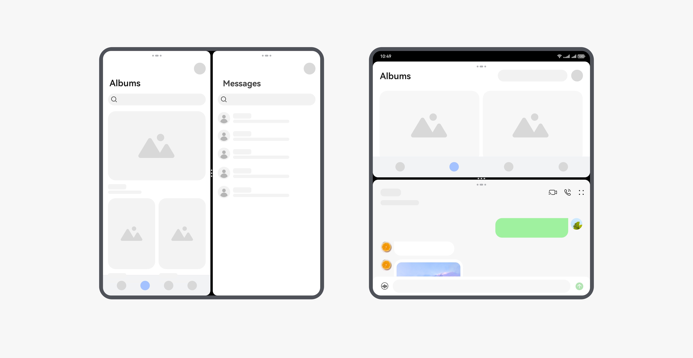

# Window Mode Overview

<!--Kit: ArkUI-->
<!--Subsystem: Window-->
<!--Owner: @yyuehao-->
<!--Designer: @yyuehao-->
<!--Tester: @qinliwen0417-->
<!--Adviser: @ge-yafang-->
<!-- md-trans-meta sourceCommit=e3c52b80ea412371fb2dea52b278788d7531f840 translatedAt=2026-07-16T06:47:37.140Z pushedAt=2026-07-16T10:53:50.881Z -->

## When to Use

Window mode refers to the display state of a window on the device screen, including full-screen, maximized, minimized, floating window, and split-screen modes. It is an attribute of a single window.

By properly configuring and using window modes, apps can better adapt to different device forms and user interaction scenarios, delivering a superior multi-window experience.

[Multi-window](https://developer.huawei.com/consumer/en/doc/harmonyos-guides/multi-window-intro) is a practical example of combining multiple window modes. It allows users to run multiple app windows simultaneously on the same screen at the same time in floating window, split-screen, or panoramic multi-window mode, thereby enabling multitasking.

The window mode capability allows users to use multiple app windows simultaneously. This capability differs between the [freeform window](freeform-window-overview.md#freeform-window) state and the non-[freeform window](freeform-window-overview.md#freeform-window) state:

- Window mode policies can be configured only for the main window and child windows in the [freeform window](freeform-window-overview.md#freeform-window) state.

- Global floating windows (WindowType.TYPE_FLOAT), modal windows (WindowType.TYPE_DIALOG), child windows not in the [freeform window](freeform-window-overview.md#freeform-window) state, and system windows are fixed as floating window mode, with no window mode switching.

Refer to the following sections for details on basic window mode capabilities, freeform window adaptation, and more.

## Window Mode WindowStatusType

Window modes are described by the [WindowStatusType](../reference/apis-arkui/arkts-apis-window-e.md#windowstatustype11) enum, which defines the display states of an app window in different scenarios. You can select an appropriate window mode based on app requirements, or dynamically listen for window mode changes to perform corresponding adaptation. The following sections detail the characteristics of each window mode, how to detect window mode changes, and how to configure window mode policies.

> **NOTE**
>
> Except that the **FULL_SCREEN** mode is always supported for the main window in non-[freeform window](freeform-window-overview.md#freeform-window) states, all other window modes must have their corresponding support policies configured in advance before they can be triggered.

### FULL_SCREEN

This mode is a display state in which the app window fills the entire screen.

**Features:**

- The window occupies the entire screen space.

- In [freeform window](freeform-window-overview.md#freeform-window) state, the window fills the entire screen, with no dock bar, title bar, or status bar displayed by default.

- In non-[freeform window](freeform-window-overview.md#freeform-window) state, the window is maximized to cover the entire screen, with no title bar or dock bar displayed.

**Applicable scenarios:**

- Apps that require immersive experiences, such as video playback and games.

- Scenarios that require maximum utilization of screen space.

**Trigger methods:**

- In [freeform window](freeform-window-overview.md#freeform-window) state:

  - When the app calls [startAbility()](../reference/apis-ability-kit/js-apis-inner-application-uiAbilityContext.md#startability-1), set **windowMode** in [StartOptions](../reference/apis-ability-kit/js-apis-app-ability-startOptions.md#startoptions) to **AbilityConstant.WindowMode.WINDOW_MODE_FULLSCREEN**.

  - The app calls the [maximize()](../reference/apis-arkui/arkts-apis-window-Window.md#maximize12) API with the **window.MaximizePresentation.ENTER_IMMERSIVE** or **window.MaximizePresentation.ENTER_IMMERSIVE_DISABLE_TITLE_AND_DOCK_HOVER** enum parameter.

  - The user clicks the maximize button on the system title bar.

- In non-[freeform window](freeform-window-overview.md#freeform-window) state, the main window enters the **FULL_SCREEN** display mode by default upon startup.

### MAXIMIZE

This mode means that the app window is maximized to fill the entire screen in the [freeform window](freeform-window-overview.md#freeform-window) state, while the dock bar, status bar, and title bar remain visible.

**Features:**

- The window occupies the entire screen space, and the dock bar, status bar, and title bar are displayed without requiring hover.

- This mode exists only in the [freeform window](freeform-window-overview.md#freeform-window) state.

**Applicable scenarios:**

When the app needs full-screen display in [freeform window](freeform-window-overview.md#freeform-window) mode while keeping the dock bar, status bar, and title bar visible.

**Trigger methods:**

- In [freeform window](freeform-window-overview.md#freeform-window) mode, configure the "ohos.ability.window.isMaximize" field to **true** in the metadata of the module.json5 file, and the main app window will start in MAXIMIZE mode.

- In [freeform window](freeform-window-overview.md#freeform-window) mode, the app calls the [maximize()](../reference/apis-arkui/arkts-apis-window-Window.md#maximize12) API with the **window.MaximizePresentation.EXIT_IMMERSIVE** enum parameter.

> **NOTE**
> 
> - App subwindows support the **FULL_SCREEN** and **MAXIMIZE** modes only in the [freeform window](freeform-window-overview.md#freeform-window) state, and the **maximizeSupported** parameter must be set to **true** when creating the subwindow. Alternatively, you can configure support through [setSupportedWindowModes()](../reference/apis-arkui/arkts-apis-window-Window.md#setsupportedwindowmodes).
> 
> - Key differences between **FULL_SCREEN** and **MAXIMIZE**:
>
>   - **FULL_SCREEN**: The window is maximized to fill the entire screen. In the [freeform window](freeform-window-overview.md#freeform-window) state, no dock bar, status bar, or title bar is displayed. In the non-[freeform window](freeform-window-overview.md#freeform-window) state, no dock bar or title bar is displayed.
>
>   - **MAXIMIZE**: The window is maximized to fill the entire screen, and the dock bar, status bar, and title bar are displayed.
>
>   - The MAXIMIZE mode takes effect only in the [freeform window](freeform-window-overview.md#freeform-window) state.

### MINIMIZE

This mode refers to the state where the app window shrinks to the taskbar or dock and no longer displays content on the screen.

**Features:**

- The window content is invisible, and the window lifecycle enters the background state.

- The user can reactivate the window through the taskbar or dock.

**Applicable scenarios:**

- The user needs to temporarily hide a window but wants to quickly restore its previous display content.

- Apps that need to continue processing certain business logic in the background.

**Trigger methods:**

- The app calls the [minimize()](../reference/apis-arkui/arkts-apis-window-Window.md#minimize11) API.

- The user taps the minimize button in the system title bar.

### FLOATING

This mode allows an app window to be displayed as a floating window, with freely adjustable size and position.

In the [freeform window](freeform-window-overview.md#freeform-window) state and the non-[freeform window](freeform-window-overview.md#freeform-window) state, the floating window mode has different characteristics and applicable scenarios.

- **In the freeform window state**

  In the freeform window state, the floating window can be displayed on the screen at any size and position, and supports drag to move, drag to resize, and split-screen combination, thereby enabling multitasking.

  **Features:**

  - An app can change the size and position of a floating window through APIs such as [resize()](../reference/apis-arkui/arkts-apis-window-Window.md#resize9) and [moveWindowTo()](../reference/apis-arkui/arkts-apis-window-Window.md#movewindowto9-1).

  - Multiple floating windows can be displayed simultaneously on the same screen.

  - In [freeform window](freeform-window-overview.md#freeform-window) state, the main window has a default title bar and three control buttons (maximize/restore, minimize, close). You can resize the window by dragging its edges and move it by dragging the title bar.

  - Global floating windows, modal windows, and system windows are fixed in floating window mode and cannot switch to other window modes.

  **Applicable scenarios:**

  - Scenarios involving parallel multitasking.

  - Scenarios where content from multiple apps needs to be viewed simultaneously.

  **Trigger methods:**

  - In the [freeform window](freeform-window-overview.md#freeform-window) state, the window enters **FLOATING** display mode by default upon startup.

  - When the window is in full-screen mode or split-screen mode, the app calls the [recover()](../reference/apis-arkui/arkts-apis-window-Window.md#recover11) API.

  - When the window is in full-screen mode or split-screen mode, the user taps the restore button in the system title bar.

- **In non-freeform window state**

  In non-freeform window state, a floating window can be displayed at any position on the screen. However, the capabilities of different window types in floating window mode vary.

  **Features:**

- For the main window:

  - The main window enters freeform window mode only after entering the multi-window floating window or panoramic multi-window. For details, see [Introduction to Multi-Window](https://developer.huawei.com/consumer/en/doc/harmonyos-guides/multi-window-intro).

  - It does not support freely changing the window size and position through APIs such as [resize()](../reference/apis-arkui/arkts-apis-window-Window.md#resize9) and [moveWindowTo()](../reference/apis-arkui/arkts-apis-window-Window.md#movewindowto9-1).

  - There is a limit on the maximum number of freeform windows on the same screen. When the limit is exceeded, opening a new freeform window replaces the freeform window that has been inactive the longest. The maximum number varies by product. For details, see the "Floating Windows" and "Multitask Views" sections in [Introduction to Multi-Window](https://developer.huawei.com/consumer/en/doc/harmonyos-guides/multi-window-intro).

  - In freeform window mode, the main window always has a top bar. Users can drag the top bar to move the window, switch window modes, and perform other actions.

    - Users can resize the window by dragging its edges.

  - For app subwindows, global floating windows, modal windows, and system windows:

    - They are always displayed in freeform window mode and cannot switch to other window modes.

    - Their size and position can be freely changed using APIs such as [resize()](../reference/apis-arkui/arkts-apis-window-Window.md#resize9) and [moveWindowTo()](../reference/apis-arkui/arkts-apis-window-Window.md#movewindowto9-1).

    - There is no limit on the maximum number of simultaneously displayed windows of this type, but they are subject to the overall window limit (a system restriction that currently caps the maximum number of windows in a single app process at 256).

    - No top bar.

  **Applicable scenarios:**

  - Scenarios where multiple tasks are processed in parallel.

  - Scenarios where content from multiple apps needs to be viewed simultaneously.

  **Trigger methods:**

  User-triggered: Includes methods such as floating window gesture trigger, starting the app from a notification message, starting the app from the side Dock, and switching via the top bar. For details, see the "Triggering and Restoration of Floating Windows" section in [Introduction to Multi-Window](https://developer.huawei.com/consumer/en/doc/harmonyos-guides/multi-window-intro).

  > **NOTE**
  > 
  > For more information about multi-window floating windows, see [Introduction to Multi-Window](https://developer.huawei.com/consumer/en/doc/harmonyos-guides/multi-window-intro) and [Best Practices for Multi-Window](https://developer.huawei.com/consumer/en/doc/best-practices/bpta-multi-window-practice).

### SPLIT_SCREEN

This mode is a state in which an app window occupies a portion of the screen and is displayed simultaneously with another window. Both in-app split-screen and cross-app split-screen are supported.

**Features:**

- Split-screen windows are arranged in a left-right or top-bottom layout.

- A divider exists between the two split-screen windows. You can drag the divider to adjust the window size of each pane.

- Only the main window supports split-screen mode.

- Currently, only two-pane split-screen is supported.

**Applicable scenarios:**

Scenarios where multiple apps are used in parallel for an extended period, such as viewing a document while composing an email, or comparing product prices across multiple apps.

**Trigger methods:**

- When the app calls [startAbility()](../reference/apis-ability-kit/js-apis-inner-application-uiAbilityContext.md#startability-1) in the foreground, configure [StartOptions](../reference/apis-ability-kit/js-apis-app-ability-startOptions.md#startoptions) with **windowMode** set to **WINDOW_MODE_SPLIT_PRIMARY** or **WINDOW_MODE_SPLIT_SECONDARY**. The newly launched main window enters a ready-to-split state in [freeform window](freeform-window-overview.md#freeform-window) mode, or forms a split-screen with the caller app's main window in non-[freeform window](freeform-window-overview.md#freeform-window) mode.

- User-triggered: In [freeform window](freeform-window-overview.md#freeform-window) state, the split-screen can be triggered by tapping the three-button area on the system title bar or dragging the window to the split-screen hot zone. In non-[freeform window](freeform-window-overview.md#freeform-window) state, it can be triggered by using a split-screen gesture or tapping the top bar to switch.

## Obtaining and Listening for Window Mode

An app can detect changes in the current window state by querying the window mode and listening for window mode change events, and then perform corresponding service adaptations accordingly.

The system provides the following related query and listening APIs.

| API | Description | Trigger Timing | Applicable Scenario |
| -------- | -------- | -------- | -------- |
| [getWindowStatus()](../reference/apis-arkui/arkts-apis-window-Window.md#getwindowstatus12) | Obtains the current app window mode. | When the app actively calls it. | Scenarios where the current window mode needs to be obtained immediately for judgment, such as checking the current window mode before performing certain window operations to avoid calling related APIs in an unsupported window mode. |
| [on('windowStatusChange')](../reference/apis-arkui/arkts-apis-window-Window.md#onwindowstatuschange11) | Enables listening for window mode changes. | Triggered immediately when the window mode changes (window properties may not have been updated yet). | Scenarios that require quick response to window mode changes without depending on window properties. |
| [on('windowStatusDidChange')](../reference/apis-arkui/arkts-apis-window-Window.md#onwindowstatusdidchange20) | Enables listening for window mode changes. | Triggered after the window mode changes and the **Rect** attribute update is complete. | Scenarios where the exact window size and position need to be obtained immediately after a window mode change. |

## Customizing Window Mode Support Policies

An app can configure supported window modes in multiple ways to meet the requirements of different devices and scenarios. For main window and subwindow modes, four configuration methods are provided, listed below in descending order of priority:

| Priority | Configuration Method | Supported Window Types | Effective Scope |
| -------- | -------- | -------- | -------- |
| 1 | [Configuring via setSupportedWindowModes()](#configuring-via-setsupportedwindowmodes) | Main window, subwindow | Takes effect only in freeform window state |
| 2 | [Configuring via the startAbility() API](#configuring-via-the-startability-api) | Main window | Takes effect only in freeform window state |
| 3 | [Configuring via the metadata tag under the abilities tag in the module.json5 configuration file](#configuring-via-the-metadata-tag-under-the-abilities-tag-in-the-modulejson5-configuration-file) | Main window | Takes effect only in freeform window state |
| 4 | [Configuring the supportWindowMode property under the abilities tag in the module.json5 Configuration File](#configuring-the-supportwindowmode-attribute-under-the-abilities-tag-in-the-modulejson5-configuration-file) | Main window | Takes effect in all states |

> **NOTE**
> 
> - In non-[freeform window](freeform-window-overview.md#freeform-window) states, window mode support can only be configured via the supportWindowMode attribute under the [abilities tag](../quick-start/module-configuration-file.md#abilities) in the [module.json5 configuration file](../quick-start/module-configuration-file.md). Other configuration methods do not take effect.
> 
> - In non-[freeform window](freeform-window-overview.md#freeform-window) states, even if **FULL_SCREEN** is not included in the **supportWindowMode** attribute configured under the [abilities tag](../quick-start/module-configuration-file.md#abilities), the app still supports full-screen mode display by default.
> 
> - In the [freeform window](freeform-window-overview.md#freeform-window) state, the **FULL_SCREEN** mode configured in **supportWindowMode** indicates that the window supports both **windowStatusType.FULL_SCREEN** and **windowStatusType.MAXIMIZE** display modes.
> 
> - For development and implementation of different window modes in multi-device scenarios, refer to [Best Practices for Window Mode](https://developer.huawei.com/consumer/en/doc/best-practices/bpta-multi-device-window-mode).

### Configuring via setSupportedWindowModes()

- By calling WindowStage.[setSupportedWindowModes()](../reference/apis-arkui/arkts-apis-window-WindowStage.md#setsupportedwindowmodes15) with supportedWindowModes, or calling WindowStage.[setSupportedWindowModes()](../reference/apis-arkui/arkts-apis-window-WindowStage.md#setsupportedwindowmodes20) with **supportedWindowModes** and **grayOutMaximizeButton**, you can dynamically modify the window modes supported by the current main window at runtime.

- By calling **Window**.[setSupportedWindowModes()](../reference/apis-arkui/arkts-apis-window-Window.md#setsupportedwindowmodes) with **supportedWindowModes**, you can dynamically modify the window modes supported by the current main window and subwindow at runtime.

The supported window modes are as follows:

| Configuration Value | Mode | Description |
| -------- | -------- | -------- |
| SupportWindowMode.FULL_SCREEN | Full-screen mode | The window supports full-screen display. |
| SupportWindowMode.SPLIT | Split-screen mode | The main window does not support configuring **SPLIT** alone; it must be used together with **FULL_SCREEN** and **FLOATING**. The subwindow does not support configuring SPLIT. |
| SupportWindowMode.FLOATING | Floating mode | The window supports floating display. |

- Takes effect only in the [freeform window](freeform-window-overview.md#freeform-window) state.

- Has the highest configuration priority and overrides other configuration methods.

- Suitable for scenarios where the window mode needs to be dynamically adjusted based on the app state.

### Configuring via the startAbility() API

When an app calls [startAbility()](../reference/apis-ability-kit/js-apis-inner-application-uiAbilityContext.md#startability-1), it can specify the window modes supported at startup through the **supportWindowMode** parameter in [StartOptions](../reference/apis-ability-kit/js-apis-app-ability-startOptions.md#startoptions).

**Supported mode values** (For details, see [bundleManager.SupportWindowMode](../reference/apis-ability-kit/js-apis-bundleManager.md#supportwindowmode)):

| Name | Mode | Description |
| -------- | -------- | -------- |
| bundleManager.SupportWindowMode.FULL_SCREEN | Full-screen mode | The window supports full-screen display. |
| bundleManager.SupportWindowMode.SPLIT | Split-screen mode | The window supports split-screen display. |
| bundleManager.SupportWindowMode.FLOATING | Floating window mode | The window supports floating display. |

- Takes effect only in the [freeform window](freeform-window-overview.md#freeform-window) state.

- Applicable when specifying the window mode at main window startup.

### Configuring via the metadata Tag Under the abilities Tag in the module.json5 Configuration File

Through the [metadata tag](window-config-m.md#metadata) under the [abilities](../quick-start/module-configuration-file.md#abilities) in the [module.json5 configuration file](../quick-start/module-configuration-file.md), you can set window-related metadata attributes, including supported window modes in freeform multi-window.

**Configuration Item Description:**

| Configuration Item | Description | Value |
| -------- | -------- | -------- |
| name | Metadata name | "ohos.ability.window.supportWindowModeInFreeMultiWindow" |
| value | Supported window modes | String. Multiple modes can be configured, separated by commas without regard to order and without spaces. The supported modes are: - "fullscreen": Full-screen mode, where the app window is maximized to cover the entire screen. - "split": Split-screen mode, where the app window occupies a portion of the screen and is displayed simultaneously with another window. - "floating": Floating window mode, where the app window is displayed as a floating window. |

- Takes effect only in the [freeform window](freeform-window-overview.md#freeform-window) state.

- Applicable to configuring the default window mode support scope for an app in the freeform window state.

- This configuration item can be omitted. The default value is "fullscreen, split, floating".

### Configuring the supportWindowMode Attribute Under the abilities Tag in the module.json5 Configuration File

The **supportWindowMode** attribute under the [abilities tag](../quick-start/module-configuration-file.md#abilities) tag in the [module.json5 configuration file](../quick-start/module-configuration-file.md) specifies the window modes supported by the app.

**Supported mode values:**

| Configuration Value | Mode | Description |
| -------- | -------- | -------- |
| "fullscreen" | Full-screen mode | The app window is maximized to cover the entire screen. |
| "split" | Split-screen mode | The app window occupies a portion of the screen and is displayed alongside another window. |
| "floating" | Floating window mode | The app window is displayed as a floating window. |

- This attribute can be left unspecified. The default value is **["fullscreen", "split", "floating"]**.

- Takes effect in both the [freeform window](freeform-window-overview.md#freeform-window) state and the non-[freeform window](freeform-window-overview.md#freeform-window) state.

- In the non-[freeform window](freeform-window-overview.md#freeform-window) state, only this configuration method is supported.

- In the [freeform window](freeform-window-overview.md#freeform-window) state, this configuration method has the lowest priority compared with the other methods described above.

- In the [freeform window](freeform-window-overview.md#freeform-window) state, when both **"fullscreen"** and **"split"** are configured, the window starts in floating window mode if the app's [targetAPIVersion](../quick-start/app-configuration-file.md#tags-in-the-configuration-file) is earlier than 15, and starts in full-screen mode if the app's [targetAPIVersion](../quick-start/app-configuration-file.md#tags-in-the-configuration-file) is 15 or later.

<!--no_check-->