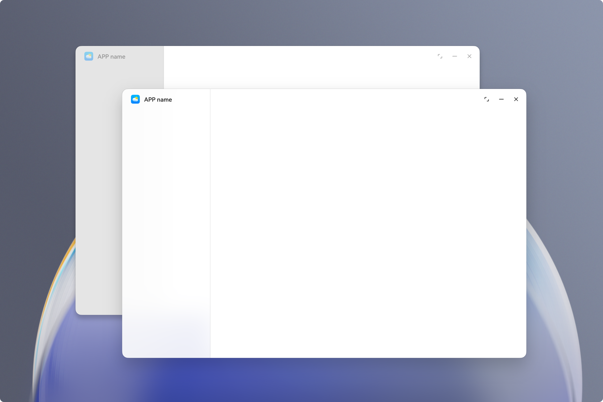
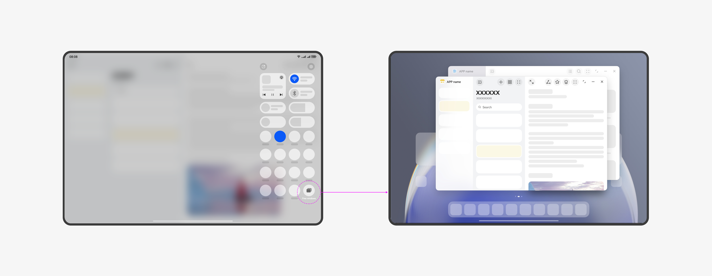
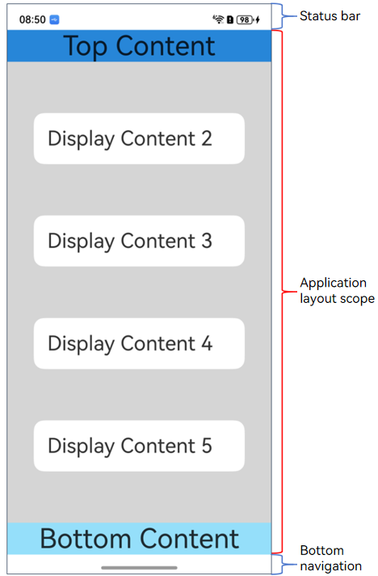
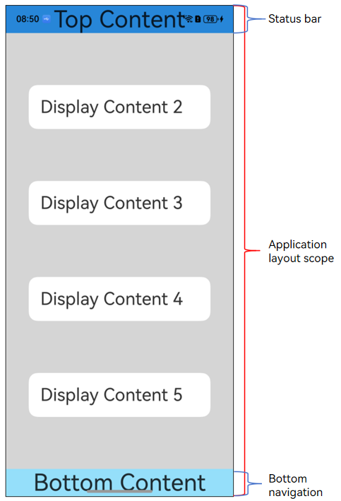
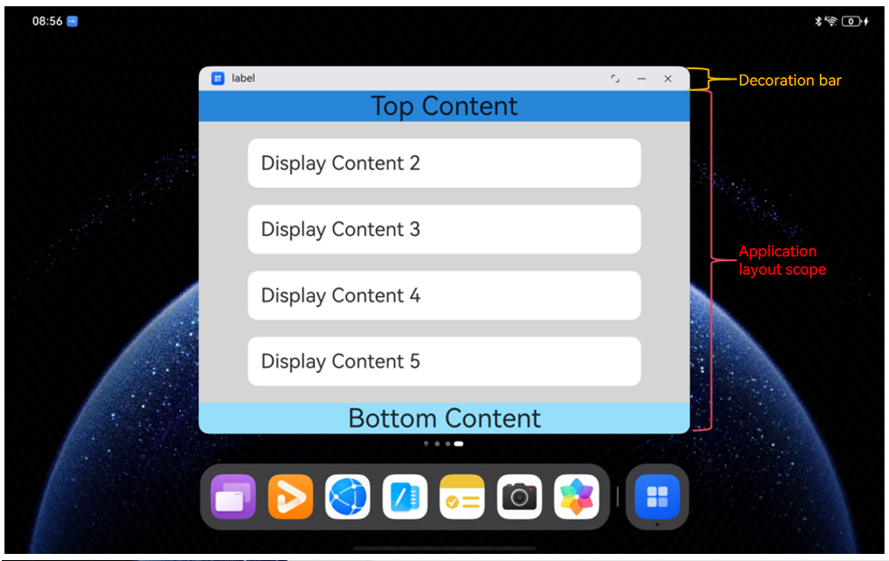
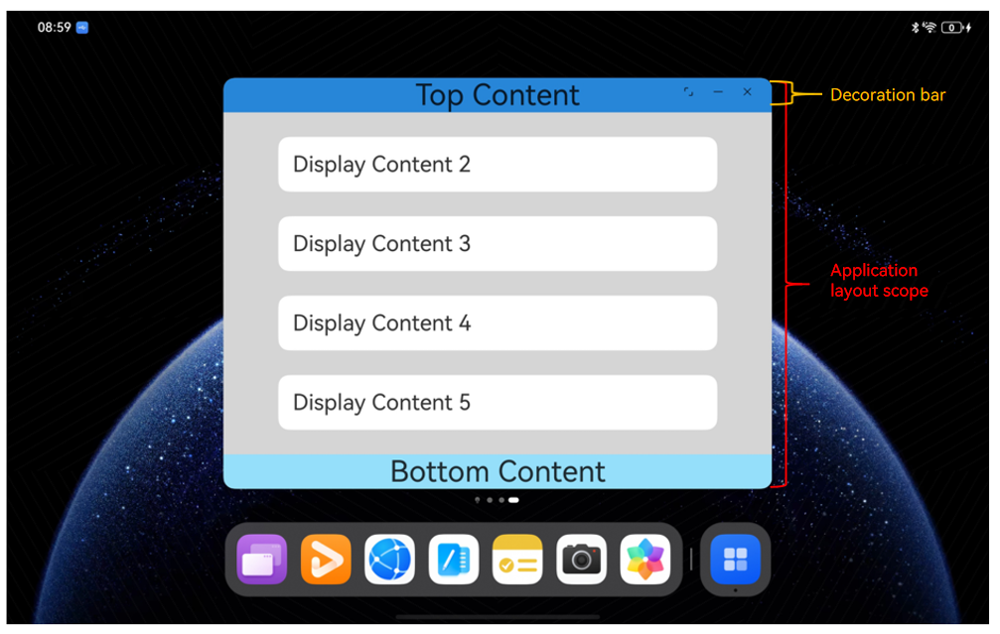

# Window Development Terminology
<!--Kit: ArkUI-->
<!--Subsystem: Window-->
<!--Owner: @waterwin-->
<!--Designer: @nyankomiya-->
<!--Tester: @qinliwen0417-->
<!--Adviser: @ge-yafang-->

## Window Type

Windows are classified into system windows and application windows.

### System Window

System windows are designed to carry out specific system functions. Examples include volume bars, wallpapers, notification panels, status bars, and navigation bars.

System windows are available only for system applications.

### Application Window

Application windows, which are different from system windows, are related to the display of application content. Depending on how they are managed and their purpose, application windows can be further divided into main windows and auxiliary windows.

- Main window

  Main windows are created by default when a UIAbility is created and are displayed as an independent mission card on the mission management screen. They are used to show the main interface of the application's UIAbility.

- Auxiliary window

  Auxiliary windows are managed, created, and destroyed by the application itself and are not displayed as an independent mission card on the mission management screen. They can be used to show auxiliary content of the application, such as pop-up windows.

  Auxiliary windows include child windows, global floating windows, modal windows, picture-in-picture, and floating ball windows.

## Floating Window

Floating windows are divided into multi-window floating windows and global floating windows.

- Multi-window floating windows are non-full-screen application windows that float on the device screen.

  They are typically used to temporarily handle another task while a full-screen task is running or for short-term parallel use of multiple tasks, such as replying to messages while browsing the web.

  For details, see [Introduction to Multi-Window](https://developer.huawei.com/consumer/en/doc/harmonyos-guides/multi-window-intro) and [Multi-Window](https://developer.huawei.com/consumer/en/doc/best-practices/bpta-multi-window-practice).

- Global floating windows are a special type of application auxiliary window that can remain displayed on the foreground even after the application's main window and corresponding ability are moved to the background.

  Global floating windows can be used to continue displaying the UI in a small window after the application is moved to the background, such as displaying lyrics on the home screen for a music application.

  Before creating a global floating window, the application needs to request the corresponding permission.
  
  <!--RP1-->
  For details, see [Setting a Global Floating Window](application-window-stage.md#setting-a-global-floating-window).<!--RP1End-->

## Freeform Window

Freeform windows are a type of window that can be displayed on the same screen with flexible size and position. These windows support multitasking features such as dragging, resizing, and split-screen combinations.

Freeform windows are stacked on the Z-axis in the order they are opened or gain focus. When a freeform window is clicked or touched, it is brought to the front and gains focus.

When a new freeform window is launched, it appears with a certain gap in the bottom-right corner of the previous window by default.

Each freeform window includes a window title bar at the top by default. The title bar displays the application icon on the left and three control buttons on the right: maximize/restore, minimize, and close. The window title bar also supports [immersive configurations](https://developer.huawei.com/consumer/en/doc/best-practices/bpta-multi-device-window-immersive#section1477255312219).

You can resize a freeform window by dragging its edges and move its position by dragging the title bar.

**Device Support**

-  **2-in-1 devices**: Windows on 2-in-1 devices are freeform window by default.
-  **Tablets**: Some tablets support enabling [free windows](#free-windows) mode by pulling down Control Panel and tapping the **Free windows** button. Once this mode is enabled, application windows default to freeform windows.
-  **Phones**: Some phones support enabling [free windows](#free-windows) mode by pulling down Control Panel and tapping the **Free windows** button. Once this mode is enabled, application windows default to freeform windows.

### Free Windows

Free windows mode is an interaction method that enables multitasking on mobile devices. 

It allows multiple application windows to be displayed on a single screen simultaneously. These windows are known as [freeform window](#freeform-window).

On some tablets, you can enable free windows mode by pulling down Control Panel and tapping the **Free windows** button.

On some phones, you can enable free windows mode by pulling down Control Panel and tapping the **Free windows** button.

## Immersive Layout

An immersive layout is a window state that helps an application UI focus on content by reducing distractions from irrelevant elements.

Non-[freeform windows](#freeform-window) can enter immersive layout by calling [setWindowLayoutFullScreen](../reference/apis-arkui/arkts-apis-window-Window.md#setwindowlayoutfullscreen9).

| Non-immersive layout of a non-freeform window                   | Immersive layout of a non-freeform window              |
|----------------------------------------------|----------------------------------------|
|     |     |

Freeform windows can enter immersive layout by hiding the decoration bar.

| Non-immersive layout of a freeform window                     | Immersive layout of a freeform window                |
|----------------------------------------------|----------------------------------------|
|     |     |

In immersive layout, an application window's component layout expands from the safe area to the entire window. You can use [isImmersiveLayout](../reference/apis-arkui/arkts-apis-window-Window.md#isimmersivelayout20) to check whether the window is in immersive layout.

For details about immersive development and implementation in different window forms in multi-device scenarios, see [Immersive Window](https://developer.huawei.com/consumer/cn/doc/best-practices/bpta-multi-device-window-immersive).
