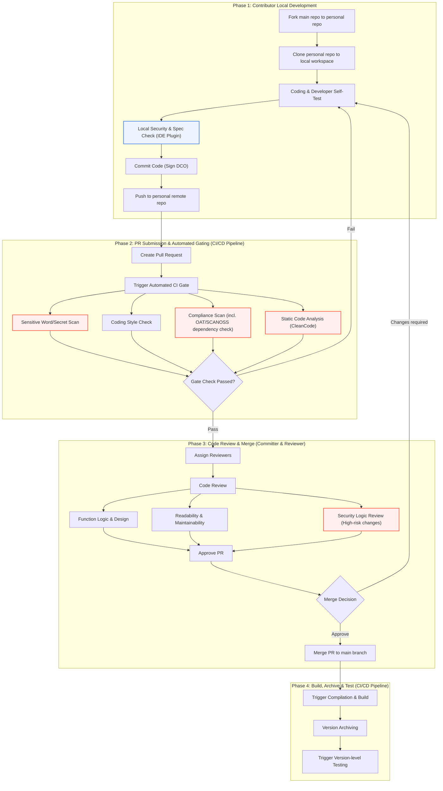

# OpenHarmony Community Contribution Workflow

This workflow aims to guide contributors to participate in the OpenHarmony project efficiently, securely, and in compliance with community standards. It integrates key stages such as development, automated gating, manual review, and security assurance. Please refer to the following flowchart for the complete process.



## 1. Contribution Preparation (Code Download)

### Environment Setup
-   Install and configure Git. Refer to the GitCode Help Center: [Git Handbook](https://gitcode.com/help/categories/43)
-   Configure your SSH public key on GitCode. Refer to: [Public Key Management](https://gitcode.com/help/articles/4191)

### Get the Code
1.  **Fork the Main Repository**: Find the repository you are interested in under the OpenHarmony GitCode organization, click the "Fork" button in the upper right corner to create a copy under your personal account (personal repository).
2.  **Clone to Your Local Machine**: Clone your personal repository to your local computer to set up your local workspace.
    ```bash
    git clone git@gitcode.com:{your_gitcode_id}/{repository_name}.git
    cd {repository_name}
    ```
3.  **Create a Development Branch**: Create a new local branch for your contribution based on the latest code from the main branch.
    ```bash
    # Add the upstream repository (only needed the first time)
    git remote add upstream https://gitcode.com/openharmony/{repository_name}.git
    
    # Sync the latest code and create a new branch
    git fetch upstream
    git checkout -b my-awesome-feature upstream/master
    ```

## 2. Local Development and Self-Check (Coding)

### Code Development and Testing
-   On the `my-awesome-feature` branch you created, write, modify, and develop your code.
-   Perform necessary self-tests to ensure your changes do not break existing functionality and that new features work as expected.

### **Local Static Check (IDE Plugin)**
-   It is **strongly recommended** to use community-approved IDE plugins (e.g., for code style and static analysis) during development.
-   These plugins can help you identify and fix issues related to coding standards, potential defects, and simple security vulnerabilities before you commit, serving as the first line of defense for contribution quality.

### Commit Local Changes
-   The OpenHarmony community requires all contributors to sign the **Developer Certificate of Origin (DCO)**. This is done by using the `-s` or `--signoff` flag when running `git commit`.
-   The commit message should follow community conventions and clearly describe the changes.
    ```bash
    git add .
    git commit -sm "feat: your feature description
    
    Detailed description of the changes you made.
    
    issue: #IXXXXX"
    ```
-   Push the local branch to your personal remote repository on GitCode.
    ```bash
    git push origin my-awesome-feature
    ```

## 3. PR Submission and Automated Gating

### Create a Pull Request (PR)
-   Go to your personal repository page on GitCode and click the "Pull Request" button.
-   Select your source branch (`my-awesome-feature`) and the target branch (usually `openharmony/master`), then fill in the PR title and description before submitting.
-   **[Security Enhancement]** If your changes involve security-sensitive areas (e.g., cryptography, permissions, kernel), please state this clearly in the PR description to draw the attention of security experts.

### Automated CI Gate Build
After submitting a PR, the CI/CD pipeline will automatically trigger a series of gate checks. **A failure in any of these checks will prevent the PR from being merged.** You must fix the issues based on the failure report and resubmit.

Gate checks include, but are not limited to:

-   **Compilation and Build**: Ensures your code compiles successfully.
-   **Unit/Functional Tests**: Runs automated test cases.
-   **[Security Enhancement] Static Check Capabilities**:
    1.  **Coding Style Check**: Verifies that the code style adheres to community standards.
    2.  **Sensitive Word/Secret Scan**: Automatically scans code to prevent hard-coded secrets, passwords, or tokens from being exposed.
    3.  **Compliance Scan**:
        -   **License Check**: Ensures that all introduced files and dependencies have licenses compatible with the community policy.
        -   **Software Composition Analysis (SCANOSS)**: Scans for third-party open-source software snippets and dependencies to check for known security vulnerabilities (CVEs).
    4.  **Static Code Analysis**: Uses tools like CleanCode to perform deep scans of the code to find potential quality defects and security vulnerabilities.

## 4. Code Review and Merge

### Code Review
-   After the gate checks pass, a Committer will **assign Reviewers** to conduct a manual review of your code.
-   Reviewers will provide feedback on aspects like functional logic, code design, readability, and maintainability.
-   **Specialized Security Review**: For high-risk PRs or those marked as security-sensitive, an additional review by members of the **Security Committee (Security SIG)** or designated security experts is required.
-   You will need to modify your code based on the review feedback and push the updates again. This process may involve multiple rounds.

### Approval and Merge
-   Once your PR has been approved by a sufficient number of reviewers, a Committer will perform a final check.
-   After the review and testing are passed, the CI system will **merge** your PR into the project's main branch. At this point, your contribution officially becomes part of the OpenHarmony project.

## 5. Build, Archive, and Test

After the PR is merged into the main branch, the CI/CD pipeline will execute the following tasks:
1.  **Compilation and Build**: Compiles the latest main branch, now including your code.
2.  **Version Archiving**: Archives the successful build artifacts, creating daily builds or release candidates.
3.  **Testing**: Performs more comprehensive integration and system tests on the archived version to ensure the overall stability and quality of the system.

