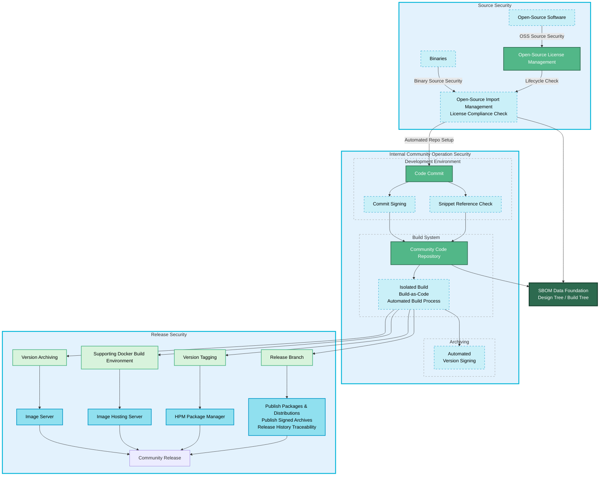

# Community Supply Chain Security Governance

## Overview

To ensure the integrity, security, and compliance of the OpenHarmony open-source project, the community has established a comprehensive supply chain security governance framework that spans the entire software lifecycle. This framework implements strict controls across three core stages: **Source Security**, **Internal Community Operation Security**, and **Release Security**. It is supported by an **SBOM (Software Bill of Materials) Data Foundation** as its unified technical backbone to achieve end-to-end security for the software supply chain.

### Governance Flowchart

## Detailed Governance Process

### 1. Source Security

Source security is the first line of defense for the supply chain, aiming to ensure that all software components and code entering the community repository are trustworthy and compliant.

-   **Third-Party Open-Source Software Import**: All third-party components planned for import must undergo a strict admission review, including vulnerability scanning, community health assessment, and license compliance analysis.
-   **Community Contributor Code**: Code submissions from community contributors must pass automated code review and security scanning processes to ensure code quality and security.
-   **Open-Source License Management**: The community has a dedicated license management mechanism to check the compliance of all imported components and records the results in the **SBOM** Data Foundation to mitigate legal risks.

### 2. Internal Community Operation Security

After code enters the community, it is continuously monitored through an automated security toolchain and processes to promptly identify and remediate risks.

-   **Community Code Repository**: As the repository for trusted code, all code changes are logged and traceable.
-   **Automated Security Gates**: The code integration process triggers a series of automated scans that act as security gates:
    -   **Static Code Scanning **: Checks for potential security flaws in the source code.
    -   **Software Composition Analysis **: Identifies all direct and indirect dependencies in the project, analyzing their sources, versions, and licenses.
    -   **Vulnerability Scanning**: Compares the identified open-source components against known vulnerability databases (e.g., NVD/CVE) to detect potential security vulnerabilities.
-   **Risk Data Consolidation**: All scan results are aggregated into the **SBOM** Data Foundation for continuous risk assessment and monitoring.

### 3. Release Security

Release security is the final checkpoint for delivering trusted software to end-users, ensuring that the released artifacts are complete, traceable, and untampered.

-   **Version Archiving**: Build artifacts that pass security audits are securely archived in the artifact repository.
-   **Supporting Docker Build Environment**: A corresponding Docker build environment is provided for each official release to ensure the reproducibility of the build process, facilitating security audits and troubleshooting.
-   **Version Identification and Traceability**: By applying clear Git tags and creating dedicated release branches, a precise traceability chain is established from binary artifacts back to the source code.
-   **Secure Distribution**: The final release versions are distributed to users through official and trusted channels.

### 4. SBOM Data Foundation

The **SBOM** Data Foundation is the core of the entire supply chain security governance framework. It provides comprehensive software transparency and serves as the basis for continuous risk monitoring and rapid incident response.

-   **Core Function**: As a dynamically updated database, it records detailed information about all software components in the OpenHarmony project, including their sources, versions, licenses, dependencies, and known vulnerabilities.
-   **Design Tree vs. Build Tree**: The **SBOM** foundation manages both the "Design Tree" (components planned for inclusion during development) and the "Build Tree" (components actually included in the final build artifact). By comparing the two, potential supply chain risks can be accurately identified.
-   **Data-Driven Security**: Through continuous analysis of **SBOM** data, the community can quickly locate components affected by newly disclosed vulnerabilities and efficiently organize remediation and version updates.