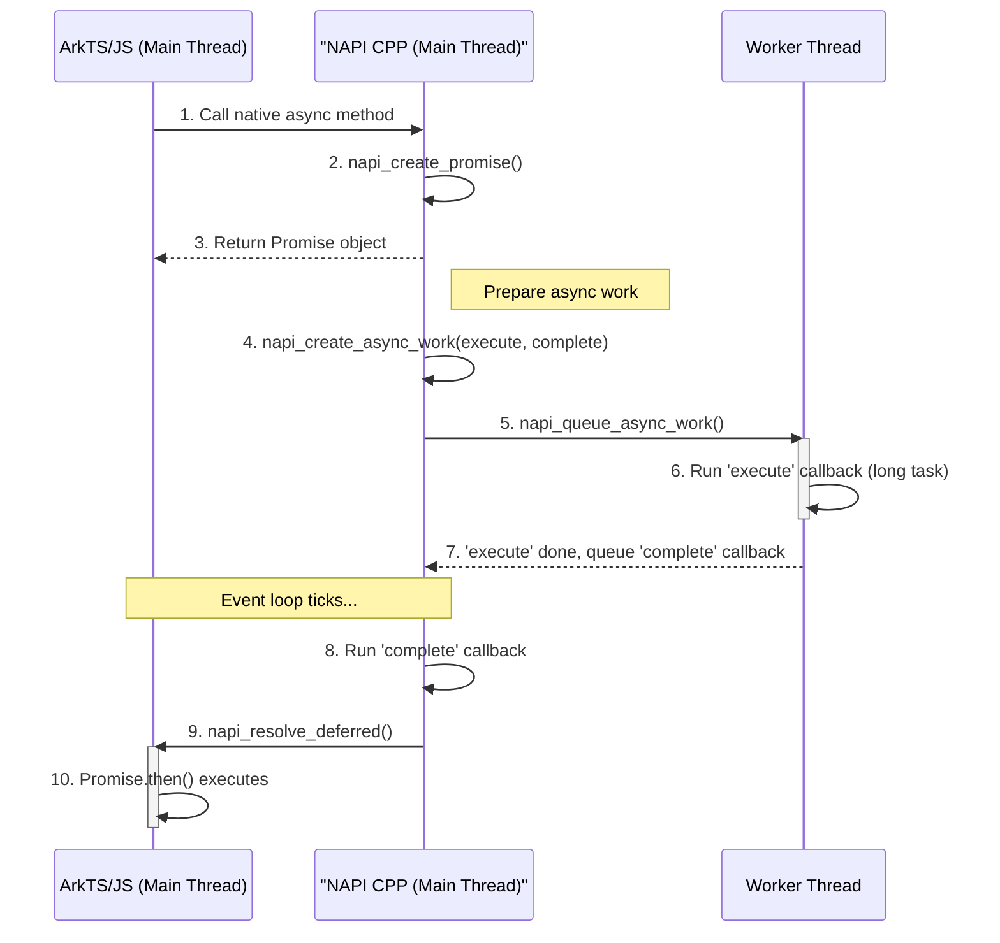

# 异步编程
<!--Kit: ArkTS-->
<!--Subsystem: ArkCompiler-->
<!--Owner: @wanzixuan330-->
<!--Designer: @LeechyLiang; @zengmanyi; @jcj525-->
<!--Tester: @wuhan544-->
<!--Adviser: @fang-jinxu-->

ArkTS 1.2原生支持多任务并发，与ArkTS 1.0（JS）的单线程事件循环模型有很大不同。因此，ANI的设计鼓励将异步流程的编排放在ArkTS层，而不是像NAPI那样在native层管理异步任务。

异步示例：[ani_async_wrapper/ani_async_wrapper.ets · LeechyLiang/ani_cookbook](https://gitcode.com/LeechyLiang/ani_cookbook/blob/master/ani_async_wrapper/ani_async_wrapper.ets)

> ⚠️ **潜在问题：**
> 在异步上下文中抛出异常可能会导致程序冻结且无法正常结束。
> 若配置了执行超时，最终可能会自动崩溃。
> 尝试在`.then`之后添加`.catch`并在失败分支中显式reject外层Promise。

## NAPI 异步模式回顾

NAPI通过`napi_create_async_work`在native层创建任务，该任务包含两部分：
1. `execute`回调：在Worker线程执行耗时操作。
2. `complete`回调：在`execute`完成后，回到主线程（事件循环）执行，用于处理结果并resolve/reject Promise。



## ANI 异步模式推荐方案

在ANI中，推荐的模式是将异步编排放在ArkTS层，利用其语言特性（`taskpool`、`Promise`）来完成。

1. **ArkTS层：**
    * 在对外暴露的`Promise`接口内部，创建一个新的`Promise`实例。
    * 使用`taskpool.execute()`将耗时的native方法调用放入工作线程执行。
    * 在`taskpool`返回的Promise的`.then()`中，根据native方法的执行结果，调用`resolve`或`reject`来完成最外层的Promise。

    ```ts
    import taskpool from '@ohos.taskpool';

    class MyService {
        // native方法本身是同步的
        private native heavyTask(param: string): boolean;

        public async heavyTaskPromise(param: string): Promise<boolean> {
            return new Promise((resolve, reject) => {
                // 使用taskpool将native调用放入工作线程
                taskpool.execute(this.heavyTask, param).then(result => {
                    // .then()中的代码在主线程执行
                    // result是native方法的返回值 (装箱后)
                    let success = (result as Boolean).valueOf();
                    if (success) {
                        resolve(true);
                    } else {
                        reject(new Error("Task failed in native"));
                    }
                }).catch(err => {
                    reject(err);
                });
            });
        }

        static { loadLibrary("myservice"); }
    }
    ```

2. **native层：**
    * 只负责实现核心的、**同步的**耗时操作（`heavyTask`）。
    * 无需关心线程管理和Promise的状态变更，大大简化了native层的逻辑。

**实现`AsyncCallback`接口的方案：**
逻辑类似，在`taskpool.execute(...).then()`中调用用户传入的`callback`函数即可。

## Native层Promise接口

如果需要在native层创建或完成Promise状态，可以使用以下接口：

```cpp
ani_status Promise_New(ani_env *env, ani_resolver *result_resolver, ani_object *result_promise);

ani_status PromiseResolver_Resolve(ani_env *env, ani_resolver resolver, ani_ref resolution);

ani_status PromiseResolver_Reject(ani_env *env, ani_resolver resolver, ani_error rejection);
```

