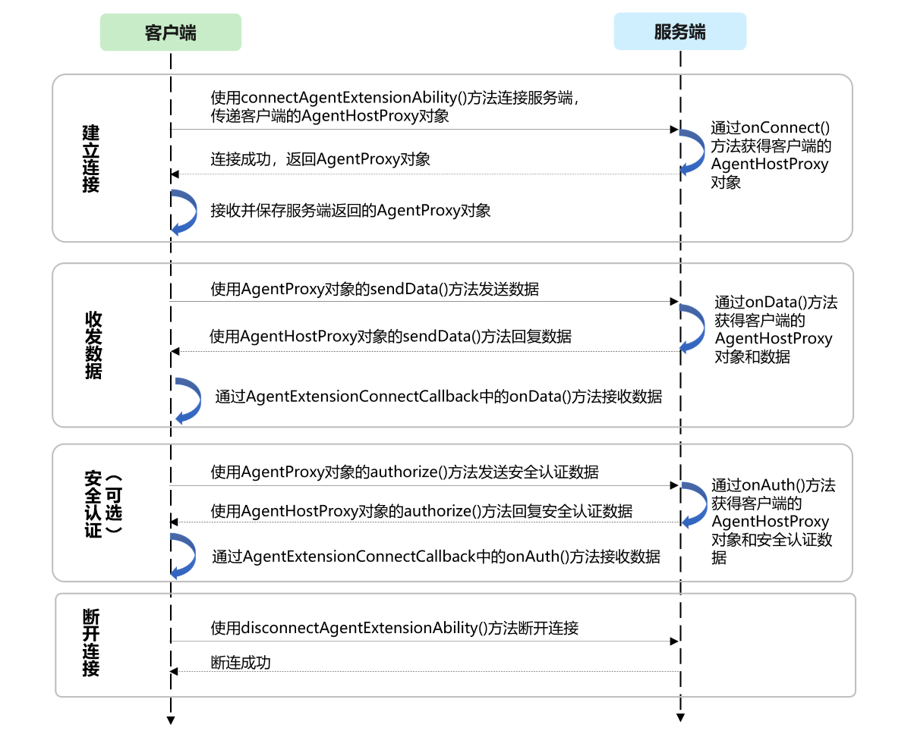

# 使用AgentExtensionAbility组件提供的智能体服务（仅对系统应用开放）

<!--Kit: Ability Kit-->
<!--Subsystem: Ability-->
<!--Owner: @littlejerry1-->
<!--Designer: @ccllee1-->
<!--Tester: @lixueqing513-->
<!--Adviser: @HelloCrease-->

## 概述

从API version 24开始，支持系统应用可以通过agentManager中的[connectAgentExtensionAbility](../reference/apis-ability-kit/js-apis-app-agent-agentManager-sys.md#agentmanagerconnectagentextensionability)方法，连接其他应用已实现的[AgentExtensionAbility](../reference/apis-ability-kit/js-apis-app-agent-agentExtensionAbility.md)组件，并使用其提供的智能体服务。系统应用与智能体可以进行双向通信和双向安全认证。

> **说明**
>
> 本文描述中称被连接的[AgentExtensionAbility](../reference/apis-ability-kit/js-apis-app-agent-agentExtensionAbility.md)为服务端，称连接[AgentExtensionAbility](../reference/apis-ability-kit/js-apis-app-agent-agentExtensionAbility.md)的组件为客户端。

## 客户端与服务端交互机制概述

客户端与服务端交互流程如下图所示：



1. 建立连接

    客户端可以通过调用agentManager中的[connectAgentExtensionAbility](../reference/apis-ability-kit/js-apis-app-agent-agentManager-sys.md#agentmanagerconnectagentextensionability)方法连接服务端的[AgentExtensionAbility](../reference/apis-ability-kit/js-apis-app-agent-agentExtensionAbility.md)（在[Want](../reference/apis-ability-kit/js-apis-app-ability-want.md)对象中指定连接的目标服务）。

    成功建立连接后会触发服务端的[onConnect()](../reference/apis-ability-kit/js-apis-app-agent-agentExtensionAbility.md#onconnect)方法，并在该方法中接收到客户端传递过来的[Want](../reference/apis-ability-kit/js-apis-app-ability-want.md)对象和客户端的[AgentHostProxy](../reference/apis-ability-kit/js-apis-inner-application-agentHostProxy.md)对象。

2. 收发数据

    客户端通过调用[connectAgentExtensionAbility](../reference/apis-ability-kit/js-apis-app-agent-agentManager-sys.md#agentmanagerconnectagentextensionability)方法连接服务端并接收返回的[AgentProxy](../reference/apis-ability-kit/js-apis-inner-application-agentProxy-sys.md)对象。客户端可以使用该[AgentProxy](../reference/apis-ability-kit/js-apis-inner-application-agentProxy-sys.md)对象的[sendData()](../reference/apis-ability-kit/js-apis-inner-application-agentProxy-sys.md#senddata)方法向服务端发送数据。

    服务端在[onData()](../reference/apis-ability-kit/js-apis-app-agent-agentExtensionAbility.md#ondata)方法中可以接收客户端发送的数据和[AgentHostProxy](../reference/apis-ability-kit/js-apis-inner-application-agentHostProxy.md)对象，并且可以通过[AgentHostProxy](../reference/apis-ability-kit/js-apis-inner-application-agentHostProxy.md)的[sendData()](../reference/apis-ability-kit/js-apis-inner-application-agentHostProxy.md#senddata)方法向客户端发送数据。

    客户端通过[AgentExtensionConnectCallback](../reference/apis-ability-kit/js-apis-inner-application-agentExtensionConnectCallback-sys.md)中的[onData()](../reference/apis-ability-kit/js-apis-inner-application-agentExtensionConnectCallback-sys.md#ondata)方法接收服务端发送的数据。

3. 安全认证（可选）

    客户端通过调用[connectAgentExtensionAbility](../reference/apis-ability-kit/js-apis-app-agent-agentManager-sys.md#agentmanagerconnectagentextensionability)方法连接服务端并接收返回的[AgentProxy](../reference/apis-ability-kit/js-apis-inner-application-agentProxy-sys.md)对象。客户端可以使用该[AgentProxy](../reference/apis-ability-kit/js-apis-inner-application-agentProxy-sys.md)对象的[authorize()](../reference/apis-ability-kit/js-apis-inner-application-agentProxy-sys.md#authorize)方法向服务端发送安全认证请求。

    服务端在[onAuth()](../reference/apis-ability-kit/js-apis-app-agent-agentExtensionAbility.md#onauth)方法中可以接收客户端发送的安全认证请求以及[AgentHostProxy](../reference/apis-ability-kit/js-apis-inner-application-agentHostProxy.md)对象，并且可以通过[AgentHostProxy](../reference/apis-ability-kit/js-apis-inner-application-agentHostProxy.md)的[authorize()](../reference/apis-ability-kit/js-apis-inner-application-agentHostProxy.md#authorize)方法向客户端发送安全认证请求。

    客户端通过[AgentExtensionConnectCallback](../reference/apis-ability-kit/js-apis-inner-application-agentExtensionConnectCallback-sys.md)的[onAuth()](../reference/apis-ability-kit/js-apis-inner-application-agentExtensionConnectCallback-sys.md#onauth)方法接收服务端发送的安全认证请求。

4. 断开连接

    客户端调用[connectAgentExtensionAbility](../reference/apis-ability-kit/js-apis-app-agent-agentManager-sys.md#agentmanagerconnectagentextensionability)方法连接服务端时，可以保存服务端返回的[AgentProxy](../reference/apis-ability-kit/js-apis-inner-application-agentProxy-sys.md)对象。客户端可以通过调用[disconnectAgentExtensionAbility](../reference/apis-ability-kit/js-apis-app-agent-agentManager-sys.md#agentmanagerdisconnectagentextensionability)方法利用保存的[AgentProxy](../reference/apis-ability-kit/js-apis-inner-application-agentProxy-sys.md)对象来断开与服务端的连接。

## 连接和断连AgentExtensionAbility

- 使用[connectAgentExtensionAbility](../reference/apis-ability-kit/js-apis-app-agent-agentManager-sys.md#agentmanagerconnectagentextensionability)方法建立与[AgentExtensionAbility](../reference/apis-ability-kit/js-apis-app-agent-agentExtensionAbility.md)的连接。

    <!-- @[agent_manager_one](https://gitcode.com/openharmony/applications_app_samples/blob/master/code/DocsSample/Ability/ConnectAgentExtension/entry/src/main/ets/pages/Index.ets) -->
    
    ``` TypeScript
    import { common, Want, agentManager } from '@kit.AbilityKit';
    import { BusinessError } from '@kit.BasicServicesKit';
    
    @Entry
    @Component
    struct Index {
      comProxy: common.AgentProxy | null = null;
      connectCallback: common.AgentExtensionConnectCallback = {
        onData: (data: string) => {
          console.info(`onData, data: ${data}.`);
        },
        onAuth: (handShakeData: string): void => {
          console.info(`onData, data: ${handShakeData}.`);
        },
        onDisconnect: () => {
          console.info(`onDisconnect.`);
          this.comProxy = null;
        }
      }
    
      build() {
        Column() {
          Row() {
            // 创建连接按钮
            Button('connect ability')
              .enabled(true)
              .onClick(() => {
                let connectWant: Want = {
                  bundleName: 'com.sample.agentextensionability',
                  abilityName: 'AgentExtAbility',
                };
                let agentId: string = 'weather_assistant_001';
                try {
                  // 连接AgentExtensionAbility
                  agentManager.connectAgentExtensionAbility(connectWant, agentId, this.connectCallback)
                    .then((proxy: common.AgentProxy) => {
                      this.comProxy = proxy;
                      // ...
                    })
                    .catch((err: BusinessError) => {
                      console.error(`connectAgentExtensionAbility failed, err code: ${err.code}, err msg: ${err.message}.`);
                    });
                } catch (err) {
                  let code = (err as BusinessError).code;
                  let msg = (err as BusinessError).message;
                  console.error(`connectAgentExtensionAbility failed, err code: ${code}, err msg: ${msg}.`);
                }
              })
            // ...
          }
        }
      }
    }
    ```

- 使用[disconnectAgentExtensionAbility](../reference/apis-ability-kit/js-apis-app-agent-agentManager-sys.md#agentmanagerdisconnectagentextensionability)方法断开与[AgentExtensionAbility](../reference/apis-ability-kit/js-apis-app-agent-agentExtensionAbility.md)的连接。

    <!-- @[agent_manager_two](https://gitcode.com/openharmony/applications_app_samples/blob/master/code/DocsSample/Ability/ConnectAgentExtension/entry/src/main/ets/pages/Index.ets) -->
    
    ``` TypeScript
    import { common, Want, agentManager } from '@kit.AbilityKit';
    import { BusinessError } from '@kit.BasicServicesKit';
    
    @Entry
    @Component
    struct Index {
      comProxy: common.AgentProxy | null = null;
      connectCallback: common.AgentExtensionConnectCallback = {
        onData: (data: string) => {
          console.info(`onData, data: ${data}.`);
        },
        onAuth: (handShakeData: string): void => {
          console.info(`onData, data: ${handShakeData}.`);
        },
        onDisconnect: () => {
          console.info(`onDisconnect.`);
          this.comProxy = null;
        }
      }
    
      build() {
        Column() {
          Row() {
            // ...
            // 创建断连按钮
            Button('disconnect ability')
              .enabled(true)
              .onClick(() => {
                try{
                  // this.agentProxy是连接时保存的proxy对象
                  agentManager.disconnectAgentExtensionAbility(this.comProxy).then(() => {
                    console.info(`disconnectAgentExtensionAbility success.`);
                  }).catch((error: BusinessError) => {
                    console.error(`disconnectAgentExtensionAbility failed, err code: ${error.code}, err msg: ${error.message}.`);
                  });
                } catch (err) {
                  let code = (err as BusinessError).code;
                  let msg = (err as BusinessError).message;
                  console.error(`connectAgentExtensionAbility failed, err code: ${code}, err msg: ${msg}.`);
                }
              })
          }
        }
      }
    }
    ```

## 客户端与服务端双向通信

- 客户端收发数据

    <!-- @[agent_manager_three](https://gitcode.com/openharmony/applications_app_samples/blob/master/code/DocsSample/Ability/ConnectAgentExtension/entry/src/main/ets/pages/Index.ets) -->
    
    ``` TypeScript
    import { common, Want, agentManager } from '@kit.AbilityKit';
    import { BusinessError } from '@kit.BasicServicesKit';
    
    @Entry
    @Component
    struct Index {
      comProxy: common.AgentProxy | null = null;
      connectCallback: common.AgentExtensionConnectCallback = {
        onData: (data: string) => {
          console.info(`onData, data: ${data}.`);
        },
        onAuth: (handShakeData: string): void => {
          console.info(`onData, data: ${handShakeData}.`);
        },
        onDisconnect: () => {
          console.info(`onDisconnect.`);
          this.comProxy = null;
        }
      }
    
      build() {
        Column() {
          Row() {
            // 创建连接按钮
            Button('connect ability')
              .enabled(true)
              .onClick(() => {
                let connectWant: Want = {
                  bundleName: 'com.sample.agentextensionability',
                  abilityName: 'AgentExtAbility',
                };
                let agentId: string = 'weather_assistant_001';
                try {
                  // 连接AgentExtensionAbility
                  agentManager.connectAgentExtensionAbility(connectWant, agentId, this.connectCallback)
                    .then((proxy: common.AgentProxy) => {
                      this.comProxy = proxy;
                      let data = 'test data';
                      try {
                        this.comProxy.sendData(data);
                      } catch (err) {
                        let code = (err as BusinessError).code;
                        let msg = (err as BusinessError).message;
                        console.error(`sendData failed, err code: ${code}, err msg: ${msg}.`);
                      }
                      // ...
                    })
                    .catch((err: BusinessError) => {
                      console.error(`connectAgentExtensionAbility failed, err code: ${err.code}, err msg: ${err.message}.`);
                    });
                } catch (err) {
                  let code = (err as BusinessError).code;
                  let msg = (err as BusinessError).message;
                  console.error(`connectAgentExtensionAbility failed, err code: ${code}, err msg: ${msg}.`);
                }
              })
            // ...
          }
        }
      }
    }
    ```

- 服务端收发数据

  详见[使用AgentExtensionAbility组件收发数据](agent-extension-ability.md#使用agentextensionability组件收发数据)。

## 客户端与服务端双向安全认证

- 客户端处理和发送安全认证请求

    <!-- @[agent_manager_four](https://gitcode.com/openharmony/applications_app_samples/blob/master/code/DocsSample/Ability/ConnectAgentExtension/entry/src/main/ets/pages/Index.ets) -->
    
    ``` TypeScript
    import { common, Want, agentManager } from '@kit.AbilityKit';
    import { BusinessError } from '@kit.BasicServicesKit';
    
    @Entry
    @Component
    struct Index {
      comProxy: common.AgentProxy | null = null;
      connectCallback: common.AgentExtensionConnectCallback = {
        onData: (data: string) => {
          console.info(`onData, data: ${data}.`);
        },
        onAuth: (handShakeData: string): void => {
          console.info(`onData, data: ${handShakeData}.`);
        },
        onDisconnect: () => {
          console.info(`onDisconnect.`);
          this.comProxy = null;
        }
      }
    
      build() {
        Column() {
          Row() {
            // 创建连接按钮
            Button('connect ability')
              .enabled(true)
              .onClick(() => {
                let connectWant: Want = {
                  bundleName: 'com.sample.agentextensionability',
                  abilityName: 'AgentExtAbility',
                };
                let agentId: string = 'weather_assistant_001';
                try {
                  // 连接AgentExtensionAbility
                  agentManager.connectAgentExtensionAbility(connectWant, agentId, this.connectCallback)
                    .then((proxy: common.AgentProxy) => {
                      this.comProxy = proxy;
                      // ...
                      let authorizeData = 'authorize data';
                      try {
                        this.comProxy.authorize(authorizeData);
                      } catch (err) {
                        let code = (err as BusinessError).code;
                        let msg = (err as BusinessError).message;
                        console.error(`sendData failed, err code: ${code}, err msg: ${msg}.`);
                      }
                    })
                    .catch((err: BusinessError) => {
                      console.error(`connectAgentExtensionAbility failed, err code: ${err.code}, err msg: ${err.message}.`);
                    });
                } catch (err) {
                  let code = (err as BusinessError).code;
                  let msg = (err as BusinessError).message;
                  console.error(`connectAgentExtensionAbility failed, err code: ${code}, err msg: ${msg}.`);
                }
              })
            // ...
          }
        }
      }
    }
    ```

- 服务端处理和发送安全认证请求

  详见[使用AgentExtensionAbility组件接收和发送安全认证请求](agent-extension-ability.md#使用agentextensionability组件接收和发送安全认证请求)。

            
