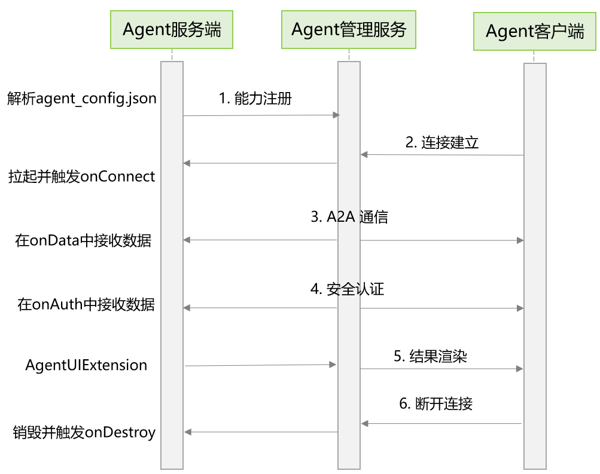

# 端侧A2A框架概述

<!--Kit: Ability Kit-->
<!--Subsystem: Ability-->
<!--Owner: @littlejerry1-->
<!--Designer: @ccllee1-->
<!--Tester: @liangchengguang-->
<!--Adviser: @HelloCrease-->

## 场景介绍

随着智能化的深入发展，越来越多的应用需要具备智能交互和跨应用协作的能力。传统应用之间的交互通常需要预先定义紧耦合的接口，开发成本高、扩展性差。从API version 24开始，端侧智能体框架（端侧A2A）为智能体（Agent）提供了一种标准化的通信与交互机制，该框架是HMAF（Harmony Agent Framework）框架在端侧能力的延伸，支持统一A2A协议规范和端云互调。

以“旅行规划”复合任务场景为例，各组件协作流程如下：

- 客户端调度：智能助手作为Agent客户端捕获用户意图（如“帮我规划明天的旅行行程”）。

- 动态服务发现：系统自动发现并连接“天气查询”、“机票预订”、“酒店推荐”等多个Agent服务端。

- 多技能协同闭环：各服务端通过A2A协议进行能力描述、数据交换和安全认证，无需预先知道彼此的实现细节，将异构的独立技能进行动态组合，协同完成复杂的端到端业务闭环。

## 基本概念

- 智能体(Agent)：一种能够自主执行任务、提供智能服务的应用组件。

- A2A协议：Agent-to-Agent开放协议，定义了智能体之间标准化通信与协作的规范，包括能力描述、数据交换、安全认证和技能调用等机制。 

- 智能体卡片(AgentCard)：用于描述智能体的能力和技能。包含智能体的基本信息、能力描述、技能列表等。

- 智能体技能(AgentSkill)：表示智能体可以执行的具体功能。每个技能定义了用途、标签、输入输出模式和使用示例，支持多技能组合。

以"旅行规划"场景为例：一个旅行助手智能体可以包含"机票查询"、"酒店预订"、"景点推荐"等多个智能体技能，每个技能通过智能体卡片对外描述其输入输出规范。其他智能体（如语音助手）通过A2A协议读取智能体卡片，了解该智能体提供哪些技能以及如何调用，从而实现自动化的任务协调。

## 运行机制

端侧智能体框架采用客户端-服务端架构，基于A2A协议通过Agent管理服务进行通信与协作，整体运行机制如下：

- **能力注册**：开发者在[agent_config.json](./agent-extension-configuration.md)中配置[AgentCard](../reference/apis-ability-kit/js-apis-inner-application-AgentCard.md)，描述智能体的名称、描述、技能列表、输入输出模式等信息。Agent管理服务负责管理这些注册信息。

- **连接建立**：系统应用（Agent客户端）<!--Del-->通过Agent管理服务的[connectAgentExtensionAbility](../reference/apis-ability-kit/js-apis-app-agent-agentManager-sys.md#agentmanagerconnectagentextensionability)方法，<!--DelEnd-->连接目标智能体（Agent服务端）的[AgentExtensionAbility](../reference/apis-ability-kit/js-apis-app-agent-agentExtensionAbility.md)组件，建立通信通道。

- **A2A通信**：连接建立后，客户端和服务端通过标准化的接口进行双向数据通信。客户端<!--Del-->通过[AgentProxy](../reference/apis-ability-kit/js-apis-inner-application-agentProxy-sys.md)<!--DelEnd-->发送请求，服务端在[onData()](../reference/apis-ability-kit/js-apis-app-agent-agentExtensionAbility.md#ondata)回调中接收并处理数据，然后通过[AgentHostProxy](../reference/apis-ability-kit/js-apis-inner-application-agentHostProxy.md)的[sendData()](../reference/apis-ability-kit/js-apis-inner-application-agentHostProxy.md#senddata)方法将数据发送给客户端。

- **安全认证**（可选）：客户端和服务端支持双向安全认证，确保通信双方身份可信。客户端<!--Del-->通过[authorize()](../reference/apis-ability-kit/js-apis-inner-application-agentProxy-sys.md#authorize)<!--DelEnd-->发起认证，服务端在[onAuth()](../reference/apis-ability-kit/js-apis-app-agent-agentExtensionAbility.md#onauth)回调中处理认证请求，然后通过[AgentHostProxy](../reference/apis-ability-kit/js-apis-inner-application-agentHostProxy.md)的[authorize()](../reference/apis-ability-kit/js-apis-inner-application-agentHostProxy.md#authorize)方法向客户端回复认证。

- **结果渲染**（可选）：服务端可以通过[AgentUIExtensionAbility](../reference/apis-ability-kit/js-apis-agent-agentUIExtensionAbility.md)在客户端应用中展示智能体的UI界面，实现富交互体验。

- **断开连接**：任务完成后，客户端<!--Del-->调用[disconnectAgentExtensionAbility](../reference/apis-ability-kit/js-apis-app-agent-agentManager-sys.md#agentmanagerdisconnectagentextensionability)<!--DelEnd-->断开与服务端的连接。

**图1** 智能体架构示意图

