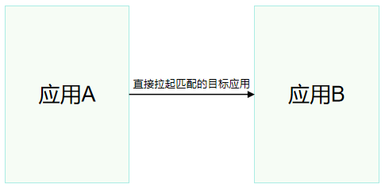
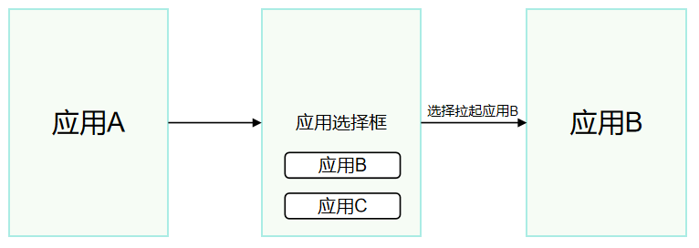

# 拉起指定应用概述

<!--Kit: Ability Kit-->
<!--Subsystem: Ability-->
<!--Owner: @hanchen45-->
<!--Designer: @ccllee1-->
<!--Tester: @lixueqing513-->
<!--Adviser: @huipeizi-->

本章节主要介绍如何通过应用链接跳转的方式拉起指定应用。

> **说明：**
> 
> 从API 12开始，已不再推荐三方应用使用指定Ability方式（即显式Want）拉起其他应用。关于如何从指定Ability方式切换到指定[应用链接](app-startup-overview.md#应用链接)方式，详见[显式Want跳转切换应用链接跳转适配指导](uiability-startup-adjust.md)。


## 应用链接

应用链接是指可以将用户引导至应用内特定位置或相关网页的URL，常见的格式如下。更多关于应用链接格式与字段含义的说明，详见[应用链接说明](app-uri-config.md)。

```
scheme://host[:port]/path
```


## 运作机制

1. 目标应用在配置文件中注册自己的URL，并对外提供URL。
2. 拉起方应用在跳转接口中传入目标应用的URL等信息。
3. 系统接收到URL等相关信息，会寻找对应匹配项，并跳转至目标应用。


## 应用链接分类

按照应用链接的scheme以及校验机制的不同，可以分为Deep Linking与App Linking两种方式。

- **Deep Linking**：是一种通过链接跳转至应用特定页面的技术，其特点是支持开发者定义任意形式的scheme。由于缺乏域名校验机制，容易被其他应用所仿冒。

- **App Linking**：其限定了scheme必须为https，同时通过增加域名校验机制，可以从已匹配到的应用中筛选过滤出目标应用，消除应用查询和定位中产生的歧义，直达受信的目标应用。


相比Deep Linking，App Linking具有更高的安全性和可靠性，用户体验更佳。推荐开发者将App Linking作为首选方案。

| 类型 | App Linking（推荐） | Deep Linking |
| -------- | -------- |-------- |
| 实现方案 | 目标应用需要在module.json5中声明应用链接；同时需要向系统注册域名并通过域名认证。 |  目标应用需要在module.json5中声明应用链接。 |
| 链接格式 | scheme必须为https。 | scheme可以自定义。通常不为https、http、file，否则会拉起默认的系统浏览器。 |
| 是否可用于分享或直接在网页中访问 | 可以 | 不可以，需在代码中调用。 |
| 是否可以直接拉起目标应用 | 可以 | 可以，但不推荐使用，存在被仿冒风险。 |

Deep Linking与App Linking均可以使用[openLink](../reference/apis-ability-kit/js-apis-inner-application-uiAbilityContext.md#openlink12)接口实现，不同条件下的跳转效果如下。

> **说明：**
> 
> 该接口中的appLinkingOnly字段表示是否必须以App Linking的方式启动UIAbility，默认为false。appLinkingOnly为true一般只用于浏览器等应用。


| 应用链接类型 | App Linking（推荐） | Deep Linking |
| -------- | -------- |-------- |
| appLinkingOnly为false且目标应用已安装 | 直接跳转打开目标应用。 | 跳转目标应用（如果有多个符合条件的应用时，展示应用选择弹框）。 |
| appLinkingOnly为false且目标应用未安装 | 跳转默认浏览器打开网页。 |返回失败，系统不跳转，由应用自行处理；当前会展示“链接无法打开”弹框。 |
| appLinkingOnly为true且目标应用已安装 | 直接跳转打开目标应用。 |返回失败，系统不跳转，由应用自行处理。 |
| appLinkingOnly为true且目标应用未安装 | 返回失败，系统不跳转由应用自行处理。 | 返回失败，系统不跳转，由应用自行处理。 |

通过App Linking方式拉起指定应用的示意图如下：



通过Deep Linking方式拉起应用时，如果存在多个符合条件的应用，需要用户选择后方可跳转到指定应用。示意图如下：



<!--RP1-->
openLink方式启动其他应用：可以通过将OpenLinkOptions中的hideFailureTipDialog字段设置为true，取消弹框提示。示例如下：
```js
import { common, OpenLinkOptions, wantConstant, CompletionHandler, bundleManager } from '@kit.AbilityKit';
import { hilog } from '@kit.PerformanceAnalysisKit';
import { BusinessError } from '@kit.BasicServicesKit';

const DOMAIN = 0xeeee;
const TAG: string = '[openLinkDemo]';

@Entry
@Component
struct Index {
  @State message: string = 'I am caller';

  build() {
    Row() {
      Column() {
        Text(this.message)
          .fontSize(50)
          .fontWeight(FontWeight.Bold)
        Button('start browser', { type: ButtonType.Capsule, stateEffect: true })
          .width('87%')
          .height('5%')
          .margin({ bottom: '12vp' })
          .onClick(() => {
            let context = this.getUIContext().getHostContext() as common.UIAbilityContext;
            let link: string = 'https://www.example.com';
            let completionHandler: CompletionHandler = {
              onRequestSuccess: (elementName: bundleManager.ElementName, message: string): void => {
                console.info(`${elementName.bundleName}-${elementName.moduleName}-${elementName.abilityName} start succeeded: ${message}`);
              },
              onRequestFailure: (elementName: bundleManager.ElementName, message: string): void => {
                console.error(`${elementName.bundleName}-${elementName.moduleName}-${elementName.abilityName} start failed: ${message}`);
              }
            };
            let openLinkOptions: OpenLinkOptions = {
              appLinkingOnly: false,
              // hideFailureTipDialog字段需要在appLinkingOnly字段是false时才生效
              hideFailureTipDialog: true,
              parameters: {
                [wantConstant.Params.CONTENT_TITLE_KEY]: 'contentTitle',
                keyString: 'str',
                keyNumber: 200,
                keyBool: false,
                keyObj: {
                  keyObjKey: 'objValue',
                }
              },
              completionHandler: completionHandler
            };
            try {
              context.openLink(
                link,
                openLinkOptions,
                (err, result) => {
                  hilog.error(DOMAIN, TAG, `openLink callback error.code: ${JSON.stringify(err)}`);
                  hilog.info(DOMAIN, TAG, `openLink callback result: ${JSON.stringify(result.resultCode)}`);
                  hilog.info(DOMAIN, TAG, `openLink callback result data: ${JSON.stringify(result.want)}`);
                }
              ).then(() => {
                hilog.info(DOMAIN, TAG, `open link success.`);
              }).catch((err: BusinessError) => {
                hilog.error(DOMAIN, TAG, `open link failed, errCode: ${JSON.stringify(err.code)}`);
              });
            } catch (e) {
              hilog.error(DOMAIN, TAG, `open link failed, errCode: ${JSON.stringify(e.code)}`);
            }
          })
      }
      .width('100%')
    }
    .height('100%')
  }
}
```
<!--RP1End-->