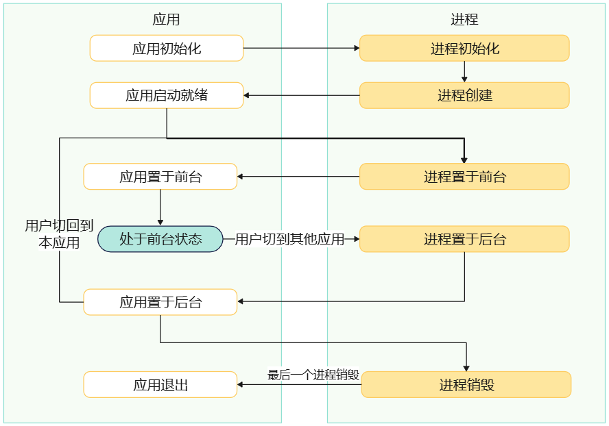
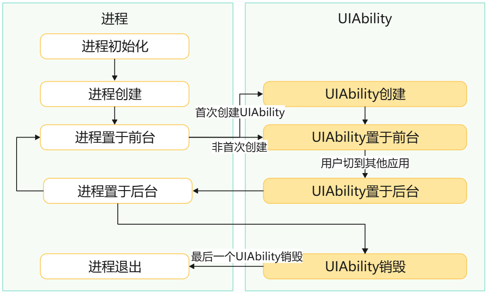

# 应用生命周期概述

<!--Kit: Ability Kit-->
<!--Subsystem: Ability-->
<!--Owner: @wendel-->
<!--Designer: @wendel-->
<!--Tester: @liangchengguang-->
<!--Adviser: @HelloCrease-->

## 概述

当用户在执行应用启动、应用前后台切换、应用退出等操作时，应用的整体生命周期状态会随之发生变化。理解应用的生命周期有助于开发者在合适的时机进行资源申请与释放、业务状态管理等操作。本章节主要介绍应用的生命周期状态、应用生命周期与应用进程及应用组件（[UIAbility](../reference/apis-ability-kit/js-apis-app-ability-uiAbility.md)、[ExtensionAbility](../reference/apis-ability-kit/js-apis-app-ability-extensionAbility.md)）的关系，以及如何监听应用生命周期状态的变化。

## 应用生命周期状态

### 应用生命周期与应用进程、应用组件的关系

- 应用生命周期与应用进程的关系

    当应用的首个进程创建时，意味着应用的启动；当应用的所有进程结束时，则意味着应用退出（具体关联见下图）。

    

- 应用进程生命周期与UIAbility组件的关系

    应用进程的生命周期直接制约并影响着UIAbility组件的生命周期（具体关联见下图）。

    

    [UIAbility组件生命周期](./uiability-lifecycle.md)的前后台回调与进程的前后台状态密切相关，但二者并非完全等同：

    - UIAbility的[onForeground()](../reference/apis-ability-kit/js-apis-app-ability-uiAbility.md#onforeground)回调表示该UIAbility实例切换至前台状态。
    - 进程状态的前后台表示整个进程的前后台状态。
    - 一个进程可能包含多个UIAbility，其中某个UIAbility的`onForeground()`不一定意味着进程状态发生改变（例如，进程可能已处于前台状态）。

    UIAbility状态和进程状态的对应关系如下（假设进程内有两个UIAbility组件）：
    | UIAbility状态 | 进程内窗口状态 | 进程状态 |
    | --------- | --------- | ------------------------------ |
    | 任一UIAbility处于前台状态 | 可见状态 | 前台状态 |
    | 任一UIAbility处于前台状态 | 不可见状态 | 前台状态 |
    | 所有UIAbility处于后台状态 | 可见状态 | 前台状态 |
    | 所有UIAbility处于后台状态 | 不可见状态 | 后台状态 |

- 应用进程生命周期与ExtensionAbility组件的关系

    当首个ExtensionAbility组件被创建时，会先创建相应的应用进程；当应用进程被销毁时，该进程的所有ExtensionAbility组件也会被销毁。

### 应用生命周期状态变化

- 应用启动：应用可以运行在一个或多个进程中，一个进程中也可以运行单个或多个[UIAbility](../reference/apis-ability-kit/js-apis-app-ability-uiAbility.md)组件实例。三方应用开发者开发的应用，必须包含至少一个[UIAbility](../reference/apis-ability-kit/js-apis-app-ability-uiAbility.md)组件，否则没有界面对用户展示。应用启动机制详见[应用的启动](./application-startup-options.md)中的介绍。
- 应用退出：当进程中所有的应用组件都销毁，进程进入销毁流程；当应用中的所有进程都销毁，则应用退出。应用退出机制详见[应用退出](./app-stop.md)中的介绍。
- 应用前后台切换：当应用中至少有一个进程处于前台则该应用为前台状态；如果应用中的所有进程都处于后台，则该应用处于后台状态。
    - 应用进程切换到前台的时机：
        - 应用进程内首个UIAbility启动时，系统会将应用进程切换到前台状态。
        - 在应用已处于后台状态前提下，用户从多任务界面点击任务将应用切换到前台状态。
        - 用户从其他应用返回到已处于后台状态下的应用时，系统会将应用进程切换到前台状态。
        - 解锁锁屏界面并返回到锁屏前显示的应用时，系统会将该应用进程切换到前台状态。

    - 应用进程切换到后台的时机：
        - 用户从应用进程返回到桌面时，系统会将应用进程切换到后台状态。
        - 用户切换到其他应用时，系统会将应用进程切换到后台状态。
        - 屏幕锁屏时，系统会将正在显示的应用进程切换到后台状态。
> **说明：**
>
> 上述应用进程前后台的切换时机不包含2in1应用，2in1应用仅在启动时被系统切换到前台状态，退出时被系统切换到后台状态。

## 监听应用生命周期

### 监听应用的启动和退出
    
应用需要先申请[ohos.permission.RUNNING_STATE_OBSERVER](../security/AccessToken/permissions-for-enterprise-apps.md#ohospermissionrunning_state_observer)权限，然后使用[on('applicationState')](../reference/apis-ability-kit/js-apis-app-ability-appManager.md#appmanageronapplicationstate14)方法可以监听全部应用的状态；使用[on('applicationState')](../reference/apis-ability-kit/js-apis-app-ability-appManager.md#appmanageronapplicationstate14-1)方法可以监听指定应用的状态。通过实现`ApplicationStateObserver`接口中的[onAppStarted()](../reference/apis-ability-kit/js-apis-inner-application-applicationStateObserver.md#applicationstateobserveronappstarted)方法，可以监听应用的启动。通过实现`ApplicationStateObserver`接口中的[onAppStopped()](../reference/apis-ability-kit/js-apis-inner-application-applicationStateObserver.md#applicationstateobserveronappstopped)方法，可以监听应用的退出。

### 监听应用前后台变化
    
应用使用`ApplicationContext`的[on('applicationStateChange')](../reference/apis-ability-kit/js-apis-inner-application-applicationContext.md#applicationcontextonapplicationstatechange10)方法可以监听应用的前后台状态变化，当应用前后台切换时，可以收到相应回调函数的通知，从而执行一些依赖前后台的方法，或者进行应用前后台切换频率等数据统计。

以[UIAbilityContext](../reference/apis-ability-kit/js-apis-inner-application-uiAbilityContext.md)中的使用为例进行说明。

<!-- @[lifecycle_ability_start](https://gitcode.com/openharmony/applications_app_samples/blob/master/code/DocsSample/Ability/ApplicationContextDemo/entry/src/main/ets/lifecycleability/LifecycleAbility.ets) -->

> **说明：**
>
> 上述的回调事件均为异步回调，无严格的时序关系。

``` TypeScript
import { UIAbility, ApplicationStateChangeCallback } from '@kit.AbilityKit';
import { BusinessError } from '@kit.BasicServicesKit';
import { hilog } from '@kit.PerformanceAnalysisKit';

const TAG = '[LifecycleAbility]';
const DOMAIN = 0xF811;

export default class LifecycleAbility extends UIAbility {
  onCreate() {
    let applicationStateChangeCallback: ApplicationStateChangeCallback = {
      onApplicationForeground() {
        hilog.info(DOMAIN, TAG, 'applicationStateChangeCallback onApplicationForeground');
      },
      onApplicationBackground() {
        hilog.info(DOMAIN, TAG, 'applicationStateChangeCallback onApplicationBackground');
      }
    }

    // 1.获取applicationContext
    let applicationContext = this.context.getApplicationContext();
    try {
      // 2.通过applicationContext注册应用前后台状态监听
      applicationContext.on('applicationStateChange', applicationStateChangeCallback);
    } catch (paramError) {
      hilog.error(DOMAIN, TAG, `error: ${(paramError as BusinessError).code}, ${(paramError as BusinessError).message}`);
    }
    hilog.info(DOMAIN, TAG, 'Register applicationStateChangeCallback');
  }
}
```