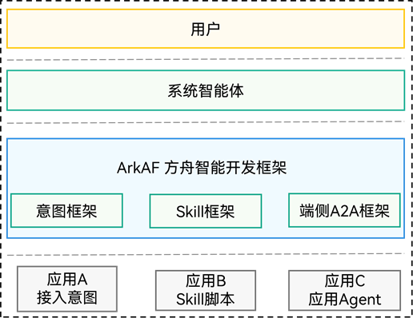

# 方舟智能开发框架概述

<!--Kit: Ability Kit-->
<!--Subsystem: Ability-->
<!--Owner: @wkljy-->
<!--Designer: @li-weifeng2024-->
<!--Tester: @liangchengguang-->
<!--Adviser: @HelloCrease-->

随着系统智能体逐步成为用户与操作系统交互的新入口，用户的诉求正从“打开某个应用”转变为“某件具体的事”。因此，应用需要将其细粒度的业务能力开放给智能体调用。

ArkAF（Ark Agentic Framework，方舟智能开发框架）是面向智能体时代的应用能力开发框架，提供意图框架、Skill框架和端侧A2A框架三种能力开放机制，帮助开发者将应用能力外化给系统智能体调用，实现应用与智能体的无缝协同。

## 基本概念

以下是ArkAF开发过程中的关键概念：

- **意图**：标准化意图接入的能力单元，应用开发者通过接入意图可被系统智能体唤醒执行的特定能力。

- **Skill**：标准化Skill接入的能力单元，应用开发者通过上架Skill可被系统智能体识别并调用，适合复杂场景功能。

- **端侧智能体**：应用智能体，开发者通过端侧A2A框架构建应用的智能体，和系统智能体进行会话协同完成系统级别的复杂任务。

## ArkAF架构

ArkAF提供三种核心能力框架，为开发者提供标准化的能力开放机制。

**图1** ArkAF架构图

工作流程分为四个阶段：

**开发接入**：开发者根据业务需求，选择意图框架、Skill框架或端侧A2A框架，将应用能力标准化封装。

**系统注册**：应用能力注册到ArkAF框架，供系统智能体发现和索引。

**智能匹配**：用户通过自然语言向系统入口发出请求，系统智能体解析意图并匹配最佳应用能力。

**能力执行**：系统智能体通过ArkAF框架调用应用能力执行任务并返回结果，系统智能体将结果转化为自然语言反馈用户。

## 能力范围

- 意图框架

  提供标准化意图接入能力和意图调度管理能力，应用开发者通过接入意图可被系统智能体唤醒执行的特定能力，详见[意图框架概述](insight-intent-overview.md)。

- Skill框架

  提供标准化Skill接入的能力和管理能力，应用开发者通过上架Skill可被系统智能体识别并调用，详见[基于ArkTS脚本开发应用Skill](arkts-skill-development-guide.md)。

- 端侧A2A框架

  提供标准化智能体接入能力和智能体调度管理能力，应用开发者可以通过智能体框架开发应用端侧智能体，和系统智能体进行会话协同完成复杂任务，详见[端侧A2A框架概述](agent-overview.md)。

三种能力开放机制的对比如下：

| 能力类型 | 核心能力 | 触发方式 | 适用场景 |
|---------|---------|---------|---------|
| 意图框架 | 标准化意图接入 + 意图调度管理 | 系统智能体唤醒执行 | 单一明确的能力调用（如播放音乐、导航） |
| Skill框架 | 标准化Skill接入 + Skill管理 | 上架Skill后被识别并调用 | 复杂场景功能（如导航回家） |
| 端侧A2A框架 | 标准化智能体接入 + 智能体调度管理 | 与系统智能体双向通信协商 | 应用端侧智能体开发 (如跟踪股票信息) |

## 亮点特性

ArkAF提供以下亮点特性，为开发者带来便捷高效的开发体验：

- 标准化接入能力和管理能力，帮助开发者快速接入系统智能体生态，降低开发成本。

- 应用能力可被系统智能体智能调度，在合适场景为用户提供便捷的智能化服务体验。