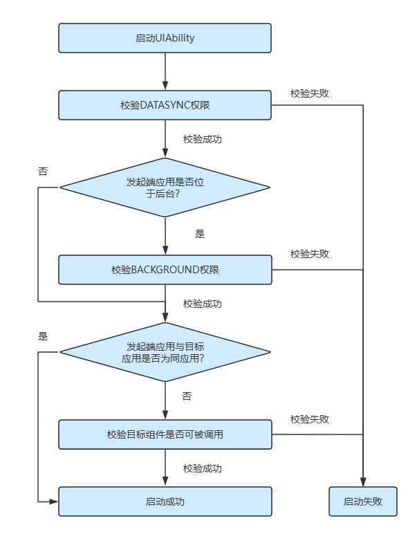
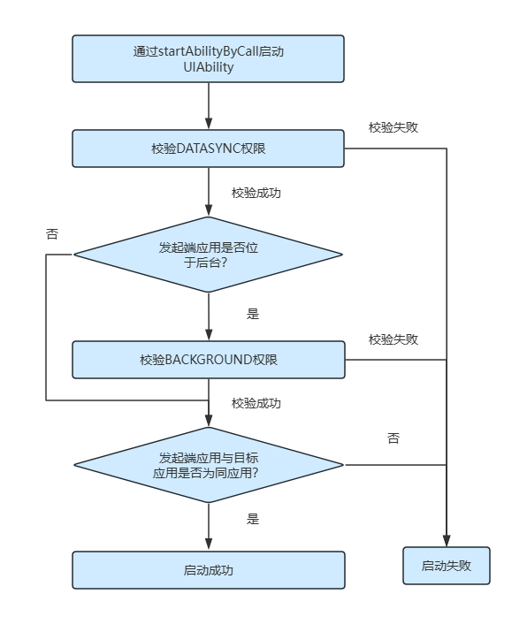
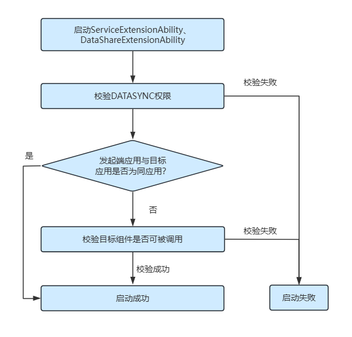

# 跨设备组件启动规则（Stage模型）（仅对系统应用开放）

<!--Kit: Ability Kit-->
<!--Subsystem: Ability-->
<!--Owner: @hobbycao-->
<!--Designer: @gsxiaowen-->
<!--Tester: @zhaodengqi-->
<!--Adviser: @HelloCrease-->

为了保障系统安全与用户体验，系统限制了应用在后台状态时任意弹窗、相互唤醒以及前台应用任意跳转的行为，相关行为表现请参考[跨设备组件启动规则（Stage模型）](./component-startup-rules-cross-device.md)。跨设备启动组件时，系统会在[设备内组件启动规则](./component-startup-rules-inner-device.md)的基础上，**再次进行跨设备维度的校验**。本文主要介绍系统应用在跨设备启动[UIAbility](../reference/apis-ability-kit/js-apis-app-ability-uiAbility.md)和[ExtensionAbility](../reference/apis-ability-kit/js-apis-app-ability-extensionAbility.md)的约束规则。

> **说明：**
>
> - 组件启动规则自API version 9开始生效，新增规则生效版本在规则中单独说明。开发者需熟知组件启动规则，以避免业务功能异常。
> - 跨设备启动需同时满足设备内启动规则与跨设备启动规则，任一环节校验失败均会导致启动失败。

## UIAbility组件启动规则

### 应用内启动UIAbility组件的规则

   位于后台状态的UIAbility应用，默认不允许再启动UIAbility组件。可申请ohos.permission.START_ABILITIES_FROM_BACKGROUND（下文简称BACKGROUND）权限启动UIAbility组件，权限的申请方式请参考[声明权限](../security/AccessToken/declare-permissions.md)。

   | 应用状态 | 权限要求   |
   | -------- | ---------- |
   | 前台应用 | 无         |
   | 后台应用 | BACKGROUND |

   > **说明：**
   >
   > - 对于2in1和Tablet设备：
   >   - 从API version 18开始，如果应用已创建在前台显示的悬浮窗，可不受该条规则约束。
   >   - 从API version 21开始，如果应用自身已经添加到状态栏，可不受该条规则约束。

### 跨应用启动UIAbility组件的规则

   通过[startAbility()](../reference/apis-ability-kit/js-apis-inner-application-uiAbilityContext.md#startability)/[startAbilityForResult()](../reference/apis-ability-kit/js-apis-inner-application-uiAbilityContext.md#startAbilityForResult)接口跨设备启动UIAbility组件时，只允许拉起exported为true的目标组件。若申请ohos.permission.START_INVISIBLE_ABILITY（下文简称INVISIBLE）权限，可不受该条规则约束。位于后台状态的UIAbility应用，默认不允许跨应用启动UIAbility组件，需申请BACKGROUND权限启动UIAbility组件。跨设备启动时不要求DATASYNC权限。权限的申请方式请参考[声明权限](../security/AccessToken/declare-permissions.md)。

   | 应用状态 | 组件可见性     | 权限要求                       |
   | -------- | -------------- | ----------------------------- |
   | 前台应用 | exported:true  | 无                             |
   | 前台应用 | exported:false | INVISIBLE权限                  |
   | 后台应用 | exported:true  | BACKGROUND权限                 |
   | 后台应用 | exported:false | BACKGROUND权限 + INVISIBLE权限 |

   > **说明：**
   >
   > - 在module.json5配置文件中，每个UIAbility都有一个exported属性。exported字段说明可参考[abilities标签](../quick-start/module-configuration-file.md#abilities标签)。
   > - 目标组件exported字段配置为true，表示可以被其他应用调用。
   > - 目标组件exported字段配置为false，表示组件仅允许应用内启动。
   > - 跨设备启动需要设备间建立信任关系，且目标设备处于在线状态。

   启动组件的具体校验流程如下图：

   

   通过[startAbilityByCall()](../reference/apis-ability-kit/js-apis-inner-application-uiAbilityContext.md#startabilitybycall)接口跨设备启动UIAbility组件时，需要具备三个条件：1.申请ohos.permission.ABILITY_BACKGROUND_COMMUNICATION（下文简称CALL）权限；2.目标UIAbility组件的exported为true，若申请INVISIBLE权限，可不受该条规则约束；3.启动方的UIAbility位于前台，否则需要申请BACKGROUND权限。在建立通路过程中，底层软总线会校验DATASYNC权限。权限的申请方式请参考[声明权限](../security/AccessToken/declare-permissions.md)。

   | 应用状态 | 组件可见性     | 权限要求                                  |
   | -------- | -------------- | ----------------------------------------- |
   | 前台应用 | exported:true  | CALL权限 + DATASYNC权限（软总线校验）                  |
   | 前台应用 | exported:false | INVISIBLE权限 + CALL权限 + DATASYNC权限（软总线校验）    |
   | 后台应用 | exported:true  | BACKGROUND权限 + CALL权限 + DATASYNC权限（软总线校验）   |
   | 后台应用 | exported:false | BACKGROUND权限 + INVISIBLE权限 + CALL权限 + DATASYNC权限（软总线校验） |

   > **说明：**
   >
   > - 当前仅分布式迁移场景对第三方应用开放Call调用权限，系统应用可自由使用。
   > - startAbilityByCall()接口在建立通路过程中，底层软总线会校验DATASYNC权限。

   启动组件的具体校验流程如下图：

   

## 跨设备启动校验拦截规则

跨设备启动组件时，被拉起方设备会进行以下校验，任一环节失败均会导致启动失败。

### 校验项说明

| 校验项 | 校验内容 | 拦截条件 |
| --- | --- | --- |
| 账号访问权限 | 校验设备间账号关系 | 同账号、访问组、ACL列表三者全部校验失败 |
| 后台权限校验 | 校验调用方在后台时是否具备BACKGROUND权限 | 调用方位于后台且未申请`ohos.permission.START_ABILITIES_FROM_BACKGROUND`权限 |
| 设备安全等级校验 | 校验源设备安全等级不低于目标设备 | 目标组件exported为false，且源设备安全等级低于目标设备 |
| 可见性权限校验 | 校验调用方是否具备拉起不可见组件的权限 | 目标组件exported为false且调用方未申请`ohos.permission.START_INVISIBLE_ABILITY`权限 |
| 自定义权限校验 | 校验调用方是否持有目标组件声明的权限 | 目标组件在module.json5中声明了permissions，调用方未持有其中任一权限 |

### 各接口校验项对照

| 校验项 | startAbility / startAbilityForResult | startAbilityByCall | connectServiceExtensionAbility |
| --- | :---: | :---: | :---: |
| 账号访问权限 | ✅ | ✅ | ✅ |
| 后台权限校验 | ✅ | ✅ | ✅ |
| 设备安全等级校验 | ✅ | ✅ | ✅ |
| 可见性权限校验 | ✅ | ✅ | ✅ |
| 自定义权限校验 | ✅ | ❌ | ✅ |

> **说明：**
>
> - 系统应用可通过申请相应权限豁免部分校验规则。
> - startAbilityByCall场景不校验自定义权限，但需申请`ohos.permission.ABILITY_BACKGROUND_COMMUNICATION`权限。

## ExtensionAbility组件启动规则

所有类型的[ExtensionAbility](../reference/apis-ability-kit/js-apis-app-ability-extensionAbility.md)组件（[ServiceExtensionAbility](../reference/apis-ability-kit/js-apis-app-ability-serviceExtensionAbility-sys.md)、[DataShareExtensionAbility](../reference/apis-arkdata/js-apis-application-dataShareExtensionAbility-sys.md)除外）是由相应的系统管理服务拉起，以确保其生命周期受系统管控。ExtensionAbility组件在使用时被拉起，使用完则销毁。

- [ServiceExtensionAbility](../reference/apis-ability-kit/js-apis-app-ability-serviceExtensionAbility-sys.md)组件启动规则：

   通过[startServiceExtensionAbility](../reference/apis-ability-kit/js-apis-inner-application-serviceExtensionContext-sys.md#serviceextensioncontextstartserviceextensionability)跨设备启动或使用[connectServiceExtensionAbility](../reference/apis-ability-kit/js-apis-inner-application-serviceExtensionContext-sys.md#serviceextensioncontextconnectserviceextensionability)跨设备连接ServiceExtensionAbility组件时，只允许拉起exported为true的目标组件。若申请INVISIBLE权限，可不受该条规则约束。在建立通路过程中，底层软总线会校验DATASYNC权限。

   | 应用状态 | 组件可见性     | 权限要求                       |
   | -------- | -------------- | ----------------------------- |
   | 前台应用 | exported:true  | DATASYNC权限（软总线校验）             |
   | 前台应用 | exported:false | INVISIBLE权限 + DATASYNC权限（软总线校验） |
   | 后台应用 | exported:true  | DATASYNC权限（软总线校验）             |
   | 后台应用 | exported:false | INVISIBLE权限 + DATASYNC权限（软总线校验） |

   启动组件的具体校验流程如下图：

   

- [DataShareExtensionAbility](../reference/apis-arkdata/js-apis-application-dataShareExtensionAbility-sys.md)组件启动规则：

   通过[createDataShareHelper](../reference/apis-arkdata/js-apis-data-dataShare-sys.md#datasharecreatedatasharehelper)接口可以跨设备启动DataShareExtensionAbility组件，在建立通路过程中，底层软总线会校验DATASYNC权限。具体操作和限制请参考[通过DataShareExtensionAbility实现数据共享](../database/share-data-by-datashareextensionability-sys.md)。

- 其他ExtensionAbility组件启动规则：
   
   其他ExtensionAbility组件的启动规则请参考[ExtensionAbility组件](extensionability-overview.md#extensionability类型说明)。