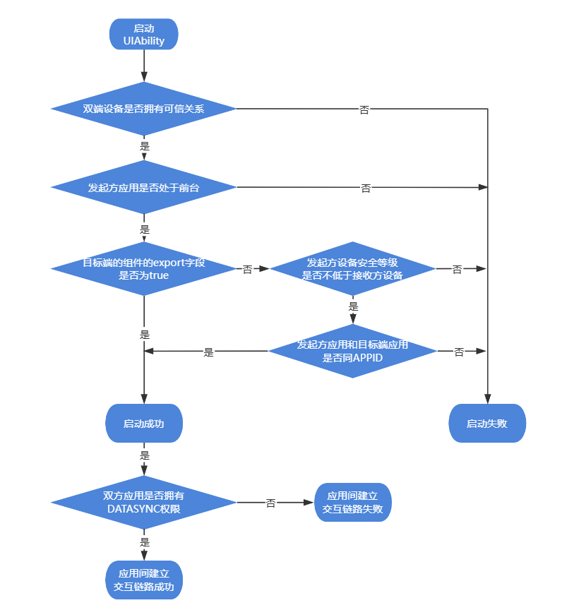

# 跨设备组件启动规则（Stage模型）

<!--Kit: Ability Kit-->
<!--Subsystem: Ability-->
<!--Owner: @wendel-->
<!--Designer: @wendel-->
<!--Tester: @liangchengguang-->
<!--Adviser: @HelloCrease-->

本文介绍第三方应用跨设备启动[UIAbility](../reference/apis-ability-kit/js-apis-app-ability-uiAbility.md)和[ExtensionAbility](../reference/apis-ability-kit/js-apis-app-ability-extensionAbility.md)的约束规则。系统应用规则请参考[跨设备组件启动规则（Stage模型）（仅对系统应用开放）](./component-startup-rules-cross-device-sys.md)。

> **说明：**
> - 跨设备启动需设备间建立可信关系。（双端设备登录同一个华为账号；若非同账号环境，需先通过[设备发现](../distributedservice/devicemanager-guidelines.md#设备发现开发指导)和[设备绑定](../distributedservice/devicemanager-guidelines.md#设备绑定开发指导)建立设备间可信关系）
> - 跨设备启动需同时满足[设备内组件启动规则（Stage模型）](./component-startup-rules-inner-device.md)与跨设备启动规则，任一环节校验失败均会导致启动失败。

## 支持的启动接口

| 接口 | 适用场景 | 发起方应用权限要求 | 被启动方权限要求 | 分布式设备安全等级要求 |
| --- | --- | --- | --- | --- |
| [abilityConnectionManager](../reference/apis-distributedservice-kit/js-apis-distributed-abilityConnectionManager.md) | 支持跨设备启动UIAbility组件和多轮交互模式，依赖WIFI开启；**推荐使用该接口，接口速度快、性能更好**，详情请参考[跨设备连接UIAbility开发指南](../distributedservice/abilityconnectmanager-guidelines.md)。 | 需申请ohos.permission.INTERNET，ohos.permission.GET_NETWORK_INFO，ohos.permission.SET_NETWORK_INFO和ohos.permission.DISTRIBUTED_DATASYNC权限。权限申请方式参考[声明权限](../security/AccessToken/declare-permissions.md)；   若目标组件在module.json5文件中设置了[abilities标签](../quick-start/module-configuration-file.md)中的permissions时，调用方必须持有其中所有权限。 | 需申请ohos.permission.INTERNET，ohos.permission.GET_NETWORK_INFO，ohos.permission.SET_NETWORK_INFO和ohos.permission.DISTRIBUTED_DATASYNC权限。 | 若目标组件设置`exported`为`false`，要求发起方设备的安全等级不能低于目标方设备。 |
| [startAbilityByCall](../reference/apis-ability-kit/js-apis-inner-application-uiAbilityContext.md#startabilitybycall) | 支持跨设备启动**同应用**（相同APPID）的UIAbility组件和多轮交互模式 | 需申请ohos.permission.DISTRIBUTED_DATASYNC（该权限仅当执行应用间建链操作时由软总线实施权限校验，在应用拉起阶段不做校验） | 需申请ohos.permission.DISTRIBUTED_DATASYNC（该权限仅当执行应用间建链操作时由软总线实施权限校验，在应用拉起阶段不做校验）。| 若目标组件设置`exported`为`false`，要求发起方设备的安全等级不能低于目标方设备。 |
| [connectServiceExtensionAbility](../reference/apis-ability-kit/js-apis-inner-application-uiAbilityContext.md#connectserviceextensionability) | 支持跨设备启动ExtensionAbility组件和多轮交互模式 | 需申请ohos.permission.DISTRIBUTED_DATASYNC（该权限仅当执行应用间建链操作时由软总线实施权限校验，在应用拉起阶段不做校验）；   若目标组件在module.json5文件中设置了[abilities标签](../quick-start/module-configuration-file.md)中的permissions时，调用方必须持有其中所有权限。 | 需申请ohos.permission.DISTRIBUTED_DATASYNC（该权限仅当执行应用间建链操作时由软总线实施权限校验，在应用拉起阶段不做校验）。| 若目标组件设置`exported`为`false`，要求发起方设备的安全等级不能低于目标方设备。 |
| [startAbility](../reference/apis-ability-kit/js-apis-inner-application-uiAbilityContext.md#startability) | 支持UIAbility间的跨设备单次启动 | 若目标组件在module.json5文件中设置了[abilities标签](../quick-start/module-configuration-file.md)中的permissions时，调用方必须持有其中所有权限。 | - | 若目标组件设置`exported`为`false`，要求发起方设备的安全等级不能低于目标方设备。 |
| [startAbilityForResult](../reference/apis-ability-kit/js-apis-inner-application-uiAbilityContext.md#startAbilityForResult) | 支持UIAbility间的跨设备单次启动，并在目标组件调用[terminateSelfWithResult](../reference/apis-ability-kit/js-apis-inner-application-uiAbilityContext.md#terminateselfwithresult)销毁时获取返回结果 | 若目标组件在module.json5文件中设置了[abilities标签](../quick-start/module-configuration-file.md)中的permissions时，调用方必须持有其中所有权限。 | - | 若目标组件设置`exported`为`false`，要求发起方设备的安全等级不能低于目标方设备。 |

## 跨设备启动流程

启动组件的具体校验流程如下图：

