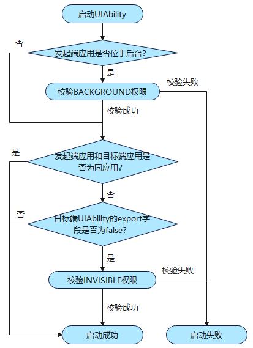
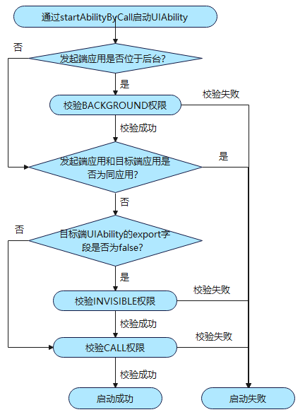
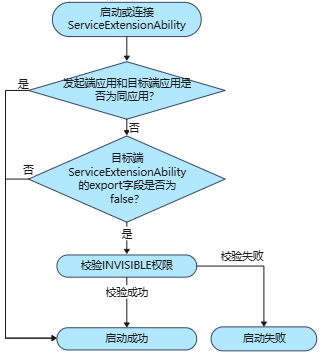

# 设备内组件启动规则（Stage模型）（仅对系统应用开放）

<!--Kit: Ability Kit-->
<!--Subsystem: Ability-->
<!--Owner: @wendel-->
<!--Designer: @wendel-->
<!--Tester: @liangchengguang-->
<!--Adviser: @HelloCrease-->

为了保障系统安全与用户体验，系统限制了应用在后台状态时任意弹窗、相互唤醒以及前台应用任意跳转的行为，相关行为表现请参考[设备内组件启动规则（Stage模型）](./component-startup-rules-inner-device.md)。本文主要介绍系统应用在设备内启动[UIAbility](../reference/apis-ability-kit/js-apis-app-ability-uiAbility.md)和[ExtensionAbility](../reference/apis-ability-kit/js-apis-app-ability-extensionAbility.md)的约束规则。

> **说明：**
> 
> 组件启动规则自API version 9开始生效，新增规则生效版本在规则中单独说明。开发者需熟知组件启动规则，以避免业务功能异常。

## UIAbility组件启动规则

### 应用内启动UIAbility组件的规则

   位于后台状态的UIAbility应用，默认不允许再启动UIAbility组件。可申请ohos.permission.START_ABILITIES_FROM_BACKGROUND（下文简称BACKGROUND）权限启动UIAbility组件，权限的申请方式请参考[声明权限](../security/AccessToken/declare-permissions.md)。

   | 应用状态 | 权限要求   |
   | -------- | ---------- |
   | 前台应用 | 无         |
   | 后台应用 | BACKGROUND |

   > **说明：**
   >
   > - 对于2in1和Tablet设备：
   >   - 从API version 18开始，如果应用已创建在前台显示的悬浮窗，可不受该条规则约束。
   >   - 从API version 21开始，如果应用自身已经添加到状态栏，可不受该条规则约束。

### 跨应用启动UIAbility组件的规则

   通过[startAbility()](../reference/apis-ability-kit/js-apis-inner-application-uiAbilityContext.md#startability)/[openLink()](../reference/apis-ability-kit/js-apis-inner-application-uiAbilityContext.md#openlink12)等跨应用启动UIAbility组件时，只允许拉起exported为true的目标组件。若申请ohos.permission.START_INVISIBLE_ABILITY（下文简称INVISIBLE）权限，可不受该条规则约束。位于后台状态的UIAbility应用，默认不允许跨应用启动UIAbility组件，需申请BACKGROUND权限启动UIAbility组件。权限的申请方式请参考[声明权限](../security/AccessToken/declare-permissions.md)。

   | 应用状态 | 组件可见性     | 权限要求                       |
   | -------- | -------------- | ----------------------------- |
   | 前台应用 | exported:true  | 无                             |
   | 前台应用 | exported:false | INVISIBLE权限                  |
   | 后台应用 | exported:true  | BACKGROUND权限                 |
   | 后台应用 | exported:false | BACKGROUND权限 + INVISIBLE权限 |

   > **说明：**
   >
   > - 在module.json5配置文件中，每个UIAbility都有一个exported属性。exported字段说明可参考[abilities标签](../quick-start/module-configuration-file.md#abilities标签)。
   > - 目标组件exported字段配置为true，表示可以被其他应用调用。
   > - 目标组件exported字段配置为false，表示组件仅允许应用内启动。

   启动组件的具体校验流程如下图：

   

   通过[startAbilityByCall()](../reference/apis-ability-kit/js-apis-inner-application-uiAbilityContext.md#startabilitybycall)接口跨应用启动UIAbility组件时，需要具备三个条件：1.申请ohos.permission.ABILITY_BACKGROUND_COMMUNICATION（下文简称CALL）权限；2.目标UIAbility组件的exported为true，若申请INVISIBLE权限，可不受该条规则约束；3.启动方的UIAbility位于前台，否则需要申请BACKGROUND权限。权限的申请方式请参考[声明权限](../security/AccessToken/declare-permissions.md)。

   | 应用状态 | 组件可见性     | 权限要求                                  |
   | -------- | -------------- | ----------------------------------------- |
   | 前台应用 | exported:true  | CALL权限                                  |
   | 前台应用 | exported:false | INVISIBLE权限 + CALL权限                  |
   | 后台应用 | exported:true  | BACKGROUND权限 + CALL权限                 |
   | 后台应用 | exported:false | BACKGROUND权限 + INVISIBLE权限 + CALL权限 |

   启动组件的具体校验流程如下图：

   

## ExtensionAbility组件启动规则

所有类型的[ExtensionAbility](../reference/apis-ability-kit/js-apis-app-ability-extensionAbility.md)组件（[ServiceExtensionAbility](../reference/apis-ability-kit/js-apis-app-ability-serviceExtensionAbility-sys.md)、[DataShareExtensionAbility](../reference/apis-arkdata/js-apis-application-dataShareExtensionAbility-sys.md)除外）是由相应的系统管理服务拉起，以确保其生命周期受系统管控。ExtensionAbility组件在使用时被拉起，使用完则销毁。

- [ServiceExtensionAbility](../reference/apis-ability-kit/js-apis-app-ability-serviceExtensionAbility-sys.md)组件启动规则：

   通过[startServiceExtensionAbility](../reference/apis-ability-kit/js-apis-inner-application-serviceExtensionContext-sys.md#serviceextensioncontextstartserviceextensionability)跨应用启动或使用[connectServiceExtensionAbility](../reference/apis-ability-kit/js-apis-inner-application-serviceExtensionContext-sys.md#serviceextensioncontextconnectserviceextensionability)跨应用连接ServiceExtensionAbility组件时，只允许拉起exported为true的目标组件。若申请INVISIBLE权限，可不受该条规则约束。

   | 应用状态 | 组件可见性     | 权限要求                       |
   | -------- | -------------- | ----------------------------- |
   | 前台应用 | exported:true  | 无                             |
   | 前台应用 | exported:false | INVISIBLE权限                  |
   | 后台应用 | exported:true  | 无                             |
   | 后台应用 | exported:false | INVISIBLE权限                  |

   启动组件的具体校验流程如下图：

   

- [DataShareExtensionAbility](../reference/apis-arkdata/js-apis-application-dataShareExtensionAbility-sys.md)组件启动规则：

   通过[createDataShareHelper](../reference/apis-arkdata/js-apis-data-dataShare-sys.md#datasharecreatedatasharehelper)接口可以启动DataShareExtensionAbility组件，具体操作和限制请参考[通过DataShareExtensionAbility实现数据共享](../database/share-data-by-datashareextensionability-sys.md)。

- 其他ExtensionAbility组件启动规则：
   
   其他ExtensionAbility组件的启动规则请参考[ExtensionAbility组件](extensionability-overview.md#extensionability类型说明)。
