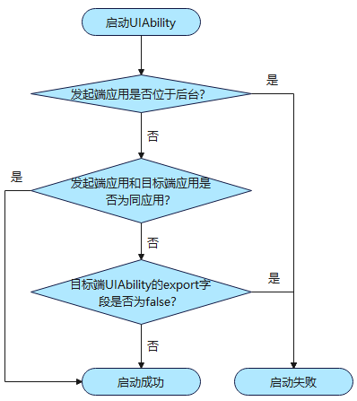

# 设备内组件启动规则（Stage模型）

<!--Kit: Ability Kit-->
<!--Subsystem: Ability-->
<!--Owner: @wendel-->
<!--Designer: @wendel-->
<!--Tester: @liangchengguang-->
<!--Adviser: @HelloCrease-->

为了保障系统安全与用户体验，系统限制了应用在后台状态时任意弹窗、相互唤醒以及前台应用任意跳转的行为。本文主要介绍应用在设备内启动[UIAbility](../reference/apis-ability-kit/js-apis-app-ability-uiAbility.md)的约束规则。

- 应用在后台状态时任意弹窗：各种广告弹窗。
- 应用在后台状态时相互唤醒：不合理地占用系统资源，导致系统功耗增加或系统卡顿。
- 前台应用任意跳转到其他应用：随意跳转到其他应用的支付页面。

> **说明：**
> 
> 组件启动规则自API version 9开始生效，新增规则生效版本在规则中单独说明。开发者需熟知组件启动规则，以避免业务功能异常。

## 前后台应用启动

   位于后台状态的UIAbility应用，不允许再启动UIAbility组件。

   > **说明：**
   >
   > - 对于2in1和Tablet设备：
   >   - 从API version 18开始，如果应用已创建在前台显示的悬浮窗，可不受该条规则约束。
   >   - 从API version 21开始，如果应用自身已经添加到状态栏，可不受该条规则约束。

## 跨应用启动

   通过[startAbility()](../reference/apis-ability-kit/js-apis-inner-application-uiAbilityContext.md#startability)/[openLink()](../reference/apis-ability-kit/js-apis-inner-application-uiAbilityContext.md#openlink12)等跨应用启动UIAbility组件时，只允许拉起exported为true的目标组件。

   > **说明：**
   >
   > - 在module.json5配置文件中，每个UIAbility都有一个exported属性。exported字段说明可参考[abilities标签](../quick-start/module-configuration-file.md#abilities标签)。
   > - 目标组件exported字段配置为true，表示可以被其他应用调用。
   > - 目标组件exported字段配置为false，表示组件仅允许应用内启动。

启动组件的具体校验流程如下图：

