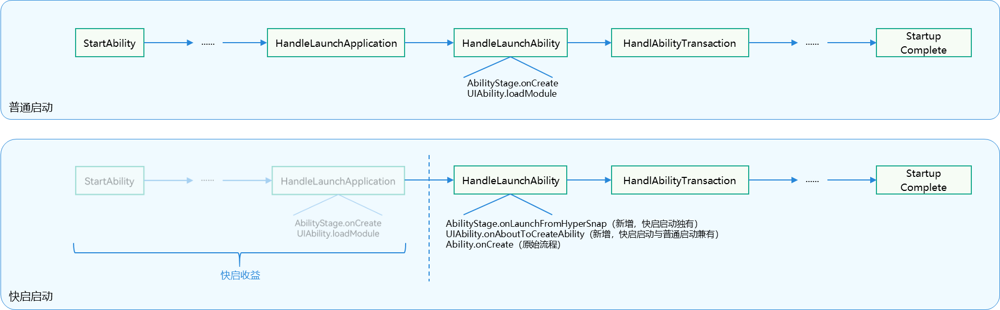
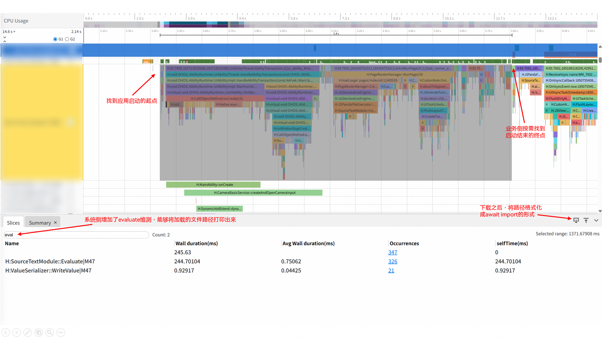

# 基于鸿蒙内核应用快启技术实现的应用加速启动

## 概述

从API version 24开始，提供应用快启机制。该机制提前持久化保存应用启动的中间状态，启动应用从中间状态直接加载。

当用户启动应用时，由于会跳过部分的启动流程，所需的启动时间会缩短，有助于提升用户的启动体验和应用竞争力。

开发者可以通过如下两方面判断，应用是否适合接入快启特性：

1. 应用冷启动性能差，启动时延高于1.6s或者存在启动舆情问题
2. 资源、模块加载在启动过程中的占比耗时超过25%

### 相关名称解释

| 名词 | 描述 |
| --- | --- |
| 快照化 | 将应用启动流程的中间状态持久化保存 |
| 快照  | 应用启动流程中间状态的上下文备份  |
| 快照点  |  时序上，快照点前的启动流程会被打进快照中，应用启动时会跳过这些流程；快照点后的启动流程不受影响 |

## 约束限制

* 开发者模式下，debug签名的应用不受系统侧管控限制，开发者可以进行快照特性接入开发和测试
* 应用接入快启后，会产生一定的资源占用，所以每用户同时生效的应用是有限的，这会根据用户偏好启用
* 接入快启的应用会对资源产生占用，为防止资源滥用，系统会管控接入的应用。因此开发者需要和华为侧对接，进行测试，然后正式上线

## 规格说明

| 规格 | 说明 |
| --- | --- |
| 快照制作 | 已解锁，用户进行灭屏或锁屏后，系统开始制作快照，一小段时间后，快照制作完成 |
| 快照销毁 | 应用卸载，应用安装，应用更新，系统重启以及一些系统环境变量发生变化  |
| 快照重置 | 快照销毁后，若满足快照制作前置条件，则再次触发快照生成条件时则重做快照 |

## 实现原理

快启技术将启动流程的中间状态（快照）进行持久化保存。应用启动时，直接加载快照，从而实现跳过这部分启动流程，达到启动加速的目标。如下图所示，快启启动相较于普通启动就是直接跳过了启动的一阶段，达到了减少启动时延的目标：



### 快照涵盖的启动流程

包含在快照内的流程有：AbilityStage模块加载，[AbilityStage.onCreate](https://gitcode.com/openharmony/docs/blob/master/zh-cn/application-dev/reference/apis-ability-kit/js-apis-app-ability-abilityStage.md#oncreate)，UIAbility模块加载。特别地，在[模块加载](https://developer.huawei.com/consumer/cn/doc/harmonyos-guides/arkts-module-side-effects)过程中会有一些代码执行，这包括：顶层代码（top level），so的constructor，类静态变量初始化等。

## 接口说明

系统提供了一整套API，支持快照特性的接入和适配。

| 接口名| 功能描述 |
| --- | --- |
| [onLaunchFromHyperSnap ](https://gitcode.com/openharmony/docs/blob/master/zh-cn/application-dev/reference/apis-ability-kit/js-apis-app-ability-abilityStage.md#onlaunchfromhypersnap24)| 生命周期回调接口，仅从快启启动时，系统会回调该接口执行 |
| [onAboutToCreateAbility  ](https://gitcode.com/openharmony/docs/blob/master/zh-cn/application-dev/reference/apis-ability-kit/js-apis-app-ability-abilityStage.md#onabouttocreateability24)|  生命周期回调接口，在AbilityStage创建第一个Ability前回调，普通启动和快启启动都会执行该回调 |
| [setHyperSnapEnabled ](https://gitcode.com/openharmony/docs/blob/master/zh-cn/application-dev/reference/apis-ability-kit/js-apis-app-ability-hyperSnapManager.md#hypersnapmanagersethypersnapenabled)| 普通调用接口，设置快照开启/关闭。特别地，设置关闭时会立即销毁快照；设置开启时，会择机制作快照，并在下次启动时生效快启启动 |
| [requestRebuildHyperSnap  ](https://gitcode.com/openharmony/docs/blob/master/zh-cn/application-dev/reference/apis-ability-kit/js-apis-app-ability-hyperSnapManager.md#hypersnapmanagerrequestrebuildhypersnap)| 普通调用接口，调用可以重做一次快照  |

## 开发步骤

### 产生状态不一致的快照风险操作

快照化跳过了部分启动流程，为了保证数据一致性和状态正确，开发者需要消除制作快照流程中的风险操作，才能保障快启启动的应用数据的正确性。

这类操作有如下几类：

* 磁盘数据访问

快照制作过程中发生的磁盘数据读取，不会在快启启动中执行，所以数据会产生不一致。

举例：快照制作中，应用业务读取存储在数据库中的字体属性：宋体；从快启启动后的应用，用户将字体调整为楷体，该属性被持久化到数据库文件，然后应用退出；下次从快启启动的应用进程，由于没有再次读取数据库（快照化后，跳过了），导致字体仍为宋体，而不是更新后的楷体。

* 事件监听回调注册

快照制作过程中建立的回调事件监听，快照不能响应，会导致事件丢失。

举例：快照制作中，应用业务注册了颜色模式的监听，初始为深色模式；在应用未被用户启动的条件下，系统颜色模式发生了变化，切换成了浅色模式。由于快照无法响应事件监听，所以无法接收到这个切换颜色模式的广播消息。下次用户从快启启动的应用，就仍会显示为深色模式。

* 网络访问

快照制作中建立的网络连接不可控，会有连接中断等问题。

举例：快照制作中，建立了长时TCP连接以接收云端信息；快照制作后，快照不会执行，无法响应TCP连接，超时导致连接失败。

* 进程间通讯（IPC)

快照制作中，禁止有状态的进程间通讯，比如保存应用状态和数据持久化，否则会触发保护机制导致快照制作失败。

### 将快照风险操作后置到快照点外

系统对开发者提供了新的回调接口AbilityStage.onAboutToCreateAbility。从时序上讲，该回调接口在AbilityStage. onCreate()之后执行，但不会被放到快照制作过程中去执行。特别地，即使不开启快照功能，该回调接口也会执行。

举例一：AbilityStage.OnCreate中存在快照风险操作

```
export class AppAbilityStage extends AbilityStage {
	onCreate() {
		this.readFile();
	}
	readFile() {
		// Read a file from disk.
	}
}
```

建议：

1、将快照风险操作后置到AbilityStage.onAboutToCreateAbility，如下：

```
export class AppAbilityStage extends AbilityStage {
	onAboutToCreateAbility() {
		this.readFile();
	}
}
```

2、调整业务逻辑一定要考虑时序依赖，保障业务逻辑不出错

3、AbilityStage.onCreate()是首个包含了较多的业务逻辑生命周期回调。若该回调中的业务不容易进行拆分，建议开发者在首次适配时，直接将AbilityStage.onCreate()内容全部挪至AbilityStage. onAboutToCreateAbility()。后续，通过业务前移扩大收益。

举例二：顶层代码中存在快照风险操作
如下是在第一行是在顶层代码中直接实例化类，并最终导致直接访问文件

```
let tmp = new classA()
export classA() {
	constructor() {
		this.readFile()
	}

	function readFile() {
		// Read a file from disk.
	}
}
```

建议：

1、顶层代码会随import该模块而执行，直接在顶层代码写业务逻辑是一种不规范的写法。

2、因为顶层代码在时序上与第一个import该模块的调用者绑定，这在时序上是一种隐性的、不可控的调用，任何修改都很容易造成调用时序混乱。

3、具体到快启启动特性，系统要求应用模块不可以在顶层代码执行快照风险操作，而是要根据业务逻辑调整到生命周期回调中执行。

举例三：C++的构造函数中存在快照风险操作

```
static napi_module OpenPlatformModule = {
	.nm_version = 1,
	.nm_flags = 100,
	.nm_filename = nullptr,
	.nm_register_func = Init,
	.nm_modname = "openplatform",
	.nm_priv = ((void *)0),
	.reserved = {0}
};

void read_file() {
	// Read a file from disk.
}

extern "C" __attribute__((constructor)) void RegisterOpenPlatformModule(void) {
	napi_module_register(&OpenPlatformModule);
	read_file();
}
```

建议：

1、开发者可以将启动过程中的加载的so逐一检查

2、constructor中不存在快照风险操作的so在AbilityStage.onCreate进行dlopen, 以扩大快照收益

3、存在风险操作constructor的so，放到UIAbility等快照之外的生命周期进行调用
举例四：类静态变量初始化中存在快照风险操作。下面的例子中存在两类静态执行，一是静态变量data的初始化，会直接进行文件读取；二是静态域会直接执行网络访问。

```
export class AppAbilityStage extends AbilityStage {
	private a = 1
	static data = readFile()
	static {
   		netAccess();
 	}
	function readFile() {
		// Read a file from disk.
	} 
	function netAccess() {
 	 	// Access the network.
	}
}
```

建议：

1、根据业务逻辑进行调整，将快照风险操作挪出快照。

### 在更新回调接口中进行数据更新

考虑到实际调整业务逻辑的困难，部分对外数据交互难以剥离。快照机制对开发者提供了新的回调接口 AbilityStage. onLaunchFromHyperSnap()，该回调接口只会在从镜像启动的流程（而不是镜像制作流程）中执行，正常冷启动不执行该回调。开发者可以在该回调接口中，重新请求一次外部数据进行同步，保证数据的一致性。

典例：AbilityStage.OnCreate中存在快照风险操作

```
export class AppAbilityStage extends AbilityStage {
	onCreate() {
		this.initLanguage(language)
	}
	function initLanguage(language) {
		readFile();
	}
	function readFile(){
		// read data from disk
	}
}
```

在onLaunchFromHyperSnap中进行更新

```
export class AppAbilityStage extends AbilityStage {
	onLaunchFromHyperSnap() {
		this.updateLanguage()
	}
	updateLanguage() {
		readFile();
	}
}
```

## 支持云推开关来关闭/开启快照功能

借助setHyperSnapEnabled(true/false)接口，应用可以自己根据需要关闭应用的快启启动功能，直到云推开关再次打开。

基本规则：

* 配置值默认为关闭（false）
* setHyperSnapEnabled设置的配置值会被持久化，设备重启仍有效
* 应用更新和应用安装会重置为默认值

一种建议的使用方法：

* 应用安装完成后，首次启动应用，主动拉取一次云端的配置，调用一次setHyperSnapEnabled(true)进行设置
* 后续，应用监控云端配置变化，云端主动推送新配置注：和云端交互的逻辑要放到快照点之后，避免快照内进行网络交互，同时避免快照跳过该业务逻辑的执行
* 云推获取设置的同时，需要在应用本地保存一份配置（如存储到某个数据库）
* 快照内，AbilityStage.onCreate中读取本地配置，并重新调用接口注：这种设计有两个收益：
  
  （1）保障应用更新后可以继续使能快照

  （2）可以保障触发预加载且预加载进程被查杀时，应用可以从快启启动获得启动收益

  （3）保障系统侧极少数场景下配置同步
  
  ```
  export class LauncherAbility extends UIAbility {
  	onCreate() {
   		.....
   	}
  
  	onConfigChange( key: string, value: string) {
   		if (key == "enable_hyper_snap") {
  			if (value == "true") {
    	    	setHyperSnapEnabled(true);
    		} else {
    			setHyperSnapEnabled(true);
    		}
   		}
   	}
  }
  export class AppAbilityStage extends AbilityStage {
    onCreate() {
       	const hyperSnapConfig = this.readConfigFromDB();
    	if (hyperSnapConfig === "true"){
  			setHyperSnapEnabled(true);
   		} else {
    	  setHyperSnapEnabled(false);
   		}
   	}
  	readConfigFromDB() {
       //read local value of "setHyperSnapEnabled" from DB
     }
  }
  ```

## 支持应用主动镜像重置

类似地，鸿蒙系统对外提供了requestRebuildHyperSnap接口，该接口支持应用在自己的业务逻辑中主动调用，销毁当前快照，择机重做。

```
export class LauncherAbility extends UIAbility {
	onCreate() {
		...
		try {
			...
		}catch (error) {
			...
			requestRebuildHyperSnap(); //According to business logic, developer can reset snapshot when catch an error.
			...
		}
	}
}
```

## 通过调整业务逻辑扩大快照收益

快照内包含的内容越多，快照收益越大。

开发者可以对整个启动流程进行梳理和分析，将适合做到快照内的启动逻辑（即不含快照风险操作），在保障业务逻辑正确性的条件下前置到快照内，扩大快照收益。

### 启动过程中的时序无关且快照友好的业务逻辑前置到快照内

* 如果存在某个任务可以前置且无时序依赖，那么可以考虑放到快照内以扩大收益
* 同时，需要考虑这个任务的快照友好性（参考前文）

### 启动过程中的import动作前置到快照内

import动作前置是有范围的，系统建议将冷启动过程中的import动作都尽可能地放到快照内，以扩大收益。如下图所示，通过trace工具扫描关键词“Evaluate”，检索出启动过程中的import动作



特别地，不建议将启动之后的import动作前置到启动流程甚至快照流程中去，因为这样会导致两方面问题：

（1）劣化普通冷启动性能

（2）导致启动流程的内存发生不必要的膨胀

修改方式上，建议采用动态import的方式在AbilityStage.oncreate中执行import动作

```
export class AppAbilityStage extends AbilityStage {  
	onCreate() {
		...
		this.preLoadKit()
		...
	}

	preLoadKit() {
		await import('@ohos/common/src/..../1');
		await import('@ohos/common/src/..../2');
		...
		await import('@ohos/common/src/..../N');
	}
}

```

## 快照接入的辅助工具

为了快速帮助开发者定位需要适配和修改的内容，系统提供了[配套插件工具](https://gitcode.com/LYZ-H/HyperSnapshot/blob/master/tools/hyperstartupcheck-user-manual.md
)。该工具基于代码扫描，直接识别具有快照风险行为的代码，并报告给开发者进行修正，节省人工排查工作量，提升应用适配快照的效率。


