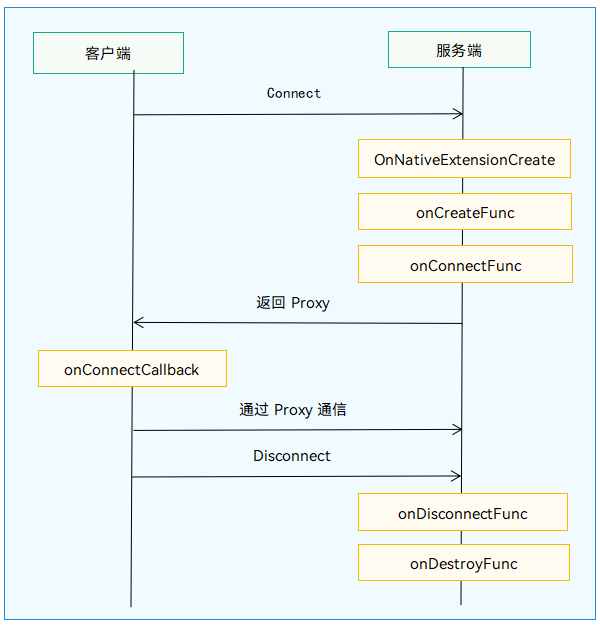

# 模块化对象模型概述 (C/C++)

<!--Kit: Ability Kit-->
<!--Subsystem: Ability-->
<!--Owner: @yzkp-->
<!--Designer: @yzkp-->
<!--Tester: @liangchengguang-->
<!--Adviser: @HelloCrease-->

模块化对象是一种跨应用的能力开放方式。应用通过ModularObjectExtensionAbility（[modular_object_extension_ability.h](../reference/apis-ability-kit/capi-modular-object-extension-ability-h.md)）组件将特定功能封装为独立的功能模块并对外暴露Proxy对象，其他应用获取Proxy对象后，即可跨进程调用这些能力。例如，文档编辑类应用可以提供文档处理能力，其他应用可调用该能力实现文档协同编辑；邮件类应用可以提供邮件发送能力，其他应用可调用该能力实现邮件群发等。

## 基本概念

- 服务端：提供ModularObjectExtensionAbility组件的应用称为服务端。
- 客户端：连接并调用ModularObjectExtensionAbility组件的应用称为客户端。
- Stub对象：服务端创建的对象，用于接收并处理客户端发送的IPC请求，以及业务能力实现。
- Proxy对象：客户端持有的对象，用于向服务端发送IPC请求。客户端通过连接ModularObjectExtensionAbility组件获取该对象。

## 运行机制

1. 客户端连接服务端：客户端通过Connect接口发起连接请求，指定目标ModularObjectExtensionAbility的bundleName、moduleName和abilityName。每次连接服务端都会创建新的ModularObjectExtensionAbility实例。
2. 服务端返回Proxy对象：连接成功后，系统会加载服务端对应Ability的so库，并调用OnNativeExtensionCreate入口函数。然后系统会依次触发服务端的OnCreateFunc和OnConnectFunc回调，开发者在OnConnectFunc回调中返回Stub对象。系统将Stub转换为Proxy对象返回给客户端。
3. 客户端通过Proxy与服务端通信：客户端在OnConnectCallback回调中收到服务端返回的Proxy对象后，通过该对象与服务端通信。当不再需要通信时，客户端可以通过Disconnect断开连接。连接断开后，系统会依次触发服务端的OnDisconnectFunc回调和OnDestroyFunc回调。

上述步骤中涉及的简写与完整接口名称的对应关系如下表所示：

| 简写 | 完整接口名称 |
|---------|-------------|
| Connect | [OH_AbilityRuntime_ConnectModularObjectExtensionAbility](../reference/apis-ability-kit/capi-modular-object-extension-manager-h.md#oh_abilityruntime_connectmodularobjectextensionability) |
| Disconnect | [OH_AbilityRuntime_DisconnectModularObjectExtensionAbility](../reference/apis-ability-kit/capi-modular-object-extension-manager-h.md#oh_abilityruntime_disconnectmodularobjectextensionability) |
| OnNativeExtensionCreate | [OH_AbilityRuntime_OnNativeExtensionCreate](../reference/apis-ability-kit/capi-extension-ability-h.md#oh_abilityruntime_onnativeextensioncreate) |
| OnCreateFunc | [OH_AbilityRuntime_ModObjExtensionAbility_OnCreateFunc](../reference/apis-ability-kit/capi-modular-object-extension-ability-h.md#oh_abilityruntime_modobjextensionability_oncreatefunc) |
| OnConnectFunc | [OH_AbilityRuntime_ModObjExtensionAbility_OnConnectFunc](../reference/apis-ability-kit/capi-modular-object-extension-ability-h.md#oh_abilityruntime_modobjextensionability_onconnectfunc) |
| OnDisconnectFunc | [OH_AbilityRuntime_ModObjExtensionAbility_OnDisconnectFunc](../reference/apis-ability-kit/capi-modular-object-extension-ability-h.md#oh_abilityruntime_modobjextensionability_ondisconnectfunc) |
| OnDestroyFunc | [OH_AbilityRuntime_ModObjExtensionAbility_OnDestroyFunc](../reference/apis-ability-kit/capi-modular-object-extension-ability-h.md#oh_abilityruntime_modobjextensionability_ondestroyfunc) |
| OnConnectCallback | [OH_AbilityRuntime_ConnectOptions_OnConnectCallback](../reference/apis-ability-kit/capi-connect-options-h.md#oh_abilityruntime_connectoptions_onconnectcallback) |
| Proxy | [OHIPCRemoteProxy](../reference/apis-ipc-kit/capi-ohipcparcel-ohipcremoteproxy.md) |
| Stub | [OHIPCRemoteStub](../reference/apis-ipc-kit/capi-ohipcparcel-ohipcremotestub.md) |