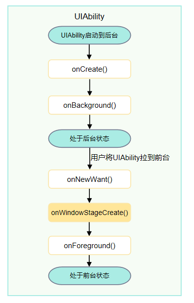

# UIAbility组件生命周期

<!--Kit: Ability Kit-->
<!--Subsystem: Ability-->
<!--Owner: @altay; @Luobniz21-->
<!--Designer: @altay-->
<!--Tester: @lixueqing513-->
<!--Adviser: @huipeizi-->

## 概述

当用户在执行应用启动、应用前后台切换、应用退出等操作时，系统会触发相关应用组件的生命周期回调。其中，UIAbility组件的核心生命周期回调包括[onCreate](../reference/apis-ability-kit/js-apis-app-ability-uiAbility.md#oncreate)、[onForeground](../reference/apis-ability-kit/js-apis-app-ability-uiAbility.md#onforeground)、[onBackground](../reference/apis-ability-kit/js-apis-app-ability-uiAbility.md#onbackground)、[onDestroy](../reference/apis-ability-kit/js-apis-app-ability-uiAbility.md#ondestroy)。作为一种包含UI的应用组件，UIAbility的生命周期不可避免地与[WindowStage](../../application-dev/windowmanager/application-window-stage.md)的生命周期存在关联关系。

UIAbility的生命周期示意图如下所示。


以下是UIAbility启动到前台和后台两种场景说明，以及生命周期回调流程讲解。

- UIAbility启动到前台，对应流程图参见上图。

  1. 当用户启动一个UIAbility时，系统会依次触发onCreate()、onWindowStageCreate()、onForeground()生命周期回调。

  2. 当用户跳转到其他应用（当前UIAbility切换到后台）时，系统会触发onBackground()生命周期回调。

  3. 当用户再次将UIAbility切换到前台时，系统会依次触发onNewWant()、onForeground()生命周期回调。

- UIAbility启动到后台，对应流程图参见下图。

  1. 当用户通过[UIAbilityContext.startAbilityByCall()](../reference/apis-ability-kit/js-apis-inner-application-uiAbilityContext.md#startabilitybycall)接口启动一个UIAbility到后台时，系统会依次触发onCreate()、onBackground()（不会执行onWindowStageCreate()生命周期回调）生命周期回调。

  2. 当用户将UIAbility拉到前台，系统会依次触发onNewWant()、onWindowStageCreate()、onForeground()生命周期回调。

  

## 生命周期回调

> **说明：**
>
> - 生命周期回调是在应用主线程执行，为了确保应用性能，建议在生命周期回调中，仅执行必要的轻量级操作。对于耗时任务，推荐采用异步处理或交由子线程执行，避免阻塞主线程。
> - 如果需要感知UIAbility生命周期变化，开发者可以使用[ApplicationContext注册接口](../reference/apis-ability-kit/js-apis-inner-application-applicationContext.md#applicationcontextonabilitylifecycle)监听UIAbility生命周期变化。详见[监听UIAbility生命周期变化](./application-context-stage.md#监听uiability生命周期变化)。

### onCreate()

在首次创建UIAbility实例时，系统触发[onCreate()](../reference/apis-ability-kit/js-apis-app-ability-uiAbility.md#oncreate)回调。开发者可以在该回调中执行UIAbility整个生命周期中仅发生一次的启动逻辑。

```ts
import { AbilityConstant, UIAbility, Want } from '@kit.AbilityKit';

export default class EntryAbility extends UIAbility {
  onCreate(want: Want, launchParam: AbilityConstant.LaunchParam): void {
    // 执行UIAbility整个生命周期中仅发生一次的业务逻辑
  }
  // ...
}
```

### onWindowStageCreate()

[UIAbility](../reference/apis-ability-kit/js-apis-app-ability-uiAbility.md)实例创建完成之后，在进入前台之前，系统会创建一个[WindowStage](../../application-dev/windowmanager/application-window-stage.md)。WindowStage创建完成后会进入[onWindowStageCreate()](../reference/apis-ability-kit/js-apis-app-ability-uiAbility.md#onwindowstagecreate)回调，开发者可以在该回调中进行UI加载、WindowStage的事件订阅。

在onWindowStageCreate()回调中通过[loadContent()](../reference/apis-arkui/arkts-apis-window-Window.md#loadcontent9)方法设置应用要加载的页面，并根据需要调用[on('windowStageEvent')](../reference/apis-arkui/arkts-apis-window-WindowStage.md#onwindowstageevent9)方法订阅[WindowStage的事件](../reference/apis-arkui/arkts-apis-window-e.md#windowstageeventtype9)（获焦/失焦、切到前台/切到后台、前台可交互/前台不可交互）。

> **说明：**
> 
> - 不同开发场景下[WindowStage事件](../reference/apis-arkui/arkts-apis-window-e.md#windowstageeventtype9)的时序可能存在差异，WindowStage的相关使用请参见[窗口开发指导](../windowmanager/application-window-stage.md)。
> - 对于不同类型的产品，当应用主窗口从前台进入后台时，UIAbility生命周期的变化也会存在差异。详见[不同设备生命周期的差异化行为](../windowmanager/window-overview.md#不同设备生命周期的差异化行为)。

```ts
import { UIAbility } from '@kit.AbilityKit';
import { window } from '@kit.ArkUI';
import { hilog } from '@kit.PerformanceAnalysisKit';

const DOMAIN_NUMBER: number = 0xFF00;

export default class EntryAbility extends UIAbility {
  // ...
  onWindowStageCreate(windowStage: window.WindowStage): void {
    // 设置WindowStage的事件订阅（获焦/失焦、切到前台/切到后台、前台可交互/前台不可交互）
    try {
      windowStage.on('windowStageEvent', (data) => {
        let stageEventType: window.WindowStageEventType = data;
        switch (stageEventType) {
          case window.WindowStageEventType.SHOWN: // 切到前台
            hilog.info(DOMAIN_NUMBER, 'testTag', `windowStage foreground.`);
            break;
          case window.WindowStageEventType.ACTIVE: // 获焦状态
            hilog.info(DOMAIN_NUMBER, 'testTag', `windowStage active.`);
            break;
          case window.WindowStageEventType.INACTIVE: // 失焦状态
            hilog.info(DOMAIN_NUMBER, 'testTag', `windowStage inactive.`);
            break;
          case window.WindowStageEventType.HIDDEN: // 切到后台
            hilog.info(DOMAIN_NUMBER, 'testTag', `windowStage background.`);
            break;
          case window.WindowStageEventType.RESUMED: // 前台可交互状态
            hilog.info(DOMAIN_NUMBER, 'testTag', `windowStage resumed.`);
            break;
          case window.WindowStageEventType.PAUSED: // 前台不可交互状态
            hilog.info(DOMAIN_NUMBER, 'testTag', `windowStage paused.`);
            break;
          default:
            break;
        }
      });
    } catch (exception) {
      hilog.error(DOMAIN_NUMBER, 'testTag',
        `Failed to enable the listener for window stage event changes. Cause: ${JSON.stringify(exception)}`);
    }
    hilog.info(DOMAIN_NUMBER, 'testTag', `%{public}s`, `Ability onWindowStageCreate`);
    // 设置UI加载
    windowStage.loadContent('pages/Index', (err, data) => {
      // ...
    });
  }
}
```

### onForeground()

在[UIAbility](../reference/apis-ability-kit/js-apis-app-ability-uiAbility.md)切换至前台时且UIAbility的UI可见之前，系统触发[onForeground](../reference/apis-ability-kit/js-apis-app-ability-uiAbility.md#onforeground)回调。开发者可以在该回调中申请系统需要的资源，或者重新申请在`onBackground()`中释放的资源。系统回调该方法后，UIAbility实例进入前台状态，即UIAbility实例可以与用户交互的状态。UIAbility实例会一直处于这个状态，直到被某些动作打断（例如屏幕关闭、用户跳转到其他UIAbility）。

例如，应用已获得地理位置权限。在UI显示之前，开发者可以在`onForeground()`回调中开启定位功能，从而获取到当前的位置信息。

```ts
import { UIAbility } from '@kit.AbilityKit';

export default class EntryAbility extends UIAbility {
  // ...

  onForeground(): void {
    // 申请系统需要的资源，或者重新申请在onBackground()中释放的资源
  }
  // ...
}
```


### onBackground()

在[UIAbility](../reference/apis-ability-kit/js-apis-app-ability-uiAbility.md)的UI完全不可见之后，系统触发[onBackground](../reference/apis-ability-kit/js-apis-app-ability-uiAbility.md#onbackground)回调，将UIAbility实例切换至后台状态。开发者可以在该回调中释放UI不可见时的无用资源，例如停止定位功能，以节省系统的资源消耗。

`onBackground()`执行时间较短，无法提供足够的时间做一些耗时动作。请勿在该方法中执行保存用户数据或执行数据库事务等耗时操作。

```ts
import { UIAbility } from '@kit.AbilityKit';

export default class EntryAbility extends UIAbility {
  // ...

  onBackground(): void {
    // 释放UI不可见时无用的资源
  }
  // ...
}
```


### onWindowStageWillDestroy()
在[UIAbility](../reference/apis-ability-kit/js-apis-app-ability-uiAbility.md)实例销毁之前，系统触发[onWindowStageWillDestroy()](../reference/apis-ability-kit/js-apis-app-ability-uiAbility.md#onwindowstagewilldestroy12)回调。该回调在WindowStage销毁前执行，此时WindowStage可以使用。开发者可以在该回调中释放通过WindowStage获取的资源、注销WindowStage事件订阅等。

```ts
import { UIAbility } from '@kit.AbilityKit';
import { window } from '@kit.ArkUI';
import { BusinessError } from '@kit.BasicServicesKit';
import { hilog } from '@kit.PerformanceAnalysisKit';

const DOMAIN_NUMBER: number = 0xFF00;

export default class EntryAbility extends UIAbility {
  windowStage: window.WindowStage | undefined = undefined;
  // ...
  onWindowStageCreate(windowStage: window.WindowStage): void {
    this.windowStage = windowStage;
    // ...
  }

  onWindowStageWillDestroy(windowStage: window.WindowStage) {
    // 释放通过windowStage对象获取的资源
    // 在onWindowStageWillDestroy()中注销WindowStage事件订阅（获焦/失焦、切到前台/切到后台、前台可交互/前台不可交互）
    try {
      if (this.windowStage) {
        this.windowStage.off('windowStageEvent');
      }
    } catch (err) {
      let code = (err as BusinessError).code;
      let message = (err as BusinessError).message;
      hilog.error(DOMAIN_NUMBER, 'testTag', `Failed to disable the listener for windowStageEvent. Code is ${code}, message is ${message}`);
    }
  }
}
```

### onWindowStageDestroy()
在[UIAbility](../reference/apis-ability-kit/js-apis-app-ability-uiAbility.md)实例销毁之前，系统触发[onWindowStageDestroy()](../reference/apis-ability-kit/js-apis-app-ability-uiAbility.md#onwindowstagedestroy)回调，开发者可以在该回调中释放UI资源。该回调在WindowStage销毁后执行，此时WindowStage不可以使用。

```ts
import { UIAbility } from '@kit.AbilityKit';
import { window } from '@kit.ArkUI';

export default class EntryAbility extends UIAbility {
  // ...

  onWindowStageCreate(windowStage: window.WindowStage): void {
    // 加载UI资源
  }

  onWindowStageDestroy() {
    // 释放UI资源
  }
}
```

### onDestroy()

在[UIAbility](../reference/apis-ability-kit/js-apis-app-ability-uiAbility.md)实例销毁之前，系统触发[onDestroy](../reference/apis-ability-kit/js-apis-app-ability-uiAbility.md#ondestroy)回调。该回调是UIAbility接收到的最后一个生命周期回调，开发者可以在onDestroy()回调中进行系统资源的释放、数据的保存等操作。

例如，开发者调用[terminateSelf()](../reference/apis-ability-kit/js-apis-inner-application-uiAbilityContext.md#terminateself)方法通知系统停止当前UIAbility实例时，系统会触发onDestroy()回调。
<!--RP1-->再比如，用户在最近任务列表中上滑关闭UIAbility实例时，系统会触发onDestroy()回调。<!--RP1End-->

```ts
import { UIAbility } from '@kit.AbilityKit';

export default class EntryAbility extends UIAbility {
  // ...

  onDestroy() {
    // 系统资源的释放、数据的保存等
  }
}
```

### onNewWant()

当应用的UIAbility实例已创建，再次调用方法启动该UIAbility实例时，系统触发该UIAbility的[onNewWant()](../reference/apis-ability-kit/js-apis-app-ability-uiAbility.md#onnewwant)回调。开发者可以在该回调中更新要加载的资源和数据等，用于后续的UI展示。

```ts
import { AbilityConstant, UIAbility, Want } from '@kit.AbilityKit';

export default class EntryAbility extends UIAbility {
  // ...

  onNewWant(want: Want, launchParam: AbilityConstant.LaunchParam) {
    // 更新资源、数据
  }
}
```

## 相关实例

针对UIAbility生命周期，有以下相关实例可供参考：

- [UIAbility和自定义组件生命周期（ArkTS）（API9）](https://gitee.com/openharmony/codelabs/blob/master/Ability/UIAbilityLifeCycle/README.md)