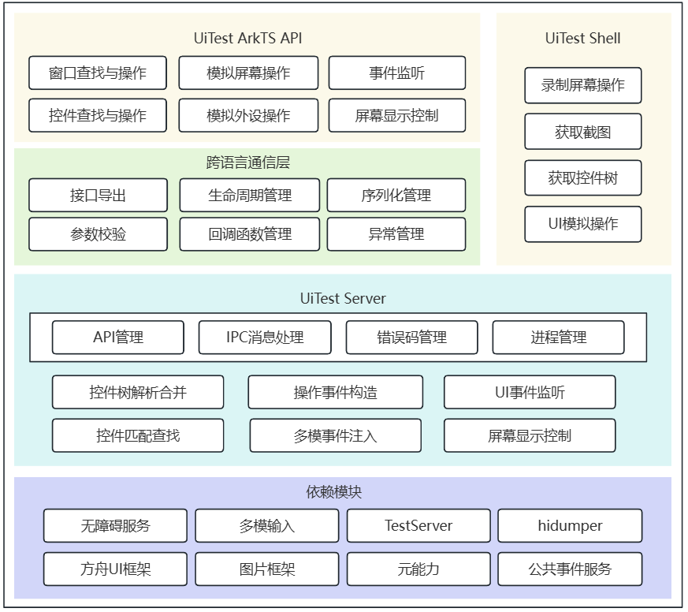

# UI测试框架使用指导 

<!--Kit: Test Kit-->
<!--Subsystem: Test-->
<!--Owner: @inter515-->
<!--Designer: @inter515-->
<!--Tester: @laonie666-->
<!--Adviser: @Brilliantry_Rui-->

## 概述

测试用户交互行为，是保障用户体验的关键环节 —— 通过模拟真实使用场景验证交互逻辑，可有效规避用户操作中可能出现的意外结果，避免不良使用体验。

若需验证应用用户界面（UI）的功能完整性与运行稳定性，编写 UI 测试用例是高效且必要的手段。这类测试用例不仅支持快速执行，还能确保测试结果的可靠性，同时可反复运行以覆盖多轮迭代场景，为应用 UI 质量提供保障。

UI测试框架（UiTest）为开发者提供全方位的UI界面查找和操作模拟能力，可覆盖UI自动化测试的关键场景，包括界面控件精准查找、UI 交互操作（如点击、滑动、文本输入等）、外设行为模拟（如键盘输入、鼠标操作、触控板手势、手写笔动作等），助力开发者高效搭建可靠的界面自动化测试流程。

## 功能全景

  图1.UI测试框架主要功能

  

UiTest支持采用ArkTS语言与Shell命令两种方式编写测试脚本，为界面自动化测试提供灵活高效的技术支撑，核心能力如下：

**ArkTS 脚本开发能力：** 
提供简洁易用的API接口，可满足各类测试场景需求，核心支持点击、双击、长按、滑动等主流 UI 交互操作，助力用户快速开发基于界面交互逻辑的自动化测试脚本，降低脚本编写门槛。

On<sup>9+</sup>：提供控件特征描述能力，用于精准筛选、匹配并查找目标控件，适配 API version 9 及以上版本。

Component<sup>9+</sup>：代表 UI 界面中的指定控件，支持控件属性获取、控件点击、滑动查找、文本注入等核心操作，适配 API version 9 及以上版本。

Driver<sup>9+</sup>：模块入口类，提供控件匹配与查找、模拟操作事件注入、屏幕截图等基础测试能力，适配 API version 9 及以上版本。

UiWindow<sup>9+</sup>：模块入口类，支持窗口属性获取、窗口拖动、窗口大小调整等窗口级操作，适配 API version 9 及以上版本。

**Shell 命令测试能力：** 
支持通过Shell命令直接实现多元化测试操作，包括获取当前界面截屏、导出界面控件树结构、录制界面操作流程、便捷注入UI模拟事件等，帮助开发者灵活开展测试验证工作。

## 使用ArkTS接口进行UI测试

本章节将重点讲解 UI 测试框架 ArkTS API 的核心能力与具体使用方法，为开发者开展界面自动化测试提供清晰指引。

UI 测试构建于单元测试基础之上，额外增加了对 UiTest 接口的调用，接口的详细定义与参数说明可参考<!--RP1-->具体请参考[API文档](../reference/apis-test-kit/js-apis-uitest.md)<!--RP1End-->。

### UI测试示例

下方示例代码以单元测试脚本为基础，进行UI测试的增量开发，实现的核心步骤为：

1) 调用[程序框架服务](../references/js-apis-inner-application-abilitydelegator)能力，启动目标被测应用，并确认应用运行状态.

2) 调用UI测试框架能力，页面中执行点击操作；

3) 验证操作后当前页面的实际变化是否与预期结果一致。

A. 编写Index.ets页面代码，作为被测示例demo。
```ts
@Entry
@Component
struct Index {
    @State message: string = 'Hello World';

    build() {
    Row() {
        Column() {
        Text(this.message)
            .fontSize(50)
            .fontWeight(FontWeight.Bold)
        Text("Next")
            .fontSize(50)
            .margin({top:20})
            .fontWeight(FontWeight.Bold)          
            .onClick((event?: ClickEvent) => {
                if(event){
                    this.text = "after click";
                })
        }
        .width('100%')
    }
    .height('100%')
    }
}
```

B. 在ohosTest > ets > test文件夹下.test.ets文件中编写具体测试代码。
```ts
import { describe, it, expect, Level } from '@ohos/hypium';
// 导入测试依赖kit
import { abilityDelegatorRegistry, Driver, ON } from '@kit.TestKit';
import { UIAbility, Want } from '@kit.AbilityKit';

const delegator: abilityDelegatorRegistry.AbilityDelegator = abilityDelegatorRegistry.getAbilityDelegator();
export default function abilityTest() {
  describe('ActsAbilityTest', () => {
    it('testUiExample',Level.LEVEL3, async (done: Function) => {
      console.info("uitest: TestUiExample begin");        
      // 初始化Driver对象
      const driver = Driver.create();
      const bundleName = abilityDelegatorRegistry.getArguments().bundleName;
      // 指定被测应用包名、ability名
      const want: Want = {
          bundleName: bundleName,
          abilityName: 'EntryAbility'
      }
      // 拉起被测应用
      await delegator.startAbility(want);
      // 等待应用拉起完成
      let idled: boolean = await driver.waitForIdle(4000,5000);
      // 确认当前应用顶部Ability为指定的ability
      const ability: UIAbility = await delegator.getCurrentTopAbility();
      console.info("get top ability");
      expect(ability.context.abilityInfo.name).assertEqual('EntryAbility');

      // 依据指定文本“Next”查找目标控件
      const button = await driver.findComponent(ON.text('Next'));
      // 点击目标控件
      await button.click();
      await driver.delayMs(1000);
      // 通过断言文本为“after click”的控件存在，确认操作后页面变化符合预期。
      await driver.assertComponentExist(ON.text('after click'));
      await driver.pressBack();
      done();
    })
  })
}
```

### 模拟触摸屏手指操作
以下示例代码演示了如何使用UiTest接口进行触摸屏坐标级的手指操作模拟。

```ts
import { describe, it, TestType, Size, Level } from '@ohos/hypium';
// 导入测试依赖kit
import { Driver, PointerMatrix } from '@kit.TestKit';

export default function abilityTest() {
  describe('screenOperationTest', () => {
    /**
     * 基于坐标的触摸屏手指操作
     */
    it("touchScreenOperation", TestType.FUNCTION, async (done: Function) => {
      let driver: Driver = Driver.create();
      // 单击
      await driver.click(100,100);
      // 指定屏幕id进行单击
      await driver.clickAt({ x: 100, y: 100, displayId: 0 });
      // 滑动
      await driver.swipe(100, 100, 200, 200, 600);
      // 指定屏幕id进行滑动
      await driver.swipeBetween({x: 100, y: 100, displayId: 0}, {x: 1000, y: 1000, displayId: 0}, 800);
      // 抛滑
      await driver.fling({x: 100, y: 100},{x: 200, y: 200}, 5, 600);
      // 指定方向的抛滑
      await driver.fling(UiDirection.DOWN, 10000);
      // 拖拽
      await driver.drag(100, 100, 200, 200, 600);
      // 指定屏幕id和拖拽移动前的长按时间
      await driver.dragBetween( {x: 100, y: 100, displayId: 0}, {x: 1000, y: 1000, displayId: 0}, 800, 1500); 
      // 多指操作，指定使用两根手指，每根手指基于两个坐标点滑动
      let pointers: PointerMatrix = PointerMatrix.create(2, 2);
      pointers.setPoint(0, 0, {x: 100, y: 100});
      pointers.setPoint(0, 1, {x: 200, y: 100});
      pointers.setPoint(1, 0, {x: 100, y: 200});
      pointers.setPoint(1, 1, {x: 200, y: 200});
      await driver.injectMultiPointerAction(pointers);
    })
  })
}

```
### 控件查找与操作
以下示例代码演示了如何使用UiTest接口进行控件的查找和操作，根据控件属性或相对位置查找控件，并进行点击、放大等控件级操作。

```ts
import { describe, it, TestType, Size, Level } from '@ohos/hypium';
// 导入测试依赖kit
import { Driver, Component, ON, On } from '@kit.TestKit';

export default function abilityTest() {
  describe('componentOperationTest', () => {
    /**
     * 查找类型为'Button'的控件，并进行控件点击操作
     */
    it("componentSearchAndOperation", TestType.FUNCTION, async (done: Function) => {
      let driver: Driver = Driver.create();
      let button: Component = await driver.findComponent(ON.type('Button'));
      await button.click();
    })

    /**
     * 利用相对位置查找控件，查找'Scroll'类型控件中文本内容为'123'的控件
     */
    it("relativePositioncomponentSearch", TestType.FUNCTION, async (done: Function) => {
      let driver: Driver = Driver.create();
      let on: On = ON.text('123').within(ON.type('Scroll'));
      let items: Array<Component> = await driver.findComponents(on);
    })

    /**
     * 查找类型为'Image'的控件，并进行对其进行双指放大操作。
     */
    it("componentPinch", TestType.FUNCTION, async (done: Function) => {
      let driver: Driver = Driver.create();
      let image: Component = await driver.findComponent(ON.type('Image'));
      await image.pinchOut(1.5);
    })
  })
}

```
### 窗口查找与操作
以下示例代码演示了如何使用UiTest接口进行窗口查找和操作，根据窗口属性查找窗口，并进行窗口最小化等操作。

```ts
import { describe, it, TestType, Size, Level } from '@ohos/hypium';
// 导入测试依赖kit
import { Driver, Component, ON, On } from '@kit.TestKit';

export default function abilityTest() {
  describe('windowOperationTest', () => {
    /**
     * 根据指定条件查找活跃窗口，并对其进行窗口最小化操作
     */
    it("windowSearchAndOperation", TestType.FUNCTION, async (done: Function) => {
      let driver = Driver.create();
      let window = await driver.findWindow({active: true});
      await window.minimize();
    })
  })
}
```

### 模拟文本输入
以下示例代码演示了如何使用UiTest接口进行文本输入，包括基于控件的文本输入和基于坐标的文本输入两种方式。

```ts
import { describe, it, TestType, Size, Level } from '@ohos/hypium';
// 导入测试依赖kit
import { Driver, ON } from '@kit.TestKit';

export default function abilityTest() {
  describe('inputTextTest', () => {
    /**
     * 基于控件的文本输入，调用接口会默认清空文本框中内容后输入指定文本
     */
    it('componentInputText', TestType.FUNCTION, async () => {
      let driver = Driver.create();
      let input = await driver.findComponent(ON.type('TextInput'));
      await input.inputText('abc');
    })

    /**
     * 基于坐标的文本输入，点击指定位置使输入框获焦，并在光标处输入指定文本
     */
    it('pointInputText', TestType.FUNCTION | Size.MEDIUMTEST | Level.LEVEL3, async () => {
      let driver = Driver.create()
      let input = await driver.findComponent(ON.type('TextInput'))
      let center = await input.getBoundsCenter()
      await driver.inputText(center, 'abc')
    })
  })
}
```
### 截图
以下示例代码演示了如何使用UiTest接口进行屏幕截图，指定屏幕id和截取屏幕区域，并将截图保存到指定路径下。

```ts
import { describe, it, TestType, Size, Level } from '@ohos/hypium';
// 导入测试依赖kit
import { Driver } from '@kit.TestKit';
import display from '@ohos.display';

export default function abilityTest() {
  describe('screenCaptureTest', () => {
    /**
     * 截取指定区域的屏幕，并保存到指定路径
     */
    it('screenCapture', TestType.FUNCTION, async () => {
      let driver = Driver.create();
      // 应用沙箱路径，el2为用户级加密区，base为应用在本设备上存放持久化数据的子目录。
      let savePath = '/data/storage/el2/base/cache/1.png';
      let res = await driver.screenCapture(savePath, {left: 0, top: 0, right: 100, bottom: 100});
    })

    /**
     * 截取指定屏幕id的屏幕全屏，并保存到指定路径
     */
    it('screenCapWithId', TestType.FUNCTION | Size.MEDIUMTEST | Level.LEVEL3, async () => {
      let driver = Driver.create();
      // 获取默认屏幕对象
      let disPlay = display.getDefaultDisplaySync();
      let savePath = '/data/storage/el2/base/cache/1.png'
      let res = await driver.screenCap(savePath, disPlay.id)；// 获取默认屏幕ID属性
    })
  })
}
```

> **说明：**
> 1. 指定截图文件保存路径，路径需为当前应用的[沙箱路径](../../file-management/app-sandbox-directory.md)。
> 2. 测试hap的<!--RP4-->[APL等级级别](../security/AccessToken/app-permission-mgmt-overview.md#权限机制中的基本概念)<!--RP4End-->为system_basic、normal，对应要求使用用户级加密区的应用沙箱路径。且需指定将文件保存在应用在本设备上存放持久化数据的子目录。
> 3. 截屏时，可以调用display模块的接口[获取Display对象](../displaymanager/screenProperty-guideline.md#获取Display对象)，实现[屏幕相关属性获取](../displaymanager/screenProperty-guideline.md#获取屏幕相关属性)。

### UI事件监听
以下示例代码演示了如何使用UiTest接口进行UI界面事件的监听，设置监听回调函数，监听toast、dialog等控件的出现，等待事件发生后进行下一步操作。

```ts
import { describe, it, TestType, Size, Level } from '@ohos/hypium';
// 导入测试依赖kit
import { Driver, UIElementInfo } from '@kit.TestKit';

export default function abilityTest() {
  describe('observerTest', () => {
    /**
     * 监听toast控件出现。
     */
    it("toastObserver", TestType.FUNCTION, async () => {
      let driver = Driver.create();
      let observer = driver.createUIEventObserver();
      let callback = (uiElementInfo : UIElementInfo) => {
        let bundleName = uiElementInfo.bundleName;
        let text = uiElementInfo.text;
        let type = uiElementInfo.type;
      }
      observer.once('toastShow', callback);
    })
  })
}
```

### 模拟键鼠操作
以下示例代码演示了如何使用UiTest接口进行键鼠模拟操作，包括键盘按键、组合键输入操作，鼠标点击、移动、拖拽操作和键鼠组合操作等。

```ts
import { describe, it, TestType, Size, Level } from '@ohos/hypium';
// 导入测试依赖kit
import { Driver, MouseButton } from '@kit.TestKit';
import { KeyCode } from '@ohos.multimodalInput.keyCode';

export default function abilityTest() {
  describe('KeyboardMouseTest', () => {
    /**
     * 模拟键盘按键输入、组合键输入。
     */
    it('keyBoardOperation', TestType.FUNCTION | Size.MEDIUMTEST | Level.LEVEL3, async () => {
      let driver = Driver.create();
      // 键盘按键输入（注入返回键）
      await driver.triggerKey(KeyCode.KEYCODE_BACK);
      // 键盘组合键输入（注入保存组合键）
      await driver.triggerCombineKeys(KeyCode.KEYCODE_CTRL_LEFT,  KeyCode.KEYCODE_S);
    })

    /**
     * 模拟鼠标左键单击、鼠标移动、鼠标拖拽操作。
     */
    it('mouseOperation', TestType.FUNCTION | Size.MEDIUMTEST | Level.LEVEL3, async () => {
      let driver = Driver.create();
      // 鼠标左键单击
      await driver.mouseClick({x: 100, y: 100}, MouseButton.MOUSE_BUTTON_LEFT); 
      // 鼠标移动
      await driver.mouseMoveTo({x: 100, y: 100});
      // 鼠标拖拽
      await driver.mouseDrag({x: 100, y: 100}, {x: 200, y: 200}, 600);
    })

    /**
     * 模拟键盘、鼠标组合操作。
     */
    it('combinedOperation', TestType.FUNCTION | Size.MEDIUMTEST | Level.LEVEL3, async () => {
      let driver = Driver.create();
      // 按下左CTRL键，同时鼠标滚轮滚动
      await driver.mouseScroll({x:100, y:100}, true, 30, KeyCode.KEYCODE_CTRL_LEFT);
      // 按下左CTRL键，同时鼠标左键长按
      await driver.mouseLongClick({x:100, y:100}, MouseButton.MOUSE_BUTTON_LEFT, KeyCode.KEYCODE_CTRL_LEFT);
    })
  })
}
```

### 模拟触摸板操作
以下示例代码演示了如何使用UiTest接口进行触摸板模拟操作，触摸板三指上滑返回桌面，三指下滑恢复应用窗口。

```ts
import { describe, it, TestType, Size, Level } from '@ohos/hypium';
// 导入测试依赖kit
import { Driver, UiDirection } from '@kit.TestKit';

export default function abilityTest() {
  describe('touchPadOperationTest', () => {
    /**
     * PC场景，模拟触摸板三指上滑（界面返回桌面），三指下滑（界面恢复窗口）操作。
     */
    it('touchPadOperation', TestType.FUNCTION | Size.MEDIUMTEST | Level.LEVEL3, async () => {
      let driver = Driver.create();
      // 触摸板三指上滑返回桌面。
      await driver.touchPadMultiFingerSwipe(3, UiDirection.UP);
      // 触摸板三指下滑恢复窗口
      await driver.touchPadMultiFingerSwipe(3, UiDirection.DOWN);
    })
  })
}

```

### 模拟手写笔操作
以下示例代码演示了如何使用UiTest接口进行手写笔模拟操作，包括点击、滑动等操作，支持设置操作时的压力值大小。

```ts
import { describe, it, TestType, Size, Level } from '@ohos/hypium';
// 导入测试依赖kit
import { Driver } from '@kit.TestKit';

export default function abilityTest() {
  describe('penOperationTest', () => {
    /**
     * 模拟手写笔单击、双击、长按、滑动操作
     */
    it('penOperation', TestType.FUNCTION | Size.MEDIUMTEST | Level.LEVEL3, async () => {
      let driver = Driver.create();
      // 手写笔单击
      await driver.penClick({x: 100, y: 100});
      // 手写笔双击
      await driver.penDoubleClick({x: 100, y: 100});
      // 手写笔长按
      await driver.penLongClick({x: 100, y: 100}, 0.5);
      // 手写笔滑动
      await driver.penSwipe({x: 100, y: 100}, {x: 100, y: 500}, 600, 0.5);
    })
  })
}
```

### 模拟表冠操作
以下示例代码演示了如何使用UiTest接口进行表冠模拟操作，包括表冠的顺/逆时针旋转。

```ts
/**
  * 手表场景，模拟表冠顺/逆时针旋转
  */
it('crownRotate', TestType.FUNCTION | Size.MEDIUMTEST | Level.LEVEL3, async () => {
  let driver = Driver.create();
  // 顺时针旋转50格，旋转速度为30格/秒
  await driver.crownRotate(50, 30);
  // 逆时针旋转20格，旋转速度为30格/秒
  await driver.crownRotate(-20, 30);
})
```

### 屏幕显示操作
以下示例代码演示了如何使用UiTest接口进行屏幕显示操作，包括获取屏幕大小、分辨率等属性和屏幕唤醒、屏幕旋转等操作。

```ts
/**
  * 屏幕属性获取和屏幕操作
  */
it('displayOperation', TestType.FUNCTION | Size.MEDIUMTEST | Level.LEVEL3, async () => {
  let driver = Driver.create();
  // 获取屏幕大小
  let size: Point = await driver.getDisplaySize();
  // 获取屏幕清晰度
  let density: Point = await driver.getDisplayDensity();
  // 唤醒屏幕
  await driver.wakeUpDisplay();
  // 屏幕顺时针旋转90度
  await driver.setDisplayRotation(DisplayRotation.ROTATION_90);
})
```

## 基于Shell命令进行UI测试

在开发阶段，若需快速执行截屏、界面操作录制、UI模拟操作注入、控件树获取等测试相关操作，可直接借助Shell命令实现，高效完成各类测试验证需求，显著提升操作便捷性与测试效率。

> **说明：**
>
> 使用cmd的方式，需要配置好hdc相关的环境变量。

**命令列表**
| 命令            | 配置参数   |描述                              |
|---------------|---------------------------------|---------------------------------|
| help          | help|  显示uitest工具能够支持的命令信息。            |
| screenCap       |[-p] | 截屏。非必填。<br>指定存储路径和文件名，只支持存放在/data/local/tmp/下。<br>默认存储路径：/data/local/tmp，文件名：时间戳 + .png。 |
| dumpLayout      |[-p] \<-i \| -a \| -b \| -w \| -m \| -d>|支持在daemon运行时执行获取控件树。<br>各参数代表的含义请参考[获取控件树](#获取控件树)|
| uiRecord        | uiRecord \<record \| read>|录制界面操作。  <br> **record** ：开始录制，将当前界面操作记录到'/data/local/tmp/record.csv'，结束录制操作使用Ctrl+C结束录制。  <br> **read** ：读取并且打印录制数据。<br>各参数代表的含义请参考[用户录制操作](#用户录制操作)。|
| uiInput       | \<help \| click \| doubleClick \| longClick \| fling \| swipe \| drag \| dircFling \| inputText \| keyEvent \| text>| 注入UI模拟操作。<br>各参数代表的含义请参考[注入ui模拟操作](#注入ui模拟操作)。                       |
| --version | --version|获取当前工具版本信息。                     |
| start-daemon|start-daemon| 拉起uitest测试进程。 |

### 截图使用示例

```bash
# 存储路径：/data/local/tmp，文件名：时间戳 + .png。
hdc shell uitest screenCap
# 指定存储路径和文件名，存放在/data/local/tmp/下。
hdc shell uitest screenCap -p /data/local/tmp/1.png
```

### 获取控件树
| 命令    |   配置参数   | 描述       | 
|---------|--------------|-----------|
| **-p** | \<savePath\> |指定存储路径和文件名，只支持存放在'/data/local/tmp/'下。默认存储路径：'/data/local/tmp'，文件名：'时间戳 + .json'。|
| **-i** | |不过滤不可见控件，也不做窗口合并。|
| **-a** | |保存 BackgroundColor、 Content、FontColor、FontSize、extraAttrs 属性数据。<br>**说明** ：默认不保存上述属性数据。 <br> **-a和-i不可同时使用** | 
| **-b** | \<bundleName\> |获取指定包名对应目标窗口的控件树信息。|
| **-w** | \<windowId\>  |获取指定ID目标窗口的控件树信息。|
| **-m** | \<true\|false\> |指定在获取控件树信息时是否合并窗口信息。true表示合并窗口信息，false表示不合并窗口信息，不设置时默认为true。 |
| **-d** | \<displayId\>  |多屏场景下，获取指定ID屏幕下的控件树。|

```bash
# 指定存储路径和文件名，存放在/data/local/tmp/下。
hdc shell uitest dumpLayout -p /data/local/tmp/1.json
```
**说明**：可通过hidumper工具[获取应用窗口信息](../dfx/hidumper.md#获取应用窗口信息), 包含应用对应窗口的WinId和DisplayId。

```bash
# 指定获取ID为0的屏幕的控件树信息。
hdc shell uitest dumpLayout -d 0
```

### 录制界面操作
>**说明**
>
> 录制过程中，需等待当前操作的识别结果在命令行输出后，再进行下一步操作。

**命令列表**
| 命令   | 配置参数    |  必填 | 描述              | 
|-------|--------------|------|-----------------|
| -W    | \<true/false> | 否   | 录制过程中是否保存操作坐标对应的控件信息到/data/local/tmp/record.csv文件中。true表示保存控件信息，false表示仅记录坐标信息，不设置时默认为true。 |
| -l    |              | 否   | 在每次操作后保存当前布局信息，文件保存路径：/data/local/tmp/layout_录制启动时间戳_操作序号.json。 | 
| -c    | \<true/false> | 否   | 是否将录制到的操作事件信息打印到控制台，true表示打印，false表示打印，不设置时默认为true。 | 

```bash
# 将当前界面操作记录到/data/local/tmp/record.csv，结束录制操作使用Ctrl+C结束录制。
hdc shell uitest uiRecord record
# 录制时仅记录操作对应的坐标，不匹配目标控件。
hdc shell uitest uiRecord record -W false
# 每次操作后，保存页面布局，文件保存路径：/data/local/tmp/layout_录制启动时间戳_操作序号.json。
hdc shell uitest uiRecord record -l
# 录制到的操作事件信息不打印到控制台。
hdc shell uitest uiRecord record -c false
# 读取并打印录制数据。
hdc shell uitest uiRecord read
```

以下举例为：record数据中包含的字段及字段含义，仅供参考。

 ```json
 {
	 "ABILITY": "com.ohos.launcher.MainAbility", // 前台应用界面
	 "BUNDLE": "com.ohos.launcher", // 操作应用
	 "CENTER_X": "", // 预留字段,暂未使用
	 "CENTER_Y": "", // 预留字段,暂未使用
	 "EVENT_TYPE": "pointer", //  
	 "LENGTH": "0", // 总体步长
	 "OP_TYPE": "click", //事件类型，当前支持点击、双击、长按、拖拽、滑动、抛滑动作录制
	 "VELO": "0.000000", // 离手速度
	 "direction.X": "0.000000",// 总体移动X方向
	 "direction.Y": "0.000000", // 总体移动Y方向
	 "duration": 33885000.0, // 手势操作持续时间
	 "fingerList": [{
		 "LENGTH": "0", // 总体步长
		 "MAX_VEL": "40000", // 最大速度
		 "VELO": "0.000000", // 离手速度
		 "W1_BOUNDS": "{"bottom":361,"left":37,"right":118,"top":280}", // 起点控件bounds
		 "W1_HIER": "ROOT,3,0,0,0,0,0,0,0,0,5,0,0,0,0,0,0,0", // 起点控件hierarchy
		 "W1_ID": "", // 起点控件id
		 "W1_Text": "", // 起点控件text
		 "W1_Type": "Image", // 起点控件类型
		 "W2_BOUNDS": "{"bottom":361,"left":37,"right":118,"top":280}", // 终点控件bounds
		 "W2_HIER": "ROOT,3,0,0,0,0,0,0,0,0,5,0,0,0,0,0,0,0", // 终点控件hierarchy
		 "W2_ID": "", // 终点控件id
		 "W2_Text": "", // 终点控件text
		 "W2_Type": "Image", // 终点控件类型
		 "X2_POSI": "47", // 终点X
		 "X_POSI": "47", // 起点X
		 "Y2_POSI": "301", // 终点Y
		 "Y_POSI": "301", // 起点Y
		 "direction.X": "0.000000", // x方向移动量
		 "direction.Y": "0.000000" // Y方向移动量
	 }],
	 "fingerNumber": "1" //手指数量
 }
 ```

### 注入UI模拟操作

| 命令   | 必填 | 描述              | 
|------|------|-----------------|
| help   | 是    | uiInput命令相关帮助信息。 |
| click   | 是    | 模拟单击操作。具体请参考下方**uiInput-click/doubleClick/longClick使用示例**。      | 
| doubleClick   | 是    | 模拟双击操作。具体请参考下方**uiInput click/doubleClick/longClick使用示例**。      | 
| longClick   | 是    | 模拟长按操作。具体请参考下方**uiInput click/doubleClick/longClick使用示例**。     | 
| fling   | 是    | 模拟快滑操作。具体请参考下方**uiInput fling使用示例使用示例**。   | 
| swipe   | 是    | 模拟慢滑操作。具体请参考下方**uiInput swipe/drag使用示例**。     | 
| drag   | 是    | 模拟拖拽操作。具体请参考下方**uiInput swipe/drag使用示例**。     | 
| dircFling   | 是    | 模拟指定方向滑动操作。具体请参考下方**uiInput dircFling使用示例**。     |
| inputText   | 是    | 指定坐标点，模拟输入框输入文本操作。具体请参考下方**uiInput inputText使用示例**。                   |
| text   | 是    | 无需指定坐标点，在当前获焦处，模拟输入框输入文本操作。具体请参考下方**uiInput text使用示例**。                           |
| keyEvent   | 是    | 模拟实体按键事件（如：键盘，电源键，返回上一级，返回桌面等），以及组合按键操作。具体请参考下方**uiInput keyEvent使用示例**。     | 


#### uiInput-click/doubleClick/longClick使用示例

| 配置参数    | 必填 | 描述            |
|---------|------|-----------------|
| point_x | 是      | 点击x坐标点。 |
| point_y | 是       | 点击y坐标点。 |

```shell
# 执行单击事件。
hdc shell uitest uiInput click 100 100

# 执行双击事件。
hdc shell uitest uiInput doubleClick 100 100

# 执行长按事件。
hdc shell uitest uiInput longClick 100 100
```

#### uiInput fling使用示例

| 配置参数  | 必填             | 描述               |      
|------|------------------|-----------------|
| from_x   | 是                | 滑动起点x坐标。 | 
| from_y   | 是                | 滑动起点y坐标。 | 
| to_x   | 是                | 滑动终点x坐标。 |
| to_y   | 是                | 滑动终点y坐标。 |
| swipeVelocityPps_   | 否      | 滑动速度，单位：px/s，取值范围：200-40000。<br> 默认值：600。取值超出限定范围时，取默认值。 | 
| stepLength_   | 否 | 滑动步长。默认值：滑动距离/50。<br>  **为实现更好的模拟效果，推荐参数缺省/使用默认值。**  | 


```shell  
# 执行快滑操作，stepLength_缺省。
hdc shell uitest uiInput fling 10 10 200 200 500 
```

#### uiInput swipe/drag使用示例

| 配置参数  | 必填             | 描述               |
|------|------------------|-----------------|
| from_x   | 是                | 滑动起点x坐标。 |
| from_y   | 是                | 滑动起点y坐标。 |
| to_x   | 是                | 滑动终点x坐标。 |
| to_y   | 是                | 滑动终点y坐标。 |
| swipeVelocityPps_   | 否      | 滑动速度，单位：px/s，取值范围：200-40000。<br> 默认值：600。取值超出限定范围时，取默认值。 |

```shell  
# 执行慢滑操作。
hdc shell uitest uiInput swipe 10 10 200 200 500

# 执行拖拽操作。 
hdc shell uitest uiInput drag 10 10 100 100 500 
```

#### uiInput dircFling使用示例

| 配置参数             | 必填       | 描述 |
|-------------------|-------------|----------|
| direction         | 否 | 滑动方向，取值范围：[0,1,2,3]，默认值为0。<br> 0代表向左滑动，1代表向右滑动，2代表向上滑动，3代表向下滑动。    | 
| swipeVelocityPps_ | 否| 滑动速度，单位：px/s，取值范围：200-40000。<br> **默认值**: 600。取值超出限定范围时，取默认值。    | 
| stepLength        | 否        | 滑动步长。<br> **默认值**: 滑动距离/50。为更好的模拟效果，推荐参数缺省/使用默认值。 |

```shell  
# 执行左滑操作。
hdc shell uitest uiInput dircFling 0 500
# 执行向右滑动操作。
hdc shell uitest uiInput dircFling 1 600
# 执行向上滑动操作。
hdc shell uitest uiInput dircFling 2 
# 执行向下滑动操作。
hdc shell uitest uiInput dircFling 3
```

#### uiInput inputText使用示例

| 配置参数             | 必填       | 描述 |       
|------|------------------|----------|
| point_x   | 是                | 输入框x坐标点。 | 
| point_y   | 是                | 输入框y坐标点。 |
| text      | 是                | 输入文本内容。  |

```shell  
# 执行输入框输入操作。
hdc shell uitest uiInput inputText 100 100 hello 
```

#### uiInput text使用示例

| 配置参数             | 必填       | 描述 |       
|--------|-------------------|----------------|
| text   | 是                | 输入文本内容。  |

```shell  
# 无需输入坐标点，在当前获焦处，执行输入框输入操作。若当前获焦处不支持文本输入，则无实际效果。
hdc shell uitest uiInput text hello
```

#### uiInput keyEvent使用示例

| 配置参数             | 必填       | 描述                                                                                                                              |                
|------|------|---------------------------------------------------------------------------------------------------------------------------------|
| keyID1   | 是    | 实体按键对应ID，取值范围：Back、Home、Power、或[KeyCode键码值](../reference/apis-input-kit/js-apis-keycode.md#keycode)。<br>当取值为Back、Home或Power时，不支持输入组合键。 <br>当前注入大写锁定键（KeyCode=2074）无效，请使用组合键实现大写字母输入。如“按键shift+按键V”输入大写字母V。 | 
| keyID2    | 否    | 实体按键对应ID，取值范围：[KeyCode键码值](../reference/apis-input-kit/js-apis-keycode.md#keycode)，默认值为空。                                               |
| keyID3    | 否    | 实体按键对应ID，取值范围：[KeyCode键码值](../reference/apis-input-kit/js-apis-keycode.md#keycode)，默认值为空。                                               |

```shell  
# 返回主页。
hdc shell uitest uiInput keyEvent Home
# 返回。
hdc shell uitest uiInput keyEvent Back
# 组合键粘贴。
hdc shell uitest uiInput keyEvent 2072 2038
# 输入小写字母v。
hdc shell uitest uiInput keyEvent 2038
# 输入大写字母V。
hdc shell uitest uiInput keyEvent 2047 2038
```

### 获取版本信息

```bash
hdc shell uitest --version
```
### 拉起uitest测试进程

```shell  
hdc shell uitest start-daemon
```

>**说明**
>
> 设备需调成开发者模式。
>
> 仅元能力aa test拉起的测试hap才能调用Uitest的能力。
>
> 测试hap的<!--RP4-->[APL等级级别](../security/AccessToken/app-permission-mgmt-overview.md#权限机制中的基本概念)<!--RP4End-->需为system_basic、normal。

<!--Del-->


## UI测试脚本实例

### 查找指定控件能力实例
介绍通过设置控件属性作为查找条件，在应用界面上查找组件对象，具体代码请参考[控件查找示例](https://gitcode.com/openharmony/applications_app_samples/blob/master/code/Project/Test/uitest/entry/src/ohosTest/ets/test/findCommentExampleTest/Component/findCommentExample.test.ets)。

### 模拟点击操作事件能力实例
介绍模拟用户在应用界面上进行点击，长按，双击等事件,具体代码请参考[点击事件示例](https://gitcode.com/openharmony/applications_app_samples/blob/master/code/Project/Test/uitest/entry/src/ohosTest/ets/test/operationExampleTest/ui/clickEvent.test.ets)。

### 模拟鼠标操作能力实例
介绍模拟鼠标左击、右击、滑轮事件，具体代码请参考[鼠标操作事件示例](https://gitcode.com/openharmony/applications_app_samples/blob/master/code/Project/Test/uitest/entry/src/ohosTest/ets/test/operationExampleTest/ui/MouseEvent.test.ets)。

### 模拟文本输入能力实例
介绍模拟输入中文、英文文本内容，仅支持可输入文本的组件进行操作，例如文本框等，具体代码请参考[文本输入能力示例](https://gitcode.com/openharmony/applications_app_samples/blob/master/code/Project/Test/uitest/entry/src/ohosTest/ets/test/operationExampleTest/ui/InputEvent.test.ets)。

### 截图能力实例
介绍屏幕截图功能，包括指定区域截图能力，具体代码请参考[截图能力示例](https://gitcode.com/openharmony/applications_app_samples/blob/master/code/Project/Test/uitest/entry/src/ohosTest/ets/test/operationExampleTest/ui/ScreenCapEvent.test.ets)。

### 模拟快滑操作能力实例
介绍模拟快滑操作能力，即在可滑动页面上进行滑动，滑动后手指离开屏幕，具体代码请参考[模拟快滑操作能力示例](https://gitcode.com/openharmony/applications_app_samples/blob/master/code/Project/Test/uitest/entry/src/ohosTest/ets/test/operationExampleTest/ui/FlingEvent.test.ets)。

### 模拟慢滑操作能力实例
介绍模拟慢滑操作能力，即在可滑动页面上进行滑动，滑动后手指仍停留在屏幕，具体代码请参考[模拟慢滑操作能力示例](https://gitcode.com/openharmony/applications_app_samples/blob/master/code/Project/Test/uitest/entry/src/ohosTest/ets/test/operationExampleTest/ui/SwipeEvent.test.ets)。

### 模拟缩放操作能力实例
介绍模拟缩放能力，即在支持放大缩小的图片上，模拟双指缩放操作的能力，具体代码请参考[模拟缩放操作能力示例](https://gitcode.com/openharmony/applications_app_samples/blob/master/code/Project/Test/uitest/entry/src/ohosTest/ets/test/operationExampleTest/ui/PinchEvent.test.ets)。

### 模拟滚动到组件顶端或底端能力实例
介绍模拟针对滑动类组件，可以模拟操作直接滚动到组件顶端或底端，具体代码请参考[模拟滚动到组件顶端或底端示例](https://gitcode.com/openharmony/applications_app_samples/blob/master/code/Project/Test/uitest/entry/src/ohosTest/ets/test/operationExampleTest/ui/ScrollerEvent.test.ets)。

### 查找指定窗口能力实例
介绍通过应用包名查找应用窗口，具体代码请参考[查找指定窗口能力示例](https://gitcode.com/openharmony/applications_app_samples/blob/master/code/Project/Test/uitest/entry/src/ohosTest/ets/test/findCommentExampleTest/window/findWindowExample.test.ets)。

### 模拟窗口移动能力实例
介绍模拟移动窗口到指定位置能力，具体代码请参考[模拟窗口移动示例](https://gitcode.com/openharmony/applications_app_samples/blob/master/code/Project/Test/uitest/entry/src/ohosTest/ets/test/operationExampleTest/window/MoveToEvent.test.ets)。

### 模拟调整窗口大小能力实例
介绍模拟调整窗口大小能力，并可指定调整的具体方向，具体代码请参考[模拟调整窗口大小能力示例](https://gitcode.com/openharmony/applications_app_samples/blob/master/code/Project/Test/uitest/entry/src/ohosTest/ets/test/operationExampleTest/window/ReSizeWindow.test.ets)。
<!--DelEnd-->

## 常见问题

**1. 失败日志有“uitest-api does not allow calling concurrently”错误信息**

**问题描述**

UI测试用例执行失败，查看hilog日志发现日志中有“uitest-api does not allow calling concurrently”错误信息。

**可能原因**

1. 用例中UI测试框架提供异步接口没有增加await语法糖调用。

2. 多进程执行UI测试用例，导致拉起多个UITest进程，框架不支持多进程调用。

**解决方法**

1. 检查用例实现，异步接口增加await语法糖调用。

2. 避免多进程执行UI测试用例。

**2. 失败日志有“does not exist on current UI! Check if the UI has changed after you got the widget object”错误信息**

**问题描述** 

UI测试用例执行失败，查看hilog日志发现日志中有“does not exist on current UI! Check if the UI has changed after you got the widget object”错误信息。

**可能原因**

在用例中代码查找到目标控件后，设备界面发生了变化，导致查找到的控件丢失，无法进行下一步的模拟操作。

**解决方法**

重新执行UI测试用例，确保进行模拟操作时控件在界面中存在。

**3. 失败日志有“Cannot connect to AAMS, RET_ERR_CONNECTION_EXIST”错误信息**

**问题描述** 

UI测试用例执行失败，查看hilog日志发现日志中有“Cannot connect to AAMS, RET_ERR_CONNECTION_EXIST”错误信息。

**可能原因**

在用例执行的同时使用了其他依赖UI测试框架运行的测试工具，如：DevEco Testing，hypium等。

**解决方法**

关闭依赖UI测试框架运行的测试工具或重启设备。