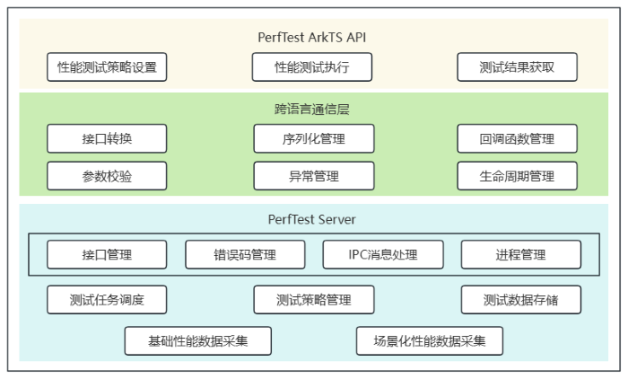

# 白盒性能测试框架使用指导

<!--Kit: Test Kit-->
<!--Subsystem: Test-->
<!--Owner: @inter515-->
<!--Designer: @inter515-->
<!--Tester: @laonie666-->
<!--Adviser: @Brilliantry_Rui-->

## 简介

白盒性能测试框架（PerfTest），提供了针对指定代码段运行时的白盒性能测试能力，用于度量指定应用进程的性能表现。框架通过多轮迭代执行机制和环境复位机制实现自动化测试，支持耗时、CPU使用率等基础数据和启动时延、滑动帧率等场景化性能数据的采集和度量。使用PerfTest接口的性能测试脚本需基于单元测试框架进行开发。

## 实现原理

PerfTest功能设计图如下所示：



PerfTest对外提供ArkTS API，包括性能测试策略设置、性能测试执行、测试结果获取等能力。<!--RP1-->具体请参考[API文档](../reference/apis-test-kit/js-apis-perftest.md)<!--RP1End-->。

跨语言通信层负责上层ArkTS接口与底层C++接口的转换，包括参数校验、JSON序列化对象处理和异常处理等。作为PerfTest的客户端，它提供启动入口和功能调用接口。该层由测试应用加载运行，通过IPC与服务端通信实现功能调用和生命周期管理。此外，该层还负责管理C++层对ArkTS回调函数的调用。

PerfTest服务端负责白盒性能测试框架的主要功能处理，包含以下两部分：

- 框架运行通用能力：管理C++接口和错误码，包括接口调用、参数解析、异常处理等。PerfTest服务端以独立进程运行，通过IPC与客户端通信，监听客户端生命周期，实现进程保活和按需启停。

- 白盒性能测试能力：主要负责测试任务调度和性能数据采集工作。根据用户定义的测试策略，实现测试代码段运行、性能数据采集、数据处理和存储的自动化性能测试流程。当前支持采集的性能指标包括：耗时、CPU、内存、应用启动时延、页面切换时延、列表滑动帧率等。

## 开发步骤

使用PerfTest接口进行白盒性能测试流程如下图所示：


1. 定义性能测试策略，明确测试指标列表、被测代码段、环境复位代码段、被测应用包名、测试迭代次数、代码段单次执行超时时间等，后续白盒性能测试中将依照此策略执行测试。

2. 创建测试任务，配置测试策略并准备测试环境。

3. 启动测试，将根据测试迭代次数执行多轮测试。每轮测试采集被测代码段执行期间的性能数据，并执行环境复位代码段恢复环境。完成后进行数据处理和保存。

4. 获取测量数据值，结果存储在对象中，支持获取每轮测试详细数据和最大值、最小值、平均值等统计数据。

5. 销毁创建的对象，释放内存占用。

下面以采集指定代码段执行期间的耗时、CPU使用率为例，介绍详细代码开发步骤。

### 定义测试策略

1. 定义测试性能指标列表

    定义所需测试的性能指标列表`metrics`，类型为`Array<PerfMetric>`，其中<!--RP2-->[PerfMetric](../reference/apis-test-kit/js-apis-perftest.md#perfmetric)<!--RP2End-->为框架支持采集的性能指标枚举。
    ```ts
    let metrics: Array<PerfMetric> = [ PerfMetric.DURATION, PerfMetric.CPU_USAGE ];
    ```

2. 定义被测代码段和环境复位代码段

    被测代码段`actionCode`是一个类型为`Callback<Callback<boolean>>`的回调函数，框架在测试期间会自动调用此回调函数，并采集性能数据。执行结束时需调用入参`Callback<boolean>`函数通知框架执行完成，否则会导致代码段执行超时。例如测试`Utils.CalculateTest`方法性能时，通过调用`finish(true)`通知框架代码段执行完成。
    ```ts
    let actionCode: Callback<Callback<boolean>> = async (finish: Callback<boolean>) => {
        Utils.CalculateTest();
        finish(true);
    };
    ```

    此外，框架支持定义环境复位代码段`resetCode`，用于在单次测试后进行环境复位，类型和使用方法与`actionCode`相同。`resetCode`会在`actionCode`执行完成后执行，但执行期间不会采集应用性能数据。
    ```ts
    let resetCode: Callback<Callback<boolean>> = async (finish: Callback<boolean>) => {
        Utils.Reset();
        finish(true);
    };
    ```

3. 构造测试策略对象

    除以上步骤定义的属性外，框架还支持定义其他测试策略，从而帮助开发者进行更加精确的自动化性能测试。所有测试策略通过<!--RP3-->[PerfTestStrategy](../reference/apis-test-kit/js-apis-perftest.md#perfteststrategy)<!--RP3End-->对象定义和保存，性能测试期间会依据此策略执行并采集数据。
    ```ts
    let perfTestStrategy: PerfTestStrategy = {
        metrics: metrics,   // 步骤1中定义
        actionCode: actionCode,   // 步骤2中定义
        resetCode: resetCode,   // 步骤2中定义
        bundleName: "com.example.test", // 定义被测应用包名
        iterations: 10,  // 定义测试迭代次数
        timeout: 20000  // 定义代码段单次执行超时时间，单位ms
    };
    ```

### 创建测试任务和启动测试

  使用<!--RP4-->[PerfTest.create()](../reference/apis-test-kit/js-apis-perftest.md#create)<!--RP4End-->创建测试任务时，传入上文定义的`PerfTestStrategy`对象。然后调用<!--RP5-->[PerfTest.run()](../reference/apis-test-kit/js-apis-perftest.md#run)<!--RP5End-->异步接口启动测试。测试会自动迭代执行被测代码段并采集性能数据。使用await语法糖同步等待执行完成后再进行后续操作。
  ```ts
  let perfTest: PerfTest = PerfTest.create(perfTestStrategy);
  await perfTest.run();
  ```

### 获取测试结果

  性能测试运行完成后，调用<!--RP6-->[PerfTest.getMeasureResult()](../reference/apis-test-kit/js-apis-perftest.md#getmeasureresult)<!--RP6End-->获取各个指标的测试结果。结果存储在<!--RP7-->[PerfMeasureResult](../reference/apis-test-kit/js-apis-perftest.md#perfmeasureresult)<!--RP7End-->对象中。若测试未完成或指标未定义，则抛出错误码。
  ```ts
  let res1: PerfMeasureResult = perfTest.getMeasureResult(PerfMetric.DURATION);
  let res2: PerfMeasureResult = perfTest.getMeasureResult(PerfMetric.CPU_USAGE);
  ```

### 销毁创建的对象

  性能测试完成后，若无需继续使用`PerfTest`对象，可以调用<!--RP8-->[PerfTest.destroy()](../reference/apis-test-kit/js-apis-perftest.md#destroy)<!--RP8End-->销毁对象以释放内存。
  ```ts
  perfTest.destroy();
  ```

## 完整示例

### 基础性能数据采集示例

下面以测试应用内指定逻辑执行时的基础性能数据为例，应用内定义了一个名为'Utils.CalculateTest()'的方法，性能测试时执行此方法，并采集执行期间的耗时和应用CPU占用率。

1. 在 main > ets > utils 文件夹下新增 Utils.ets 文件，在文件中编写自定义的函数。

    ```ts
    export class Utils {
      static num: number = 0
      public static CalculateTest() {
        for (let index = 0; index < 10000; index++) {
          Utils.num++;
        }
      }
      public static Reset() {
        Utils.num = 0
      }
    }
    ```

2. 在 ohosTest > ets > test 文件夹下 PerfTest.test.ets 文件中编写具体测试代码。

    ```ts
    import { describe, it, expect, Level } from '@ohos/hypium';
    import { PerfMetric, PerfTest, PerfTestStrategy, PerfMeasureResult } from '@kit.TestKit';
    import { Utils } from '../../../main/ets/utils/Utils'

    export default function PerfTestTest() {
      describe('PerfTestTest', () => {
        it('testExample1', 0, async (done: Function) => {
          let metrics: Array<PerfMetric> = [ PerfMetric.DURATION, PerfMetric.CPU_USAGE ]; // 定义待测指标
          let actionCode: Callback<Callback<boolean>> = async (finish: Callback<boolean>) => {  // 定义被测代码段
            Utils.CalculateTest();
            finish(true);
          };
          let resetCode: Callback<Callback<boolean>> = async (finish: Callback<boolean>) => {  // 定义环境复位代码段
            Utils.Reset();
            finish(true);
          };
          let perfTestStrategy: PerfTestStrategy = {  // 定义测试策略
            metrics: metrics,
            actionCode: actionCode,
            resetCode: resetCode,
            bundleName: "com.example.test", // 定义被测应用包名，请开发者替换为实际包名
            iterations: 10,  // 定义测试迭代次数
            timeout: 20000  // 定义代码段单次执行超时时间
          };
          try {
            let perfTest: PerfTest = PerfTest.create(perfTestStrategy); // 创建测试任务对象PerfTest
            await perfTest.run(); // 执行测试，异步函数需使用await同步等待完成
            let res1: PerfMeasureResult = perfTest.getMeasureResult(PerfMetric.DURATION); // 获取耗时指标的测试结果
            let res2: PerfMeasureResult = perfTest.getMeasureResult(PerfMetric.CPU_USAGE); // 获取CPU使用率指标的测试结果
            perfTest.destroy(); // 销毁PerfTest对象
            expect(res1.average).assertLessOrEqual(1000); // 断言性能测试结果
            expect(res2.average).assertLessOrEqual(30); // 断言性能测试结果
          } catch (error) {
            console.error(`Failed to execute perftest. Cause:${JSON.stringify(error)}`);
            expect(false).assertTrue()
          }
          done()
        })
      })
    }
    ```

### 场景化性能数据采集示例

下面以测试应用内列表滑动的帧率为例，实现如下功能：打开指定应用，使用UI测试框架接口查找类型为'Scroll'的可滚动组件，并进行滑动操作，采集期间的列表滑动帧率数据。

1. 在 main > ets > pages 文件夹下编写 Index.ets 页面代码，作为被测示例demo。

    ```ts
    @Entry
    @Component
    struct ListPage {
      scroller: Scroller = new Scroller()
      private arr: number[] = [1, 2, 3, 4, 5, 6, 7, 8, 9, 10]
      build() {
        Row() {
          Column() {
            Scroll(this.scroller) {
              Column() {
                ForEach(this.arr, (item: number) => {
                  Text(item.toString())
                    .width('90%')
                    .height('40%')
                    .fontSize(80)
                    .textAlign(TextAlign.Center)
                    .margin({ top: 10 })
                }, (item: string) => item)
              }
            }
            .width('100%')
            .height('100%')
            .scrollable(ScrollDirection.Vertical)
            .scrollBar(BarState.On)
            .scrollBarColor(Color.Gray)
          }
          .width('100%')
        }
        .height('100%')
      }
    }
    ```

2. 在ohosTest > ets > test文件夹下 PerfTest.test.ets 文件中编写具体测试代码。

    ```ts
    import { describe, it, expect, Level } from '@ohos/hypium';
    import { PerfMetric, PerfTest, PerfTestStrategy, PerfMeasureResult } from '@kit.TestKit';
    import { abilityDelegatorRegistry, Driver, ON } from '@kit.TestKit';
    import { Want } from '@kit.AbilityKit';

    const delegator: abilityDelegatorRegistry.AbilityDelegator = abilityDelegatorRegistry.getAbilityDelegator();
      export default function PerfTestTest() {
        describe('PerfTestTest', () => {
        it('testExample2',Level.LEVEL3, async (done: Function) => {
            let driver = Driver.create();
            await driver.delayMs(1000);
            const bundleName = abilityDelegatorRegistry.getArguments().bundleName;
            // 被拉起应用的包名和Ability组件名，请开发者替换为实际的bundleName和abilityName
            const want: Want = {
                bundleName: bundleName,
                abilityName: 'EntryAbility'
            };
            await delegator.startAbility(want); // 拉起测试应用
            await driver.delayMs(1000);
            let scroll = await driver.findComponent(ON.type('Scroll'));
            await driver.delayMs(1000);
            let center = await scroll.getBoundsCenter();  // 获取Scroll可滚动组件坐标
            await driver.delayMs(1000);
            let metrics: Array<PerfMetric> = [PerfMetric.LIST_SWIPE_FPS]  // 指定被测指标为列表滑动帧率
            let actionCode = async (finish: Callback<boolean>) => { // 测试代码段中使用uitest进行列表滑动
                await driver.fling({x: center.x, y: Math.floor(center.y * 3 / 2)}, {x: center.x, y: Math.floor(center.y / 2)}, 50, 20000);
                await driver.delayMs(3000);
                finish(true);
            };
            let resetCode = async (finish: Callback<boolean>) => {  // 复位环境，将列表划至顶部
                await scroll.scrollToTop(40000);
                await driver.delayMs(1000);
                finish(true);
            };
            let perfTestStrategy: PerfTestStrategy = {  // 定义测试策略
                metrics: metrics,
                actionCode: actionCode,
                resetCode: resetCode,
                iterations: 5,  // 指定测试迭代次数
                timeout: 50000, // 指定actionCode和resetCode的超时时间
            };
            try {
                let perfTest: PerfTest = PerfTest.create(perfTestStrategy); // 创建测试任务对象PerfTest
                await perfTest.run(); // 执行测试，异步函数需使用await同步等待完成
                let res: PerfMeasureResult = perfTest.getMeasureResult(PerfMetric.LIST_SWIPE_FPS); // 获取列表滑动帧率指标的测试结果
                perfTest.destroy(); // 销毁PerfTest对象
                expect(res.average).assertLargerOrEqual(60);  // 断言性能测试结果
            } catch (error) {
                console.error(`Failed to execute perftest. Cause:${JSON.stringify(error)}`);
            }
            done();
          })
      })
    }
    ```

<!--Del-->
PerfTest详细工程示例可参考[白盒性能测试示例](https://gitcode.com/openharmony/applications_app_samples/blob/master/code/Project/Test/perftest)。
<!--DelEnd-->