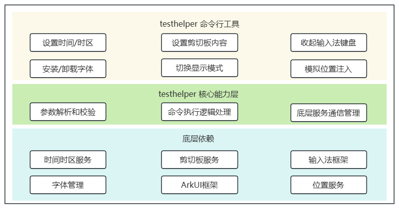

# 辅助测试工具使用指导

<!--Kit: Test Kit-->
<!--Subsystem: Test-->
<!--Owner: @inter515-->
<!--Designer: @inter515-->
<!--Tester: @laonie666-->
<!--Adviser: @Brilliantry_Rui-->

## 概述

辅助测试工具（testhelper），为开发者提供系统状态管理和环境模拟能力，支持时间设置、剪贴板管理、输入法管理、字体管理、显示模式切换和位置模拟等功能，助力开发者快速进行测试环境配置。

搭载OpenHarmony 7.0.0及以上版本的设备支持此工具。

## 功能全景

testhelper功能架构设计图如下所示：



testhelper分为命令行工具层和核心能力层两部分，依赖底层系统服务提供功能支持。

**命令行工具层：** 作为用户交互入口，负责接收和处理用户输入的命令。

**核心能力层：** 包含参数解析和校验、命令执行处理、服务通信管理三部分，负责testhelper的核心功能处理。

**系统服务依赖：** testhelper依赖底层系统服务实现具体功能，包括时间时区服务、剪贴板服务、输入法框架、字体管理、ArkUI框架、位置服务等，testhelper通过IPC调用这些服务。

## 命令详细说明

### testhelper help

显示testhelper工具的帮助信息，包括所有可用命令及其用法。

**使用示例：**

```bash
hdc shell testhelper help
```

输出示例：

```bash
Usage:
  testhelper <command> [options]

Commands:
  get-time           Get current system time
  set-time <time>    Set system time (format: YYYY-MM-DD HH:MM:SS)
  get-timezone       Get current system timezone
  set-timezone <timezone>  Set system timezone (e.g., Asia/Shanghai)
  get-pastedata      Get pasteboard text content
  set-pastedata <text>     Set pasteboard text content
  clear-pastedata    Clear pasteboard content
  hide-keyboard      Hide input method keyboard
  get-fontname <font-path> Get font name from font file (/data/local/* files only)
  install-font <font-path>  Install font from font file (/data/local/* files only)
  uninstall-font <font-name>  Uninstall font by font name
  set-viewmode <dark|light>  Set view mode (dark or light)
  enable-location-mock     Enable location mock functionality
  disable-location-mock    Disable location mock and restore real location
  set-mocked-locations <path> [interval] Set mocked locations from GPX file
  help               Show this help message
  --version          Show version information
```

### testhelper --version

显示testhelper工具的版本信息。

**使用示例：**

```bash
hdc shell testhelper --version
```

输出示例：`1.0.1`

### testhelper get-time

获取当前系统时间。

**使用示例：**

```bash
hdc shell testhelper get-time
```

输出示例：`Current system time: 2026-05-16 14:30:00`

**异常场景介绍：**

| 场景 | 打印信息 |
|-----|----------|
| 时间服务不可用。| `Error: Service is not available.` |

### testhelper set-time

设置系统时间。

**参数说明：**

| 参数 | 必填 | 说明 |
|-----|------|------|
| time | 是 | 时间字符串，格式必须为`YYYY-MM-DD HH:MM:SS`。<br>**取值范围：**<br>- 年份：`1970-2038`。<br>- 月份：`1-12`。<br>- 日期：`1-31`，需符合实际日历（如2月无30日）。<br>- 小时：`0-23`。<br>- 分钟：`0-59`。<br>- 秒：`0-59`。|

**使用示例：**

```bash
hdc shell testhelper set-time 2026-05-16 14:30:00
```

输出示例：`Set time to 2026-05-16 14:30:00 successfully.`

**异常场景介绍：**

| 场景 | 打印信息 |
|-----|----------|
| 时间格式错误。| `Error: Invalid time format. Time must be in 'YYYY-MM-DD HH:MM:SS' format.` |
| 时间值无效（如月份为13）。| `Error: Invalid time value. 2026-13-01 00:00:00 is not a valid date and time.` |
| 时间服务不可用。| `Error: Service is not available.` |

### testhelper get-timezone

获取当前系统时区。

**使用示例：**

```bash
hdc shell testhelper get-timezone
```

输出示例：`Current timezone: Asia/Shanghai`

**异常场景介绍：**

| 场景 | 打印信息 |
|-----|----------|
| 时间服务不可用。| `Error: Service is not available.` |

### testhelper set-timezone

设置系统时区。

**参数说明：**

| 参数 | 必填 | 说明 |
|-----|------|------|
| timezone | 是 | 时区标识符，如`Asia/Shanghai`。取值参考[支持的系统时区](../reference/apis-basic-services-kit/js-apis-system-time.md#支持的系统时区)。|

**使用示例：**

```bash
hdc shell testhelper set-timezone Asia/Shanghai
```

输出示例：`Set timezone to Asia/Shanghai successfully.`

**异常场景介绍：**

| 场景 | 打印信息 |
|-----|----------|
| 时区值无效。| `Error: Invalid timezone value. xxx is not a valid timezone identifier.` |
| 时间服务不可用。| `Error: Service is not available.` |

### testhelper get-pastedata

获取剪贴板文本内容。

**使用示例：**

```bash
hdc shell testhelper get-pastedata
```

输出示例：`Pasteboard text: hello world`

**异常场景介绍：**

| 场景 | 打印信息 |
|-----|----------|
| 设备不支持剪贴板功能。| `Error: Operation is not supported. Pasteboard is not supported on this device.` |
| 服务不可用。| `Error: Service is not available.` |

### testhelper set-pastedata

设置剪贴板文本内容。

**参数说明：**

| 参数 | 必填 | 说明 |
|-----|------|------|
| text | 是 | 要设置的文本内容。最大长度：128MB。|

**使用示例：**

```bash
hdc shell testhelper set-pastedata "hello world"
```

输出示例：`Pasteboard text set successfully.`

**异常场景介绍：**

| 场景 | 打印信息 |
|-----|----------|
| 文本过长（超过128MB）。| `Error: Text is too long. Maximum length is 128MB.` |
| 设备不支持剪贴板功能。| `Error: Operation is not supported. Pasteboard is not supported on this device.` |
| 服务不可用。| `Error: Service is not available.` |

### testhelper clear-pastedata

清除剪贴板内容。

**使用示例：**

```bash
hdc shell testhelper clear-pastedata
```

输出示例：`Pasteboard text cleared successfully.`

**异常场景介绍：**

| 场景 | 打印信息 |
|-----|----------|
| 设备不支持剪贴板功能。| `Error: Operation is not supported. Pasteboard is not supported on this device.` |
| 服务不可用。| `Error: Service is not available.` |

### testhelper hide-keyboard

隐藏输入法键盘。

**使用示例：**

```bash
hdc shell testhelper hide-keyboard
```

输出示例：`Keyboard hidden successfully.`

**异常场景介绍：**

| 场景 | 打印信息 |
|-----|----------|
| 设备不支持输入法功能。| `Error: Operation is not supported. IMF is not supported on this device.` |
| 没有活跃的输入法键盘。| `Error: No active input method keyboard.` |
| 服务不可用。| `Error: Service is not available.` |

### testhelper get-fontname

从字体文件获取字体名称。

**参数说明：**

| 参数 | 必填 | 说明 |
|-----|------|------|
| font-path | 是 | 字体文件的绝对路径。<br>**路径要求：**<br>- 路径必须为`/data/local/tmp`下的绝对路径。<br>- 文件格式：仅支持`.ttf`和`.ttc`。<br>- 不支持包含`..`的路径。|

**使用示例：**

```bash
hdc shell testhelper get-fontname /data/local/tmp/myfont.ttf
```

输出示例：`Font name: MyFont`

**异常场景介绍：**

| 场景 | 打印信息 |
|-----|----------|
| 路径无效（非`/data/local/tmp`下的绝对路径）。| `Error: Invalid font path. Please provide a valid absolute path under the /data/local/tmp` |
| 字体文件格式无效（非`.ttf`或`.ttc`）。| `Error: Invalid font file format. Only supports .ttf and .ttc files.` |
| 字体文件未找到。| `Error: Font file not found: /data/local/tmp/myfont.ttf` |
| 设备不支持字体管理功能（字体管理功能仅支持Phone、PC/2in1、Tablet设备）。| `Error: Operation is not supported. Font management is not supported on this device.` |
| 服务不可用。| `Error: Service is not available.` |

### testhelper install-font

从字体文件安装字体。

**参数说明：**

| 参数 | 必填 | 说明 |
|-----|------|------|
| font-path | 是 | 字体文件的绝对路径。<br>**路径要求：**<br>- 路径必须为`/data/local/tmp`下的绝对路径。<br>- 文件格式：仅支持`.ttf`和`.ttc`。<br>- 不支持包含`..`的路径。|

**使用示例：**

```bash
hdc shell testhelper install-font /data/local/tmp/myfont.ttf
```

输出示例：`Font installed successfully from /data/local/tmp/myfont.ttf`

**异常场景介绍：**

| 场景 | 打印信息 |
|-----|----------|
| 路径无效（非`/data/local/tmp`下的绝对路径）。| `Error: Invalid font path. Please provide a valid absolute path under the /data/local/tmp` |
| 字体文件格式无效（非`.ttf`或`.ttc`）。| `Error: Invalid font file format. Only supports .ttf and .ttc files.` |
| 字体文件未找到。| `Error: Font file not found: /data/local/tmp/myfont.ttf` |
| 字体已安装。| `Error: Font is already installed.` |
| 设备不支持字体管理功能（字体管理功能仅支持Phone、PC/2in1、Tablet设备）。| `Error: Operation is not supported. Font management is not supported on this device.` |
| 服务不可用。| `Error: Service is not available.` |

### testhelper uninstall-font

卸载字体。

**参数说明：**

| 参数 | 必填 | 说明 |
|-----|------|------|
| font-name | 是 | 字体名称。可通过[testhelper get-fontname](#testhelper-get-fontname)命令获取已安装字体文件对应的字体名称。 |

**使用示例：**

```bash
hdc shell testhelper uninstall-font MyFont
```

输出示例：`Font uninstalled successfully: MyFont`

**异常场景介绍：**

| 场景 | 打印信息 |
|-----|----------|
| 字体名称为空。| `Error: Font not found: ` |
| 字体未找到。| `Error: Font not found: MyFont` |
| 设备不支持字体管理功能（字体管理功能仅支持Phone、PC/2in1、Tablet设备）。| `Error: Operation is not supported. Font management is not supported on this device.` |
| 服务不可用。| `Error: Service is not available.` |

### testhelper set-viewmode

设置显示模式（深色/浅色模式）。

**参数说明：**

| 参数 | 必填 | 说明 |
|-----|------|------|
| mode | 是 | 显示模式，取值为`dark`（深色模式）或`light`（浅色模式）。|

**使用示例：**

```bash
hdc shell testhelper set-viewmode dark
```

输出示例：`Set view mode to dark successfully.`

**异常场景介绍：**

| 场景 | 打印信息 |
|-----|----------|
| 模式值无效（非`dark`或`light`）。| `Error: Invalid view mode. Mode must be 'dark' or 'light'.` |
| 设备不支持显示模式。| `Error: Operation is not supported. View mode is not supported on this device.` |
| 显示模式已设置为指定值。| `Error: View mode is already set to dark.` |
| 服务不可用。| `Error: Service is not available.` |

### testhelper enable-location-mock

启用位置模拟功能。启用后支持使用[testhelper set-mocked-locations](#testhelper-set-mocked-locations)命令设置模拟位置信息。

**使用示例：**

```bash
hdc shell testhelper enable-location-mock
```

输出示例：`Enable location mock successfully.`

**异常场景介绍：**

| 场景 | 打印信息 |
|-----|----------|
| 设备不支持位置模拟功能。| `Error: Operation is not supported. Location mock is not supported on this device.` |
| 服务不可用。| `Error: Service is not available.` |

### testhelper disable-location-mock

禁用位置模拟功能，恢复真实位置。

**使用示例：**

```bash
hdc shell testhelper disable-location-mock
```

输出示例：`Disable location mock successfully.`

**异常场景介绍：**

| 场景 | 打印信息 |
|-----|----------|
| 设备不支持位置模拟功能。| `Error: Operation is not supported. Location mock is not supported on this device.` |
| 服务不可用。| `Error: Service is not available.` |

### testhelper set-mocked-locations

从GPX文件设置模拟位置。

**参数说明：**

| 参数 | 必填 | 说明 |
|-----|------|------|
| path | 是 | GPX文件的绝对路径。<br>**路径要求：**<br>- 路径必须为`/data/local/tmp`下的绝对路径。<br>- 文件格式：仅支持`.gpx`扩展名。<br>- 不支持包含`..`的路径。<br>- 最大位置数量：1000个。|
| interval | 否 | 位置更新间隔，单位为秒。<br>- 取值范围：1-3600（整数）。<br>- 默认值：1。|

**使用示例：**

```bash
hdc shell testhelper set-mocked-locations /data/local/tmp/locations.gpx 2
```

输出示例：`Set mocked locations successfully.`

**GPX文件格式：**

testhelper支持标准的GPX 1.1格式，支持以下三种位置点类型：
- `<wpt>`（waypoint）：航点。
- `<trk>`（track）：轨迹，包含`<trkseg>`和`<trkpt>`。
- `<rte>`（route）：路线，包含`<rtept>`。

每个位置点需包含以下属性：
- `lat`和`lon`：经纬度坐标（必填），纬度范围-90到90，经度范围-180到180。
- `<ele>`：海拔高度（可选，单位：米）。
- `<time>`：时间戳（可选，ISO 8601格式）。
- `<speed>`：速度（可选，单位：米/秒，必须≥0）。
- `<direction>`或`<course>`：方向（可选，单位：度，范围0-360）。

**GPX文件模板示例：**

```xml
<?xml version="1.0" encoding="UTF-8"?>
<gpx version="1.1" creator="TestHelper" xmlns="http://www.topografix.com/GPX/1/1">
  <metadata>
    <name>位置模拟轨迹</name>
  </metadata>
  <trk>
    <name>模拟轨迹</name>
    <trkseg>
      <trkpt lat="22.5431" lon="114.0579">
        <ele>8.0</ele>
        <time>2024-01-15T09:00:00Z</time>
        <speed>25.0</speed>
        <direction>90.0</direction>
      </trkpt>
      <trkpt lat="22.5531" lon="114.0679">
        <ele>10.0</ele>
        <time>2024-01-15T09:01:00Z</time>
        <speed>28.0</speed>
        <direction>95.0</direction>
      </trkpt>
    </trkseg>
  </trk>
</gpx>
```

**异常场景介绍：**

| 场景 | 打印信息 |
|-----|----------|
| 路径无效（非`/data/local/tmp`下的绝对路径）。| `Error: Invalid path. Please provide a valid gpx file path under the /data/local/tmp` |
| GPX文件扩展名无效（非`.gpx`）。| `Error: Invalid path. Please provide a valid gpx file path under the /data/local/tmp` |
| GPX文件格式无效（XML格式错误、根元素错误、缺少有效位置点等）。| `Error: The parameter validation in gpx file has failed. xxx`（具体错误信息） |
| 时间间隔无效（≤0或>3600）。| `Error: The parameter validation has failed. timeInterval must be greater than 0.` 或 `timeInterval must be less than 3600.` |
| GPX文件位置数量超过限制（>1000）。| `Error: The parameter validation in gpx file has failed. locations size must be less than 1000.` |
| 设备不支持位置模拟功能。| `Error: Operation is not supported. Location mock is not supported on this device.` |
| 服务不可用。| `Error: Service is not available.` |

## 常见问题

### 服务不可用（Error: Service is not available）

**问题现象**

执行命令时返回服务不可用（`Error: Service is not available.`）错误信息。

**可能原因**

1. 相关服务未启动或异常退出。
2. 设备资源不足，服务无法正常运行。

**解决措施**

重启设备后重试。

### 参数验证失败

**问题现象**

执行命令时返回参数验证相关的错误信息。

**可能原因**

1. 参数格式不正确（如时间格式、文件路径格式等）。
2. 参数值超出限制范围（如时间值、文本长度、位置数量等）。
3. 文件路径不符合要求（如路径前缀、文件扩展名等）。

**解决措施**

1. 检查参数格式是否符合要求。
2. 确认参数值在限制范围内。
3. 确保文件路径符合要求（如为`/data/local/tmp`下的绝对路径、拥有正确的扩展名）。