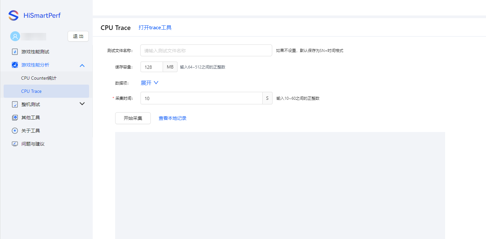
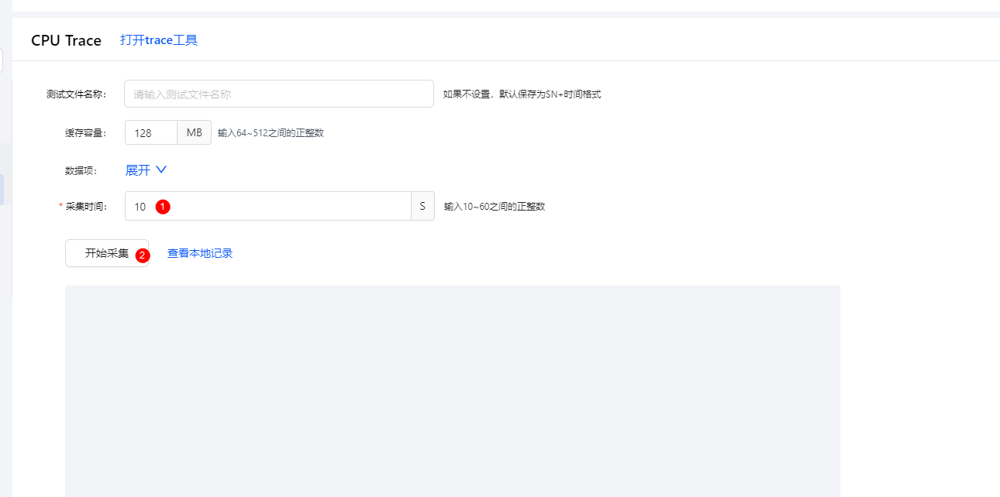
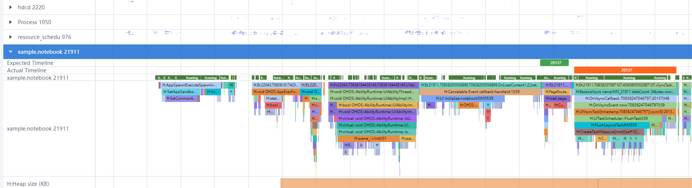
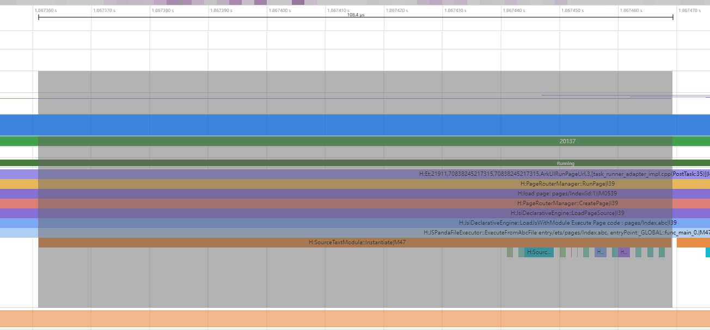
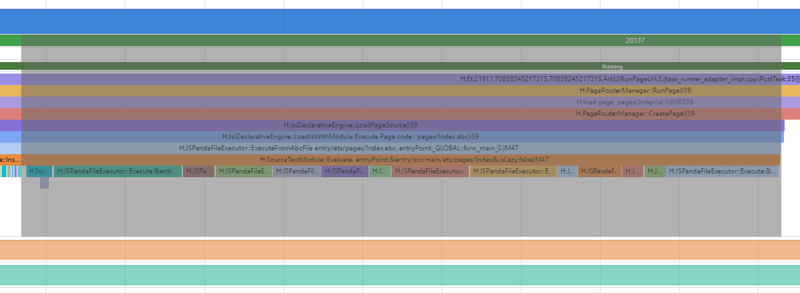
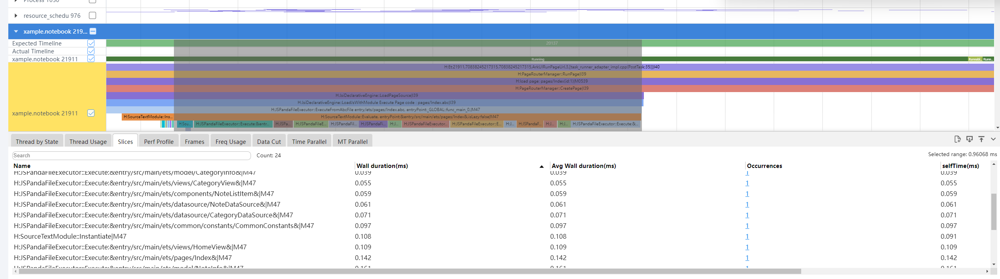

# 模块化调试工具
<!--Kit: ArkTS-->
<!--Subsystem: ArkCompiler-->
<!--Owner: @yao_dashuai-->
<!--Designer: @yao_dashuai-->
<!--Tester: @kirl75; @zsw_zhushiwei-->
<!--Adviser: @HellloCrease-->

ArkTS运行时提供了多种模块化调试工具，帮助开发者快速定位和解决模块化相关问题。

| 工具名称 | 主要功能 | 适用场景 | API版本 |
|---------|---------|---------|---------|
| [模块加载链路调试工具](#模块加载链路调试工具)| 检测循环依赖，记录模块加载路径 | 循环依赖问题、模块加载路径分析 |26.0.0|
| [模块化trace打点工具](#模块化trace打点工具) | 分析模块性能，统计使用情况 | 性能分析、性能优化 |26.0.0|

## 模块加载链路调试工具
当应用在模块加载阶段因异常发生崩溃，或开发者希望获取模块调用链路时，开发者可以通过该功能快速找到出问题的模块和它的调用路线，尤其适用于多层级嵌套import场景下的故障诊断。

### 启用和禁用方法

打开工具：当应用在模块加载阶段发生JsCrash或CppCrash，可开启此功能。开启后，崩溃日志中会记录完整的模块加载链路，帮助定位问题源头。
```bash
# 启用模块加载链路调试功能
hdc shell param set persist.ark.properties 0x40000105c
```

禁用工具：该功能会持续记录模块加载信息，对运行时性能有一定损耗。因此，定位完成、问题修复后应立即关闭，避免影响应用正常运行的性能。
```bash
# 禁用模块加载链路调试功能
hdc shell param set persist.ark.properties 0x0000105c
```

### 栈数据格式

开启模块加载链路调试功能后，JsCrash和CppCrash 崩溃日志中将显示模块调用链路信息。

**JsCrash日志示例：**

开启模块加载链路调试功能后，JsCrash崩溃日志中将新增 `ModuleImportStack` 字段。
```text
...
Stacktrace:
    at anonymous entry (entry/src/main/ets/pages/Index.ets:7:13)
HybridStack:
...
AsyncStack:
...
ModuleImportStack:
#0 entry/src/main/ets/pages/Index.ets
#1 entry/src/main/ets/utils/Helper.ets
#2 entry/src/main/ets/core/Core.ets

HiLog:
...
```

**CppCrash日志示例：**

开启模块加载链路调试功能后，CppCrash 崩溃日志LastFatalMessage字段中将显示模块调用链。
```text
...
LastFatalMessage:Failed to load &entry/src/main/ets/pages/A&, the dependency import call stack is as follows
#0 &entry/src/main/ets/pages/A&
#1 &entry/src/main/ets/pages/Index&
Fault thread info:
...
```

> **注意：**
> 
> 模块加载链路调试最多打印64KB内容，对于嵌套深度较大的场景，CppCrash和JsCrash会省略掉中间的栈。

```text
ModuleImportStack:
#000 entry/src/main/ets/pages/Index.ets
#001 entry/src/main/ets/utils/Helper.ets
...
#999 entry/src/main/ets/deep/Module99.ets
```
### 使用JsCrash追踪模块加载路径
开发者若需快速定位引发问题的模块导入链路，可在问题模块的顶层抛出一个JsError。例如，在B模块的顶层抛出异常后，开发者在打开工具并复现场景时，即可查看模块加载链路。
```js
// entry/src/main/ets/pages/Index.ets
import  {A} from './A'

A()
```
```js
// entry/src/main/ets/pages/A.ets
import {b} from "./B"

export function A(){
  return b + 2;
}
```
```js
// entry/src/main/ets/pages/B.ets
// 在顶层抛异常，不要在函数内。
throw new Error("ModuleImportStack test")
export const b = 1;
```
打印示例：
```text
ModuleImportStack:
#0 &entry/src/main/ets/pages/B&
#1 &entry/src/main/ets/pages/A&
#2 &entry/src/main/ets/pages/Index&
```
### 追踪so模块的ets导入来源
开发者若想快速定位引发问题的so模块加载链路，可在引发问题的so的napi_init中抛出CppCrash。例如，在napi_init.cpp中对空指针进行操作以触发CppCrash，开发者打开工具后复现场景，即可看到libentry.so模块是从哪个ets文件导入。
```js
// entry/src/main/ets/pages/Index.ets
import {a} from './A'
import { hilog } from '@kit.PerformanceAnalysisKit';

const DOMAIN = 0x0000;
hilog.info(DOMAIN, 'testTag', 'ModuleImportStack test', a);
```
```js
// entry/src/main/ets/pages/A.ets
import { hilog } from '@kit.PerformanceAnalysisKit';
import testNapi from 'libentry.so';

const DOMAIN = 0x0000;
hilog.info(DOMAIN, 'testTag', 'Test NAPI 2 + 3 = %{public}d', testNapi.add(2, 3));
export const a = 1;
```
```cpp
// entry/src/main/cpp/napi_init.cpp
EXTERN_C_START
static napi_value Init(napi_env env, napi_value exports)
{
    napi_property_descriptor desc[] = {
        { "add", nullptr, Add, nullptr, nullptr, nullptr, napi_default, nullptr }
    };
    napi_define_properties(env, exports, sizeof(desc) / sizeof(desc[0]), desc);
    // 在需要知道调用链路的文件中抛出空指针触发CppCrash
    int *p = nullptr;
    *p = 42;
    return exports;
}
EXTERN_C_END
```
打印示例：
```text
LastFatalMessage:Failed to load &entry/src/main/ets/pages/A&, the dependency import call stack is as follows
#0 &entry/src/main/ets/pages/A&
#1 &entry/src/main/ets/pages/Index&
```  
## 模块化trace打点工具

当开发者需要分析文件加载场景的性能可以使用此开关。  

### 使用步骤

启用和禁用工具：当应用需要分析文件加载性能，可开启此功能。开启后，采集trace数据会显示模块化打点，帮助分析性能问题。该功能会持续进行模块打点，对运行时性能有一定损耗。因此，抓取trace后可关闭，避免影响应用正常运行的性能。
```bash
# 启用模块化打点功能
hdc shell param set persist.ark.properties 0x100105c
# 禁用模块化打点功能
hdc shell param set persist.ark.properties 0x000105c
```

使用HiSmartPerf抓取trace：  

> **说明：**  
>  
> HiSmartPerf工具是一个独立的性能调优工具，用于采集测试时间段内系统、CPU和GPU的性能数据。通过可视化界面进行直观的呈现，便于开发者分析所开发应用运行时的性能表现和原因，以此为基础进行深入的性能优化，以使应用运行更加流畅。
>
> HiSmartPerf工具完整的介绍可参考指南：[HiSmartPerf](https://developer.huawei.com/consumer/cn/doc/AppGallery-connect-Guides/smartperf-tool-0000001873208929)。

1. 进入CPU Trace

   打开HiSmartPerf工具，进入游戏性能分析的CPU Trace页面。虽然标题是游戏性能分析，但分析场景并不仅限于游戏场景。

     

2. 配置采集时间并开始采集

   采集完成后将提示文件回传，当文件较大时请耐心等待。

      

3. 打开trace文件并选择需要查看的应用

     

### trace文件分析

实例化的文件以及so在SourceTextModule::Instantiate下。   

 

执行的文件以及so在SourceTextModule::Evaluate下。  

   

选中需要分析的区域，会在下方生成表格。可以根据表格数据对耗时长的文件进行性能优化。  

  