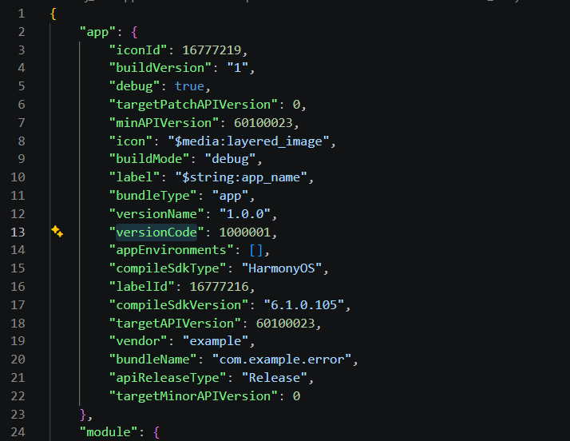
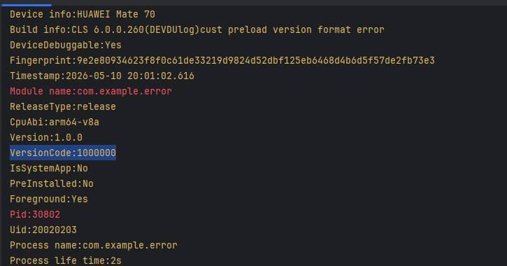
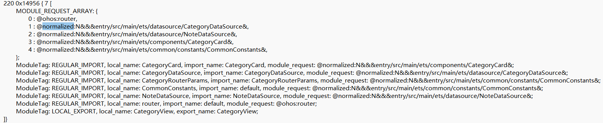
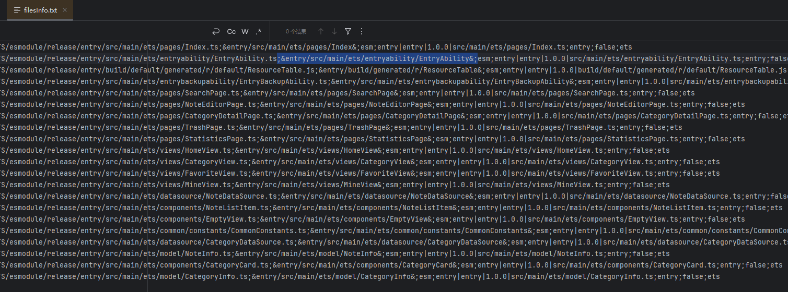
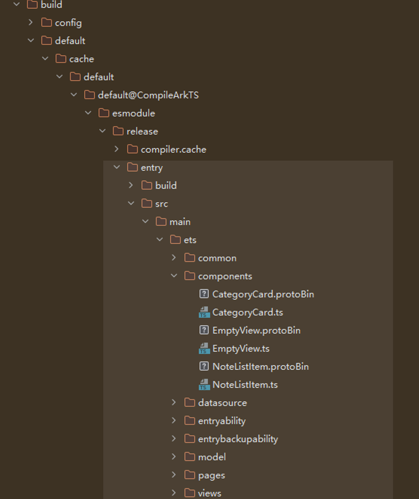

# 模块化常见问题
<!--Kit: ArkTS-->
<!--Subsystem: ArkCompiler-->
<!--Owner: @yao_dashuai-->
<!--Designer: @yao_dashuai-->
<!--Tester: @kirl75; @zsw_zhushiwei-->
<!--Adviser: @HellloCrease-->

## Object is not initialized

**问题现象**

应用运行时报错：“Object is not initialized”导致应用无法正常运行。

**可能原因**

模块之间存在循环依赖关系，导致变量在访问时还未完成初始化。

循环依赖是指两个或多个模块之间相互引用，形成循环引用关系的问题。在模块加载过程中，如果处理不当，可能导致变量未初始化等异常。

循环依赖问题的产生与模块加载顺序和执行时机密切相关，理解其原理有助于快速定位和解决问题。

1. 模块加载顺序。

   根据ECMA规范，模块的执行顺序是深度遍历加载。

   假设应用存在加载链路A->B->C，那么ArkTS模块化会先执行C文件，再执行B文件，最后执行A文件，执行顺序为C->B->A。

2. 循环依赖的执行流程。

   如果应用存在加载链路A->B->A，根据深度遍历执行顺序，执行流程会先标记A的状态为加载中，然后去加载B，标记B的状态为加载中，然后去加载A，由于A文件已经标记加载中，根据规范定义，识别到加载中模块会直接返回，就会先执行B文件。

3. 为何某些循环依赖未产生影响，而另一些则导致crash。

   由上述分析可知，B文件虽然依赖A文件变量，但由于B文件先执行，如果B文件导入的A文件变量没有在全局或者类静态中被使用，B文件就会正常执行。反之，如果B文件在全局或者实例化某个类等其他方法中使用到A文件的变量，导致文件执行时就会用到A的变量，由于此时A文件的变量还未初始化，就会产生 ”Object is not initialized”的crash，即循环依赖导致变量未被初始化。

**解决措施**

1. 打开模块化错误检测增强开关，复现问题并定位错误。

   ```bash
   hdc shell param set persist.ark.properties 0x2000105c
   ```

2. 处理错误。若报错仍显示“Object is not initialized”，可使用模块加载链路调试工具检查循环依赖问题。

3. 分析模块加载链路，定位循环依赖的模块关系。

   通过打开模块加载链路调试工具，可以观察到发生异常时的模块加载链路。此时栈顶为B模块，结合报错信息可知，B模块试图访问A模块的变量，从而推断出A->B->A的循环依赖链路。

4. 重构代码结构，消除循环依赖。

   通过修改模块之间的依赖关系，确保没有循环引用。常见方法包括：
   - 将公共依赖提取到独立模块
   - 调整模块导入顺序
   - 使用依赖注入等方式解耦模块关系

**代码示例**

下面示例中存在加载链路A->B->A。在执行过程中出现“a is not initialized”的异常。

``` typescript
// A.ets
import { Animal } from './B'

export let a = "this is A";
export function A() {
  return new Animal;
}

// B.ets
import { a } from './A'

export class Animal {
  static {
    console.info("this is in class");
    let str = a; // 报错信息：a is not initialized
  }
}
```

通过打开模块加载链路调试工具可以看到发生异常时的模块加载链路：

```text
ModuleImportStack:
#0 &entry/src/main/ets/pages/B&
#1 &entry/src/main/ets/pages/A&
#2 &entry/src/main/ets/pages/Index&
```

## cannot find module 'fileName', which is application Entry Point.

**问题现象**

应用启动时报错：cannot find module 'fileName', which is application Entry Point.

**可能原因**

应用在升级时并未升级版本号，或者应用使用了normalized特性，但是在升级或者更新时没有重启应用。

**解决措施**

1. 使用clean删除DevEco Studio缓存，重新构建。

2. 确认crash文件中的versionCode与hap包中module.json的versionCode是否一致。

   若不一致，则为应用版本号降级导致更新失败，应用需要更新版本号。

   

   

3. 检查是否使用了normalized特性但未重启应用。

   查看反编译后的abc文件为normalized ohmurl格式。可以在文件内搜索@normalized：

   

4. 重新启动应用，确保normalized特性生效。

**参考链接**

[Disassembler反汇编工具](./tool-disassembler.md)

## cannot find record 'fileName', please check request path.

**问题现象**

应用运行时报错：cannot find record 'fileName', please check request path.提示无法找到指定的模块或文件，导致应用运行异常。

**可能原因**

1. 该文件为动态加载表达式、动态加载文件等，但没有进行相关文件配置。

2. 文件路径配置错误，导致无法在hap包中找到对应文件。

**解决措施**

1. 检查动态加载文件的配置是否正确。

   按照动态加载写法进行检查。

2. 检查文件路径和编译产物是否匹配。

      在本地工程复现问题，可以在entry/build/default/cache/default/default@CompileArkTS/esmodule/release/filesInfo.txt（以release工程为例）文件中搜索报错的文件路径，搜索可能有两种情况：

   情况一：搜索不到完整的文件名，但可以搜索到相似的名字。

      

      解决办法：每行的第一个和第二个分号之间会有完整的名字，报错中的文件名和编译产物中的文件名需要修改为一致。

   情况二：filesInfo.txt搜索不到这个文件，在编译产物区域也找不到对应产物的文件生成。

      

      解决方法：每个被打入abc的文件都会在编译产物中生成，如entry包、har包。开发者如果在对应路径没有查到该文件，则排查是否为动态加载文件。

**参考链接**

[动态加载](./arkts-dynamic-import.md)
