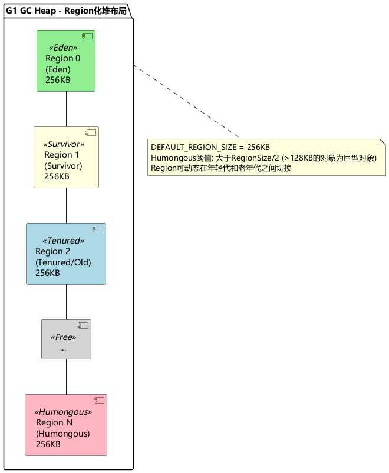
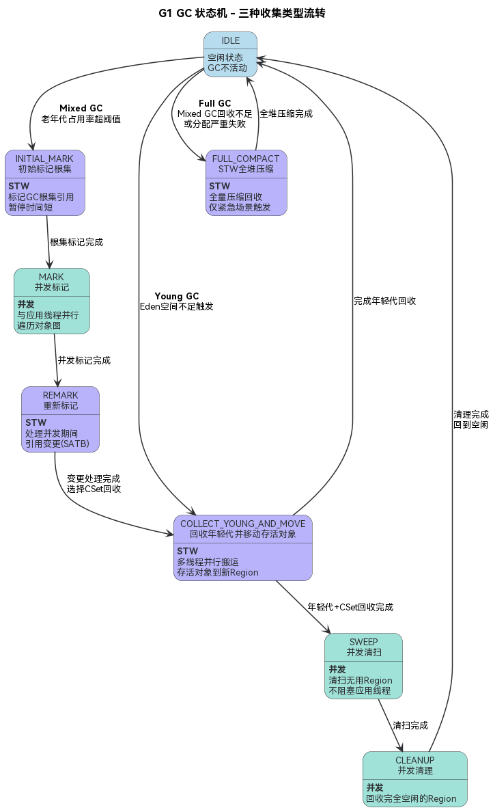
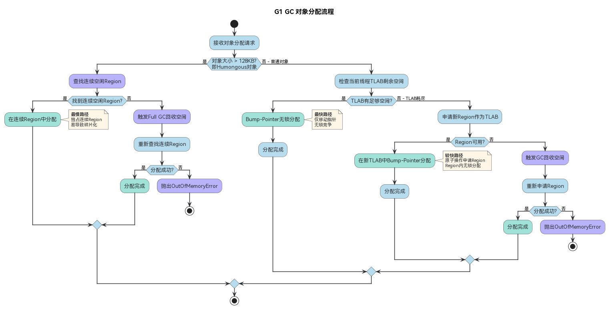
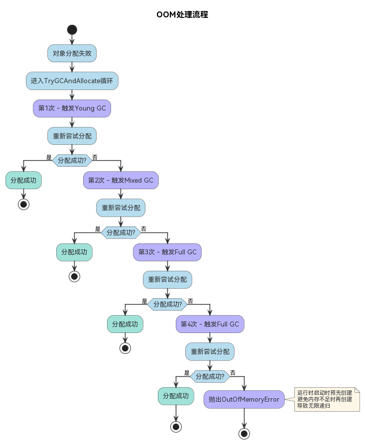
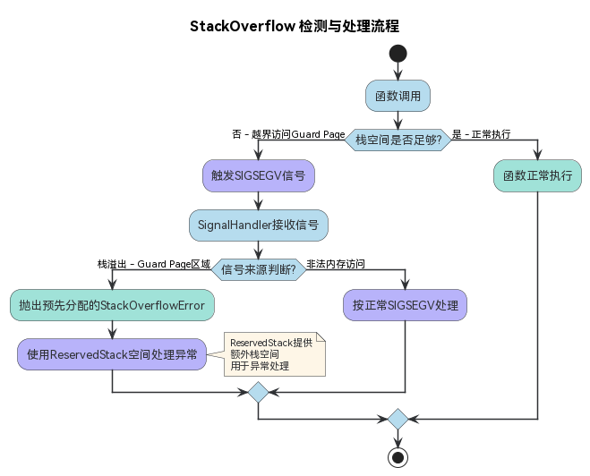

# GC垃圾回收 (ArkTS-Sta)
<!--Kit: ArkTS-->
<!--Subsystem: RuntimeCore-->
<!--Owner: @lijin1039-->
<!--Designer: @lijin1039-->
<!--Tester: @kirl75; @zsw_zhushiwei-->
<!--Adviser: @HelloCrease-->

ArkTS-Sta运行时采用基于**对象追踪**的GC算法设计，默认使用**G1 GC**——一种分代、Region化、并发标记的垃圾回收器，灵感来自JVM G1收集器。

## GC算法概述

ArkTS-Sta运行时采用基于对象追踪的GC算法，支持G1 GC以适应不同场景需求。

### 对象追踪算法

ArkTS-Sta选择基于对象追踪（Tracing GC）算法，主要原因：

- 引用计数存在循环引用导致的内存泄漏问题。
- 引用计数在对象操作时插入了计数环节，增加内存分配和赋值开销。
- 对象追踪可以解决循环引用问题，且对内存分配和赋值无额外开销。

> **说明：**
>
> 对象追踪算法的缺点是有短暂的STW（Stop The World）阶段和回收延迟，但G1 GC通过并发标记和Region化设计将这些影响最小化。

### ArkTS-Sta支持的GC类型

| GC类型 | 启动参数 | 特点 | 适用场景 |
| -------- | -------- | -------- | -------- |
| Epsilon GC | --gc-type=epsilon | 仅分配不回收 | 调试、性能测试 |
| Epsilon G1 GC | --gc-type=epsilon-g1 | G1布局但不回收 | 调试G1布局 |
| STW GC | --gc-type=stw | 全停顿收集器，简单但暂停时间长 | 极端兼容场景 |
| **G1 GC** | --gc-type=g1-gc | **默认GC**，分代+并发+Region化 | 生产环境 |
| CMC GC | --gc-type=cmc | 并发标记压缩，实验性质 | 实验场景 |

> **说明：**
>
> 默认GC为G1 GC（`--gc-type=g1-gc`）。开发者不应在生产环境中更改GC类型，除非有明确的性能测试数据支撑。

## G1 GC架构

G1 GC采用Region化堆布局和分代模型，结合复制、整理和清扫算法实现高效回收。

### Region化堆布局

G1 GC将堆划分为固定大小的Region，每个Region可以独立地作为年轻代或老年代使用。下图展示了G1 GC的Region化堆布局：堆由一系列固定大小（默认256KB）的Region组成，不同Region可分别作为Eden（新生代分配）、Survivor（存活对象暂存）、Tenured/Old（老年代）、Humongous（巨型对象独占连续Region）或Free（空闲）类型使用。Region类型可动态切换，使得G1 GC能灵活调整各代空间大小。



**Region类型**：

| Region类型 | 说明 |
| -------- | -------- |
| Eden | 新生代分配区域，存放新创建的对象。 |
| Survivor | 从Eden晋升的存活对象（经历一次GC）。 |
| Tenured/Old | 多次GC后晋升的老对象。 |
| Humongous | 超过半个Region大小的巨型对象，独占连续Region。 |
| Free | 未使用的空闲Region。 |

### 分代模型

G1 GC采用传统的分代模型，将对象划分为年轻代和老年代：

- **年轻代对象**：新分配的对象直接分配到Eden Region，存活率低，回收频繁。
- **老年代对象**：经过多次GC依然存活的对象被晋升到Tenured Region。

与ArkTS-Dyn的From/To半空间模型不同，G1 GC中年轻代由一组Eden Region + Survivor Region组成，不需要预留一半内存空间。

### 混合算法设计

G1 GC的回收策略根据Region类型采用不同算法：

- **年轻代回收（Young GC）**：对Eden + Survivor Region使用复制算法，将存活对象移动到新的Survivor Region或直接晋升到Old Region。
- **混合回收（Mixed GC）**：回收年轻代 + 选择回收收益最高的部分老年代Region。选择存活对象少、回收代价小的Region进行整理回收，对剩余老年代Region进行清扫回收。
- **全堆回收（Full GC）**：对整个堆进行全量压缩回收，用于内存严重不足场景。

**CSet（Collection Set）选择策略**：

混合回收时，G1 GC引入启发式CSet选择算法：

1. 根据设定的区域存活对象大小阈值，将满足条件的Region纳入初步CSet队列。
2. 根据存活率进行从低到高的排序（存活率 = 存活对象大小 / 区域大小）。
3. 根据设定的释放区域个数阈值和暂停时间目标，选出最终的CSet队列进行整理回收。
4. 对未被选入CSet队列的Region进行清扫回收。

启发式CSet选择算法结合了标记-整理和标记-清扫算法的优点，避免了内存碎片问题，同时提升了性能。

### 流程优化

G1 GC在回收流程中引入了并发和并行优化，以减少对应用性能的影响：

- 并发标记：标记阶段与应用线程并发执行，不阻塞应用运行。仅INITIAL_MARK和REMARK阶段需要短暂STW，大幅减少标记阶段的暂停时间。
- 并发清扫：Mixed GC的SWEEP阶段与应用线程并发执行，清扫无用Region时不阻塞应用。
- 并行回收：COLLECT_YOUNG_AND_MOVE阶段使用多个GC工作线程并行执行对象搬运，加快回收速度。
- 并发清理：CLEANUP阶段回收完全空闲的Region，与应用线程并发执行。

> **说明：**
>
> 与ArkTS-Dyn的HPP GC类似，G1 GC通过并发+并行的方式将大部分GC工作与应用线程并行执行，仅在必要的根集标记和对象搬运阶段需要短暂STW，从而最小化对应用性能的影响。

## GC流程与状态机

G1 GC通过状态机管理三种收集类型的流程，Young GC、Mixed GC和Full GC各有不同的阶段流转。

### GC阶段

G1 GC运行状态机（按GC类型分支）。下图展示了G1 GC在三种收集类型下的状态流转：Young GC从IDLE直接进入COLLECT_YOUNG_AND_MOVE（回收年轻代）后返回IDLE；Mixed GC依次经历INITIAL_MARK（STW标记根集）、MARK（并发标记）、REMARK（STW处理变更）、COLLECT_YOUNG_AND_MOVE（回收年轻代+部分老年代CSet）、SWEEP（并发清扫）和CLEANUP（并发回收空闲Region）后返回IDLE；Full GC从IDLE直接进入FULL_COMPACT（STW全堆压缩）后返回IDLE。



| 阶段 | 说明 | 是否STW |
| -------- | -------- | -------- |
| INITIAL_MARK | 初始标记，标记根集。 | STW |
| MARK | 并发标记阶段。 | 并发（与应用线程并行） |
| REMARK | 重新标记，处理并发标记期间的变更。 | STW |
| COLLECT_YOUNG_AND_MOVE | 回收年轻代并移动存活对象。 | STW |
| SWEEP | 清扫无用Region。 | 并发 |
| CLEANUP | 回收完全空闲的Region。 | 并发 |

### GC收集类型

**Young GC**

- 触发机制：年轻代空间分配不足时触发。Eden Region使用率达到阈值。
- 功能描述：回收Eden + Survivor Region中的年轻代对象。
- 场景：前台场景，回收频率高，单次耗时短。
- 日志关键词：`[G1 YoungGC]`。

**Mixed GC**

- 触发机制：老年代空间占用率超过阈值（默认 InitiatingHeapOccupancyPercent）时触发并发标记，标记完成后进行混合回收。
- 功能描述：回收年轻代 + 部分存活率低的老年代Region。
- 场景：前台场景，GC耗时比Young GC长，但回收更多空间。
- 日志关键词：`[G1 MixedGC]`。

**Full GC**

- 触发机制：Mixed GC回收不足、内存分配严重失败、或外部主动请求时触发。
- 功能描述：对整个堆进行全量压缩回收，停止所有并发活动。
- 场景：紧急内存回收场景，单次耗时最长。
- 日志关键词：`[G1 FullGC]`。

> **说明：**
>
> Full GC是G1 GC的最后防线，设计目标是尽量避免触发。如果频繁出现Full GC，通常意味着堆空间不足或存在内存泄漏，需要排查应用内存使用情况。

## CardTable与写屏障

G1 GC通过CardTable实现跨代引用追踪，并通过双写屏障机制保证并发标记和分代回收的正确性。

### CardTable

CardTable实现跨代引用追踪，用于G1 GC的分区化回收：

- 卡片大小：4KB（每256KB Region = 64张卡片）。
- 热度追踪：3-bit hotness counter，频繁修改的卡片标记为"hot"。
- 卡片状态：
  - GC周期内状态：`CLEAR → MARKED → PROCESSED → YOUNG`。
  - `DIRTY`：由写屏障实时标记的特殊状态，表示该卡片所在区域存在老年代对象对年轻代对象的跨代引用。DIRTY状态独立于上述流转链，发生引用写入时直接设置，Young GC扫描后清除为CLEAR。

**工作原理**：

当老年代对象引用了年轻代对象时（跨代引用），写屏障将对应的卡片标记为DIRTY。Young GC时只需要扫描DIRTY卡片对应的Region区域，而不是扫描整个老年代，大大减少了Young GC的根集扫描时间。扫描完成后，DIRTY卡片被清除为CLEAR状态，等待下次跨代引用写入时重新标记。

### 写屏障

G1 GC使用双屏障机制保证并发标记和分代回收的正确性：

**Post-write barrier（Card-table屏障）**

- 对象引用写入后，标记对应卡片为DIRTY。
- 热度计数达到阈值时加入hot cards缓存。
- 作用：维护跨代引用信息，支持分区化Young GC。

**Pre-write barrier（SATB屏障）**

- Snapshot-at-the-beginning策略，并发标记前记录旧引用值。
- 保证并发标记期间引用变更不丢失（SATB一致性）。
- 作用：保证并发标记的正确性。

> **说明：**
>
> 写屏障会在每次对象引用赋值时执行，带来少量运行时开销。但这是G1 GC实现并发标记和分区化回收的基础，总体上减少了STW暂停时间。

## 对象分配机制

G1 GC根据对象大小和当前线程TLAB状态选择不同的分配路径。下图展示了对象分配的完整决策流程：首先判断对象是否为Humongous对象（超过128KB），若是则查找连续空闲Region进行分配；若为普通对象，则优先在当前线程的TLAB（Thread Local Allocation Buffer）中通过无锁bump-pointer方式分配，TLAB耗尽时申请新Region作为TLAB后继续分配。



**分配性能**：

- TLAB内分配：最快，无锁bump-pointer，仅移动指针。
- 直接Region分配：较慢，需要原子操作。
- Humongous分配：最慢，需要查找连续空闲Region。

> **说明：**
>
> 避免创建超过128KB的大对象（Humongous对象）。Humongous对象独占连续Region，导致Region碎片化，降低分配效率和GC回收效果。如果确实需要大对象，考虑拆分为多个小对象。

## Heap空间结构

ArkTS-Sta运行时的堆由多种空间组成，每种空间承担不同的对象存储职责。

### 堆空间类型

ArkTS-Sta运行时通过互操作层（Interop Layer）的XGC机制处理ArkTS-Sta与ArkTS-Dyn/JS之间的跨运行时引用追踪，而非使用共享堆来存储跨运行时对象。

每个空间由一个或多个Region进行分区域管理。Region是空间向内存分配器申请的单位。各空间中的Region类型可动态切换，使得G1 GC能够灵活调整各代空间大小。

Survivor Region是可选空间，仅在高端设备上启用。当优先吞吐量时，可不使用Survivor——大多数Eden对象生命周期很短，直接晋升到Old Region可减少一次复制开销。在不使用Survivor时，可实现非搬移式分代GC。

| 空间类型 | 说明 |
| -------- | -------- |
| Eden/Young Region | 新生代分配区域，存放新创建的对象，存活率低，回收频繁。 |
| Survivor Region | 从Eden晋升的存活对象（经历一次GC），可选空间。 |
| Tenured/Old Region | 多次GC后晋升的老对象，存活率高。 |
| Humongous Region | 超过半个Region大小的巨型对象，独占连续Region。 |
| NonMovableSpace | 不可移动对象空间，存放GC期间不可搬移的对象（如被Pinning锁定的对象、运行时内部结构等）。 |
| CodeSpace | 机器码空间，存放JIT/AOT编译生成的可执行代码。 |
| InternalSpace | 运行时内部空间，存放运行时自身所需的内部数据（包括GC自身的数据结构）。 |

### Heap相关参数

> **说明：**
>
> 以下参数为运行时内部参数，部分可通过ark命令行配置，部分由系统根据设备内存自动设定。开发者不应在应用代码中直接配置。

**堆大小相关参数**

| 参数名 | 默认值 | 说明 |
| -------- | -------- | -------- |
| heap-size-limit | 512MB | 堆大小上限。 |
| young-space-size | 4MB | 年轻代空间大小（Eden + Survivor Region总大小）。 |
| region-size | 256KB | Region大小。 |
| heap-min-size | 0 | 堆最小大小。 |

**GC线程相关参数**

| 参数名 | 默认值 | 说明 |
| -------- | -------- | -------- |
| gc-workers-count | 2 | GC工作线程数。 |
| concurrent-gc-enabled | true | 启用并发GC。 |

**GC触发相关参数**

| 参数名 | 默认值 | 说明 |
| -------- | -------- | -------- |
| pause-target | - | STW暂停时间目标（毫秒）。 |
| hot-card-threshold | 3 | CardTable热度阈值。 |

**解释器栈大小**

| 参数名 | 默认值 | 说明 |
| -------- | -------- | -------- |
| max-stack-size | 128KB | 控制解释器栈的大小。 |

## GC触发策略

G1 GC提供多种触发策略，包括空间阈值、分配失败、外部请求、并发标记提前触发、自适应策略、空闲时触发和Native内存绑定触发。

### 空间阈值触发GC

- **Young GC触发**：Eden Region分配空间不足时触发。年轻代使用率超过阈值。
- **Mixed GC触发**：老年代空间使用率超过InitiatingHeapOccupancyPercent阈值时，先启动并发标记，标记完成后选择CSet进行混合回收。
- **Full GC触发**：Mixed GC回收空间不足、或分配失败触发全堆回收。

### 分配失败触发GC

- 对象分配时TLAB耗尽、Region分配失败时触发GC。
- HeapManager在分配失败时最多尝试4次GC + 重新分配，每次增大回收力度（Young → Mixed → Full）。

### 外部触发GC

- `Runtime::RequestGC()` 外部主动请求GC。
- 与ArkTS-Dyn的`ArkTools.hintGC()`类似，提示系统进行GC。

### 并发标记提前触发

- `ConcurrentGCTrigger`：堆使用率超过阈值时提前启动并发标记，减少后续Mixed GC的STW时间。
- `PauseTimeGoalTrigger`：基于暂停时间目标的触发策略。当堆使用量超过目标占用量时触发并发标记，确保在指定的暂停时间目标内完成GC。G1 Analytics根据历史GC数据预测分配速率和回收时间，自适应调整触发时机。

### 自适应触发策略

G1 GC提供多种自适应触发策略，根据应用运行状况动态调整GC触发时机：

- **HeapTrigger**：基于堆使用百分比的阈值触发，是最基本的触发方式。
- **AdaptiveHeapTrigger**：自适应策略，使用环形缓冲区记录最近的触发阈值，根据历史数据动态调整。当阈值过于接近时，以倍乘因子跳跃增长，避免GC频率过高。
- **TriggerHeapOccupancy**：基于堆占用百分比的触发策略，设置最大触发百分比上限，防止堆使用率过高时才触发GC导致回收压力过大。
- **NoGCForStartUp**：启动阶段跳过前N次GC触发，减少冷启动时的GC干扰。

### 空闲时触发GC

- 应用空闲时根据内存使用情况选择合适的GC类型进行回收，避免在性能敏感场景触发GC影响用户体验。
- G1 GC通过`PauseTimeGoalTrigger`在低活动期间优化GC时机，减少对前台性能的影响。

### Native内存绑定触发GC

- 当应用通过`GC.registerNativeAllocation()`注册的Native内存大小超过阈值时，触发GC以回收关联的堆对象，释放绑定的Native内存。
- 该策略确保Native内存与堆内存的协同回收，避免Native内存占用持续增长。

## Smart GC特性

Smart GC是一种智能GC抑制机制，在冷启动场景和性能敏感场景中通过临时提高GC触发阈值来降低GC触发频率，避免因GC而导致应用掉帧，从而影响用户体验。

### GC推迟机制（PostponeGC）

G1 GC提供了GC推迟机制，允许应用在关键代码段中临时抑制阈值触发的GC：

- `GC.postponeGCStart()`：开始推迟GC，禁止阈值触发的GC。期间Young GC仍可执行，但会将所有存活对象直接晋升到老年代。
- `GC.postponeGCEnd()`：结束推迟GC，恢复正常触发策略。

> **注意：**
>
> 推迟GC期间，对象会持续分配到堆中且不被回收。如果推迟时间过长，堆使用量可能超过推迟限制阈值（约80MB增量），此时即使处于推迟状态也会强制触发GC。

### 冷启动GC抑制

在应用冷启动阶段，Smart GC通过以下策略抑制GC触发：

- **启动阶段一**：冷启动初始阶段，堆使用率低于30%时不触发GC。
- **启动阶段二**：冷启动部分完成阶段，堆使用率低于12.5%时不触发GC。
- **冷启动结束**：冷启动完成后（约10秒），恢复正常GC触发策略。

### 性能敏感场景GC抑制

在滑动、页面跳转等性能敏感场景中：

- 进入敏感场景时，临时提高GC触发阈值。只有当堆增量超过敏感场景阈值（64位设备约80MB，32位设备约40MB）时才触发GC。
- 退出敏感场景后，恢复正常GC触发策略。
- 敏感场景期间Young GC仍可正常执行，确保年轻代空间的正常回收。

> **说明：**
>
> Smart GC对Worker线程和TaskPool线程不生效，仅对主线程生效。如果敏感场景持续时间过久，对象分配仍可能达到提高后的GC阈值，仍会触发GC，且由于积累对象较多，GC时间会较长。该特性由系统侧管控，三方应用暂无接口直接调用。

## GC与应用线程的协调

GC需要STW暂停时，通过Rendezvous和Safepoint机制与应用线程协调，确保线程在安全点主动暂停。

### Rendezvous机制

GC需要STW暂停时，通过`Rendezvous::SafepointBegin()`通知所有应用线程到达安全点：

1. GC请求Safepoint，所有ManagedThread收到通知。
2. 应用线程在解释器或编译代码的安全点检查处主动暂停。
3. 所有线程到达安全点后，GC执行STW阶段（INITIAL_MARK/REMARK等）。
4. STW阶段完成后，GC释放Safepoint，应用线程继续执行。

### Safepoint

- 解释器和编译代码中预置安全点检查。
- 安全点通常位于方法调用、循环回边、分配点等位置。
- 应用线程主动响应GC暂停请求，而非被强制中断。

## OOM与StackOverflow处理

运行时对内存不足和栈溢出两种严重错误采用渐进式GC重试和信号检测机制进行处理。

### OutOfMemoryError处理

当对象分配失败时，HeapManager会尝试通过逐步增大GC力度来回收内存并重新分配。

下图展示了OOM处理的完整流程：分配失败后进入TryGCAndAllocate循环，最多尝试4次GC（依次为Young GC、Mixed GC、两次Full GC），每次GC后尝试重新分配；若4次尝试后仍分配失败，则抛出运行时启动时预先创建的OutOfMemoryError，避免内存不足时再创建Error对象导致无限递归。



> **说明：**
>
> OutOfMemoryError和StackOverflowError在运行时启动时预先创建，避免在内存不足或栈溢出时再次触发同类错误导致无限递归。

### StackOverflowError处理

StackOverflowError采用信号机制检测。

下图展示了栈溢出的检测与处理流程：运行时在每个线程栈底部设置Guard Page（不可访问页），当函数调用超出栈空间时触发SIGSEGV信号；SignalHandler检测信号来源，若判断为栈溢出则抛出预先分配的StackOverflowError并使用ReservedStack空间处理异常，若为非法内存访问则按正常SIGSEGV处理。



## 日志解释

通过运行时命令行参数可开启GC日志，日志包含GC类型、内存变化、各阶段耗时和触发原因等关键信息。

### 开启全量GC日志

默认情况下，详细的GC日志仅在GC耗时超过40毫秒时才会打印。若需开启所有GC日志，可通过运行时命令行参数配置：

- `--log-level=debug --log-components=gc`：开启GC组件的调试级别日志。
- `--log-components=gc_trigger`：开启GC触发器相关日志。
- `--log-components=reference_processor`：开启引用处理器相关日志。
- `--log-detailed-gc-info-enabled=true`：开启详细GC信息日志。
- `--log-detailed-gc-compaction-info-enabled=true`：开启每个Region的压缩详情日志。

### 典型日志

G1 GC日志包含以下关键信息：

- **GC类型**：`[G1 YoungGC]`、`[G1 MixedGC]`、`[G1 FullGC]`。
- **内存变化**：GC前对象占用大小 → GC后对象占用大小。
- **耗时统计**：总耗时、各阶段耗时（INITIAL_MARK、MARK、REMARK、COLLECT_YOUNG_AND_MOVE、SWEEP、CLEANUP）。
- **GC原因**：触发GC的原因（空间阈值、分配失败、外部请求等）。

日志示例：

```text
[G1 YoungGC] freed 2MB, 10% free, allocated/total: 4MB/8MB, phase: INITIAL_MARK paused: 0.5ms total: 3ms
```

```text
[G1 MixedGC] freed 15MB, 25% free, allocated/total: 30MB/128MB, 
INITIAL_MARK paused: 1ms, MARK concurrent: 50ms, 
REMARK paused: 2ms, COLLECT_YOUNG_AND_MOVE paused: 5ms, 
SWEEP concurrent: 10ms, total: 68ms
```

- **freed**：本次GC释放的内存大小。
- **free**：GC后堆的空闲百分比。
- **allocated/total**：当前已分配大小/堆总大小。
- **paused**：STW暂停时间。
- **total**：GC总耗时（含并发阶段）。

> **说明：**
>
> GC统计信息还包括累计数据：总GC时间、吞吐量（MB/s）、各类型GC次数、最大/最小/平均暂停时间等。可在运行时退出时获取完整的GC统计汇总。

## GC开发者调试接口

> **说明：**
>
> 以下接口仅供调试使用，非正式对外SDK接口，不应在应用正式版本中使用。

ArkTS-Sta运行时通过`std.core.GC`命名空间提供GC调试接口，相比ArkTS-Dyn的`ArkTools.hintGC()`提供了更丰富的功能：

### GC触发接口

| 接口 | 说明 |
| -------- | -------- |
| `GC.startGC(cause, inPlaceMode)` | 主动触发指定类型的GC。cause可为YOUNG（年轻代GC）、THRESHOLD（阈值触发GC）、FULL（全堆GC）。inPlaceMode为true时原地执行GC（同步），为false时异步执行。返回GC任务ID。 |
| `GC.waitForFinishGC(gcId)` | 等待指定GC完成。gcId由startGC返回，0或-1时立即返回。 |
| `GC.scheduleGcAfterNthAlloc(n, cause)` | 在第n次对象分配后触发指定类型GC，用于精确调试。 |

### GC抑制接口

| 接口 | 说明 |
| -------- | -------- |
| `GC.postponeGCStart()` | 开始推迟GC，禁止阈值触发的GC。Young GC仍可执行，但存活对象直接晋升。 |
| `GC.postponeGCEnd()` | 结束推迟GC，恢复正常触发策略。 |

### 对象Pinning接口

| 接口 | 说明 |
| -------- | -------- |
| `GC.pinObject(obj)` | 锁定对象，GC不会移动被锁定的对象。适用于需要稳定内存地址的场景（如Native代码访问）。 |
| `GC.unpinObject(obj)` | 解锁对象，GC可再次移动该对象。 |
| `GC.allocatePinned*Array(length)` | 分配并锁定指定类型的原始类型数组（支持boolean/byte/char/short/int/long/float/double）。 |

> **说明：**
>
> Pinning接口仅在G1 GC（移动式GC）中有效，因为只有移动式GC才需要防止对象被搬移。CMC GC等非移动式GC不需要Pinning机制。

### 内存信息查询接口

| 接口 | 说明 |
| -------- | -------- |
| `GC.getFreeHeapSize()` | 获取堆中可用于新对象分配的空闲空间大小（字节）。 |
| `GC.getUsedHeapSize()` | 获取当前堆中已使用的空间大小（字节）。 |
| `GC.getReservedHeapSize()` | 获取堆的最大空间大小（字节）。 |
| `GC.getObjectSpaceType(obj)` | 获取对象所在的空间类型（OBJECT/HUMONGOUS/NON_MOVABLE/YOUNG/TENURED）。 |
| `GC.getObjectSize(obj)` | 获取对象的大小（字节）。 |

### Native内存注册接口

| 接口 | 说明 |
| -------- | -------- |
| `GC.registerNativeAllocation(size)` | 向GC注册Native内存分配，使GC感知Native内存占用。当Native内存超过阈值时触发GC。 |
| `GC.registerNativeFree(size)` | 向GC注册Native内存释放，减少GC感知的Native内存占用。 |

**使用参考：**

```typescript
// 主动触发Full GC并等待完成
let gcId: long = GC.startGC(GC.Cause.FULL);
GC.waitForFinishGC(gcId);

// 在关键代码段推迟GC
GC.postponeGCStart();
// ... 执行关键代码 ...
GC.postponeGCEnd();

// 锁定对象防止GC移动
let buffer: FixedArray<int> = GC.allocatePinnedIntArray(1024);
// ... 使用buffer的稳定地址 ...
GC.unpinObject(buffer);

// 注册Native内存分配
GC.registerNativeAllocation(4096);
// ... Native操作 ...
GC.registerNativeFree(4096);
```

## GC常见问题

以下是开发中常见的GC问题及其排查方向。

### GC暂停时间过长

**问题现象**

应用运行时出现明显的卡顿，GC日志显示TotalGC耗时超过40ms。

**可能原因**

1. Mixed GC或Full GC耗时较长，CSet选择过多Region。
2. 并发标记未提前启动，导致REMARK阶段处理大量变更引用。
3. Humongous对象过多导致Region碎片化。

**解决方向**

- 检查是否存在频繁创建超过128KB的大对象。
- 检查老年代对象引用年轻代对象的频率（hot cards）。
- 考虑增大年轻代空间（`--young-space-size`）。
- 检查是否有内存泄漏导致老年代持续增长。

### 频繁Young GC

**问题现象**

GC日志中Young GC频率极高，单次耗时短但总次数多，影响应用流畅度。

**可能原因**

1. 年轻代空间过小（默认4MB），对象分配速度快于回收速度。
2. 对象存活率低但分配量大（如循环中频繁创建临时对象）。

**解决方向**

- 优化代码减少临时对象创建。
- 考虑增大年轻代空间。

### Humongous对象导致碎片

**问题现象**

Full GC频繁触发，堆空间利用率低，大量Region被Humongous对象占用但内部空间浪费。

**可能原因**

创建超过128KB的大对象（如大型数组、长字符串缓冲区）。

**解决方向**

- 将大对象拆分为多个小对象。
- 使用流式处理替代一次性大缓冲区。

### GC线程与OS线程识别

可以通过线程名称和堆栈中的方法来识别GC任务：

- ArkTS-Sta运行时中GC线程名称包含`GC`关键词。
- 堆栈中包含`GCTask`、`G1GC`等关键词的方法为GC任务。
- GC任务上报地址异常类型的崩溃时，开发者应首先排查非法多线程问题和内存访问问题。

**GC稳定性问题排查指导**：

- 检测非法多线程操作：确保共享可变数据使用锁、原子类型或并发容器保护。
- 检测踩内存问题：使用HWASan检测工具。

### 类初始化与GC交互问题

**问题现象**

应用启动时类初始化阶段触发GC，导致初始化超时或ERRONEOUS状态。

**可能原因**

1. 类的\<cctor\>（静态初始化块）中创建了大量对象，触发Young GC。
2. \<cctor\>中分配大对象触发Humongous分配，Region不足导致Full GC。
3. GC在类初始化过程中暂停应用线程，影响\<cctor\>执行。

**解决方向**

- 减少\<cctor\>中的对象创建量，将复杂初始化延迟到首次使用时。
- 避免在\<cctor\>中分配大对象。
