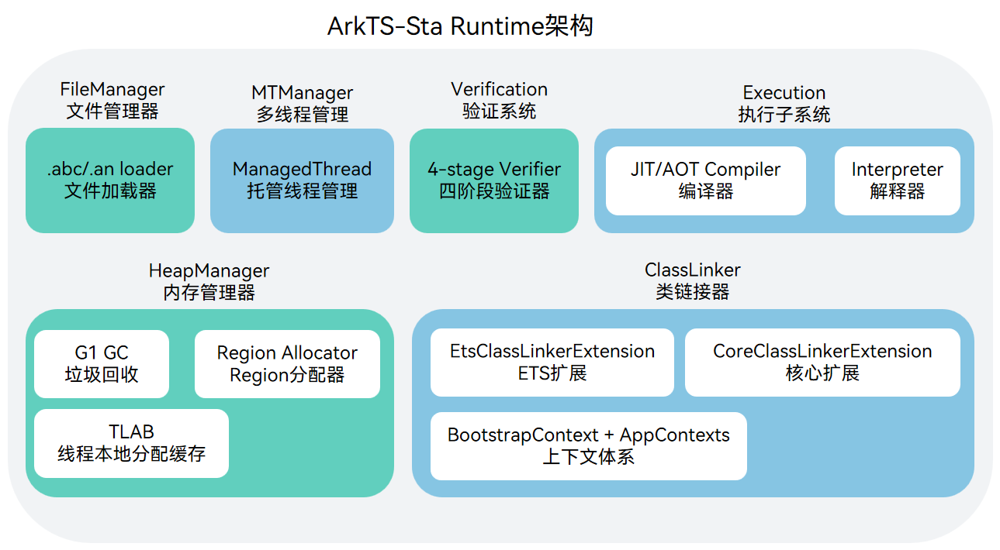
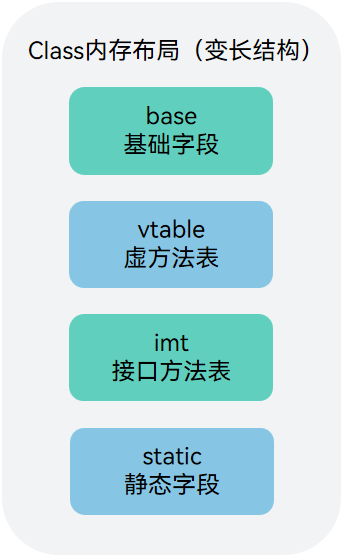
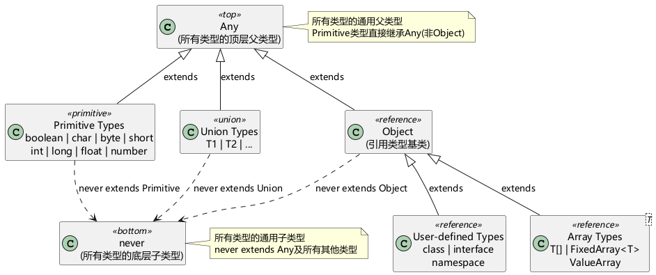

# ArkTS运行时概述 (ArkTS-Sta)
<!--Kit: ArkTS-->
<!--Subsystem: RuntimeCore-->
<!--Owner: @lijin1039-->
<!--Designer: @lijin1039-->
<!--Tester: @kirl75; @zsw_zhushiwei-->
<!--Adviser: @HelloCrease-->

静态ArkTS运行时是OpenHarmony上面向ArkTS-Sta（强静态类型）语言的运行时系统。ArkTS-Sta运行时基于共享内存模型，支持真正的多线程并行执行，并提供G1分代垃圾回收器、完整的类型系统反射能力、以及基于Region的内存管理机制。

## 运行时架构

静态ArkTS运行时由以下核心子系统组成：

- **Core Subsystem**：基础运行库，包含承载字节码的File组件（PANDA格式.abc文件）、支持Debugger的Tooling组件、以及负责适配系统调用的Base库组件。

- **Execution Subsystem**：包含执行方舟字节码的解释器、快速路径内联缓存、以及[文件模块化管理运行](arkts-sta-module-principle.md)。

- **Compiler Subsystem**：包含Stub编译器、基于IR的编译优化框架、[AOT静态编译器](static-arkts-aot-overview.md)以及JIT动态编译器。

- **Runtime Subsystem**：包含以下ArkTS-Sta运行相关模块。

  - 内存管理：基于Region的对象分配器与[G1垃圾回收器](arkts-sta-gc-introduction.md)，支持分代收集、并发标记、混合回收。

  - 类链接器：负责类加载、验证、链接和初始化，支持ETS语言扩展。

  - 反射系统：提供Class.from\<T\>()、instanceof、动态代理等运行时类型查询能力。

  - 并发管理：基于共享内存模型的[并发调度](arkts-sta-concurrency-overview.md)，支持TaskPool和EAWorker。

  - 错误处理：完整的ETS Error层级体系，描述符驱动的异常机制。

  - 标准库：ArkTS-Sta定义的标准库（etsstdlib）。

  - 其他：包括ANI（Ark Native Interface）跨语言调用接口等功能。
  
## 运行时结构

ArkTS-Sta运行时以Runtime单例为核心，围绕Class数据结构构建类型体系和类链接机制。

### Runtime单例

运行时以`Runtime`类为全局单例，管理所有子系统，包括文件管理器、多线程管理、验证系统，执行子系统、内存管理器（G1 GC、Region分配器和TLAB）以及ClassLinker（类链接器及其ETS/Core扩展与上下文体系）。

### Class结构

`Class`是运行时最核心的数据结构。所有类型（包括原始类型、数组、接口）在运行时都以`Class`实例表示。`Class`是变长结构，内联存储vtable、IMT和静态字段。

### ClassRoot枚举

运行时通过`ClassRoot`枚举预定义所有基础类型，在Runtime初始化时创建：

| ClassRoot类别 | 包含类型 |
| -------- | -------- |
| Primitive | U1, I8, U8, I16, U16, I32, U32, I64, U64, F32, F64 |
| Special | ANY, NEVER, TAGGED |
| Object | OBJECT_BASE, STRING |
| Array | 每种原始类型 + Object + String 对应的数组类 |
| Foreign | 外部文件引用的基础类 |

### 类型层级

ArkTS-Sta运行时定义了以`Any`为顶层父类型、`never`为底层子类型的类型层级体系。Primitive类型（boolean、char、byte等）直接继承Any而非Object，引用类型（Object、Array、用户自定义类型）继承Object，Union类型同样继承Any。

