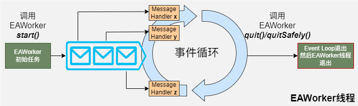

# EAWorker简介
<!--Kit: ArkTS-->
<!--Subsystem: Utils-->
<!--Owner: @MofengMa-->
<!--Designer: @MofengMa-->
<!--Tester: @zsw_zhushiwei-->
<!--Adviser: @ge-yafang-->

EAWorker主要作用是为应用程序提供一个多线程的运行环境，可满足应用程序在执行过程中与宿主线程分离，在后台线程中运行一个脚本进行耗时操作，有效避免类似于计算密集型或高延迟的任务阻塞宿主线程的运行。

ArkTS-Dyn运行时采用单线程架构，其并发模型基于Worker API构建。该API继承自W3C的Web Worker标准，原本主要适用于Web场景，核心是将线程划分为宿主线程与Worker线程两种角色。随着ArkTS-Sta引入共享并发特性，原有Worker API的局限性逐渐显现 —— 其基于Web场景设计的线程角色划分，在多线程环境下会增加开发者的理解难度和使用门槛。为此，ArkTS-Sta推出了全新的并发API：EAWorker。EAWorker是"Exclusive ArkTS Worker"的缩写，顾名思义，它在多线程环境中依然保持线程独占性，与传统Worker一样隐式绑定事件循环以处理异步任务。但相比之下，EAWorker有两处关键改进：

1. 统一线程语义：取消了宿主线程与Worker线程的角色区分，所有线程通过一致的语义交互，简化了多线程编程模型。
2. 贴近传统线程的生命周期管理：借鉴C++或Java中Thread的设计思路，提供更符合开发者直觉的生命周期控制方式，让线程管理更直观易用。

这一升级使ArkTS在支持共享并发的同时，大幅降低了多线程编程的理解与使用成本。


## EAWorker运作机制

**图1** EAWorker运作机制示意图



创建EAWorker的线程称为宿主线程（不一定是主线程，工作线程也支持创建EAWorker子线程），EAWorker自身的线程称为EAWorker子线程（或Actor线程、工作线程）。与Worker API不同，EAWorker API中宿主线程和EAWorker子线程的API接口没有区别。所有EAWorker线程共享一个运行时实例，包括基础设施、对象和代码段。创建每个EAWorker的开销包括EAWorker对象的创建和线程资源的创建。当创建支持互操作的EAWorker线程时，会创建一个全新的独立ArkTS-Dyn运行时，该运行时不包含任何宿主线程中的ArkTS-Dyn对象。EAWorker线程之间的通信基于消息传递。

## 跨线程传输
### 隐式传输
隐式传输是指变量跨线程直接访问，分以下几种情况：
- ArkTS-Sta对象：共享读写
  ```ts
  // ArkTS-Sta
  class A {
    n: number = 1
  }

  let capturedVar = new A(); // ArkTS-Sta对象
  const workerInstance = new EAWorker("example eaworker", () => {
    ++capturedVar.n; // OK. 宿主线程和EAWorker线程指向同一个对象
  });
  workerInstance.start();
  ```

- ArkTS-Dyn Sendable对象（interop场景）：共享读写
  ```ts
  // ArkTS-Dyn
  @Sendable
  class A {
    n: number = 1
  }

  // ArkTS-Sta
  import { A } from "1.1"

  class B {
    a: A = new A()
  }

  let capturedVar1 = new A(); // ArkTS-Dyn Sendable对象
  let capturedVar2 = new B(); // ArkTS-Sta持有的ArkTS-Dyn Sendable对象
  const workerInstance = new EAWorker("example eaworker", () => {
    ++capturedVar1.n;   // OK. 宿主线程和EAWorker线程指向同一个对象
    ++capturedVar2.a.n; // OK. 宿主线程和EAWorker线程指向同一个对象
  });
  workerInstance.start();
  ```

- ArkTS-Dyn非Sendable对象（interop场景）：触发运行时错误（RTE）
  ```ts
  // ArkTS-Dyn
  class A {
    n: number = 1
  }

  // ArkTS-Sta
  import { A } from "1.1"

  class B {
    a: A = new A()
  }

  let capturedVar1 = new A(); // ArkTS-Dyn非Sendable对象
  let capturedVar2 = new B(); // ArkTS-Sta持有的ArkTS-Dyn非Sendable对象
  const workerInstance = new EAWorker("example eaworker", () => {
    ++capturedVar1.n;   // RTE
    ++capturedVar2.a.n; // RTE
  });
  workerInstance.start();
  ```

### 显式传输
显式传输是指变量跨线程通过显式API传递，分以下几种情况：
- ArkTS-Sta对象：共享读写
  ```ts
  // ArkTS-Sta
  class A {
    n: number = 1
  }

  const workerInstance = new EAWorker("example worker");
  workerInstance.start();

  const workerCB = (msg: concurrency.Message) => {
    let a: A = msg.getObject() as A;
    ++a.n; // OK. 宿主线程和EAWorker线程指向同一个对象
  }
  let workerHandler = new concurrency.MessageHandler(workerCB, workerInstance);

  let data = new A(); // ArkTS-Sta对象
  let workerMessage = new concurrency.Message(1, data, workerHandler);
  workerMessage.sendToTarget();
  ```

- ArkTS-Dyn Sendable对象（interop场景）：共享读写
  ```ts
  // ArkTS-Dyn
  @Sendable
  class A {
    n: number = 1
  }

  // ArkTS-Sta
  import { A } from "1.1"

  class B {
    a: A
  }

  const workerInstance = new EAWorker("example worker");
  workerInstance.start();

  const workerCB = (msg: concurrency.Message) => {
    if (msg.getWhat() == 1) {
      let a: A = msg.getObject() as A;
      ++a.n; // OK. 宿主线程和EAWorker线程指向同一个对象
    } else if (msg.getWhat() == 2) {
      let b: B = msg.getObject() as B;
      ++b.a.n; // OK. 宿主线程和EAWorker线程指向同一个对象
    }
  }
  let workerHandler = new concurrency.MessageHandler(workerCB, workerInstance);

  // ArkTS-Dyn Sendable对象
  let data1 = new A();
  let msg1 = new concurrency.Message(1, data1, workerHandler);
  msg1.sendToTarget();

  // ArkTS-Sta持有的ArkTS-Dyn Sendable对象
  let data2 = new B();
  let msg2 = new concurrency.Message(2, data2, workerHandler);
  msg2.sendToTarget();
  ```

- ArkTS-Dyn非Sendable对象（interop场景）：序列化反序列化
  ```ts
  // ArkTS-Dyn
  class A {
    n: number = 1
  }
  
  // ArkTS-Sta
  import { A } from "1.1"
  
  class B {
    a: A
  }
  
  const workerInstance = new EAWorker("example worker");
  workerInstance.start();
  
  const workerCB = (msg: concurrency.Message) => {
    if (msg.getWhat() == 1) {
      let a: A = msg.getObject() as A;
      ++a.n;   // OK. 宿主线程和EAWorker线程指向不同对象
    } else if (msg.getWhat() == 2) {
      let b: B = msg.getObject() as B;
      ++b.a.n; // RTE
    }
  }
  let workerHandler = new concurrency.MessageHandler(workerCB, workerInstance);
  
  // ArkTS-Dyn非Sendable对象：触发序列化反序列化
  let data1 = new A();
  let msg1 = new concurrency.Message(1, data1, workerHandler);
  msg1.sendToTarget();
  
  // ArkTS-Sta持有的ArkTS-Dyn非Sendable对象：使用持有的ArkTS-Dyn非Sendable对象时RTE
  let data2 = new B();
  let msg2 = new concurrency.Message(2, data2, workerHandler);
  msg2.sendToTarget();
  ```

## EAWorker注意事项
- 创建EAWorker后，需手动管理其生命周期，且同时运行的EAWorker线程数量最多为64个。
- 消息传递的过程默认使用ArkTS-Sta的引用传递机制，不涉及序列化。
- 由于不同线程共享上下文对象，因此EAWorker线程只能使用线程安全的库，例如，不能使用UI相关的非线程安全库。
- EAWorker线程优先级通过`setPriority`和`getPriority`接口设置。
- EAWorker是ArkTS侧创建运行时线程的API；从C++侧，开发者可以通过使用ANI的AttachCurrentThread接口将一个C++线程注册到运行时中，从而调用其他ANI接口。

### 创建EAWorker的注意事项
- EAWorker构造函数中传入的任务回调是一个lambda对象，不再需要像Worker API那样指定线程文件的路径。
- EAWorker API的使用无需依赖DevEco Studio的支持，因此DevEco Studio中所提供的Worker相关功能支持，实际针对的是ArkTS-Dyn版本的Worker API，与EAWorker API并无直接关联。 
- 创建EAWorker实例时，可以通过`enableInterop`参数指定是否支持与ArkTS-Dyn代码互操作，默认为关闭。如果`enableInterop`为真，EAWorker初始化时会创建一个与EAWorker线程关联的ArkTS-Dyn上下文，其互操作规格与主线程一致。
- 创建支持互操作的EAWorker会带来一定的内存和性能开销，因此应尽量减少使用支持互操作的EAWorker。

### 生命周期注意事项

EAWorker的创建和销毁耗费性能，建议开发者合理管理已创建的EAWorker并重复使用。EAWorker空闲时也会一直运行，因此当不需要EAWorker时，可以调用[quit()](../reference/apis-arkts/eaworker_managed.md#quit)接口方法主动销毁EAWorker。调用`quit()`后，EAWorker会在处理完消息队列中的剩余任务后才退出。若EAWorker处于已销毁或正在销毁等非运行状态时，调用其功能接口，会抛出相应的错误。

## EAWorker基本用法示例

1. 在宿主线程中通过调用EAWorker的[constructor()](../reference/apis-arkts/eaworker_managed.md#constructor)方法创建EAWorker对象，当前线程为宿主线程，并注册回调函数。

    ```ts
    // Index.ets
    @Entry
    @Component
    struct Index {
      @State message: string = 'Hello World';
    
      build() {
        RelativeContainer() {
          Text(this.message)
            .id('HelloWorld')
            .fontSize(50)
            .fontWeight(FontWeight.Bold)
            .alignRules({
              center: { anchor: '__container__', align: VerticalAlign.Center },
              middle: { anchor: '__container__', align: HorizontalAlign.Center }
            })
            .onClick(() => {
              const currentworker = EAWorker.current()
              // 创建EAWorker对象并调用start()方法启动
              const workerInstance = new EAWorker("example eaworker");
              workerInstance.start();
    
              // 注册宿主线程MessageHandler回调，当宿主线程接收到来自其创建的EAWorker发送的消息时被调用，在宿主线程执行
              const currentCB = (msg: concurrency.Message) => {
                let data: string = msg.getObject() as string;
                console.info("workerInstance onmessage is: ", data);
              }
              let currentHandler = new concurrency.MessageHandler(currentCB, currentworker);
    
              // 注册异常处理回调，可以捕获EAWorker线程中未处理的全局异常，在宿主线程执行
              workerInstance.setUncaughtExceptionHandler((err: Error) => {
                console.info("workerInstance onAllErrors message is: " + err.message);
              })
    
              // 注册EAWorker线程MessageHandler回调，当EAWorker线程收到来自其宿主线程发送的消息时被调用，在EAWorker线程执行
              const workerCB = (msg: concurrency.Message) => {
                let data: string = msg.getObject() as string;
                console.info('workerPort onmessage is: ', data);
    
                // 向主线程发送消息
                let dataToSend: string = "2"
                let msg2 = new concurrency.Message(1, dataToSend, currentHandler);
                msg2.sendToTarget();
              }
              let workerHandler = new concurrency.MessageHandler(workerCB, workerInstance);
    
              let data: string = "1"
              let msg1 = new concurrency.Message(1, data,  workerHandler);
              msg1.sendToTarget();
    
              // 退出EAWorker
              workerInstance.quit();
              console.info("workerInstance quit successfully");
            })
        }
        .height('100%')
        .width('100%')
      }
    }
    ```

2. 创建一个新的C++线程，使用ANI的`AttachCurrentThread`接口将线程注册到运行时中，然后调用ANI的方法执行ArkTS代码。

    ```c++
    ani_vm *GetEtsVm()
    {
        ani_vm *etsVM;
        ani_size vmCount;
        [[maybe_unused]] ets_int res = ANI_GetCreatedVMs(&etsVM, 1, &vmCount);
        assert(res == ETS_OK);
        assert(vmCount == 1);
        return etsVM;
    }

    void callStaticMethodExample()
    {
        ani_vm *etsVM = GetEtsVm();

        auto t = std::thread([etsVM] {
            ani_env *etsEnv {nullptr};
            ani_option interopEnabled {"--interop=disable", nullptr};
            ani_options aniArgs {1, &interopEnabled};
            etsVM->AttachCurrentThread(&aniArgs, ANI_VERSION_1, &etsEnv);
            assert(etsEnv != nullptr);

            ani_class cls;
            [[maybe_unused]] ani_status status = etsEnv->FindClass("Lattach_example/SomeClass;", &cls);
            assert(status == ETS_OK);
            ani_static_method method;
            status = etsEnv->Class_FindStaticMethod(cls, "callEtsFunctionTest", nullptr, &method);
            assert(status == ETS_OK);
            ani_int val;
            etsEnv->Class_CallStaticMethod_Int(etsEnv, cls, method, &val);
            assert(val == 0);

            etsVM->DetachCurrentThread();
        });

        t.join();
    }
    ```

    ```ts
    // attach_example.ets
    class SomeClass {
        static callEtsFunctionTest(): int {
            console.info("callEtsFunctionTest");
            return 0;
        }
    }
    ```
