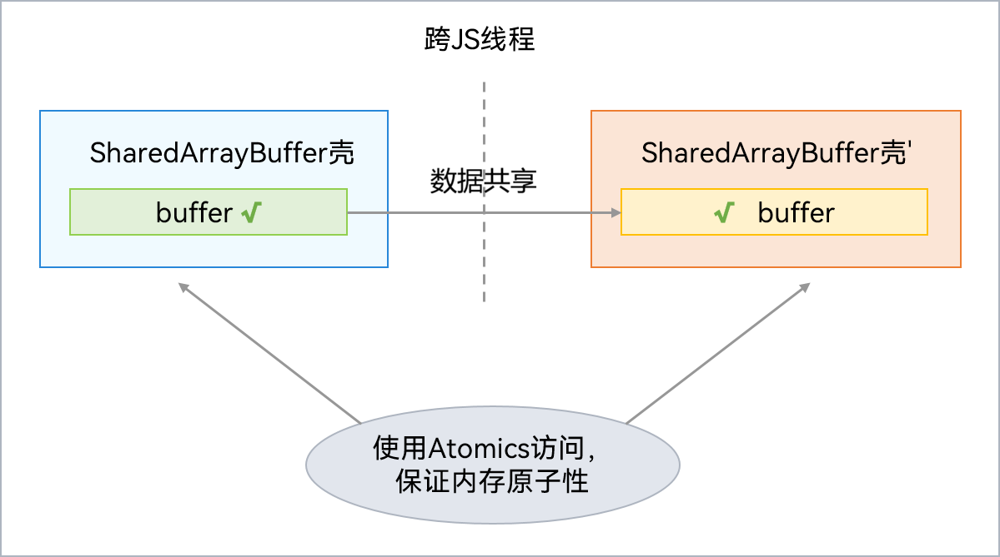

# SharedArrayBuffer对象
<!--Kit: ArkTS-->
<!--Subsystem: CommonLibrary-->
<!--Owner: @wang_zhaoyong-->
<!--Designer: @weng-changcheng-->
<!--Tester: @kirl75; @zsw_zhushiwei-->
<!--Adviser: @ge-yafang-->

SharedArrayBuffer内部包含一块Native内存，其JS对象壳被分配在虚拟机本地堆（LocalHeap）。支持跨并发实例间共享Native内存，但是对共享Native内存的访问及修改需要采用Atomics类，防止数据竞争。SharedArrayBuffer可用于多个并发实例间的状态或数据共享。通信过程如下图所示：

## 使用示例

使用TaskPool传递Int32Array对象，实现如下：

<!-- @[example_pass_obj](https://gitcode.com/openharmony/applications_app_samples/blob/master/code/DocsSample/ArkTS/ArkTsConcurrent/ConcurrentThreadCommunication/InterThreadCommunicationObjects/CommunicationObjects/entry/src/main/ets/managers/SharedArrayBufferObject.ets) -->

<!-- @[example_pass_obj](https://gitcode.com/openharmony/applications_app_samples/blob/master/code/DocsSample/ArkTS/ArkTsConcurrent/ConcurrentThreadCommunication/InterThreadCommunicationObjects/CommunicationObjects/entry/src/main/ets/managers/SharedArrayBufferObject.ets) -->
