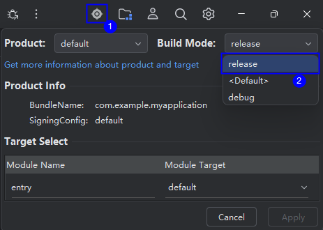
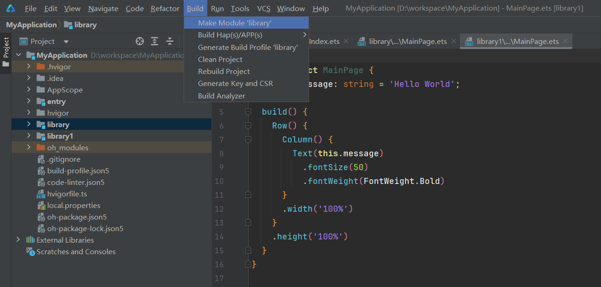
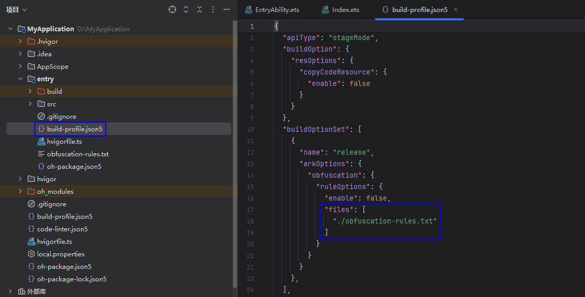
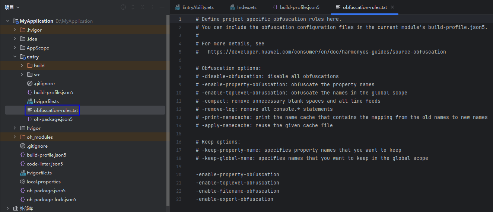
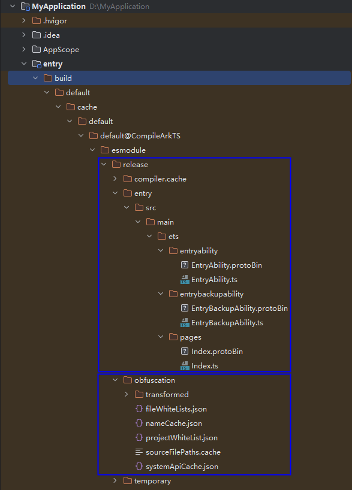

# ArkGuard混淆实践指导 
<!--Kit: ArkTS-->
<!--Subsystem: ArkCompiler-->
<!--Owner: @doubleGuan-->
<!--Designer: @wangwenbo551-->
<!--Tester: @yan_panda-->
<!--Adviser: @k1ngqaquuu-->

## 概述

源码混淆技术可以增加代码的复杂性和模糊性，从而提高攻击者分析代码的难度。源码混淆有以下几个方面的作用：

1.  保护知识产权：源码混淆防止他人轻易复制和窃取软件代码，增加逆向工程难度。
2.  防止逆向工程：逆向工程是分析软件以了解其工作原理和实现细节的过程。源码混淆可增加逆向工程的难度，保护应用程序免受恶意修改或破坏。
3.  提高安全性：源码混淆减少漏洞和安全风险，增加攻击者利用漏洞的难度。
4.  降低反盗版和欺诈风险：源码混淆可增加攻击者破解软件许可验证系统或修改代码绕过付费机制的难度，从而减少盗版和欺诈。

源码混淆针对工程源码进行混淆，提高破解难度，缩短类和成员名称，减小应用大小。

## 混淆开启

从API version 10开始，支持源码混淆功能。开启混淆需要满足以下条件：工程为Stage模型、在Release编译模式下、在模块的`build-profile.json5`文件中开启混淆配置。详细的开启步骤和配置方法请参考[ArkGuard混淆开启指南](source-obfuscation-guide.md)。

> **注意：**  
> `enable`默认为false，默认不开启源码混淆功能（在DevEco Studio 5.0.3.600之前，新建工程默认开启源码混淆）。

如果工程或模块是Static Library，则该工程或模块是一个HAR。

构建[字节码HAR](https://developer.huawei.com/consumer/cn/doc/harmonyos-guides/ide-hvigor-build-har#section16598338112415)时的混淆行为如下：

1.  以Debug模式构建HAR，会直接打包源码，不进行源码混淆。
2.  以Release模式构建HAR，会编译、混淆并压缩代码。
3.  构建字节码格式的HAR。开启混淆时，编译器会先对源码中间文件进行混淆，再生成abc字节码。

针对不同包类型的混淆建议，请参考[不同包类型的源码混淆建议](source-obfuscation-practice.md)。

### 编译操作步骤

满足开启混淆的条件后，选择目标模块，点击Build -\> Make Module开始编译。

使用Release模式构建HAR的步骤如下：  
**图 1**  DevEco Studio选择release编译模式  

**图 2**  DevEco Studio指定模块编译  

## 混淆配置能力

### 编译选项

若按照上述编译流程开启源码混淆，在API 12之前的版本，默认仅混淆参数名和局部变量名。从API 12版本起，默认启用四项推荐的混淆选项：`-enable-property-obfuscation`、`-enable-toplevel-obfuscation`、`-enable-filename-obfuscation`和`-enable-export-obfuscation`。开发者可以根据需要进一步修改混淆配置。

如果在流水线开启混淆并使用release构建模式，在编译参数加上`-p buildMode=release`和`-p debuggable=false`。

### 混淆配置

如下图所示，可在每个模块下的`build-profile.json5`文件中配置是否开启混淆以及对应的混淆配置文件。

**图 3**  编译配置文件  

新建工程时，每个模块下都有`obfuscation-rules.txt`文件，用于配置混淆。

**图 4**  混淆配置文件  

在上图中，`obfuscation-rules.txt`文件中添加了`-enable-property-obfuscation`和`-enable-toplevel-obfuscation`开关，表示已启用属性混淆和顶层作用域名称混淆。

DevEco Studio混淆选项及功能描述如下：

**表 1** 混淆选项

| 选项 | 功能 |
| --- | --- |
| -disable-obfuscation | 关闭混淆 |
| -enable-property-obfuscation | 开启属性名称混淆 |
| -enable-string-property-obfuscation | 开启字符串属性名称混淆 |
| -enable-toplevel-obfuscation | 开启顶层作用域名称混淆 |
| -enable-export-obfuscation | 开启导入导出名称混淆 |
| -enable-filename-obfuscation | 开启文件名混淆 |
| -compact | 代码压缩 |
| -remove-comments | 声明文件注释删除 |
| -remove-log | 删除console.*语句 |
| -print-namecache | 名称缓存输出 |
| -apply-namecache | 名称缓存复用 |
| -print-kept-names | 输出未混淆名单 |
| -extra-options strip-language-default | 缩减语言预置白名单 |
| -extra-options strip-system-api-args | 缩减系统预置白名单 |
| -extra-options strip-not-compiled-module-name | 不保留未参与编译模块名称 |
| -keep-parameter-names | 保留声明文件参数 |
| -enable-lib-obfuscation-options | 合并依赖模块选项 |
| -use-keep-in-source | 通过注释在源码中标记白名单 |
| -keep-object-props | 保留对象字面量属性名称 |
| -remove-nosideeffects-calls | 删除指定的方法调用语句 |

**表 2** 保留选项

| 选项 | 功能 |
| --- | --- |
| -keep-property-name | 指定保留属性名称 |
| -keep-global-name | 指定保留顶层作用域或导入导出元素名称 |
| -keep-file-name | 指定保留文件/文件夹名称 |
| -keep-comments | 指定保留注释 |
| -keep-dts | 指定保留声明文件中的所有名称 |
| -keep | 指定保留源码文件中的所有名称 |
| -keep-uncompact | 在代码压缩时排除指定路径的文件 |

> **说明：**
> 名称类和路径类的保留选项支持通配符，详细用法请参考[保留选项支持的通配符](source-obfuscation-keep-options.md#保留选项支持的通配符)。

混淆选项的详细用法及代码示例可以参考[混淆配置选项](source-obfuscation-rule-options.md)和[混淆保留选项](source-obfuscation-keep-options.md)。

**混淆优化建议**

开发者混淆工程时，发现缓存文件或SDK中的文件中存在大量未混淆的源码名称。原因包括以下两类：

* 混淆选项开启较少；开启`-enable-property-obfuscation`、`-enable-toplevel-obfuscation`、`-enable-export-obfuscation`、`-enable-filename-obfuscation`选项。
* 源码名称与系统白名单、语言白名单重名；添加后缀避开白名单。

### 混淆规则合并策略

在编译一个模块时，生效的混淆规则是当前编译模块混淆规则和依赖模块混淆规则的合并结果。具体规则请参考：[混淆规则合并策略](source-obfuscation.md#混淆规则合并策略)。

## 查看混淆结果

开发者可以在编译模块的build目录中找到编译和混淆生成的缓存文件、名称映射表及系统API白名单文件。

* 源码编译及混淆缓存文件目录：build/\[…\]/release/模块名
* 混淆名称映射表及系统API白名单目录：build/\[…\]/release/obfuscation

  * 名称映射表文件：`nameCache.json`，记录源码名称映射。
  * 系统API白名单文件：`systemApiCache.json`，记录SDK接口与属性名称。

    **图 5**  DevEco Studio编译产物与缓存文件  
    

## 调试

代码经过混淆工具处理后，名称会发生更改，这可能导致运行时崩溃堆栈日志难以理解，因为堆栈与源代码不完全一致。如果未保留调试信息，行号及名称更改将导致无法准确定位问题。此外，启用`-enable-property-obfuscation`、`-enable-toplevel-obfuscation`等选项后，源码混淆可能会引发运行时崩溃或功能性错误。开发者需要还原报错堆栈，排查并配置白名单以确保功能正常。

### 函数调用栈还原

经过混淆的应用程序中代码名称会发生更改，因此报错栈与源码不完全一致，crash时打印的报错栈会难以理解，如何处理请参考[报错栈还原](source-obfuscation-guide.md#报错栈还原)。

### 反混淆工具hstack

hstack需要将Node.js配置到环境变量中，详细使用说明请参考[堆栈解析工具（hstack）](https://developer.huawei.com/consumer/cn/doc/harmonyos-guides/ide-command-line-hstack)。

### 常见报错案例

请参考[ArkGuard混淆常见问题](source-obfuscation-questions.md)。

## 使用第三方加固

在HarmonyOS提供的源码混淆能力之外，开发者还可以使用第三方安全厂商提供的高级混淆和加固能力。多家安全加固厂商已经启动了HarmonyOS开发，开发者可以根据需求选择这些安全厂商的服务。开发者需要与第三方安全厂商自行沟通合作方式和范围，本文档不做详细说明。具体的官方与第三方源码混淆能力的关系如下：

由于HarmonyOS代码签名、应用加密等安全机制的限制，以及应用市场上架审核的纯净安全要求，三方加固厂商提供的安全加固内容必须满足以下六点要求：

1. 不允许隐藏敏感系统API的调用，审核人员必须能够清晰地看到应用的特性。

2. 不允许混淆非自研的SDK。SDK应由SDK厂商自行进行混淆保护。如果非自研SDK被混淆，将会影响应用市场审核相关SDK的指纹信息。

3. 通过第三方安全加固的应用程序，必须确保不包含恶意行为，以免对生态系统造成影响。此要求为约束性条款，不遵守可能导致应用被下架。

4. 不允许使用第三方虚拟机，HarmonyOS系统通过代码签名等机制限制动态加载代码，这可能导致应用无法正常运行。

5. 不允许对方舟字节码文件进行篡改，此方法可能让应用无法正常运行，以及影响应用市场对应用的纯净安全进行审核。

6. 不允许对系统库使用hook技术，此方法影响应用市场对应用的纯净安全进行审核。

## 示例代码

-   [应用安全示例代码](https://gitcode.com/HarmonyOS_Samples/BestPracticeSnippets/tree/master/Privacy)

