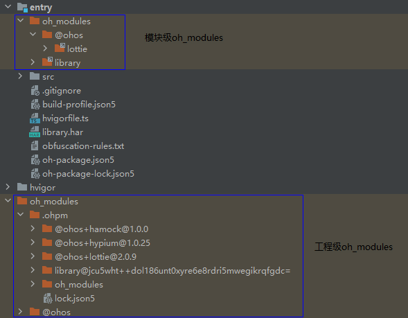

# ArkGuard混淆保留选项
<!--Kit: ArkTS-->
<!--Subsystem: ArkCompiler-->
<!--Owner: @oatuwwutao-->
<!--Designer: @oatuwwutao-->
<!--Tester: @kirl75; @zsw_zhushiwei-->
<!--Adviser: @HelloCrease-->

从API version 10开始，开启混淆后代码中的方法、属性或路径将被混淆。但在运行时，如果访问是未被混淆的原始方法、属性或路径，可能会导致功能失效。因此需要根据不同的场景配置相应的保留选项。

排查场景和配置字段时，推荐使用[混淆助手配置保留选项](https://developer.huawei.com/consumer/cn/doc/harmonyos-guides/ide-build-obfuscation#section19439175917123)，快速识别需要配置的保留选项和白名单字段。

## 保留选项汇总

| 功能 | 选项 | 起始API版本 |
| --- | --- | --- |
| 指定保留属性名称 | [`-keep-property-name`](#-keep-property-name) | 10 |
| 指定保留顶层作用域或导入导出元素名称 | [`-keep-global-name`](#-keep-global-name) | 10 |
| 指定保留文件/文件夹名称 | [`-keep-file-name`](#-keep-file-name) | 10 |
| 指定保留注释 | [`-keep-comments`](#-keep-comments) | 12 |
| 指定保留声明文件中的所有名称 | [`-keep-dts`](#-keep-dts) | 12 |
| 指定保留源码文件中的所有名称 | [`-keep`](#-keep) | 12 |
| 名称类和路径类的保留选项支持通配符 | [`保留选项支持的通配符`](#保留选项支持的通配符)  | 12 |
| 在代码压缩时排除指定路径的文件 | [`-keep-uncompact`](#-keep-uncompact) | 26.0.0 |

## -keep-property-name

指定想保留的属性名，支持使用[名称类通配符](#名称类通配符)。按如下方式进行配置，表示保留名称为`firstName`和`lastName`的属性：

```txt
-keep-property-name
firstName
lastName
```

**使用该选项时，需要注意以下事项：**

1. 该选项在开启[-enable-property-obfuscation](./source-obfuscation-rule-options.md#-enable-property-obfuscation)时生效。
2. 属性白名单作用于全局。即代码中出现多个重名属性，只要与`-keep-property-name`配置白名单名称相同，均不会被混淆。

**需要手动配置白名单的属性名：**

1. 如果代码中通过字符串拼接、变量访问或使用defineProperty方法定义对象属性，则这些属性名应被保留。

    <!-- @[jsOptionExample_keepPropertyName](https://gitcode.com/openharmony/applications_app_samples/blob/OpenHarmony_feature_sta_20260331/code/DocsSample/ArkTS/ArkTSCompilationToolchain/ArkGuardForSourceCodeObfuscation/ArkGuardObfuscationAbility/entry/src/main/ets/arkguardability/ArkGuardAbility.js) -->   
    
    ``` JavaScript
    // ArkGuardAbility.js
    var obj = {x0: '0', x1: '1', x2: '2'};
    for (var i = 0; i <= 2; i++) {
        console.info(obj['x' + i]); // x0, x1, x2应该被保留
    }
    
    Object.defineProperty(obj, 'y', {}); // y应该被保留
    Object.getOwnPropertyDescriptor(obj, 'y'); // y应该被保留
    console.info(obj.y);
    
    obj.s1 = 'a';
    let key = 's1';
    console.info(obj[key]); // key对应的变量值s1应该被保留
    
    obj.t1 = 'b';
    console.info(obj['t' + '1']); // t1应该被保留
    ```

   对于如下的字符串常量形式的属性调用，可以选择性保留：

    <!-- @[optionExample_keepPropertyName1](https://gitcode.com/openharmony/applications_app_samples/blob/master/code/DocsSample/ArkTS/ArkTSCompilationToolchain/ArkGuardForSourceCodeObfuscation/ArkGuardObfuscationAbility/entry/src/main/ets/arkguardability/ArkGuardAbility.ts) -->      
    
    ``` TypeScript
    // 混淆配置：
    // -enable-property-obfuscation
    // -enable-string-property-obfuscation
    
    // ArkGuardAbility.ts
    var obj2 = {t:'1', m:'2'};
    obj2.t = 'a';
    console.info(obj2['t']); // 此时，'t'会被正确混淆，t可以选择性保留
    
    obj2['m'] = 'b';
    console.info(obj2['m']); // 此时，'m'会被正确混淆，m可以选择性保留
    ```

  2. 对于间接或直接导出的类或对象的属性名的场景，如果混淆后出现问题，可以使用[-keep-property-name](#-keep-property-name)来保留这些属性名。

      <!-- @[optionExample_keepPropertyName2](https://gitcode.com/openharmony/applications_app_samples/blob/master/code/DocsSample/ArkTS/ArkTSCompilationToolchain/ArkGuardForSourceCodeObfuscation/ArkGuardObfuscationAbility/entry/src/main/ets/arkguardability/ArkGuardAbility.ts) -->    
      
      ``` TypeScript
      // 间接导出MyClass07
      class MyClass07 {
        greet() {}
      }
      let alias = new MyClass07();
      export { alias };
      
      // 直接导出MyClass08
      export class MyClass08 {
        exampleName: 'jack'
        exampleAge: 100
      }
      ```

3. 在ArkTS/TS/JS文件中使用so库的API（如示例中的addNum）时，需手动保留API名称。

    <!-- @[dtsOptionExample_keepPropertyName](https://gitcode.com/openharmony/applications_app_samples/blob/master/code/DocsSample/ArkTS/ArkTSCompilationToolchain/ArkGuardForSourceCodeObfuscation/ArkGuardObfuscationAbility/entry/src/main/cpp/types/libentry/Index.d.ts) -->         
    
    ``` TypeScript
    // src/main/cpp/types/libentry/Index.d.ts
    export const addNum: (a: number, b: number) => number;
    ```

    <!-- @[etsOptionExample_keepPropertyName1](https://gitcode.com/openharmony/applications_app_samples/blob/master/code/DocsSample/ArkTS/ArkTSCompilationToolchain/ArkGuardForSourceCodeObfuscation/ArkGuardObfuscationAbility/entry/src/main/ets/arkguardability/ArkGuardAbility.ets) -->        
    
    ``` TypeScript
    // ArkGuardAbility.ets
    import testNapi from 'libentry.so';
    // ...
    testNapi.addNum(2, 3); // addNum需要保留，示例如：-keep-property-name addNum
    ```

4. JSON数据解析和对象序列化时，需要保留使用到的字段。

    ```json
    {
      "jsonProperty": "value",
      "otherProperty": "value2"
    }
    ```

    <!-- @[optionExample_keepPropertyName3](https://gitcode.com/openharmony/applications_app_samples/blob/master/code/DocsSample/ArkTS/ArkTSCompilationToolchain/ArkGuardForSourceCodeObfuscation/ArkGuardObfuscationAbility/entry/src/main/ets/arkguardability/ArkGuardAbility.ts) -->     
    
    ``` TypeScript
    import jsonData from './ImportJson.json';
    // ...
    let jsonProp = jsonData.jsonProperty; // jsonProperty应该被保留
    
    class jsonTest {
      prop1: string = '';
      prop2: number = 0
    }
    
    let obj = new jsonTest();
    const jsonStr = JSON.stringify(obj); // prop1 和 prop2 会被混淆，应该被保留
    ```

5. 使用到的数据库相关的字段，需要手动保留。例如，数据库键值对类型（ValuesBucket）中的属性：

    <!-- @[optionExample_keepPropertyName4](https://gitcode.com/openharmony/applications_app_samples/blob/master/code/DocsSample/ArkTS/ArkTSCompilationToolchain/ArkGuardForSourceCodeObfuscation/ArkGuardObfuscationAbility/entry/src/main/ets/arkguardability/ArkGuardAbility.ts) -->      
    
    ``` TypeScript
    import { ValuesBucket } from '@kit.ArkData';
    // ...
    const valueBucket: ValuesBucket = {
      ID1: 'ID1', // ID1应该被保留
      NAME1: 'jack', // NAME1应该被保留
      AGE1: 20, // AGE1应该被保留
      SALARY1: 100 // SALARY1应该被保留
    }
    ```

6. 源码中自定义装饰器修饰了成员变量、成员方法、参数，同时其源码编译的中间产物为js文件时（如编译release源码HAR或者源码包含@ts-ignore、@ts-nocheck），这些装饰器所在的成员变量/成员方法名称需要被保留。这是由于ts高级语法特性转换为js标准语法时，将上述装饰器所在的成员变量/成员方法名称硬编码为字符串常量。


    <!-- @[optionExample_keepPropertyName5](https://gitcode.com/openharmony/applications_app_samples/blob/master/code/DocsSample/ArkTS/ArkTSCompilationToolchain/ArkGuardForSourceCodeObfuscation/ArkGuardObfuscationAbility/entry/src/main/ets/arkguardability/ArkGuardAbility.ts) -->      
    
    ``` TypeScript
    function CustomDecorator(target: Object, propertyKey: string) {}
    function MethodDecorator(target: Object, propertyKey: string, descriptor: PropertyDescriptor) {}
    function ParamDecorator(target: Object, propertyKey: string, parameterIndex: number) {}
    
    class A {
      // 1.成员变量装饰器
      @CustomDecorator
      propertyName1: string = ""   // propertyName1 需要被保留
      // 2.成员方法装饰器
      @MethodDecorator
      methodName1() {} // methodName1 需要被保留
      // 3.方法参数装饰器
      methodName2(@ParamDecorator param: string): void {} // methodName2 需要被保留
    }
    ```

7. 使用到的数据请求相关的字段需要手动保留，例如，传递给数据请求方的字段需要手动保留：

    <!-- @[etsOptionExample_keepPropertyName2](https://gitcode.com/openharmony/applications_app_samples/blob/master/code/DocsSample/ArkTS/ArkTSCompilationToolchain/ArkGuardForSourceCodeObfuscation/ArkGuardObfuscationAbility/entry/src/main/ets/arkguardability/ArkGuardAbility.ets) -->      
    
    ``` TypeScript
    // ArkGuardAbility.ets
    import { UIAbility } from '@kit.AbilityKit';
    import { http } from '@kit.NetworkKit';
    // ...
    export default class EntryAbility extends UIAbility {
      onForeground(): void {
        let httpRequest = http.createHttp();
        httpRequest.request('https://www.example/Login',
          {
            method: http.RequestMethod.POST,
            header: { 'Content-Type': 'application/json' },
            extraData: { usernameTest: 'test1', passwordTest: 'test2'}, // usernameTest 和 passwordTest 需要被保留
          })
      }
    }
    ```

8. 使用到的数字字面量属性需要手动保留。

    <!-- @[optionExample_keepPropertyName6](https://gitcode.com/openharmony/applications_app_samples/blob/master/code/DocsSample/ArkTS/ArkTSCompilationToolchain/ArkGuardForSourceCodeObfuscation/ArkGuardObfuscationAbility/entry/src/main/ets/arkguardability/ArkGuardAbility.ts) -->       
    
    ``` TypeScript
    class MyClass09 {
      123 = 'numeric-prop'; // 数字字面量属性
      [456] = 'computed'; // 计算属性中的数字
      method() {
        console.info(this[123]); // 123和456需要被保留
        console.info(this[456]);
      }
    }
    ```

## -keep-global-name

指定要保留的顶层作用域及导入和导出元素的名称，支持使用[名称类通配符](#名称类通配符)。配置方式如下：

```text
-keep-global-name
Person
printPersonName
```

`namespace`中导出的名称也可以通过`-keep-global-name`选项保留。

<!-- @[optionExample_keepGlobalName](https://gitcode.com/openharmony/applications_app_samples/blob/OpenHarmony_feature_sta_20260331/code/DocsSample/ArkTS/ArkTSCompilationToolchain/ArkGuardForSourceCodeObfuscation/ArkGuardObfuscationAbility/entry/src/main/ets/arkguardability/ArkGuardAbility.ts) -->      

``` TypeScript
// ArkGuardAbility.ts
export namespace Ns {
  export const myAge = 18 // -keep-global-name myAge 保留变量myAge
  export function myFunc() {} // -keep-global-name myFunc 保留函数myFunc
}
```

**使用该选项时，需要注意以下事项：**

1. 该选项在开启[-enable-toplevel-obfuscation](./source-obfuscation-rule-options.md#-enable-toplevel-obfuscation)或[-enable-export-obfuscation](./source-obfuscation-rule-options.md#-enable-export-obfuscation)时生效。
2. [-keep-global-name](#-keep-global-name)指定的白名单作用于全局。即代码中出现多个顶层作用域名称或者导出名称，只要与`-keep-global-name`配置的白名单名称相同，均不会被混淆。

**需要手动配置白名单的顶层作用域名称：**

当以命名导入的方式导入so库的API时，如果同时开启`-enable-toplevel-obfuscation`和`-enable-export-obfuscation`选项，需要手动保留API的名称。

<!-- @[dtsOptionExample_keepGlobalName](https://gitcode.com/openharmony/applications_app_samples/blob/OpenHarmony_feature_sta_20260331/code/DocsSample/ArkTS/ArkTSCompilationToolchain/ArkGuardForSourceCodeObfuscation/ArkGuardObfuscationAbility/entry/src/main/cpp/types/libentry/Index.d.ts) -->         

``` TypeScript
// src/main/cpp/types/libentry/Index.d.ts
declare function testNapi2(): void;
declare function testNapi3(): void;
```

<!-- @[etsOptionExample_keepGlobalName](https://gitcode.com/openharmony/applications_app_samples/blob/OpenHarmony_feature_sta_20260331/code/DocsSample/ArkTS/ArkTSCompilationToolchain/ArkGuardForSourceCodeObfuscation/ArkGuardObfuscationAbility/entry/src/main/ets/arkguardability/ArkGuardAbility.ets) -->        

``` TypeScript
// ArkGuardAbility.ets
import { testNapi2, testNapi3 as myNapi } from 'libentry.so'; // testNapi2 和 testNapi3 应该被保留
// ...
testNapi2();
myNapi();
```


## -keep-file-name

指定要保留的文件或文件夹名称（不需要写文件后缀），支持使用[名称类通配符](#名称类通配符)。

以文件路径"utils/file.ets"为例，配置白名单的方法如下：

```text
-keep-file-name
utils
file
```

**使用该选项时，需要注意以下事项：**

1. 该选项在开启[-enable-filename-obfuscation](./source-obfuscation-rule-options.md#-enable-filename-obfuscation)时生效。
2. `-keep-file-name`指定的白名单作用于全局。即不同层级的文件或文件夹名称，只要与`-keep-file-name`配置的白名单名称相同，均不会被混淆。
3. 不支持使用路径类通配符。
   ```text
   # 这种写法仅保留该条路径，pages目录下的文件和文件夹名称依旧会被混淆
   -keep-file-name
   ./src/main/ets/components/pages/**
   ```

**需要手动配置白名单的文件名：**

1. 在使用`require`引入文件路径时，由于`ArkTS`不支持[CommonJS模块](../arkts-utils/module-principle.md#commonjs模块)语法，因此这种情况下require引入的文件路径应该被保留。

    <!-- @[jsOptionExample_keepFileName](https://gitcode.com/openharmony/applications_app_samples/blob/OpenHarmony_feature_sta_20260331/code/DocsSample/ArkTS/ArkTSCompilationToolchain/ArkGuardForSourceCodeObfuscation/ArkGuardObfuscationAbility/entry/src/main/ets/arkguardability/ArkGuardAbility.js) -->       
    
    ``` JavaScript
    // ArkGuardAbility.js
    const module1 = require('./RequireFile'); // RequireFile 应该被保留
    ```

2. 对于动态导入的路径名，由于无法识别`import`函数中的参数是否为路径，因此在这种情况下应保留动态导入的路径名。

    <!-- @[testOptionExample_keepFileName](https://gitcode.com/openharmony/applications_app_samples/blob/OpenHarmony_feature_sta_20260331/code/DocsSample/ArkTS/ArkTSCompilationToolchain/ArkGuardForSourceCodeObfuscation/ArkGuardObfuscationAbility/entry/src/main/ets/arkguardability/DynamicImportFile.ts) -->        
    
    ``` TypeScript
    // DynamicImportFile.ts
    export function foo () {}
    ```

    <!-- @[optionExample_keepFileName](https://gitcode.com/openharmony/applications_app_samples/blob/OpenHarmony_feature_sta_20260331/code/DocsSample/ArkTS/ArkTSCompilationToolchain/ArkGuardForSourceCodeObfuscation/ArkGuardObfuscationAbility/entry/src/main/ets/arkguardability/ArkGuardAbility.ts) -->        
    
    ``` TypeScript
    // main.ts
    const moduleName = './DynamicImportFile'; // moduleName对应的路径名DynamicImportFile应该被保留
    async function func2() {
      const modules = await import(moduleName);
      const result = modules.foo();
    }
    ```

3. 对于API version 19及之前版本，使用[Navigation跨包路由](../ui/arkts-navigation-cross-package.md)进行路由跳转时，传递给动态路由的路径应被保留。动态路由提供系统路由表和自定义路由表两种方式：

    若采用自定义路由表进行跳转，配置白名单的方式与第二种动态引用场景一致。

    若采用系统路由表进行跳转，则需将模块下`resources/base/profile/route_map.json`文件中`pageSourceFile`字段对应的路径添加到白名单中。

    对于API version 20及之后版本，不再需要手动配置白名单。

      ```json
      {
        "routerMap": [
          {
            "name": "PageOne",
            "pageSourceFile": "src/main/ets/pages/directory/PageOne.ets",
            "buildFunction": "PageOneBuilder",
            "data": {
              "description" : "this is PageOne"
            }
          }
        ]
      }
      ```

4. 对于API version 19及之前版本，使用[应用启动框架AppStartup](https://developer.huawei.com/consumer/cn/doc/harmonyos-guides/app-startup)时，启动参数配置文件和启动任务文件的路径应保留。这些路径配置在本模块的`resources/base/profile/startup_config.json`文件中，分别对应`configEntry`字段和`startupTasks`对象的`srcEntry`字段。

   对于API version 20及之后版本，不再需要手动配置白名单。

   `startup_config.json`文件示例如下：

    ```json
    {
      "startupTasks": [
        {
          "name": "StartupTask_001",
          "srcEntry": "./ets/startup/StartupTask_001.ets",
          "dependencies": [
            "StartupTask_002"
          ],
          "runOnThread": "taskPool",
          "waitOnMainThread": false
        },
        {
          "name": "StartupTask_002",
          "srcEntry": "./ets/startup/StartupTask_002.ets",
          "runOnThread": "taskPool",
          "waitOnMainThread": false
        }
      ],
      "configEntry": "./ets/startup/StartupConfig.ets"
    }
    ```

    配置白名单方式如下：

    ```text
    -keep-file-name
    # 启动任务文件路径为："./ets/startup/StartupTask_001.ets" 和 "./ets/startup/StartupTask_002.ets"。
    startup
    StartupTask_001
    StartupTask_002

    # 启动参数配置文件路径为："./ets/startup/StartupConfig.ets"。
    StartupConfig
    ```

5. 使用三方库提供的路由跳转方法时开启文件名混淆规则，文件路径将被混淆，从而导致跳转失败。因此需要将路由跳转的路径都配置到`-keep-file-name`下，防止文件路径被混淆。

## -keep-comments

保留编译生成的声明文件中class、function、namespace、enum、struct、interface、module、type及属性上方的JsDoc注释，支持使用[名称类通配符](#名称类通配符)。例如想保留声明文件中Human类上方的JsDoc注释，可进行以下配置：
```text
-keep-comments
Human
```

**使用该选项时，需要注意以下事项：**

1. 该选项在开启[-remove-comments](./source-obfuscation-rule-options.md#-remove-comments)时生效。
2. 当编译生成的声明文件中class、function、namespace、enum、struct、interface、module、type及属性的名称被混淆时，该元素上方的JsDoc注释无法通过`-keep-comments`保留。例如，当在`-keep-comments`中配置了exportClass时，如果exportClass类名被混淆，其JsDoc注释无法被保留。

   <!-- @[optionExample_keepComments](https://gitcode.com/openharmony/applications_app_samples/blob/OpenHarmony_feature_sta_20260331/code/DocsSample/ArkTS/ArkTSCompilationToolchain/ArkGuardForSourceCodeObfuscation/ArkGuardObfuscationAbility/entry/src/main/ets/arkguardability/ArkGuardAbility.ts) -->         
   
   ``` TypeScript
   /**
    * @class exportClass
    */
   export class exportClass {}
   ```

## -keep-dts

指定路径`filepath`的`.d.ts`文件中的名称（如变量名、类名、属性名等）将被添加到`-keep-global-name`和`-keep-property-name`白名单中。请确保`filepath`为绝对路径，也可以指定为一个目录。如果指定为目录，则该目录下所有`.d.ts`文件中的名称都将被保留。

## -keep

保留指定相对路径*filepath*中的所有名称（例如变量名、类名、属性名等）不被混淆。*filepath*可以是文件或文件夹，若是文件夹，则文件夹下的文件及子文件夹中文件都不混淆。  

*filepath*仅支持相对路径，`./`和`../`为相对于混淆配置文件所在目录，支持使用[路径类通配符](#路径类通配符)。

```text
-keep
./src/main/ets/fileName.ts   // fileName.ts中的名称不混淆
../folder                    // folder目录下文件及子文件夹中的名称都不混淆
../oh_modules/json5          // 引用的三方库json5里所有文件中的名称都不混淆
```

**如何在模块中保留远程HAR包**

**方式一**：指定远程`HAR`包在模块级`oh_modules`中的具体路径（该路径为软链接路径，真实路径为工程级`oh_modules`中的文件路径）。因为在配置模块级`oh_modules`中的路径作为白名单时，需要具体到包名或之后的目录才能正确地软链接到真实的目录路径，所以不能仅配置`HAR`包的上级目录名称。

```text
// 正例
-keep
./oh_modules/harName1         // harName1目录下所有文件及子文件夹中的名称都不混淆
./oh_modules/harName1/src     // src目录下所有文件及子文件夹中的名称都不混淆
./oh_modules/folder/harName2  // harName2目录下所有文件及子文件夹中的名称都不混淆

// 反例
-keep
./oh_modules                  // 保留模块级oh_modules里HAR包时，不支持配置HAR包的上级目录名称
```

**方式二**：指定远程`HAR`包在工程级`oh_modules`中的具体路径。工程级`oh_modules`中的文件路径均为真实路径，可直接配置。
```text
-keep
../oh_modules                  // 工程级oh_modules目录下所有文件及子文件夹中的名称都不混淆
../oh_modules/harName3          // harName3目录下所有文件及子文件夹中的名称都不混淆
```

模块级`oh_modules`和工程级`oh_modules`在`DevEco Studio`中的目录结构如下图所示：



**使用该选项时，需要注意以下事项：**

1. 使用`-keep filepath`保留的文件，其依赖链路上的文件中导出的名称及其属性也会被保留。
2. 该功能不影响文件名混淆`-enable-filename-obfuscation`的功能。
3. 使用-keep规则保留某个文件时，该文件中的代码不会被混淆，但是在其他文件中引用该文件中的属性名称时，仍然可能被混淆，此时可参考[-keep规则常见案例](./source-obfuscation-questions.md#跨文件调用某属性该属性在一个文件中保留在另一个文件中被混淆)来解决。

## -keep-uncompact

从API版本26.0.0开始，可通过`-keep-uncompact`指定相对路径下的源码**不参与**代码压缩。

**使用该选项时，需要注意以下事项：**

1. 该选项在开启[-compact](./source-obfuscation-rule-options.md#-compact)功能后才会生效；未开启`-compact`时，配置不生效。
2. 配置的路径仅支持相对路径，`./`和`../`均为相对于混淆配置文件所在的目录。若配置路径为文件夹，则该文件夹下的文件及子文件夹中的文件都不被压缩。
3. 当配置路径指向远程三方包（即`oh_modules`目录）时，需指定其在**工程级**`oh_modules`中的真实路径（与[`-keep`](#-keep)中保留远程HAP包的方式二一致），以确保路径解析正确。 

```text
-compact
-keep-uncompact
./src/main/ets/example/FileA.ets
./src/main/ets/example/folder
../oh_modules/somePackage/src
```

## 保留选项支持的通配符

### 名称类通配符

名称类通配符使用方式如下：

| 通配符 | 含义                   | 示例                                       |
| ------ | ---------------------- | ------------------------------------------ |
| ?      | 匹配任意单个字符       | "AB?"能匹配"ABC"等，但不能匹配"AB"。        |
| \*     | 匹配任意数量的任意字符 | "\*AB\*"能匹配"AB"、"aABb"、"cAB"、"ABc"等。 |

**使用示例**：

保留所有以a开头的属性名称：

```text
-keep-property-name
a*
```

保留所有单个字符的属性名称：

```text
-keep-property-name
?
```

保留所有属性名称：

```text
-keep-property-name
*
```

### 路径类通配符

路径类通配符使用方式如下：

| 通配符 | 含义                                                                     | 示例                                              |
| ------ | ------------------------------------------------------------------------ | ------------------------------------------------- |
| ?     | 匹配任意单个字符，除了路径分隔符`/`。                                      | "../a?"能匹配"../ab"等，但不能匹配"../a/"。         |
| \*      | 匹配任意数量的任意字符，但不包括路径分隔符`/`。                                | "../a*/c"能匹配"../ab/c"，但不能匹配"../ab/d/s/c"。 |
| \*\*   | 匹配任意数量的任意字符。                                                   | "../a**/c"能匹配"../ab/c"，也能匹配"../ab/d/s/c"。  |
| !      | 表示非，只能写在某个路径最前端，用来排除用户配置的白名单中已有的某种情况。 | "!../a/b/c.ets"表示匹配除了"../a/b/c.ets"以外的路径。           |

**使用示例**：

表示路径../a/b/中所有文件夹（不包含子文件夹）中的c.ets文件不会被混淆：

```text
-keep
../a/b/*/c.ets
```

表示路径../a/b/中所有文件夹（包含子文件夹）中的c.ets文件不会被混淆：

```text
-keep
../a/b/**/c.ets
```

表示路径../a/b/中，除了c.ets文件以外的其它文件都不会被混淆。其中，`!`不可单独使用，只能用来排除白名单中已有的情况：

```text
-keep
../a/b/
!../a/b/c.ets
```

表示路径../a/中的所有文件（不包含子文件夹）不会被混淆：

```text
-keep
../a/*
```

表示路径../a/下的所有文件夹（包含子文件夹）中的所有文件不会被混淆：

```text
-keep
../a/**
```

表示模块内的所有文件不会被混淆：

```text
-keep
./**
```

**使用通配符时，需要注意以下事项：**

1. 以上选项不支持将通配符`*`、`?`、`!`用作其他含义。

    ```text
    class A {
      '*'= 1
    }

    -keep-property-name
    *
    ```

    此时`*`表示匹配任意数量的任意字符，配置效果为所有属性名称都不会被混淆，而不是只有`*`属性不被混淆。

2. -keep选项中只允许使用`/`路径格式，不支持`\`或`\\`。
