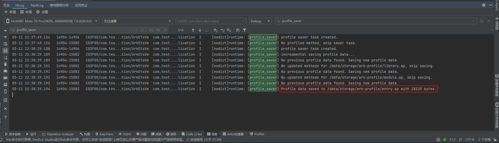
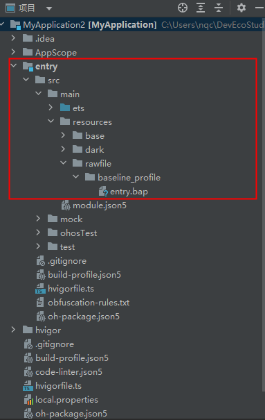
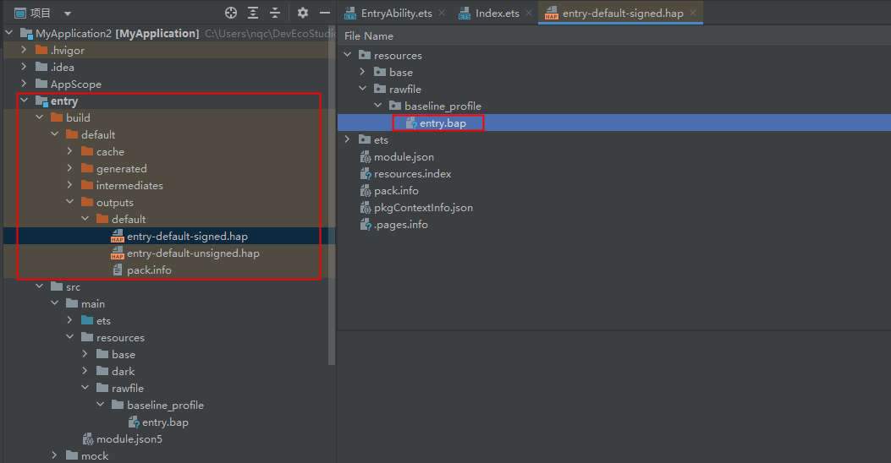
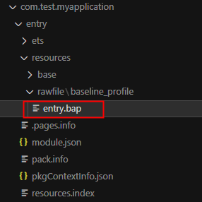
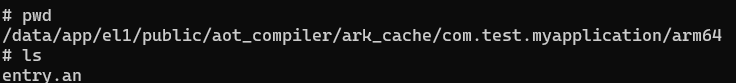
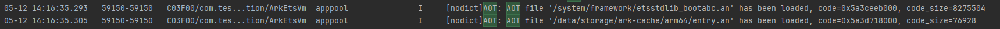

# 安装时AOT开发指导 (ArkTS-Sta)
<!--Kit: ArkTS-->
<!--Subsystem: ArkCompiler-->
<!--Owner: @NingQiCheng-->
<!--Designer: @wanzixuan330-->
<!--Tester: @haoyabo-->
<!--Adviser: @HelloCrease-->

在应用开发中，开发者会将静态ArkTS源码编译为方舟字节码文件（\*.abc），再打包为HAP进行分发。方舟字节码具备平台无关、分发灵活的优势，但应用运行时仍需通过解释执行或AOT（Ahead Of Time）预先编译等方式转换为目标设备可执行的机器码。对于冷启动、首次进入核心页面等关键路径，若热点代码只能在运行时解释执行，可能带来额外性能开销，影响用户体验。

安装时AOT（Ahead Of Time at Install Time）是在应用安装阶段触发的预先编译性能优化方案。该方案由设备侧运行环境在安装过程中读取应用包中的方舟字节码和热点函数信息，将部分热点代码提前编译为当前设备CPU可直接执行的机器码。AOT产物生成并可用后，应用后续启动或执行热点逻辑时，可减少运行时解释执行成本，使冷启动和关键业务路径有机会获得性能收益。安装时AOT适用于对冷启动、首帧或高频计算路径有性能要求的静态ArkTS应用。

## 核心机制与价值

安装时AOT的核心思想是在应用安装阶段提前完成热点函数的AOT编译。开发者通过性能采集获取热点函数信息，并在构建时将其与HAP一起打包。设备安装应用时，系统触发方舟AOT编译流程，方舟AOT编译器根据热点函数信息对字节码进行预编译，生成设备本地可执行的AOT产物。AOT产物生成并可用后，命中的热点函数可直接执行机器码，减少解释执行开销。

与解释器执行相比，安装时AOT的特点如下。

| 执行方式 | 编译时机 | 性能特点 | 开销 | 适用场景 |
| -------- | -------- | -------- | ---- | -------- |
| 解释器执行 | 应用运行时逐条解释方舟字节码 | 启动前无需编译，但热点代码执行效率相对较低 | 应用包体积和安装开销较小 | 对性能不敏感、逻辑较简单的场景 |
| 安装时AOT | 应用安装阶段在设备侧触发编译 | 可结合设备CPU架构生成机器码，在AOT产物可用后降低冷启动和热点路径的解释执行开销 | 安装耗时和设备存储占用会增加 | 对冷启动、首帧、关键业务路径性能有要求的场景 |

冷启动性能是用户感知最明显的性能指标之一。冷启动阶段需要完成进程创建、模块加载、页面构建、数据初始化等工作，其中若包含大量静态ArkTS热点函数解释执行，则会延长首屏展示时间。安装时AOT通过提前编译这些热点函数，减少后续执行时的运行时开销，使应用在冷启动和核心业务场景中获得性能收益。

安装时AOT在安装阶段触发字节码到机器码的预编译。典型流程如下：

1. 开发者在典型业务场景中运行应用，采集热点函数信息。
2. 工具链根据采集结果生成AP文件，由开发者手动改名为BAP文件。
3. 构建HAP时，将BAP文件随应用包一起打包。
4. 应用安装到设备时，安装流程读取HAP中的方舟字节码和BAP文件。
5. 方舟AOT编译器根据BAP中记录的热点函数范围进行预编译，生成AOT产物。
6. 应用运行时，方舟运行时加载可用的AOT产物；未被AOT覆盖的代码仍可按解释器执行等方式运行。

## BAP文件的作用与生成流程

BAP文件用于描述应用的热点函数信息，是安装时AOT选择编译范围的重要输入。它可以理解为Hot Function Profile（热点函数分析文件），记录应用运行过程中频繁调用或对性能有明显影响的函数列表。方舟AOT编译器根据BAP文件聚焦编译热点函数，避免对全部字节码进行无差别编译。

BAP文件通常通过性能采集流程生成。开发者应在与真实用户操作环境相似的环境中运行应用，覆盖需要优化的关键路径，例如冷启动首页加载、首次进入复杂页面、核心列表渲染、复杂计算、数据解析、首个交互动作等。采集完成后，工具链会根据运行时采集结果导出BAP文件。

BAP文件内容与应用字节码版本相关，用于标识需要参与安装时AOT的函数范围。代码结构、函数名、模块拆分或构建产物发生变化后，开发者应重新采集并生成新的BAP文件，避免BAP文件与当前HAP中的方舟字节码不匹配，导致热点函数覆盖不准确。

构建HAP时，DevEco Studio或构建工具会将BAP文件与HAP进行绑定并打包。安装应用时，设备侧安装流程可从HAP中读取BAP文件，并将其作为AOT编译器的输入。BAP文件会随应用包一起参与正常打包和签名流程，不需要开发者单独执行额外签名步骤。

BAP文件是安装时AOT的指南文件。它让AOT编译器只关注真实业务中更可能产生性能收益的热点函数，从而在性能收益、安装耗时和AOT产物体积之间取得平衡。采集场景覆盖范围过小时，AOT可能无法覆盖真正的热点函数；采集范围过广时，则可能增加安装耗时和设备存储占用。

## HAP、HAR与安装时AOT的关系

[HAP](../quick-start/hap-package.md)和[HAR](../quick-start/har-package.md)在安装时AOT流程中的关系如下。

| 包类型 | 定义 | 在安装时AOT中的角色 |
| ------ | ---- | ------------------ |
| HAP | 应用分发、安装和运行的基本单元。 | 安装时AOT的主要载体，提供字节码和BAP文件。 |
| HAR | 静态共享包，用于复用模块代码和资源，不独立安装运行。 | 不作为独立AOT目标，相关代码应从最终HAP业务场景采集热点。 |

## 开发流程与工具链

安装时AOT的开发流程中，开发者实际采集的是设备侧生成的AP文件（\*.ap）。AP文件记录应用运行过程中的热点函数信息。将AP文件从设备导出到本地后，需要将其重命名为BAP文件（\*.bap），再放入工程指定目录参与打包。因此，BAP文件并不是直接在设备侧生成的文件，而是由采集得到的AP文件转换命名后用于HAP打包的文件。

### 如何采集AP文件

开发阶段，开发者解锁设备，连接DevEco Studio并打开应用，在日志窗口中筛选关键词 `profile_saver`。随后模拟用户典型使用场景（如导航、购物或社交媒体浏览等操作），持续操作40秒。当日志中出现下方打印时，说明该HAP对应的AP文件已生成。为提高采集质量，建议多次运行核心场景并对结果进行对比，避免偶发路径影响热点函数列表。

### 如何导出AP文件并生成BAP文件

热点函数信息采集完成后，生成的AP文件存放在设备的 `/data/app/el1/100/aot_compiler/ark_profile/{bundleName}/{moduleName}.ap` 路径下。

随后使用 `hdc file recv /data/app/el1/100/aot_compiler/ark_profile/{bundleName}/{moduleName}.ap` 命令将AP文件下载到本地，并将其重命名为 `{moduleName}.bap`。其中，`bundleName` 为应用包名，`moduleName` 为模块名。后续打包阶段使用的是重命名后的BAP文件。

### 打包阶段：将BAP文件放入指定路径，IDE将自动打包

打包阶段，将BAP文件放入对应模块的 `/src/main/resources/rawfile/baseline_profile` 目录下，由DevEco Studio或构建流程自动打包到HAP中。如果没有 `baseline_profile` 目录，需要手动创建，如下图所示：

### 上架前检查：HAP包中是否包含.bap文件

上架前，建议对HAP包进行检查，确认其中包含与当前HAP版本匹配的BAP文件。

点击IDE中的 `构建 > 编译HAP(s)/APP(s) > 编译HAP(s)`，编译成功后可在IDE中查看产物中是否包含BAP文件。在模块下的 `/build/default/outputs/default/{moduleName}-default-signed.hap` 目录中，可以看到HAP包中的产物：

随后点击IDE右上角的 `运行` 按钮，IDE会自动将应用重新推送到设备。安装过程中，包管理会自动检测HAP中是否携带BAP文件；若检测到BAP文件，则会自动调用 `ark_aot`，依据BAP文件进行AOT编译。

开发者也可以使用 `hdc file recv /data/app/el1/bundle/public/{bundleName}` 将应用安装包目录拉取到本地，然后解压其中的HAP文件，查看是否存在BAP文件，如下图所示：

安装到目标设备后，应通过性能测试对比安装时AOT启用前后的具体性能指标，包括冷启动时间、首帧时间、核心场景耗时和CPU占用等。同时需要关注安装耗时和设备存储占用，确保AOT带来的额外开销在业务可接受范围内。

### 运行检查：AN文件是否成功生成并正常加载

AN文件是AOT的编译产物，AN文件一般存放在设备的 `/data/app/el1/public/aot_compiler/ark_cache/{bundleName}/arm64/{module}.an` 路径下：

AN文件生成后，应用启动时会自动加载AN文件，加载成功后即可使用AN文件。AN文件加载失败时，应用会回退到解释执行等路径，不影响应用功能。启动应用时，若有如下日志打印，则说明AN文件加载成功：

### 签名与分发：BAP是否影响签名？是否需要特殊市场审核？

签名与分发阶段，BAP文件作为应用包内文件参与标准打包、签名和分发流程。它不改变应用源码语义，也不需要特殊市场审核流程。开发者仍需完成常规功能回归测试，确认应用在命中AOT产物和未命中AOT产物的情况下都能按预期功能运行。
