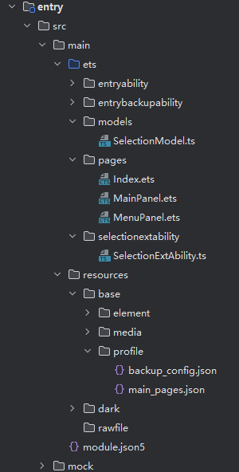

# 实现一个划词扩展能力

<!--Kit: Basic Services Kit-->
<!--Subsystem: SelectionInput-->
<!--Owner: @no86-->
<!--Designer: @mmwwbb-->
<!--Tester: @dong-dongzhen-->
<!--Adviser: @fang-jinxu-->

## 接口说明

| 名称 | 描述 |
| ---- | ---- |
| on(type: 'selectionCompleted', callback: Callback\<SelectionInfo\>): void | 订阅划词完成事件，使用`callback`回调函数。 |
| getSelectionContent(): Promise\<string\> | 获取选中文本的内容。 |
| createPanel(ctx: Context, info: PanelInfo): Promise\<Panel\> | 创建划词面板。 |
| show(): Promise\<void\> | 显示面板。 |
| hide(): Promise\<void\> | 隐藏面板。 |
| startMoving(): Promise\<void\> | 使当前划词面板可以随鼠标拖动。 |
| moveTo(x: number, y: number): Promise\<void\> | 移动划词面板至屏幕指定位置。 |

上述接口为本文档用到的核心接口，如需了解划词服务的全量接口，请参考[selectionInput.SelectionExtensionAbility](../../reference/apis-basic-services-kit/js-apis-selectionInput-selectionExtensionAbility-sys.md)接口文档获取接口详细描述。

## 开发步骤

完整的工程示例详见[SelectionAppSample](https://gitcode.com/openharmony/applications_app_samples/tree/master/code/DocsSample/SelectionService/SelectionAppSample)。

1. 创建划词应用工程。

    1.1 打开[DevEco Studio](https://developer.huawei.com/consumer/cn/deveco-studio/)，点击"File > New > Create Project"创建一个Empty Ability，设备类型勾选"2in1"

    1.2 在工程对应的ets目录下，右键选择"New > Directory"，新建两个目录，分别命名为selectionextability、models。

    1.3 在selectionextability目录下，新建`SelectionExtAbility.ets`文件；在models目录下，新建`SelectionModel.ets`文件；在目录pages下，新建两个page文件`MainPanel.ets`和`MenuPanel.ets`。目录如下：

    ```text
    /src/main/
    ├── ets/
    │   ├── selectionextability
    │   |   └── SelectionExtAbility.ets     # 划词扩展类
    │   ├── models
    │   |   └── SelectionModel.ets     # 划词模块管理类
    │   └── pages
    │       ├── MainPanel.ets                    # 主面板
    │       └── MenuPanel.ets                    # 菜单面板
    ├── resources/base/profile/main_pages.json
    ├── module.json5                             # 配置文件
    ```

    

2. 在`SelectionModel.ets`文件中自定义划词模块管理类，用于统一管理划词内容、窗口等信息。并且实现一些get、set接口，便于信息的类间传递。
    ```ts
    import { selectionManager, SelectionExtensionContext } from '@kit.BasicServicesKit';
    import { hilog } from '@kit.PerformanceAnalysisKit';

    export class SelectionModel {
      private selectionInfo: selectionManager.SelectionInfo | undefined;
      private selectionContent: string | undefined;
      private selectionPanel: selectionManager.Panel | undefined;
      private context: SelectionExtensionContext | undefined;
      private listener: (selectionInfo: selectionManager.SelectionInfo) => void;

      private constructor() {
        this.selectionInfo = undefined;
        this.selectionContent = undefined;
        this.selectionPanel = undefined;
        this.context = undefined;
        this.listener = (selectionInfo: selectionManager.SelectionInfo) => {
          hilog.info(0x0000, 'SelectionModel', `Received selection selectionInfo: ${selectionInfo}`);
        }
      }

      public static getInstance(): SelectionModel {
        if (globalThis.instance == null) {
          globalThis.instance = new SelectionModel();
        }
        return globalThis.instance;
      }

      public getSelectionInfo(): selectionManager.SelectionInfo | undefined {
        return this.selectionInfo;
      }

      public setSelectionInfo(selectionInfo: selectionManager.SelectionInfo) {
        this.selectionInfo = selectionInfo;
      }

      public getSelectionContent(): string | undefined {
        return this.selectionContent;
      }

      public setSelectionContent(selectionContent: string) {
        this.selectionContent = selectionContent;
      }

      public getSelectionPanel(): selectionManager.Panel | undefined {
        return this.selectionPanel;
      }

      public setSelectionPanel(selectionPanel: selectionManager.Panel) {
        this.selectionPanel = selectionPanel;
      }

      public getContext(): SelectionExtensionContext | undefined {
        return this.context;
      }

      public setContext(context: SelectionExtensionContext) {
        this.context = context;
      }

      public registerListener(listener: (selectionInfo: selectionManager.SelectionInfo) => void) {
        this.listener = listener;
      }
    }
    ```

3. 在`SelectionExtensionAbility.ets`文件中实现扩展能力类，该类需要继承[SelectionExtensionAbility](../../reference/apis-basic-services-kit/js-apis-selectionInput-selectionExtensionAbility-sys.md)，用于实现划词扩展生命周期管理。
    ```ts
    import { selectionManager, SelectionExtensionAbility} from '@kit.BasicServicesKit';
    import { Want } from '@kit.AbilityKit';
    import { rpc } from '@kit.IPCKit';

    class SelectionAbilityStub extends rpc.RemoteObject {
      constructor(des) {
        if (typeof des === 'string') {
          super(des);
        } else {
          return null;
        }
      }

      onRemoteMessageRequest(
        code: number,
        data: rpc.MessageSequence,
        reply: rpc.MessageSequence,
        options: rpc.MessageOption
      ): boolean | Promise<boolean> {
        return true;
      }
    }

    class SelectionExtAbility extends SelectionExtensionAbility {
      panel_: selectionManager.Panel = undefined;

      onConnect(want: Want): rpc.RemoteObject {
        // 当SelectionExtensionAbility实例完成创建时，系统会触发该回调。开发者可在该回调中执行初始化逻辑（如定义变量、加载资源、监听划词事件等）。
        return new SelectionAbilityStub('remote');
      }

      onDisconnect(): void {
        // 当SelectionExtensionAbility实例被销毁（例如用户关闭划词开关或切换划词应用）时，系统触发该回调。开发者可以在该生命周期中执行资源清理、数据保存等相关操作。
        selectionManager.destroyPanel(this.panel_);
      }
    }
    ```
    上述代码中，划词扩展被拉起时会触发[onConnect](../../reference/apis-basic-services-kit/js-apis-selectionInput-selectionExtensionAbility-sys.md#onconnect)回调，可以在该回调中监听划词事件，完成划词窗口的创建、窗口内容设定、窗口的移动、窗口的显示和隐藏等操作；当划词扩展退出时会触发[onDisconnect](../../reference/apis-basic-services-kit/js-apis-selectionInput-selectionExtensionAbility-sys.md#ondisconnect)回调，可以在该回调中完成窗口销毁的操作。详细内容可参见下面第4步。


4. 在划词扩展被拉起时，可以提前创建划词窗口（但不调用[show](../../reference/apis-basic-services-kit/js-apis-selectionInput-selectionManager-sys.md#show)接口），以缩短用户在第一次划词时的响应延迟。同时，可以在[onConnect](../../reference/apis-basic-services-kit/js-apis-selectionInput-selectionExtensionAbility-sys.md#onconnect)中监听划词事件，执行后续的弹窗操作。需要注意的是，从API version 22开始，通过监听[selectionCompleted](../../reference/apis-basic-services-kit/js-apis-selectionInput-selectionManager-sys.md#onselectioncompleted)收到的[SelectionInfo](../../reference/apis-basic-services-kit/js-apis-selectionInput-selectionManager-sys.md#selectioninfo)当中将不再包含划词内容。需要额外调用[getSelectionContent](../../reference/apis-basic-services-kit/js-apis-selectionInput-selectionManager-sys.md#getselectioncontent22)接口获取划词内容。
    <!--code_no_check-->
    ```ts
    import { selectionManager, PanelInfo, PanelType, SelectionExtensionAbility, BusinessError } from '@kit.BasicServicesKit';
    import { SelectionModel } from '../models/SelectionModel';
    import { Want } from '@kit.AbilityKit';
    import { rpc } from '@kit.IPCKit';
    import { hilog } from '@kit.PerformanceAnalysisKit';

    class SelectionAbilityStub extends rpc.RemoteObject {
      // ... 
    }

    class SelectionExtAbility extends SelectionExtensionAbility {
      panel_: selectionManager.Panel = undefined;

      onConnect(want: Want): rpc.RemoteObject {
        SelectionModel.getInstance().setContext(this.context);
        selectionManager.on('selectionCompleted', async (info: selectionManager.SelectionInfo) => {
          if (this.panel_ == undefined) {
            await this.createSelectionPanel();
          }
          this.onSelected(info);
        });
        return new SelectionAbilityStub('remote');
      }

      onDisconnect(): void {
        selectionManager.destroyPanel(this.panel_);
      }

      async createSelectionPanel() {
        let panelInfo: PanelInfo = {
          panelType: PanelType.MENU_PANEL,
          x: 0,
          y: 0,
          width: 500,
          height: 300
        }
        try {
          let panel: selectionManager.Panel = await selectionManager.createPanel(this.context, panelInfo);    // 创建菜单面板
          this.panel_ = panel;
          panel.setUiContent('pages/MenuPanel')   // 设置菜单面板样式
            .then(() => {
              hilog.info(0x0000, 'SelectionExtensionAbility', 'Succeed to setUiContent [pages/MenuPanel].');
            })
            .catch((error: BusinessError) => {
              hilog.info(0x0000, 'SelectionExtensionAbility', `Failed to setUiContent, error: ${JSON.stringify(error)}`);
              return;
            })
        } catch(error) {
          hilog.info(0x0000, 'SelectionExtensionAbility', `Failed to createPanel, error: ${JSON.stringify(error)}`);
        }
      }

      async onSelected(info: selectionManager.SelectionInfo) {
        SelectionModel.getInstance().setSelectionInfo(info);
        try {
          let content = await selectionManager.getSelectionContent();   // 获取划词内容
          SelectionModel.getInstance().setSelectionContent(content);
        } catch (error) {
          console.error(`Failed to get selection content: ${JSON.stringify(error)}`);
        }
        this.panel_.moveTo(info.startDisplayX, info.startDisplayY)    // 将弹窗移动到用户鼠标划词的起始点
          .then(() => {
            hilog.info(0x0000, 'SelectionExtensionAbility', 'Move succeed.');
          })
          .catch((error: BusinessError) => {
            hilog.info(0x0000, 'SelectionExtensionAbility', `Failed to move, error: ${JSON.stringify(error)}`);
            return;
          });

        await this.panel_.show()    // 显示弹窗
          .then(() => {
            hilog.info(0x0000, 'SelectionExtensionAbility', 'Show succeed.');
          })
          .catch((error: BusinessError) => {
            hilog.info(0x0000, 'SelectionExtensionAbility', `Failed to show panel, error: ${JSON.stringify(error)}`);
            return;
          });

        this.panel_.on('hidden', () => {    // 监听弹窗隐藏（窗口失焦时会触发隐藏）
          hilog.info(0x0000, 'SelectionExtensionAbility', 'panel has hidden.');
        })
      }
    }
    ```

5. 在`SelectionExtensionAbility.ets`文件末尾将扩展能力类导出，供项目中其他类引用。
    ```ts
    export default SelectionExtAbility;
    ```

6. 在`MenuPanel.ets`文件中，可根据业务内容绘制相应的面板，例如提供翻译、查询、扩写等按钮。通过绑定点击事件，弹出不同的主面板，以展示不同的内容。本示例仅提供了一个简单的点击按钮，用于展示如何弹出主面板。
    <!--code_no_check-->
    ```ts
    import { SelectionModel } from '../models/SelectionModel';
    import { selectionManager, PanelInfo, BusinessError, PanelType, SelectionExtensionContext } from '@kit.BasicServicesKit';
    import { hilog } from '@kit.PerformanceAnalysisKit';
    import Want from '@ohos.app.ability.Want';

    @Entry
    @Component
    struct MenuPanel {
      @State message: string = 'MenuPanel';
      selectionInfo: selectionManager.SelectionInfo | undefined = undefined;

      CreateMainPanel() {
        this.selectionInfo = SelectionModel.getInstance().getSelectionInfo();
        let panelInfo: PanelInfo = {
          panelType: PanelType.MAIN_PANEL,
          x: 0,
          y: 0,
          width: 1500,
          height: 1000
        }
        selectionManager.createPanel(SelectionModel.getInstance().getContext(), panelInfo)
          .then(async (panel: selectionManager.Panel) => {
            SelectionModel.getInstance().setSelectionPanel(panel);
            hilog.info(0x0000, 'SelectionExtensionAbility', 'Succeed to create main panel');
            if (this.selectionInfo !== undefined) {
              panel.moveTo(this.selectionInfo.startDisplayX + 100, this.selectionInfo.startDisplayY + 100);
            }
            try {
              panel.on('destroyed', () => {
                hilog.info(0x0000, 'SelectionExtensionAbility', 'panel has destroyed');
              })
            } catch (error) {
              hilog.info(0x0000, 'SelectionExtensionAbility', 'Failed to listen window destroy');
            }
            panel.setUiContent('pages/MainPanel')
              .then(() => {
                hilog.info(0x0000, 'SelectionExtensionAbility', 'Succeed to setUiContent [pages/MainPanel].');
              })
              .catch((error: BusinessError) => {
                hilog.info(0x0000, 'SelectionExtensionAbility', `Failed to setUiContent of main panel, error: [${JSON.stringify(error)}]`);
                return;
              });

            await panel.show()
              .then(() => {
                hilog.info(0x0000, 'SelectionExtensionAbility', 'Succeed to show main panel.');
              })
              .catch((error: BusinessError) => {
                hilog.info(0x0000, 'SelectionExtensionAbility', `Failed to show main panel, error: [${JSON.stringify(error)}]`);
                return;
              });
          })
          .catch((error: BusinessError) => {
            hilog.info(0x0000, 'SelectionExtensionAbility', `Failed to createPanel, error: [${JSON.stringify(error)}]`);
            return;
          });
      }

      startEntryAbility() {   // 拉起应用
        let wantAbility: Want = {
          bundleName: 'com.selection.selectionapplication',   // 应用的bundleName
          abilityName: 'EntryAbility',    // 应用的abilityName
        };
        let context: SelectionExtensionContext | undefined = SelectionModel.getInstance().getContext();
        if (context !== undefined) {
          context.startAbility(wantAbility)
            .then(() => {
              hilog.info(0x0000, 'SelectionExtensionAbility', `startAbility success, want: ${wantAbility.abilityName}`);
            })
            .catch((error: BusinessError) => {
              hilog.info(0x0000, 'SelectionExtensionAbility', `startAbility failed, error: ${JSON.stringify(error)}`);
            })
        }
      }

      build() {
        Column() {
          Button('click to show MAIN_PANEL')
            .onClick(() => {
              this.CreateMainPanel();
            })
          Button('start EntryAbility')
            .onClick(() => {
              this.startEntryAbility();
            })
        }
        .backgroundColor('#AAFFFF')
        .height('100%')
        .width('100%')
      }
    }
    ```

7. 在`MainPanel.ets`文件中，可以展示业务处理结果，例如展示翻译结果等。本示例仅提供了一个简单的展示划词内容的功能，具体的业务侧功能需要开发者自行实现。
    <!--code_no_check-->
    ```ts
    import { SelectionModel } from '../models/SelectionModel';
    import selectionManager from '@ohos.selectionInput.selectionManager';
    @Entry
    @Component
    struct MainPanel {
      @State message: string = 'MainPanel';

      aboutToAppear(): void {
        let content: string | undefined = SelectionModel.getInstance().getSelectionContent();
        if (content !== undefined) {
          this.message = content;
        }
      }

      build() {
        RelativeContainer() {
          Text(this.message)
            .id('MainPanelHelloWorld')
            .fontSize(8)
            .alignRules({
              center: { anchor: '__container__', align: VerticalAlign.Center },
              middle: { anchor: '__container__', align: HorizontalAlign.Center }
            })
        }
        .onTouch((event: TouchEvent) => {
          if (event.type === TouchType.Down) {
            let selectionPanel: selectionManager.Panel | undefined = SelectionModel.getInstance().getSelectionPanel();
            if (selectionPanel !== undefined) {
              selectionPanel.startMoving();   // 调用selectionManager提供的startMoving接口可实现划词面板随鼠标拖动
            }
          }
        })
        .backgroundColor('#AAA000')
        .height('100%')
        .width('100%')
      }
    }
    ```

8. 配置`main_pages.json`文件。

    在`src`字段中添加新增的`MainPanel`和`MenuPanel`页面。

    ```json
    "src": [
        // ...
        "pages/MainPanel",
        "pages/MenuPanel"
    ]
    ```

9. 配置`module.json5`文件。

    在`extensionAbilities`字段中配置划词扩展类文件路径。

    ```json
    {
      "module": {
      // ...
        "extensionAbilities": [
          {
            "name": "SelectionExtAbility",
            "srcEntry": "./ets/selectionextability/SelectionExtensionAbility.ets",
            "type": "selection",
            "exported": false,
          }
        ]
      }
    }
    ```

10. 签名

    点击[DevEco Studio](https://developer.huawei.com/consumer/cn/deveco-studio/)右上角的"Project Structure"按钮，点击"Signing Configs"按钮，按操作登录华为账号后会自动生成签名。

## 调测验证

1. 连接设备后，点击[DevEco Studio](https://developer.huawei.com/consumer/cn/deveco-studio/)右上角的绿色三角形"Run entry"按钮，编译器会执行编译并自动将应用安装到设备中。

2. 设置划词服务的系统参数。

    2.1 进入设置-->系统-->智慧划词界面打开智慧划词开关。
    
    2.2 选择当前应用为划词应用。
    
    2.3 选择划词触发方式为“点击ctrl键显示”。

3. 通过日志观察划词服务拉起划词扩展能力的过程。

    使用[DevEco Studio](https://developer.huawei.com/consumer/cn/deveco-studio/)的Hilog窗口查看日志。

4. 使用鼠标左键双击、三击或拖动选中文本后，键盘点击ctrl键，观察菜单面板的弹出。点击菜单面板上的按钮，观察主面板的弹出。
