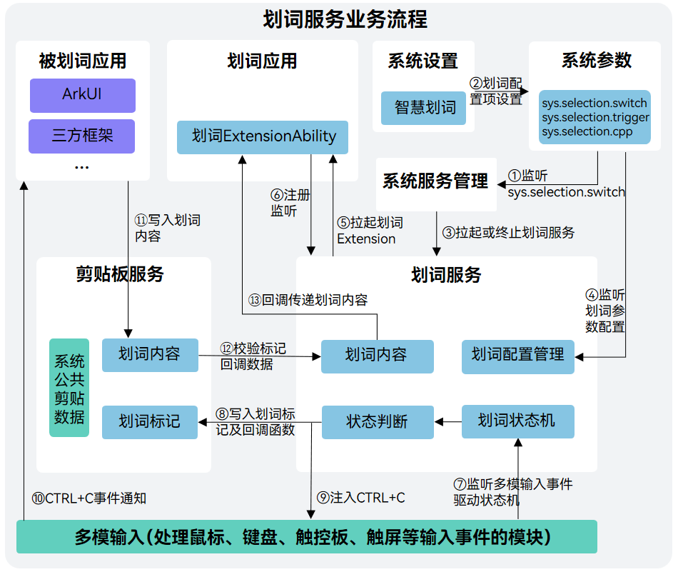

# 划词服务概述

<!--Kit: Basic Services Kit-->
<!--Subsystem: SelectionInput-->
<!--Owner: @no86-->
<!--Designer: @mmwwbb-->
<!--Tester: @dong-dongzhen-->
<!--Adviser: @fang-jinxu-->

从API version 24开始，新增划词服务，该服务具有全局获取用户选中文本的能力。开发者可调用该服务提供的接口，实现划词弹窗功能。

## 框架原理

划词服务的业务流程依赖于划词应用、被划词应用、系统设置应用、系统服务管理、多模输入以及剪贴板服务等模块的协同工作，这些模块的介绍及相关业务内容如下所述：

**划词应用**：本文档将实现了划词扩展能力的应用统称为划词应用。当划词应用被划词服务成功拉起后，可通过监听[selectionCompleted](../../reference/apis-basic-services-kit/js-apis-selectionInput-selectionManager.md#selectionmanageronselectioncompleted)事件以识别用户选词操作,可调用[getSelectionContent](../../reference/apis-basic-services-kit/js-apis-selectionInput-selectionManager.md#selectionmanagergetselectioncontent)获取选中的文本内容，同时也可调用[createPanel](../../reference/apis-basic-services-kit/js-apis-selectionInput-selectionManager.md#selectionmanagercreatepanel)和[show](../../reference/apis-basic-services-kit/js-apis-selectionInput-selectionManager.md#show)创建和显示面板。对应下图序号6。具体的接口描述和使用方法可参见[实现一个划词扩展能力](./selection-services-application-guide.md)。

**被划词应用**：本文档将用户选中文本内容所在的应用统称为被划词应用。当前划词服务的方案采用标准的系统复制机制，因此无需被划词应用进行任何适配和修改，划词服务即可实现跨应用的划词功能。对应下图序号11。然而，对于部分不支持系统级复制操作的应用（如某些受控的WebView、沙箱环境应用，或仅限于内部粘贴的应用），划词服务将无法通过标准的系统复制机制获取到用户选中的文本内容。在此类场景下，划词功能会失效。因此，建议开发者在开发划词应用时，配套使用白名单或黑名单机制，将希望支持划词功能的被划词应用放入白名单内。

**系统设置应用**：系统设置应用即系统中内置的设置应用。针对划词功能，系统设置应用会主动扫描并识别系统中所有实现了划词扩展能力的应用，将其统一列于“设置—>系统—>智慧划词”界面，供用户选择划词应用（未选择时会默认选择列表中第一个划词应用）。同时，用户可在智慧划词界面选择开启或关闭全局划词功能，以及选择划词面板的触发方式（选中文本后直接触发划词面板、选中文本后按下ctrl触发划词面板）。所有配置项都会由系统设置应用同步设置到系统参数中供其他模块访问。对应下图序号2。

**系统服务管理**：系统服务管理是统一管理系统服务的模块。针对划词服务，系统服务管理模块会监听系统参数中划词开关参数（sys.selection.switch）的变化。当监听到划词开关参数的值为on时，会拉起划词服务；当监听到划词开关参数的值为off时，会终止划词服务。对应下图序号1、3。有关系统服务管理的详细介绍可参见[系统服务管理](https://gitcode.com/openharmony/systemabilitymgr_samgr)。

**多模输入**：多模输入是统一处理触屏、键鼠等输入事件的模块。划词服务会注册对多模输入模块的事件监听，实时捕获用户的键盘、鼠标、触控板输入事件，并基于预设规则驱动状态机，精确识别划词行为。此外，划词服务还会通过多模输入模块向被划词应用注入CTRL+C事件，模拟系统复制操作。对应下图序号7、9、10。有关多模输入的详细介绍可参见[多模输入](https://gitcode.com/openharmony/multimodalinput_input)。

**剪贴板服务**：剪贴板服务是系统中统一管理剪贴板状态、支撑全局复制与粘贴功能的核心模块。针对划词服务的需求，剪贴板服务引入了划词标记机制：当标记存在时，剪贴板服务不会将后续收到的内容写入系统公共剪贴板，而是将其直接传递给划词服务，并在传递完成后立即清除该标记。因此，划词操作不会干扰用户正常的复制粘贴流程。对应下图序号8、11、12。有关剪贴板服务的详细介绍可参见[剪贴板服务](https://gitcode.com/openharmony/distributeddatamgr_pasteboard)。

**划词服务**：划词服务被拉起时，会根据系统参数中的值，拉起用户在智慧划词界面选择的划词应用。同时，划词服务还会监听划词触发方式等参数变化，确保配置可实时生效。此外，划词服务会注册对多模输入模块的事件监听，实时捕获用户的键盘、鼠标、触控板输入事件，并基于预设规则驱动状态机，精确识别划词行为。一旦状态机判定用户执行了划词操作，划词服务将通过多模输入模块向被划词应用注入CTRL+C事件，模拟系统复制操作，触发文本内容的复制流程。与此同时，划词服务会向剪贴板服务写入一个专用的划词标记及回调函数，用于后续内容拦截与传递。被划词应用在接收到CTRL+C事件后，会执行标准的复制逻辑，将用户选中的内容写入系统剪贴板。剪贴板服务在收到该内容后，首先校验是否存在划词标记。若标记有效，则不会将内容写入公共剪贴板，而是将其中的文本内容直接传递给划词服务，并立即清除标记。最终，划词服务将获取到的文本内容转发至当前的划词应用，由划词应用完成后续处理（如翻译、摘要、扩写等），并创建与显示自定义面板。对应下图序号4到13。

## 能力范围

- 选词方式：

  仅支持鼠标及触控板左键按下滑动、左键双击、左键三击三种划词方式，不支持CTRL+A等键盘选中及触屏选中方式。

- 触发方式：

  支持选中文本后直接触发划词面板、选中文本后按下ctrl触发划词面板两种方式，可在设置—>系统—>智慧划词界面切换。

- 面板管理：

  支持创建和管理菜单面板与主面板，提供面板的创建、移动、隐藏、销毁等接口，并支持自定义面板内容。

- 应用管理：

  支持多个应用实现划词扩展能力，但划词服务同一时间只可与一个划词应用进行通信，可以在设置—>系统—>智慧划词界面切换划词应用。

## 约束限制

- 支持外接键盘和鼠标的2in1设备。

- 支持获取文本类型的划词内容，最大长度限制为6000个字节。

- 支持在扩展屏上使用，不支持跨设备使用。

- 对于不支持复制或只能在当前应用内复制粘贴的被划词应用，划词功能会失效。因此，建议开发者在开发划词应用时配置相应的黑名单或白名单。
