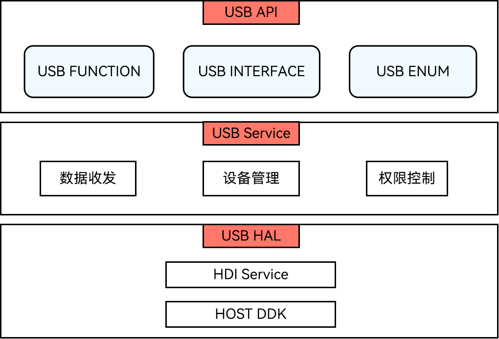

# USB设备管理（C/C++）
<!--Kit: Basic Services Kit-->
<!--Subsystem: USB-->
<!--Owner: @hwymlgitcode-->
<!--Designer: @w00373942-->
<!--Tester: @dong-dongzhen-->
<!--Adviser: @fang-jinxu-->

## 概述

OH_UsbManager是OpenHarmony提供的USB设备管理C接口模块，支持开发者在C/C++层完成USB Host侧的设备枚举、权限管理、设备连接和底层通信等操作。该接口与ArkTS层的@ohos.usbManager接口功能对应，适用于需要使用C/C++进行原生USB设备管理的开发场景。

**系统能力**：SystemCapability.USB.USBManager

### 核心能力

OH_UsbManager C API主要提供以下能力：

- **设备枚举**：获取当前连接到主设备的所有USB设备列表，包括设备名称、厂商信息、产品ID、配置描述符等详细信息。
- **权限管理**：检查和请求应用对USB设备的访问权限，确保设备操作的安全性。
- **设备连接**：建立与USB设备的通信管道（UsbPipe），获取用于底层通信的文件描述符。
- **资源管理**：提供设备数组和设备管道的释放接口，防止内存泄漏和资源泄漏。

### 基本概念

- **Host/Device**

  USB设备分为主机（Host）和从机（Device）。主机负责数据传输以及端口管理，从机为被管理的对象。OH_UsbManager C接口在当前设备作为主机时使用，用于管理所连接的从设备。

- **UsbPipe**

  设备管道（UsbPipe）是主机与USB设备通信的通道，通过`OH_UsbManager_ConnectDevice`接口打开设备后获得。UsbPipe中包含设备的总线号（busNum）和设备地址（devAddress），用于唯一标识一个已连接的USB设备。

- **设备描述符层级**

  USB设备信息采用层级结构：UsbDevice（设备）包含UsbConfig（配置），UsbConfig包含UsbInterface（接口），UsbInterface包含UsbEndpoint（端点）。每个层级通过C结构体表示，通过指针和计数器实现数组访问。

### 适用场景

OH_UsbManager C API适用于以下典型场景：

- **Ukey驱动开发**：实现USB安全密钥设备的发现、授权、连接和底层通信。
- **USB存储设备管理**：与U盘、移动硬盘等存储设备建立连接并获取文件描述符。
- **USB串口通信**：通过文件描述符与USB转串口设备进行底层通信。
- **自定义USB设备**：与厂商自定义协议的USB设备建立连接，通过ioctl进行底层I/O操作。
- **嵌入式外设对接**：在资源受限的C/C++原生环境中完成USB设备管理，无需经过ArkTS层。

### 运作机制

USB服务系统包含USB API、USB Service、USB HAL三层架构。

**图1** USB服务运作机制



- **USB API层**：提供USB基础API，包含查询USB设备列表、权限控制、设备连接等接口。OH_UsbManager C接口属于该层，通过`libohusb_manager.so`动态链接库提供。
- **USB Service层**：实现HAL层数据的接收、解析、分发以及对设备的管理。
- **USB HAL层**：提供用户态可直接调用的驱动能力接口。

在Host模式下，当前设备作为主设备负责数据传输及端口管理，连接的USB设备为被管理的从设备。应用程序通过OH_UsbManager C接口枚举设备、获取权限、建立UsbPipe通信通道，并通过文件描述符进行底层I/O操作。

## 开发前准备

### 环境要求

**开发工具及配置**

DevEco Studio是进行USB设备驱动开发的必备工具，开发者可以使用该工具进行开发、调试、打包等操作。请[下载安装](https://developer.huawei.com/consumer/cn/download/)该工具，并参考[DevEco Studio使用指南](https://developer.huawei.com/consumer/cn/doc/harmonyos-guides/ide-tools-overview)中的[创建工程及运行](https://developer.huawei.com/consumer/cn/doc/harmonyos-guides/ide-create-new-project)进行基本的操作验证，保证DevEco Studio可正常运行。

**SDK版本配置**

OH_UsbManager提供的C接口，所需SDK版本为API 26.1.0及以上才可使用。

**HDC配置**

HDC（HarmonyOS Device Connector）是为开发人员提供的用于调试的命令行工具，通过该工具可以在Windows/Linux/Mac系统上与真实设备或者模拟器进行交互，详细参考[HDC配置](https://developer.huawei.com/consumer/cn/doc/harmonyos-guides/hdc)。

> **注意：**
>
> "配置环境变量hdc_server_port"和"全局环境变量"为必须操作。

### 搭建环境

1. 在PC上安装[DevEco Studio](https://developer.huawei.com/consumer/cn/download/deveco-studio)，要求版本在4.1及以上。
2. 将public-SDK更新到API 26.1.0或以上<!--Del-->，更新SDK的具体操作可参见[更新指南](../../../../faqs/full-sdk-switch-guide.md)<!--DelEnd-->。
3. PC安装HDC工具，通过该工具可以在Windows/Linux/Mac系统上与真实设备或者模拟器进行交互。
4. 用USB线缆将搭载OpenHarmony的设备连接到PC。

### 检验环境是否搭建成功

检查DevEco Studio是否已连接上OpenHarmony设备。

### 权限配置

调用`OH_UsbManager_RequestPermission`请求设备权限时，系统会弹窗请求用户授权。该接口本身不需要在`module.json5`中声明特定权限，但需要用户在弹窗中确认。

### 约束与限制

- OH_UsbManager C接口所需SDK版本为API 26.1.0及以上。

- 当前设备必须作为USB Host模式，所连接的设备为Device模式，方可通过`OH_UsbManager_GetUsbDeviceList`获取到设备列表。

- 调用`OH_UsbManager_RequestPermission`请求设备权限时，可能触发系统弹窗请求用户授权。

- `OH_UsbManager_GetUsbDeviceList`返回的设备数组必须通过`OH_UsbManager_FreeUsbDeviceList`释放，否则会造成内存泄漏。

- `OH_UsbManager_ConnectDevice`返回的设备管道必须通过`OH_UsbManager_ClosePipe`关闭，否则会造成资源泄漏。

- `OH_UsbManager_ConnectDevice`连接设备时仅需`OH_UsbManager_UsbDevice`结构体中的`busNum`和`devAddress`字段，其他字段将被忽略。

## 接口说明

### 接口

| 名称 | 描述 |
| -------- | -------- |
| OH_UsbManager_ErrorCode OH_UsbManager_GetUsbDeviceList(OH_UsbManager_UsbDevice \*\*devices, uint32_t \*deviceCount) | 获取已连接的所有USB设备列表。函数会分配设备数组及内部字符串缓冲区，调用者必须通过OH_UsbManager_FreeUsbDeviceList释放，不能单独释放各字段。 |
| void OH_UsbManager_FreeUsbDeviceList(OH_UsbManager_UsbDevice \*devices, uint32_t deviceCount) | 释放由OH_UsbManager_GetUsbDeviceList返回的设备数组。调用后指针失效，传入null或count为0时为安全空操作。 |
| OH_UsbManager_ErrorCode OH_UsbManager_HasPermission(const char \*deviceName, bool \*result) | 检查应用是否有权限访问指定设备。设备名称格式为`<总线号>-<设备地址>`。 |
| OH_UsbManager_ErrorCode OH_UsbManager_RequestPermission(const char \*deviceName, OH_UsbManager_PermissionCallback callback, void \*userContext) | 异步请求访问指定USB设备的权限。可能触发系统弹窗请求用户授权，函数立即返回，结果通过回调返回。 |
| OH_UsbManager_ErrorCode OH_UsbManager_ConnectDevice(const OH_UsbManager_UsbDevice \*device, OH_UsbManager_UsbPipe \*pipe) | 连接USB设备并打开通信管道。仅需device中的busNum和devAddress字段，其他字段被忽略。返回的管道必须通过OH_UsbManager_ClosePipe关闭。 |
| OH_UsbManager_ErrorCode OH_UsbManager_GetFileDescriptor(const OH_UsbManager_UsbPipe \*pipe, int32_t \*fd) | 获取已打开USB设备管道的文件描述符。该fd可用于基于ioctl的底层USB传输。 |
| OH_UsbManager_ErrorCode OH_UsbManager_ClosePipe(const OH_UsbManager_UsbPipe \*pipe) | 关闭USB设备管道并释放底层资源。管道必须由OH_UsbManager_ConnectDevice获取。 |

详细的接口说明请参考[OH_UsbManager](../../../../reference/apis-basic-services-kit/capi-usbmanager.md)和[ohusb_manager.h](../../../../reference/apis-basic-services-kit/capi-ohusb-manager-h.md)。

### 数据结构

| 结构体 | 描述 |
| -------- | -------- |
| [OH_UsbManager_UsbDevice](../../../../reference/apis-basic-services-kit/capi-usbmanager-oh-usbmanager-usbdevice.md) | USB设备信息，包含总线号、设备地址、名称、厂商信息、产品ID、配置列表等。 |
| [OH_UsbManager_UsbConfig](../../../../reference/apis-basic-services-kit/capi-usbmanager-oh-usbmanager-usbconfig.md) | USB配置信息，包含配置ID、属性、最大功率、接口列表等。一个UsbDevice可包含多个UsbConfig。 |
| [OH_UsbManager_UsbInterface](../../../../reference/apis-basic-services-kit/capi-usbmanager-oh-usbmanager-usbinterface.md) | USB接口信息，包含接口ID、协议、类别、端点列表等。一个UsbConfig可包含多个UsbInterface。 |
| [OH_UsbManager_UsbEndpoint](../../../../reference/apis-basic-services-kit/capi-usbmanager-oh-usbmanager-usbendpoint.md) | USB端点信息，包含端点地址、属性、传输类型、方向等。一个UsbInterface可包含多个UsbEndpoint。 |
| [OH_UsbManager_UsbPipe](../../../../reference/apis-basic-services-kit/capi-usbmanager-oh-usbmanager-usbpipe.md) | USB设备管道，包含总线号和设备地址，用于标识已打开的设备通信通道。 |

详细的数据结构说明请参考[OH_UsbManager](../../../../reference/apis-basic-services-kit/capi-usbmanager.md)和[ohusb_manager.h](../../../../reference/apis-basic-services-kit/capi-ohusb-manager-h.md)。

### 错误码

OH_UsbManager C接口通过`OH_UsbManager_ErrorCode`枚举返回错误码，具体如下：

| 错误码 | 值 | 说明 |
| -------- | -------- | -------- |
| OH_USBMANAGER_SUCCESS | 0 | 操作成功。 |
| OH_USBMANAGER_ERROR_PERMISSION_DENIED | 14400001 | 权限被拒绝。 |
| OH_USBMANAGER_ERROR_SERVICE_EXCEPTION | 14400004 | 服务异常。 |
| OH_USBMANAGER_ERROR_NO_DEVICE | 14400008 | 不存在该设备（可能已被断开连接）。 |
| OH_USBMANAGER_ERROR_NO_MEMORY | 14400009 | 内存不足。 |
| OH_USBMANAGER_ERROR_IO_ERROR | 14400012 | 传输I/O错误。 |
| OH_USBMANAGER_ERROR_INVALID_PARAMETER | 14400014 | 无效参数。对不可为空的参数传入了空指针。 |

详细的错误码说明请参考[ohusb_manager.h](../../../../reference/apis-basic-services-kit/capi-ohusb-manager-h.md)。

## 开发步骤

USB设备管理C API的完整开发流程包括：设备发现 → 权限授权 → 设备连接 → 底层通信 → 资源关闭。以下逐步说明各阶段的操作。

**添加动态链接库**

CMakeLists.txt中添加以下lib。

```txt
libohusb_manager.so
```

**头文件**

``` C++
#include "BasicServicesKit/ohusb_manager.h"
```

### 设备发现

调用`OH_UsbManager_GetUsbDeviceList`获取当前连接的所有USB设备列表。该函数会分配设备数组及内部所有字符串缓冲区，调用者不得单独释放各字段内存。返回的设备数组包含完整的描述符层级信息（配置、接口、端点），可通过遍历设备列表查找目标设备。

使用完毕后必须调用`OH_UsbManager_FreeUsbDeviceList`释放设备数组。

<!-- @[CApiGetUsbDeviceList](https://gitcode.com/openharmony/applications_app_samples/blob/master/code/DocsSample/USB/USBManagerCApiSample/entry/src/main/cpp/napi_init.cpp) -->

``` C++
OH_UsbManager_UsbDevice *devices = nullptr;
uint32_t deviceCount = 0;
OH_UsbManager_ErrorCode code = OH_UsbManager_GetUsbDeviceList(&devices, &deviceCount);
if (code != OH_USBMANAGER_SUCCESS) {
    ThrowUsbError(env, "OH_UsbManager_GetUsbDeviceList", code);
    return nullptr;
}
```

<!-- @[CApiFreeUsbDeviceList](https://gitcode.com/openharmony/applications_app_samples/blob/master/code/DocsSample/USB/USBManagerCApiSample/entry/src/main/cpp/napi_init.cpp) -->

``` C++
OH_UsbManager_UsbDevice *devices = nullptr;
uint32_t deviceCount = 0;
bool freed = false;
{
    std::lock_guard<std::mutex> lock(g_deviceListMutex);
    devices = g_heldDevices;
    deviceCount = g_heldDeviceCount;
    if (devices != nullptr) {
        OH_UsbManager_FreeUsbDeviceList(devices, deviceCount);
        g_heldDevices = nullptr;
        g_heldDeviceCount = 0;
        freed = true;
    }
}
```

### 授权

通过`OH_UsbManager_HasPermission`检查当前应用是否已有设备访问权限。设备名称格式为`<总线号>-<设备地址>`。

若无权限，调用`OH_UsbManager_RequestPermission`异步请求权限。该函数会立即返回，请求结果通过`OH_UsbManager_PermissionCallback`回调通知。仅在授权成功后才可进行设备连接操作。

<!-- @[CApiHasPermission](https://gitcode.com/openharmony/applications_app_samples/blob/master/code/DocsSample/USB/USBManagerCApiSample/entry/src/main/cpp/napi_init.cpp) -->

``` C++
std::string deviceName;
if (!GetDeviceNameArg(env, info, deviceName)) {
    return nullptr;
}
bool result = false;
OH_UsbManager_ErrorCode code = OH_UsbManager_HasPermission(deviceName.c_str(), &result);
if (code != OH_USBMANAGER_SUCCESS) {
    ThrowUsbError(env, "OH_UsbManager_HasPermission", code);
    return nullptr;
}
```

<!-- @[CApiRequestPermission](https://gitcode.com/openharmony/applications_app_samples/blob/master/code/DocsSample/USB/USBManagerCApiSample/entry/src/main/cpp/napi_init.cpp) -->

``` C++
RequestPermissionContext *context = static_cast<RequestPermissionContext *>(data);
OH_UsbManager_ErrorCode code =
    OH_UsbManager_RequestPermission(context->deviceName.c_str(), OnPermissionCallback, context);
std::unique_lock<std::mutex> lock(context->mutex);
if (code != OH_USBMANAGER_SUCCESS) {
    context->apiCode = code;
    context->completed = true;
    return;
}
```

### 连接

权限获取后，调用`OH_UsbManager_ConnectDevice`连接目标USB设备，打开通信管道。连接时仅需`OH_UsbManager_UsbDevice`结构体中的`busNum`和`devAddress`字段，其他字段将被忽略。返回的`OH_UsbManager_UsbPipe`包含设备的总线号和设备地址，用于后续所有设备操作。

连接成功后，可调用`OH_UsbManager_GetFileDescriptor`获取设备管道的文件描述符（fd），该fd可用于基于ioctl的底层USB传输操作。

<!-- @[CApiConnectDevice](https://gitcode.com/openharmony/applications_app_samples/blob/master/code/DocsSample/USB/USBManagerCApiSample/entry/src/main/cpp/napi_init.cpp) -->

``` C++
uint32_t busNum = 0;
uint32_t devAddress = 0;
napi_get_value_uint32(env, args[0], &busNum);
napi_get_value_uint32(env, args[1], &devAddress);

OH_UsbManager_UsbDevice device = {0};
device.busNum = static_cast<uint8_t>(busNum);
device.devAddress = static_cast<uint8_t>(devAddress);
OH_UsbManager_UsbPipe pipe = {0};
OH_UsbManager_ErrorCode code = OH_UsbManager_ConnectDevice(&device, &pipe);
if (code != OH_USBMANAGER_SUCCESS) {
    ThrowUsbError(env, "OH_UsbManager_ConnectDevice", code);
    return nullptr;
}
```

<!-- @[CApiGetFileDescriptor](https://gitcode.com/openharmony/applications_app_samples/blob/master/code/DocsSample/USB/USBManagerCApiSample/entry/src/main/cpp/napi_init.cpp) -->

``` C++
(void)info;
OH_UsbManager_UsbPipe pipe = {0};
{
    std::lock_guard<std::mutex> lock(g_pipeMutex);
    if (!g_pipeConnected) {
        napi_throw_error(env, nullptr, "pipe is not open, call connectDevice first");
        return nullptr;
    }
    pipe = g_pipe;
}
int32_t fd = -1;
OH_UsbManager_ErrorCode code = OH_UsbManager_GetFileDescriptor(&pipe, &fd);
if (code != OH_USBMANAGER_SUCCESS) {
    ThrowUsbError(env, "OH_UsbManager_GetFileDescriptor", code);
    return nullptr;
}
```

### 通信

通过`OH_UsbManager_GetFileDescriptor`获取的文件描述符，开发者可使用标准文件I/O或ioctl进行底层USB通信。常见的通信方式包括：

- **ioctl控制传输**：通过文件描述符发送USB控制请求，用于设备状态获取和设置。
- **read/write读写**：通过文件描述符进行批量数据读写，适用于数据传输场景。
- **select/poll监听**：通过文件描述符监听设备数据到达事件，实现异步通知。

> **说明：**<br>底层通信的具体ioctl命令和数据格式取决于USB设备协议和内核驱动实现，开发者需参考相关USB协议规范。

### 关闭

使用完毕后，按以下顺序释放资源：

1. 调用`OH_UsbManager_ClosePipe`关闭设备管道，释放底层资源。
2. 调用`OH_UsbManager_FreeUsbDeviceList`释放由`OH_UsbManager_GetUsbDeviceList`分配的设备数组内存。

> **重要：**<br>资源释放顺序为先关闭管道，再释放设备数组。确保异常退出路径上也执行释放操作，避免资源泄漏。

<!-- @[CApiClosePipe](https://gitcode.com/openharmony/applications_app_samples/blob/master/code/DocsSample/USB/USBManagerCApiSample/entry/src/main/cpp/napi_init.cpp) -->

``` C++
(void)info;
OH_UsbManager_UsbPipe pipe = {0};
{
    std::lock_guard<std::mutex> lock(g_pipeMutex);
    if (!g_pipeConnected) {
        napi_throw_error(env, nullptr, "pipe is not open, call connectDevice first");
        return nullptr;
    }
    pipe = g_pipe;
}
OH_UsbManager_ErrorCode code = OH_UsbManager_ClosePipe(&pipe);
if (code != OH_USBMANAGER_SUCCESS) {
    ThrowUsbError(env, "OH_UsbManager_ClosePipe", code);
    return nullptr;
}
```

> **说明：**<br>完整示例代码请参考[USBManager C API Sample](https://gitcode.com/openharmony/applications_app_samples/blob/master/code/DocsSample/USB/USBManagerCApiSample/entry/src/main/cpp/napi_init.cpp)。

## 常见问题

| 问题现象 | 可能原因 | 解决措施 |
| -------- | -------- | -------- |
| 调用`OH_UsbManager_GetUsbDeviceList`获取设备列表时，返回的`deviceCount`为0。 | - 当前设备作为USB Device模式而非Host模式。<br>- 没有USB设备接入。 | 确保当前设备作为USB Host模式，所连接的设备为Device模式。部分设备支持主、从两种USB设备模式，需要将设备设置为Host模式方可枚举到从设备。 |
| 调用`OH_UsbManager_ConnectDevice`连接设备时返回`OH_USBMANAGER_ERROR_PERMISSION_DENIED`（14400001）。 | - 应用未获取设备访问权限。<br>- 用户在权限弹窗中拒绝了授权请求。 | 1. 连接设备前，先调用`OH_UsbManager_HasPermission`检查是否有访问权限。<br>2. 若无权限，调用`OH_UsbManager_RequestPermission`请求权限，在回调中确认授权结果。<br>3. 仅在权限授予后才调用`OH_UsbManager_ConnectDevice`。 |
| 调用`OH_UsbManager_RequestPermission`后，回调函数`OH_UsbManager_PermissionCallback`未被调用。 | - `deviceName`参数格式不正确。<br>- USB服务异常，无法处理权限请求。<br>- 回调函数指针为null。 | 1. 确认`deviceName`从`OH_UsbManager_UsbDevice`的`name`字段获取，格式正确。<br>2. 检查回调函数指针是否有效。<br>3. 通过日志确认USB服务是否正常运行。 |
| 多次调用`OH_UsbManager_GetUsbDeviceList`后，应用内存持续增长。 | - 调用`OH_UsbManager_GetUsbDeviceList`后未调用`OH_UsbManager_FreeUsbDeviceList`释放设备数组。<br>- 调用`OH_UsbManager_ConnectDevice`后未调用`OH_UsbManager_ClosePipe`关闭管道。<br>- 释放时传入的`deviceCount`与获取时不一致。 | 1. 每次调用`OH_UsbManager_GetUsbDeviceList`后，必须调用`OH_UsbManager_FreeUsbDeviceList`释放内存，传入的`deviceCount`应与获取时一致。<br>2. 每次调用`OH_UsbManager_ConnectDevice`后，必须调用`OH_UsbManager_ClosePipe`关闭管道。<br>3. 确保异常退出路径上也执行释放操作。 |
| 调用`OH_UsbManager_GetFileDescriptor`时返回`OH_USBMANAGER_ERROR_NO_DEVICE`（14400008）。 | - USB设备在获取文件描述符前已断开。<br>- 传入的`OH_UsbManager_UsbPipe`无效。 | 1. 确认设备仍在连接状态，可通过`OH_UsbManager_GetUsbDeviceList`确认设备是否在列表中。<br>2. 确认`OH_UsbManager_UsbPipe`由`OH_UsbManager_ConnectDevice`成功返回。<br>3. 设备重新连接后，需重新执行完整的连接流程。 |
