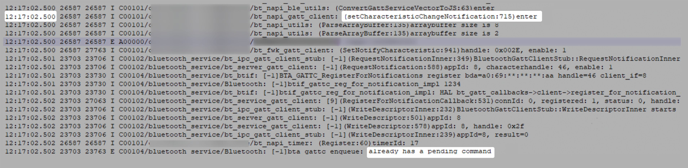

# 蓝牙接口调用报错2900099

<!--Kit: Connectivity Kit-->
<!--Subsystem: Communication-->
<!--Owner: @guoxiadi-->
<!--Designer: @chengguohong; @tangjia15-->
<!--Tester: @wangfeng517-->
<!--Adviser: @zhang_yixin13-->

## 问题现象
在BLE蓝牙应用开发过程中，调用[setCharacteristicChangeNotification](../../reference/apis-connectivity-kit/js-apis-bluetooth-ble.md#setcharacteristicchangenotification)接口时出现2900099报错。

## 背景知识
- [2900099](../../reference/apis-connectivity-kit/errorcode-bluetoothManager.md#2900099)表示接口调用操作失败。一般接口调用阻塞，会返回此错误码。
- setCharacteristicChangeNotification接口提供了client端启用或者禁用接收server端特征值内容变更通知的能力，使用前需仔细阅读接口下方说明。
- 调用setCharacteristicChangeNotification接口后，底层会默认通过描述符的形式向server端写入一次数据请求，server端可通过[on('descriptorWrite')](../../reference/apis-connectivity-kit/js-apis-bluetooth-ble.md#ondescriptorwrite)接收请求，然后调用[sendResponse](../../reference/apis-connectivity-kit/js-apis-bluetooth-ble.md#sendresponse)接口向client返回数据，client成功接收到数据后，即一个完整的setCharacteristicChangeNotification接口请求流程才算完毕。

## 问题定位
- 排查server端是否创建了[on('descriptorWrite')](../../reference/apis-connectivity-kit/js-apis-bluetooth-ble.md#ondescriptorwrite)监听。若server端没有创建此监听，将无法接收到client端发来的描述符请求，client端setCharacteristicChangeNotification接口将会处于持续请求的阻塞状态。
- 排查server端接收到client端发来的描述符请求后，是否及时应答（检查日志是否返回OnSetNotifyCharacteristic关键字）。若server端在接收到client端发来的描述符请求后没有及时调用sendResponse接口应答，client端setCharacteristicChangeNotification接口同样会处于持续请求的阻塞状态。参考错误日志如下：

- 检查client端调用setCharacteristicChangeNotification接口时，是否有其它异步接口调用未完成，导致setCharacteristicChangeNotification接口调用被阻塞。排查方式如下：
  - 通过在接口回调中设置日志打印，查看接口调用的完整顺序流程。从创建对象实例到数据传输，BLE蓝牙client端接口调用顺序参考如下：
    - 调用[createGattClientDevice](../../reference/apis-connectivity-kit/js-apis-bluetooth-ble.md#blecreategattclientdevice)接口创建client实例。
    - 创建BLE蓝牙连接状态监听、MTU变化监听、特征值变化监听等接口。
    - 调用[connect](../../reference/apis-connectivity-kit/js-apis-bluetooth-ble.md#connect)接口连接BLE蓝牙。
    - 调用[setBLEMtuSize](../../reference/apis-connectivity-kit/js-apis-bluetooth-ble.md#setblemtusize)接口协商MTU。
    - 调用[getServices](../../reference/apis-connectivity-kit/js-apis-bluetooth-ble.md#getservices)接口获取server端支持的所有服务能力。
    - 调用setCharacteristicChangeNotification接口设置server端特征值内容变更通知的能力。
    - 调用[writeCharacteristicValue](../../reference/apis-connectivity-kit/js-apis-bluetooth-ble.md#writecharacteristicvalue)接口向server端写入特征值数据。
  
  - 排查系统日志输出。可在问题复现后生成hilog日志，查看日志中各接口调用开始/完成时，系统日志输出的时间点，从而判断是否出现了接口调用阻塞情况。如：setCharacteristicChangeNotification接口调用开始时，系统日志中会打印出关键字setCharacteristicChangeNotification。接口调用完成时，可通过setCharacteristicChangeNotification接口Callback回调中自定义的日志进行判断。参考问题日志如下：

  

## 分析结论
- server端没有创建on('descriptorWrite')监听，或接收到client端发来的描述符请求后，没有及时应答。

- 在调用setCharacteristicChangeNotification接口前一般会先调用setBLEMtuSize异步接口，与server端协商MTU数据传输大小。然后再调用getServices接口，获取server端的特征值服务列表。因此，需要在setBLEMtuSize和getServices接口依次调用成功后，才可以调用setCharacteristicChangeNotification接口，设置接收server端特征值内容变更通知的能力。

## 修改建议
参考[连接和传输数据](gatt-development-guide.md)开发指导。

## 相关问题
BLE蓝牙writeCharacteristicValue接口写入数据时，返回错误码2900099，原因如下。
- 当上一个非监听类BLE蓝牙接口（setBLEMtuSize、getServices和setCharacteristicChangeNotification）回调还未返回时写入数据，会出现2900099报错提示，导致写入数据失败。因此，需要保证在其它非监听类BLE接口回调触发完成后，再调用writeCharacteristicValue接口写入数据。
- 每次重连GATT设备时都会重新创建新的gattClient对象，建立一路新的GATT连接。若每次连接关闭后不及时调用[close](../../reference/apis-connectivity-kit/js-apis-bluetooth-ble.md#close)接口销毁gattClient对象实例，则会导致每次重连时重复多次调用setCharacteristicChangeNotification和getServices，出现busy现象，进而导致报错2900099。因此，每次连接关闭后，需及时销毁gattClient对象。
- 参数错误，系统日志会同时打印Invalid parameters，需要排查是否按GATT规范传入了正确的[BLECharacteristic](../../reference/apis-connectivity-kit/js-apis-bluetooth-ble.md#blecharacteristic)。