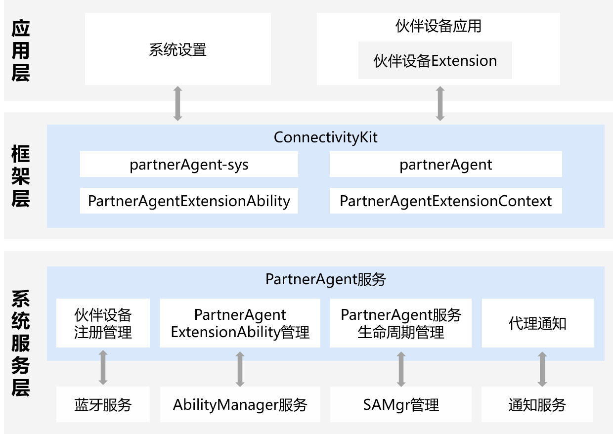

# 融合短距服务开发概述

<!--Kit: Connectivity Kit-->
<!--Subsystem: Communication-->
<!--Owner: @guoxiadi-->
<!--Designer: @chengguohong; @tangjia15-->
<!--Tester: @wangfeng517-->
<!--Adviser: @zhang_yixin13-->

## 概述

融合短距通信服务（以下简称融合短距）是OpenHarmony系统中统一管理短距离通信技术的服务，当前其内部实现了PartnerAgent服务模块。

本模块提供了伙伴设备与OpenHarmony设备互通服务，比如以下主要场景： 
- 媒体控制：手表显示OpenHarmony设备当前播放的音乐、视频；手表或耳机等伙伴设备可以控制OpenHarmony设备媒体播放（上/下一首、播放暂停等）。
- 电话反控：OpenHarmony设备来电通知手表，手表显示来电号码，联系人名称；手表或耳机等伙伴设备可以接听、拒接OpenHarmony设备来电。
- 健康监测：穿戴设备实时采集人体数据上报给OpenHarmony设备；OpenHarmony设备可实时浏览健康检测数据。

这些场景需要保证伙伴设备长时间与OpenHarmony设备保持互通，当存在数据交互比如媒体控制、电话控制、人体健康等数据时，应用需要保证可以唤醒并具备交互数据能力。本服务主要提供了应用进程保持可唤醒状态解决方案，保证伙伴设备需要的伙伴设备厂商应用在数据交互时可被唤醒并正常运行。

## 系统框架

### 模块功能说明

整体架构划分为应用层、框架层（提供API）、系统服务层。

* **应用层**
  * **系统设置**：系统设置应用，负责调用`partnerAgent-sys`系统接口，用于开启或关闭某个伙伴设备的能力。该能力被关闭后，partnerAgent服务后续不会再拉起伙伴设备Extension。
  * **伙伴设备应用**：终端用户应用，由生态设备厂商实现，负责调用`partnerAgent`的`bindDevice()`接口注册伙伴设备。
  * **伙伴设备Extension**：伙伴设备应用实现的`PartnerAgentExtensionAbility`能力。该Extension可以和伙伴设备建立蓝牙连接、进行蓝牙数据传输。伙伴设备Extension收到伙伴设备的命令后，可以进行媒体控制和通话控制。

- **框架层**
  * **partnerAgent-sys**：负责给系统设置提供`enableDeviceControl/disableDeviceControl`接口，用于开启或关闭某个伙伴设备的能力。该能力被关闭后，partnerAgent服务后续不会再拉起伙伴设备Extension。
  * **partnerAgent**：负责对伙伴设备应用提供`bindDevice/unbindDevice/getBoundDevices`等接口，处理伙伴设备的注册绑定和解注册功能。
  * **PartnerAgentExtensionAbility**：负责对伙伴设备Extension提供`onDeviceDiscovered`等接口，用于通知伙伴设备Extension已经发现了对应的伙伴设备。
  * **PartnerAgentExtensionContext**：负责提供伙伴设备Extension被拉起的上下文信息。

- **系统服务层**
  * **伙伴设备注册管理**：管理注册的伙伴设备信息。
    * 伙伴设备应用可调用`bindDevice`注册伙伴设备，调用`unbindDevice`解注册伙伴设备。
    * PartnerAgent服务感知到伙伴设备注册后，才会调用蓝牙服务接口进行BLE扫描和监听蓝牙连接状态去发现伙伴设备。
    * 下述场景PartnerAgent服务会自动解注册设备：1）伙伴设备应用注册的伙伴设备蓝牙配对关系丢失超过30天，2）和已注册伙伴设备关联的伙伴设备应用被卸载。
  * **PartnerAgentExtensionAbility管理**：负责控制伙伴设备Extension，当伙伴设备应用注册的伙伴设备被蓝牙BLE扫描/蓝牙连接发现后，拉起伙伴设备Extension进程，并通过`onDeviceDiscovered`接口通知伙伴设备Extension。
  * **PartnerAgent服务生命周期管理**：该模块提供PartnerAgent服务进程的动态启停功能，防止资源浪费。
  * **代理通知**：该模块负责管理负一屏的通知提醒，主要用于提醒用户，伙伴设备Extension进程正在后台运行，会增加一定的功耗耗电，并且可能会控制OpenHarmony设备的媒体能力和通话能力。
  
  * **蓝牙服务/AbilityManager服务/SAMgr管理/通知服务**：OpenHarmony基础系统服务。蓝牙服务负责蓝牙扫描、蓝牙连接和蓝牙数据传输；AbilityManager服务提供拉起/销毁伙伴设备Extension的能力；SAMgr管理负责拉起/销毁PartnerAgent服务；通知服务负责在负一屏显示通知。
