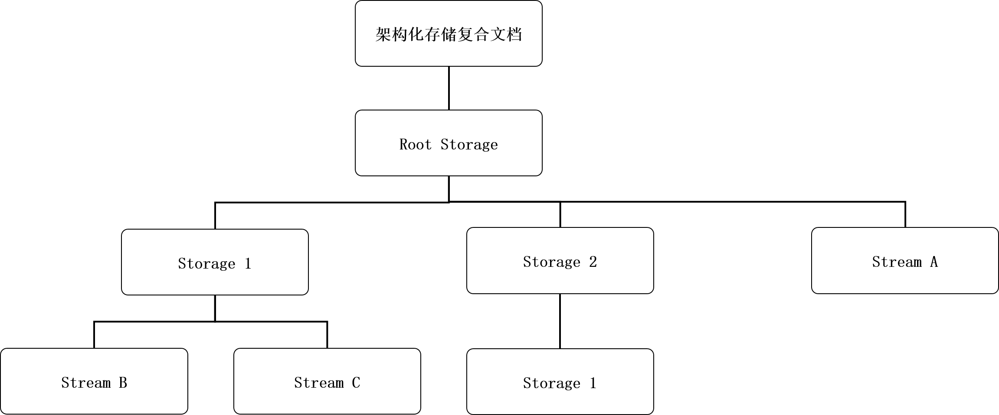

# Content Embed Kit常见问题
<!--Kit: Content Embed Kit-->
<!--Subsystem: officeservice -->
<!--Owner: @weiguoning-->
<!--Designer: @zhuwei-->
<!--Tester: @zhaotianyu-->
<!--Adviser: @jinqiuheng-->

## OE文档存储结构是什么？

OE文档是采用了一种结构化存储的复合文件，结构化存储定义了如何将单个文件视为有两种类型对象（存储对象和流对象）组成的层次化集合，这两种对象分别表现为目录和文件，如下图所示：

- root storage对象：在复合文件中，这个特殊的存储对象扮演着“根节点”的角色。它不仅是storage对象和stream对象层级结构的**最顶层父对象**，在访问任何子存储对象或流对象之前，必须先访问它。
- storage对象：复合文件中的一个对象，类似于文件系统中的目录。storage对象的父对象必须是另一个storage对象或root storage对象。
- stream对象：复合文件中的一个对象，类似于文件系统中的文件。stream对象的父对象必须是一个storage对象或root storage对象。

## 基于文件创建OE文档时如何选择链接和嵌入模式，这两种模式有什么区别？

客户端基于[OH_ContentEmbed_CreateDocumentByFile](../reference/apis-content-embed-kit/capi-content-embed-document-h#OH_ContentEmbed_CreateDocumentByFile)创建OE文档时，可以通过isLinking参数指定是否以链接方式创建OE文档。

- 当isLinking为true时，表示以链接方式创建OE文档。当服务端编辑OE文档时，源文件也会被修改。如果源文件被移动、删除或者重命名时，OE文档拉起编辑会失败，如果用户在文管中恢复原始源文件需要应用进行授权。同时链接方式不支持链接到应用的沙箱目录。
- 当isLinking为false时，表示以嵌入方式创建OE文档。当客户端请求服务端编辑OE文档时，会先拷贝一份临时文件到客户端应用沙箱目录。服务端对OE文档修改时，不会修改源文件。当客户端正常退出时会清空创建的临时文件。

## 客户端基于文件创建OE文档时如何显示文档快照或应用图标？

客户端基于[OH_ContentEmbed_CreateDocumentByFile](../reference/apis-content-embed-kit/capi-content-embed-document-h#OH_ContentEmbed_CreateDocumentByFile)创建文档时，客户端需要通过[OH_ContentEmbed_Proxy_GetCapability](../reference/apis-content-embed-kit/capi-content-embed-proxy-h#OH_ContentEmbed_Proxy_GetCapability)查询OE Extension是否支持获取快照。

- 如果服务端不支持快照时，客户端可以通过<!--RP1-->[OH_NativeBundle_GetAbilityResourceInfo](../reference/apis-ability-kit/capi-native-interface-bundle-h#oh_nativebundle_getabilityresourceinfo)获取文件类型的组件资源信息列表。<!--RP1End-->
- 如果服务端支持获取快照时，客户端可以通过[OH_ContentEmbed_Proxy_GetSnapshot](../reference/apis-content-embed-kit/capi-content-embed-proxy-h#OH_ContentEmbed_Proxy_GetSnapshot)获取快照信息。
