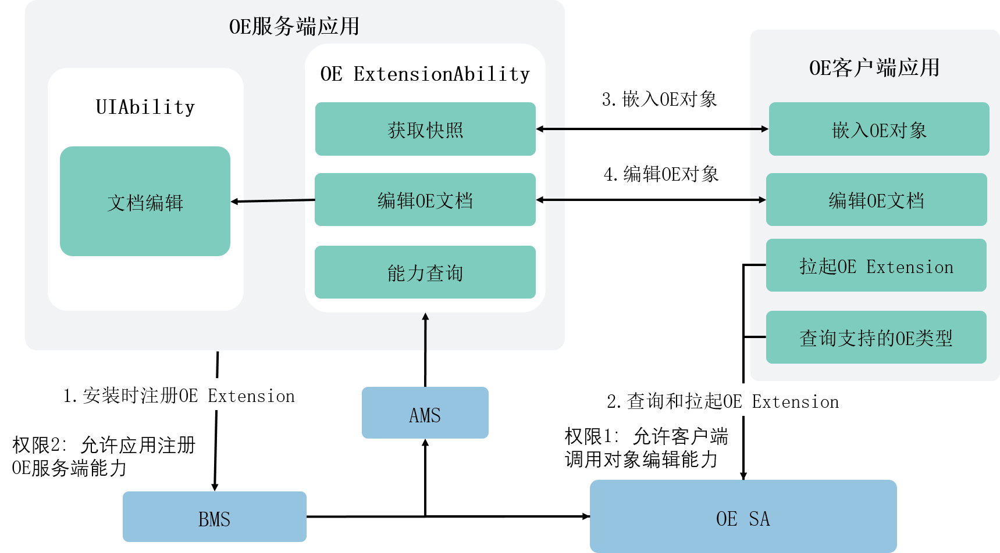

# 应用间内容嵌入与编辑关键流程

<!--Kit: Content Embed Kit-->
<!--Subsystem: ContentEmbed-->
<!--Owner: @wanxiaoguo-->
<!--Designer: @zhuwei,wei-guoning-->
<!--Tester: @yinjian-->
<!--Adviser: @jinqiuheng-->

对象编辑框架采用ExtensionAbility机制进行扩展，主要架构元素包括：[OE Extension](content-embed-kit-terminology.md#OE-Extension)和[OE SA](content-embed-kit-terminology.md#OE-SA)。

以下是OE客户端应用嵌入OE对象，并拉起OE服务端应用编辑OE文档，编辑完成后结果更新至OE客户端宿主文档的关键流程：

1. OE Extension注册：OE服务端应用注册时，会向OE SA注册OE Extension信息。
2. OE客户端查询能力：查询系统当前可支持编辑的文档格式信息。
3. OE客户端嵌入OE对象：OE客户端应用可以通过新建对象类型或已存在文件来嵌入OE对象，OE对象在OE客户端界面中可能呈现为应用图标或者文档快照（Snapshot），此时也需要拉起OE Extension后向OE服务端获取文档快照。
4. 编辑OE文档：OE客户端通过调用接口通知OE服务端编辑OE文档，若OE Extension已被拉起，则OE客户端可直接与OE Extension通信，通知其编辑OE文档；若OE Extension未被拉起，则OE客户端需先拉起OE Extension后再通知其编辑OE文档。当OE文档内容被编辑保存后，OE服务端应用会通知OE客户端应用刷新文档快照，当OE客户端收到对应通知后，应主动调用接口获取OE文档最新快照，并刷新页面来反映文档更新。