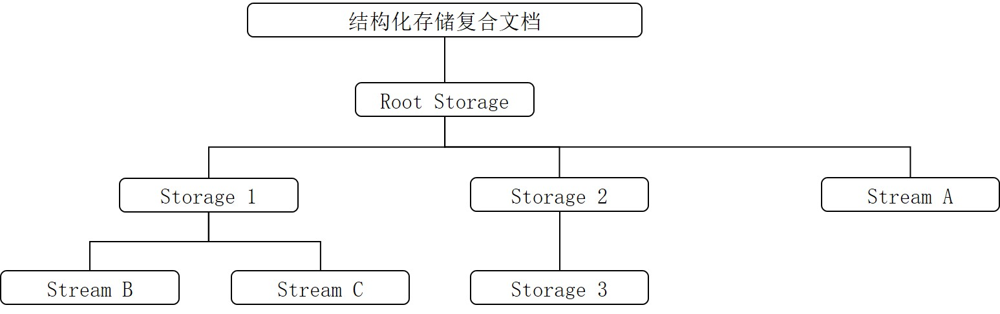

# Content Embed Kit术语
<!--Kit: Content Embed Kit-->
<!--Subsystem: officeservice -->
<!--Owner: @weiguoning-->
<!--Designer: @zhuwei-->
<!--Tester: @zhaotianyu-->
<!--Adviser: @jinqiuheng-->

本文介绍Content Embed Kit相关术语。

## OE

OE是Object Editor（对象编辑）的缩写，代表OpenHarmony提供的对象编辑框架与技术，用来实现应用间文档嵌入与协同编辑。

## OE文档

通过OE技术实现的被嵌入文档，在客户端界面中可能呈现为缩略图或者快照（Snapshot），也可能以标准格式序列化为一段二进制数据保存在内存或者某个文件中。

## OE格式文件

将遵循对象链接与嵌入标准格式的对象数据，经过序列化处理后封装为一段二进制数据流，并持久化存储在文件系统中的数据格式。

## OE文档存储结构

OE文档是一种采用结构化存储的复合文件，结构化存储定义了如何将单个文件视为有两种类型对象（存储对象和流对象）组成的层次化集合，这两种对象分别表现为目录和文件，如下图所示：

- root storage对象：在复合文件中，这个特殊的存储对象扮演着“根节点”的角色。它不仅是storage对象和stream对象层级结构的**最顶层父对象**，在访问任何子存储对象或流对象之前，必须先访问它。
- storage对象：复合文件中的一个对象，类似于文件系统中的目录。storage对象的父对象必须是另一个storage对象或root storage对象。
- stream对象：复合文件中的一个对象，类似于文件系统中的文件。stream对象的父对象必须是一个storage对象或root storage对象。

## OEID

系统可识别的**OE文档**标识符，包含在文档中。系统通过OEID定位并加载支持该OE文档的OE服务端应用，从而实现编辑功能。

## OE Extension

Content Embed Kit提供的[ExtensionAbility组件](../application-models/extensionability-overview.md)，用于三方应用实现特定格式文档嵌入与编辑能力。

## OE SA

OE SA是运行于独立进程中的系统服务，作为OE能力的核心调度和管理模块，负责与系统底层能力交互，并对上层框架提供支撑，提供对应的OE ExtensionAbility的注册和管理能力。

## 客户端OE对象

客户端开发者用于封装OE文档的对象嵌入和编辑的程序对象，并且可与OE服务端进行交互。

## 服务端OE对象

服务端开发者用于封装OE文档的对象嵌入和编辑的程序对象，与客户端OE对象指向同一个OE文档，且可与客户端OE对象交互。

## AMS
AMS (Ability Manager Service)：Ability管理服务，为**OE SA**提供内部接口`ConnectExtensionAbility/DisconnectExtensionAbility`，用于启动和停止OE Extension。

## BMS
BMS (Bundle Manager Service)：包管理服务，为**OE SA**提供已安装应用中注册的OE Extension信息查询功能，并支持通过事件通知实现OE Extension信息的动态增加、修改和删除。
