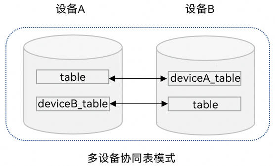
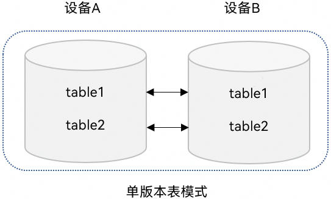

# 关系型数据库跨设备数据同步 (ArkTS)
<!--Kit: ArkData-->
<!--Subsystem: DistributedDataManager-->
<!--Owner: @baijidong-->
<!--Designer: @widecode; @htt1997-->
<!--Tester: @yippo; @logic42-->
<!--Adviser: @ge-yafang-->


## 场景介绍

当应用程序本地存储的关系型数据存在跨设备同步的需求时，可以将需要同步的表数据迁移到新的支持跨设备的表中，当然也可以在刚完成表创建时设置其支持跨设备。


## 基本概念

关系型数据库跨设备数据同步，支持应用在多设备间同步存储的关系型数据。

- 分布式表：支持组网内多设备间数据同步的数据库表。来自其他设备的数据将同步至本地，API version 23之前，仅支持通过与设备ID关联的表名进行存储，默认为多设备协同表模式；从API version 23开始，支持单版本表模式。
- 数据同步：将设备上数据库中分布式表发生的变更，同步至组网内其他设备。有推送数据和拉取数据两种方式触发同步。
- 数据变化通知：组网内其他设备数据发生的变化同步至当前设备时，会执行已注册的回调函数。

## 运作机制

底层通信组件完成设备发现和认证，会通知上层应用程序设备上线。收到设备上线的消息后数据管理服务可以在两个设备之间建立加密的数据传输通道，利用该通道在两个设备之间进行数据同步。


### 数据跨设备同步机制


业务将数据写入关系型数据库后，向数据管理服务发起同步请求。

数据管理服务从应用沙箱内读取待同步数据，根据对端设备的deviceId将数据发送到其他设备的数据管理服务。再由数据管理服务将数据写入同应用的数据库内。


### 数据变化通知机制

增、删、改数据库时，会给订阅者发送数据变化的通知。主要分为本地数据变化通知和分布式数据变化通知。

- **本地数据变化通知**：本地设备的应用内订阅数据变化通知，数据库增删改数据时，会收到通知。

- **分布式数据变化通知**：同一应用订阅组网内其他设备数据变化的通知，其他设备增删改数据时，本设备会收到通知。

### 数据同步存储机制

跨设备数据同步默认采用多设备协同表模式进行管理；从API version 23开始，支持使用单版本表模式进行数据存储。

**多设备协同表模式**

在该模式下，各设备的数据将被隔离存储在独立的分布式表中，而非写入本地表，分布式表名为在原来表名前拼接对端设备的DeviceID标识符，如下图所示。

当某一设备接收到其他设备同步过来的数据时，这些数据将自动写入对应的分布式表中，可通过obtainDistributedTableName获取对应表名并进行查询。

需要注意的是，该模式下不支持对其他设备同步过来的数据进行修改。这一限制旨在保障数据一致性与同步逻辑的稳定性。



**单版本表模式**

在该模式下，同步数据会直接写入本地表中，如下图所示。

使用单版本表模式跨设备同步，需要配置schema文件，指定所需同步列以及解冲突列；单版本表模式同步数据支持修改对端设备同步过来的数据。



## 约束限制

- 每个应用程序最多支持同时打开16个关系型分布式数据库。

- 单个数据库最多支持注册8个订阅数据变化的回调。

- 不支持将含有复合键的表设置为分布式表。

- 单版本表模式使用需要配置schema文件，用以指定同步列以及指定解冲突列，请参考[使用单版本表模式进行数据同步](#使用单版本表模式进行数据同步)。

- 同一张表不能同时配置为端端分布式表和端云分布式表，且不支持切换。

- 同一数据库下所有端端分布式表必须为一种数据同步存储机制，且不支持切换。

- 多设备协同表模式下不支持设置schema，默认不读取schema文件。

## 接口说明

以下是关系型设备协同分布式数据库跨设备数据同步功能的相关接口，大部分为异步接口。异步接口均有callback和Promise两种返回形式，下表均以callback形式为例，更多接口及使用方式请见[关系型数据库](../reference/apis-arkdata/arkts-apis-data-relationalStore.md)。

| 接口名称 | 描述 | 
| -------- | -------- |
| setDistributedTables(tables: Array&lt;string&gt;, callback: AsyncCallback&lt;void&gt;): void | 设置分布式同步表。只支持多设备协同表模式。| 
| setDistributedTables(tables: Array&lt;string&gt;, type: DistributedType, config: DistributedConfig, callback: AsyncCallback&lt;void&gt;): void | 设置分布式同步表。 | 
| sync(mode: SyncMode, predicates: RdbPredicates, callback: AsyncCallback&lt;Array&lt;[string, number]&gt;&gt;): void | 分布式数据同步。 | 
| on(event: 'dataChange', type: SubscribeType, observer: Callback&lt;Array&lt;string&gt;&gt;): void | 订阅分布式数据变化。 | 
| off(event:'dataChange', type: SubscribeType, observer: Callback&lt;Array&lt;string&gt;&gt;): void | 取消订阅分布式数据变化。 | 
| obtainDistributedTableName(device: string, table: string, callback: AsyncCallback&lt;string&gt;): void | 根据本地数据库表名获取指定设备上的表名。只支持多设备协同表模式。 | 
| remoteQuery(device: string, table: string, predicates: RdbPredicates, columns: Array&lt;string&gt; , callback: AsyncCallback&lt;ResultSet&gt;): void | 根据指定条件查询远程设备数据库中的数据。 | 


## 使用多设备协同表模式进行数据同步

> **说明：**
>
> 数据只允许向数据安全标签不高于对端设备安全等级的设备同步数据，具体规则可见[跨设备同步访问控制机制](access-control-by-device-and-data-level.md#跨设备同步访问控制机制)。

1. 导入模块。
   <!--@[sync_import](https://gitcode.com/openharmony/applications_app_samples/blob/master/code/DocsSample/ArkData/RelationalStore/DataSyncAndPersistence/entry/src/main/ets/pages/datasync/RdbDataSync.ets)--> 
   
   ``` TypeScript
   import { relationalStore } from '@kit.ArkData'; // 导入模块
   import { BusinessError } from '@kit.BasicServicesKit';
   import { distributedDeviceManager } from '@kit.DistributedServiceKit';
   import { hilog } from '@kit.PerformanceAnalysisKit';
   const DOMAIN = 0x0000;
   ```

2. 请求权限。

   1. 需要申请ohos.permission.DISTRIBUTED_DATASYNC权限，配置方式请参见[声明权限](../security/AccessToken/declare-permissions.md)。
   2. 同时需要在应用首次启动时弹窗向用户申请授权，使用方式请参见[向用户申请授权](../security/AccessToken/request-user-authorization.md)。

3. 创建关系型数据库，创建数据表，并将需要进行跨设备同步的数据表设置为分布式表，默认采用多设备协同表模式进行数据存储和管理。
   <!--@[setDefaultDistributedTables](https://gitcode.com/openharmony/applications_app_samples/blob/master/code/DocsSample/ArkData/RelationalStore/DataSyncAndPersistence/entry/src/main/ets/pages/datasync/RdbDataSync.ets)--> 
   
   ``` TypeScript
   let context = getContext();
   let store: relationalStore.RdbStore | undefined = undefined;
   // ...
     const STORE_CONFIG: relationalStore.StoreConfig = {
       name: 'RdbTest.db', // 数据库文件名
       securityLevel: relationalStore.SecurityLevel.S3 // 数据库安全级别
     };
     // 打开数据库并设置分布式表
     relationalStore.getRdbStore(context, STORE_CONFIG).then(async (rdbStore: relationalStore.RdbStore) => {
       store = rdbStore;
       await store.executeSql('CREATE TABLE IF NOT EXISTS EMPLOYEE (ID INTEGER PRIMARY KEY AUTOINCREMENT, NAME TEXT NOT NULL, AGE INTEGER, SALARY REAL, CODES BLOB)');
       // 将已创建的表设置分布式表。
       await store.setDistributedTables(['EMPLOYEE']);
     }).catch((err: BusinessError) => {
       hilog.error(DOMAIN, 'rdbDataSync', `Get RdbStore failed, code is ${err.code}, message is ${err.message}`);
     });
   ```

4. 订阅组网内其他设备的数据变化消息。
   1. 调用[on('dataChange')](../reference/apis-arkdata/arkts-apis-data-relationalStore-RdbStore.md#ondatachange)接口监听其他设备的数据变化，当数据变化同步至当前设备时，将执行订阅的回调方法，入参为数据发生变化的设备ID列表。
   2. 通过设备ID获取与设备对应的分布式表表名，查询对应设备分布式表中的数据。
   <!--@[on_data_change](https://gitcode.com/openharmony/applications_app_samples/blob/master/code/DocsSample/ArkData/RelationalStore/DataSyncAndPersistence/entry/src/main/ets/pages/datasync/RdbDataSync.ets)--> 
   
   ``` TypeScript
   // 订阅组网内其他设备的数据变化消息
   if (store) {
     try {
       // 查询组网内的设备列表
       const deviceManager = distributedDeviceManager.createDeviceManager('com.example.rdbDataSync');
       const deviceList = deviceManager.getAvailableDeviceListSync();
       const devices: string[] = [];
       deviceList.forEach(item => {
         if (item.networkId) {
           devices.push(item.networkId);
         }
       });
       // 调用分布式数据订阅接口，注册数据库的观察者
       // 当分布式数据库中的数据发生更改时，将调用回调
       store.on('dataChange', relationalStore.SubscribeType.SUBSCRIBE_TYPE_REMOTE, async (devices) => {
         for (let i = 0; i < devices.length; i++) {
           let device = devices[i];
           if (!store) {
             return;
           }
           hilog.info(DOMAIN, 'rdbDataSync', `The data of device:${device} has been changed.`);
           // 获取device对应的分布式表名。
           const distributedTableName = await store.obtainDistributedTableName(device, 'EMPLOYEE');
           // 创建查询谓词，查询组网内设备分布式表的数据
           const predicates = new relationalStore.RdbPredicates(distributedTableName);
           const resultSet = await store.query(predicates);
           hilog.info(DOMAIN, 'rdbDataSync', `device ${device}, table EMPLOYEE rowCount is: ${resultSet.rowCount}`);
         }
       });
     } catch (err) {
       hilog.error(DOMAIN, 'rdbDataSync', `Failed to register observer. Code:${err.code},message:${err.message}`);
     }
   }
   ```

5. 同步当前设备数据变化至组网内其他设备。
   1. 当前设备分布式表中的数据发生变化后，调用RdbStore的[sync](../reference/apis-arkdata/arkts-apis-data-relationalStore-RdbStore.md#sync-1)接口传入[SYNC_MODE_PUSH](../reference/apis-arkdata/arkts-apis-data-relationalStore-e.md#syncmode)参数推送数据变化至其他设备。
   2. 通过谓词的[inDevices](../reference/apis-arkdata/arkts-apis-data-relationalStore-RdbPredicates.md#indevices)方法指定推送的目标设备。
  
   <!--@[data_sync_push](https://gitcode.com/openharmony/applications_app_samples/blob/master/code/DocsSample/ArkData/RelationalStore/DataSyncAndPersistence/entry/src/main/ets/pages/datasync/RdbDataSync.ets)--> 
   
   ``` TypeScript
   // 同步当前设备数据变化至组网内其他设备
   if (store) {
     // 当前设备分布式数据表中插入新数据
     const ret = store.insertSync('EMPLOYEE', {
       name: 'sync_me',
       age: 18,
       salary: 666
     });
     hilog.info(DOMAIN, 'rdbDataSync', 'Insert to distributed table EMPLOYEE, result: ' + ret);
     // 查询组网内的设备列表
     const deviceManager = distributedDeviceManager.createDeviceManager('com.example.rdbDataSync');
     const deviceList = deviceManager.getAvailableDeviceListSync();
     const syncTarget: string[] = [];
     deviceList.forEach(item => {
       if (item.networkId) {
         syncTarget.push(item.networkId);
       }
     });
     if (syncTarget.length === 0) {
       hilog.error(DOMAIN, 'rdbDataSync', 'no device to sync');
     } else {
       // 构造用于同步分布式表的谓词对象
       const predicates = new relationalStore.RdbPredicates('EMPLOYEE');
       // 指定要同步的设备列表
       predicates.inDevices(syncTarget);
       try {
         // 调用同步数据的接口推送当前设备数据变化至组网内其他设备
         const result = await store.sync(relationalStore.SyncMode.SYNC_MODE_PUSH, predicates);
         hilog.info(DOMAIN, 'rdbDataSync', 'Push data success.');
         // 获取同步结果
         for (let i = 0; i < result.length; i++) {
           const deviceId = result[i][0];
           const syncResult = result[i][1];
           if (syncResult === 0) {
             hilog.info(DOMAIN, 'rdbDataSync', `device:${deviceId} sync success`);
           } else {
             hilog.error(DOMAIN, 'rdbDataSync', `device:${deviceId} sync failed, status:${syncResult}`);
           }
         }
       } catch (e) {
         hilog.error(DOMAIN, 'rdbDataSync', 'Push data failed, code: ' + e.code + ', message: ' + e.message);
       }
     }
   }
   ```

6. 拉取组网内其他设备的数据变化。
   1. 当前设备可调用RdbStore的[sync](../reference/apis-arkdata/arkts-apis-data-relationalStore-RdbStore.md#sync-1)接口传入[SYNC_MODE_PULL](../reference/apis-arkdata/arkts-apis-data-relationalStore-e.md#syncmode)参数拉取组网内其他设备的数据变化。
   2. 通过谓词的[inDevices](../reference/apis-arkdata/arkts-apis-data-relationalStore-RdbPredicates.md#indevices)方法指定拉取的目标设备。
   
   <!--@[data_sync_pull](https://gitcode.com/openharmony/applications_app_samples/blob/master/code/DocsSample/ArkData/RelationalStore/DataSyncAndPersistence/entry/src/main/ets/pages/datasync/RdbDataSync.ets)--> 
   
   ``` TypeScript
   // 拉取组网内其他设备的数据变化
   if (store) {
     // 查询组网内的设备列表
     const deviceManager = distributedDeviceManager.createDeviceManager('com.example.rdbDataSync');
     const deviceList = deviceManager.getAvailableDeviceListSync();
     const syncTarget: string[] = [];
     deviceList.forEach(item => {
       if (item.networkId) {
         syncTarget.push(item.networkId);
       }
     });
     if (syncTarget.length === 0) {
       hilog.error(DOMAIN, 'rdbDataSync', 'no device to pull data');
     } else {
       // 构造用于同步分布式表的谓词对象
       const predicates = new relationalStore.RdbPredicates('EMPLOYEE');
       // 指定要同步的设备列表
       predicates.inDevices(syncTarget);
       try {
         // 调用同步数据的接口拉取其他设备数据变化至当前设备
         const result = await store.sync(relationalStore.SyncMode.SYNC_MODE_PULL, predicates);
         hilog.info(DOMAIN, 'rdbDataSync', 'Pull data success.');
         // 获取同步结果
         for (let i = 0; i < result.length; i++) {
           const deviceId = result[i][0];
           const syncResult = result[i][1];
           if (syncResult === 0) {
             hilog.info(DOMAIN, 'rdbDataSync', `device:${deviceId} sync success`);
           } else {
             hilog.error(DOMAIN, 'rdbDataSync', `device:${deviceId} sync failed, status:${syncResult}`);
           }
         }
       } catch (e) {
         hilog.error(DOMAIN, 'rdbDataSync', 'Pull data failed, code: ' + e.code + ', message: ' + e.message);
       }
     }
   }
   ```

7. 当数据未完成同步，或未触发数据同步时，可使用RdbStore的[remoteQuery](../reference/apis-arkdata/arkts-apis-data-relationalStore-RdbStore.md#remotequery-1)方法查询组网内指定设备上分布式表中的数据。
   <!--@[data_remote_query](https://gitcode.com/openharmony/applications_app_samples/blob/master/code/DocsSample/ArkData/RelationalStore/DataSyncAndPersistence/entry/src/main/ets/pages/datasync/RdbDataSync.ets)--> 
   
   ``` TypeScript
   // 查询组网内指定设备上分布式表中的数据
   if (store) {
     // 查询组网内的设备列表
     const deviceManager = distributedDeviceManager.createDeviceManager('com.example.rdbDataSync');
     const deviceList = deviceManager.getAvailableDeviceListSync();
     const devices: string[] = [];
     deviceList.forEach(item => {
       if (item.networkId) {
         devices.push(item.networkId);
       }
     });
     if (devices.length === 0) {
       hilog.error(DOMAIN, 'rdbDataSync', 'no device to query data');
       return;
     }
     // 构造用于查询分布式表的谓词对象
     const predicates = new relationalStore.RdbPredicates('EMPLOYEE');
     try {
       // 查询组网内设备上的分布式表
       const resultSet = await store.remoteQuery(devices[0], 'EMPLOYEE', predicates, ['ID', 'NAME', 'AGE', 'SALARY', 'CODES']);
       hilog.info(DOMAIN, 'rdbDataSync', `ResultSet column names: ${resultSet.columnNames}, column count: ${resultSet.columnCount}`);
     } catch (e) {
       hilog.error(DOMAIN, 'rdbDataSync', 'Remote query failed, code: ' + e.code + ', message: ' + e.message);
     }
   }
   ```

## 使用单版本表模式进行数据同步

使用单版本表模式进行数据同步，基本开发步骤与[使用多设备协同表模式进行数据同步](#使用多设备协同表模式进行数据同步)相似。不过在创建数据表时（即使用多设备协同表模式进行数据同步中的步骤3），需要将进行跨设备同步的数据表设置为SINGLE_VERSION单版本类型。示例如下：
   <!--@[setSingleDistributedTables](https://gitcode.com/openharmony/applications_app_samples/blob/master/code/DocsSample/ArkData/RelationalStore/DataSyncAndPersistence/entry/src/main/ets/pages/datasync/RdbDataSync.ets)--> 
   
   ``` TypeScript
   let context = getContext();
   let store: relationalStore.RdbStore | undefined = undefined;
   // ...
     const STORE_CONFIG: relationalStore.StoreConfig = {
       name: 'RdbTest.db', // 数据库文件名
       securityLevel: relationalStore.SecurityLevel.S3 // 数据库安全级别
     };
     // 打开数据库并设置分布式表
     const DISTRIBUTED_CONFIG: relationalStore.DistributedConfig = {
       autoSync: false,
       asyncDownloadAsset: false,
       enableCloud: false,
       tableType: relationalStore.DistributedTableType.SINGLE_VERSION
     }
     relationalStore.getRdbStore(context, STORE_CONFIG).then(async (rdbStore: relationalStore.RdbStore) => {
       store = rdbStore;
       await store.executeSql('CREATE TABLE IF NOT EXISTS EMPLOYEE (ID INTEGER PRIMARY KEY AUTOINCREMENT, NAME TEXT NOT NULL UNIQUE, AGE INTEGER, SALARY REAL, CODES BLOB)');
       await store.executeSql('CREATE TABLE IF NOT EXISTS EMPLOYEE2 (NAME TEXT NOT NULL UNIQUE, AGE INTEGER, SALARY REAL, CODES BLOB, PRIMARY KEY (NAME))');
       // 将已创建的表设置分布式表。
       await store.setDistributedTables(['EMPLOYEE', 'EMPLOYEE2'], relationalStore.DistributedType.DISTRIBUTED_DEVICE, DISTRIBUTED_CONFIG);
     }).catch((err: BusinessError) => {
       hilog.error(DOMAIN, 'rdbDataSync', `Get RdbStore failed, code is ${err.code}, message is ${err.message}`);
     });
   ```

另外，在使用单版本表模式进行数据同步时，还需要配置schema文件，以指定需要同步的列及解决冲突的列。

具体配置及格式要求可见下文的[配置schema文件](#配置schema文件)。

## 配置schema文件

在使用单版本表模式进行数据同步时，需要配置schema文件。

### schema文件名及路径要求

schema文件名及路径不支持自定义，否则使用单版本表模式进行数据同步将读取不到对应文件，设置分布表也会失败。 

-  文件名：sync_schema.json

- 文件路径：`../entry/src/main/resources/rawfile/arkdata/schema/sync_schema.json`

### schema文件内容层级及目录结构

schema文件为json格式，文件主要为在dbSchema字段下进行多项配置，可以配置多个数据库。

- dbSchema：schema名称，array[db]，必填字段。
  - version：当前schema版本，int类型，必填字段。
  - bundleName：应用包名，string类型，必填字段。
  - dbName：数据库名称，string类型，必填字段。如示例中数据库名为"RdbTest.db"，则此处配置为："RdbTest"。
  - tables：数据库中表信息，array[table]。
    - tableName：表名，string，必填字段。
    - deviceSyncFields：指定端端同步对应的列，array[string]，其中字段必须在fields中，且必须在数据库表中，否则不会同步；该字段为必填字段，否则设置分布式表失败。
    - fields：数据库表字段详细信息，array[field]。
      - columnName：字段名，string类型，必填字段。
      - type：字段类型，string类型，必填字段，可选参数范围为：["Text", "Integer", "Long", "Float", "Double", "Blob" ]。
      - primaryKey：该字段表示是否为指定解冲突列，与表中是否为主键无关，bool类型。若是自增表，该字段为必填字段。其中：true表示为解冲突列，false表示非解冲突列，默认为false。
      - autoIncrement：是否自增属性，必须与表结构中对应，bool类型。关系型数据库跨设备数据同步不支持同步自增主键。其中：true表示自增主键，false表示非自增主，键默认为false。
      - notNull：是否非空，bool类型，非必填字段。其中：true表示非空字段，false表示可以为空字段，默认为false。

### schema示例

```json
{
    "dbSchema": [
      {
        "version": 0,
        "bundleName": "com.example.rdbDataSync",
        "dbName": "RdbTest",
        "tables": [
          {
            "tableName": "EMPLOYEE",
            "deviceSyncFields": ["NAME", "AGE", "SALARY", "CODES"],
            "fields": [
              {
                "columnName": "ID",
                "type": "Integer",
                "primaryKey": false,
                "notNull": false,
                "autoIncrement": true
              },
              {
                "columnName": "NAME",
                "type": "Text",
                "primaryKey": true,
                "notNull": true,
                "autoIncrement": false
              },
              {
                "columnName": "AGE",
                "type": "Integer",
                "primaryKey": false,
                "notNull": false,
                "autoIncrement": false
              },
              {
                "columnName": "SALARY",
                "type": "Float",
                "primaryKey": false,
                "notNull": false,
                "autoIncrement": false
              },
              {
                "columnName": "CODES",
                "type": "Blob",
                "primaryKey": false,
                "notNull": false,
                "autoIncrement": false
              }
            ]
          },
          {
            "tableName": "EMPLOYEE2",
            "deviceSyncFields": ["NAME", "AGE", "SALARY", "CODES"],
            "fields": [
              {
                "columnName": "NAME",
                "type": "Text",
                "primaryKey": true,
                "notNull": true,
                "autoIncrement": false
              },
              {
                "columnName": "AGE",
                "type": "Integer",
                "primaryKey": false,
                "notNull": false,
                "autoIncrement": false
              },
              {
                "columnName": "SALARY",
                "type": "Float",
                "primaryKey": false,
                "notNull": false,
                "autoIncrement": false
              },
              {
                "columnName": "CODES",
                "type": "Blob",
                "primaryKey": false,
                "notNull": false,
                "autoIncrement": false
              }
            ]
          }
        ]
      }
    ]
  }
```

### schema约束与示意

- 不支持解冲突列变化。
  
  错误示例：schema版本升级后，指定解冲突列由"NAME"改为"AGE"。
    - 旧版本schema：
      ``` Json
      {
        "dbSchema": [
          {
            "version": 0,
            "bundleName": "com.example.rdbDataSync",
            "dbName": "RdbTest",
            "tables": [
              {
                "tableName": "EMPLOYEE",
                "deviceSyncFields": ["NAME", "AGE"],
                "fields": [
                  {
                    "columnName": "NAME",
                    "type": "Text",
                    "primaryKey": true,
                    "notNull": true,
                    "autoIncrement": false
                  },
                  {
                    "columnName": "AGE",
                    "type": "Integer",
                    "primaryKey": false,
                    "notNull": false,
                    "autoIncrement": false
                  }
                ]
              }
            ]
          }
        ]
      }
      ```
    - 升级版本schema：
      ``` Json
      {
        "dbSchema": [
          {
            "version": 1,
            "bundleName": "com.example.rdbDataSync",
            "dbName": "RdbTest",
            "tables": [
              {
                "tableName": "EMPLOYEE",
                "deviceSyncFields": ["NAME", "AGE"],
                "fields": [
                  {
                    "columnName": "NAME",
                    "type": "Text",
                    "primaryKey": false,
                    "notNull": true,
                    "autoIncrement": false
                  },
                  {
                    "columnName": "AGE",
                    "type": "Integer",
                    "primaryKey": true,
                    "notNull": false,
                    "autoIncrement": false
                  }
                ]
              }
            ]
          }
        ]
      }
      ```

- 解冲突列只能有一个。
  
  错误示例：schema中指定字段"NAME"和"AGE"两个解冲突列。schema示例如下：

   ``` Json
   {
     "dbSchema": [
       {
         "version": 0,
         "bundleName": "com.example.rdbDataSync",
         "dbName": "RdbTest",
         "tables": [
           {
             "tableName": "EMPLOYEE",
             "deviceSyncFields": ["NAME", "AGE"],
             "fields": [
               {
                 "columnName": "NAME",
                 "type": "Text",
                 "primaryKey": true,
                 "notNull": true,
                 "autoIncrement": false
               },
               {
                 "columnName": "AGE",
                 "type": "Integer",
                 "primaryKey": true,
                 "notNull": false,
                 "autoIncrement": false
               }
             ]
           }
         ]
       }
     ]
   }
   ```

- 同步列必须存在表中。
  
  错误示例：schema指定字段"NAMe"，与表中字段"NAME"大小写不一致。
    - 建表语句：'CREATE TABLE IF NOT EXISTS EMPLOYEE (ID INTEGER PRIMARY KEY AUTOINCREMENT, NAME TEXT NOT NULL, AGE INTEGER, SALARY REAL, CODES BLOB)'
    - schema：
      ``` Json
      {
        "dbSchema": [
          {
            "version": 0,
            "bundleName": "com.example.rdbDataSync",
            "dbName": "RdbTest",
            "tables": [
              {
                "tableName": "EMPLOYEE",
                "deviceSyncFields": ["NAMe", "AGE"],
                "fields": [
                  {
                    "columnName": "NAME",
                    "type": "Text",
                    "primaryKey": true,
                    "notNull": true,
                    "autoIncrement": false
                  },
                  {
                    "columnName": "AGE",
                    "type": "Integer",
                    "primaryKey": false,
                    "notNull": false,
                    "autoIncrement": false
                  }
                ]
              }
            ]
          }
        ]
      }
      ```

- 同步列变化时，存量数据会重新同步。若schema中有新增指定同步列，已有指定同步列以及新增指定列数据会重新触发同步。

- schema有变化时，version需要增加。
  
  错误示例：schema中新增同步字段"AGE"，但是version未增加。
    - 旧版本schema：
      ``` Json
      {
        "dbSchema": [
          {
            "version": 0,
            "bundleName": "com.example.rdbDataSync",
            "dbName": "RdbTest",
            "tables": [
              {
                "tableName": "EMPLOYEE",
                "deviceSyncFields": ["NAME"],
                "fields": [
                  {
                    "columnName": "NAME",
                    "type": "Text",
                    "primaryKey": true,
                    "notNull": true,
                    "autoIncrement": false
                  },
                  {
                    "columnName": "AGE",
                    "type": "Integer",
                    "primaryKey": false,
                    "notNull": false,
                    "autoIncrement": false
                  }
                ]
              }
            ]
          }
        ]
      }
      ```
    - 升级版本schema：
      ``` Json
      {
        "dbSchema": [
          {
            "version": 0,
            "bundleName": "com.example.rdbDataSync",
            "dbName": "RdbTest",
            "tables": [
              {
                "tableName": "EMPLOYEE",
                "deviceSyncFields": ["NAME", "AGE"],
                "fields": [
                  {
                    "columnName": "NAME",
                    "type": "Text",
                    "primaryKey": true,
                    "notNull": true,
                    "autoIncrement": false
                  },
                  {
                    "columnName": "AGE",
                    "type": "Integer",
                    "primaryKey": false,
                    "notNull": false,
                    "autoIncrement": false
                  }
                ]
              }
            ]
          }
        ]
      }
      ```

- 单版本表模式下，表中所有UNIQUE列必须同步。
  
  错误示例："AGE"为UNIQUE列，但是未指定该字段同步
    - 建表语句：'CREATE TABLE IF NOT EXISTS EMPLOYEE (ID INTEGER PRIMARY KEY AUTOINCREMENT, NAME TEXT NOT NULL UNIQUE, AGE INTEGER UNIQUE, SALARY REAL, CODES BLOB)'。
    - schema：
      ``` Json
      {
        "dbSchema": [
          {
            "version": 0,
            "bundleName": "com.example.rdbDataSync",
            "dbName": "RdbTest",
            "tables": [
              {
                "tableName": "EMPLOYEE",
                "deviceSyncFields": ["NAME"],
                "fields": [
                  {
                    "columnName": "NAME",
                    "type": "Text",
                    "primaryKey": true,
                    "notNull": true,
                    "autoIncrement": false
                  },
                  {
                    "columnName": "AGE",
                    "type": "Integer",
                    "primaryKey": false,
                    "notNull": false,
                    "autoIncrement": false
                  }
                ]
              }
            ]
          }
        ]
      }
      ```

- 自增表下，不支持指定非主键列解冲突又同步主键。
  
  错误示例：自增表下，指定"NAME"为解冲突列，但是又同步字段"ID"。
    - 建表语句：'CREATE TABLE IF NOT EXISTS EMPLOYEE (ID INTEGER PRIMARY KEY AUTOINCREMENT, NAME TEXT NOT NULL UNIQUE, AGE INTEGER, SALARY REAL, CODES BLOB)'。
    - schema：
      ``` Json
      {
        "dbSchema": [
          {
            "version": 0,
            "bundleName": "com.example.rdbDataSync",
            "dbName": "RdbTest",
            "tables": [
              {
                "tableName": "EMPLOYEE",
                "deviceSyncFields": ["ID", "NAME" ],
                "fields": [
                  {
                    "columnName": "ID",
                    "type": "Integer",
                    "primaryKey": false,
                    "notNull": false,
                    "autoIncrement": true
                  },
                  {
                    "columnName": "NAME",
                    "type": "Text",
                    "primaryKey": true,
                    "notNull": true,
                    "autoIncrement": false
                  }
                ]
              }
            ]
          }
        ]
      }
      ```

- schema版本升级时，指定同步列只能新增不能减少。
  
  错误示例：schema版本由0升级为1，指定同步列"AGE"被删除。
    - 旧版本schema：
      ``` Json
      {
        "dbSchema": [
          {
            "version": 0,
            "bundleName": "com.example.rdbDataSync",
            "dbName": "RdbTest",
            "tables": [
              {
                "tableName": "EMPLOYEE",
                "deviceSyncFields": ["NAME", "AGE"],
                "fields": [
                  {
                    "columnName": "NAME",
                    "type": "Text",
                    "primaryKey": true,
                    "notNull": true,
                    "autoIncrement": false
                  },
                  {
                    "columnName": "AGE",
                    "type": "Integer",
                    "primaryKey": false,
                    "notNull": false,
                    "autoIncrement": false
                  }
                ]
              }
            ]
          }
        ]
      }
      ```
    - 升级版本schema：
      ``` Json
      {
        "dbSchema": [
          {
            "version": 1,
            "bundleName": "com.example.rdbDataSync",
            "dbName": "RdbTest",
            "tables": [
              {
                "tableName": "EMPLOYEE",
                "deviceSyncFields": ["NAME"],
                "fields": [
                  {
                    "columnName": "NAME",
                    "type": "Text",
                    "primaryKey": true,
                    "notNull": true,
                    "autoIncrement": false
                  },
                  {
                    "columnName": "AGE",
                    "type": "Integer",
                    "primaryKey": false,
                    "notNull": false,
                    "autoIncrement": false
                  }
                ]
              }
            ]
          }
        ]
      }
      ```

- 同步列不能为空，deviceSyncFields长度至少为1，若schema中未配置字段deviceSyncFields，默认为空。
  
  错误示例：schema中没有配置deviceSyncFields，设置单版本模式分布式表失败。schema示例如下：

   ``` Json
   {
     "dbSchema": [
       {
         "version": 0,
         "bundleName": "com.example.rdbDataSync",
         "dbName": "RdbTest",
         "tables": [
           {
             "tableName": "EMPLOYEE",
             "fields": [
               {
                 "columnName": "NAME",
                 "type": "Text",
                 "primaryKey": true,
                 "notNull": true,
                 "autoIncrement": false
               },
               {
                 "columnName": "AGE",
                 "type": "Integer",
                 "primaryKey": false,
                 "notNull": false,
                 "autoIncrement": false
               }
             ]
           }
         ]
       }
     ]
   }
   ```

- 表中not null字段必须有默认值，否则要指定同步。
  
  错误示例：字段"AGE"为not null值，没有默认值，同步schema中没有指定"AGE"同步。
    - 建表语句：'CREATE TABLE IF NOT EXISTS EMPLOYEE (ID INTEGER PRIMARY KEY AUTOINCREMENT, NAME TEXT NOT NULL UNIQUE, AGE INTEGER NOT NULL, SALARY REAL, CODES BLOB)'。
    - schema：
      ``` Json
      {
        "dbSchema": [
          {
            "version": 0,
            "bundleName": "com.example.rdbDataSync",
            "dbName": "RdbTest",
            "tables": [
              {
                "tableName": "EMPLOYEE",
                "deviceSyncFields": ["NAME"],
                "fields": [
                  {
                    "columnName": "NAME",
                    "type": "Text",
                    "primaryKey": true,
                    "notNull": true,
                    "autoIncrement": false
                  },
                  {
                    "columnName": "AGE",
                    "type": "Integer",
                    "primaryKey": false,
                    "notNull": true,
                    "autoIncrement": false
                  }
                ]
              }
            ]
          }
        ]
      }
      ```

- 无主键表不支持指定列同步，不支持配置单版本表模式。
  
  错误示例："EMPLOYEE"是无主键表，设置单版本模式分布式表时会失败。
    - 建表语句：'CREATE TABLE IF NOT EXISTS EMPLOYEE (NAME TEXT NOT NULL UNIQUE, AGE INTEGER, SALARY REAL, CODES BLOB)'。
    - schema：
      ``` Json
      {
        "dbSchema": [
          {
            "version": 0,
            "bundleName": "com.example.rdbDataSync",
            "dbName": "RdbTest",
            "tables": [
              {
                "tableName": "EMPLOYEE",
                "deviceSyncFields": ["NAME"],
                "fields": [
                  {
                    "columnName": "NAME",
                    "type": "Text",
                    "primaryKey": true,
                    "notNull": true,
                    "autoIncrement": false
                  },
                  {
                    "columnName": "AGE",
                    "type": "Integer",
                    "primaryKey": false,
                    "notNull": false,
                    "autoIncrement": false
                  }
                ]
              }
            ]
          }
        ]
      }
      ```

- 主键为非自增，主键必须同步，且解冲突列必须为主键。
  
  错误示例："NAME"为非自增主键，但是指定"AGE"为解冲突列。
    - 建表语句：'CREATE TABLE IF NOT EXISTS EMPLOYEE (NAME TEXT NOT NULL PRIMARY KEY, AGE INTEGER NOT NULL UNIQUE, SALARY REAL, CODES BLOB)'。
    - schema：
      ``` Json
      {
        "dbSchema": [
          {
            "version": 0,
            "bundleName": "com.example.rdbDataSync",
            "dbName": "RdbTest",
            "tables": [
              {
                "tableName": "EMPLOYEE",
                "deviceSyncFields": ["AGE"],
                "fields": [
                  {
                    "columnName": "NAME",
                    "type": "Text",
                    "primaryKey": false,
                    "notNull": true,
                    "autoIncrement": false
                  },
                  {
                    "columnName": "AGE",
                    "type": "Integer",
                    "primaryKey": true,
                    "notNull": false,
                    "autoIncrement": false
                  }
                ]
              }
            ]
          }
        ]
      }
      ```

- 配置解冲突列必须为UNIQUE属性，且为类似uuid等全局唯一字段。
  
  错误示例：指定解冲突列"NAME"没有UNIQUE属性。
    - 建表语句：'CREATE TABLE IF NOT EXISTS EMPLOYEE (ID INTEGER PRIMARY KEY AUTOINCREMENT, NAME TEXT NOT NULL, AGE INTEGER, SALARY REAL, CODES BLOB)'。
    - schema：
      ``` Json
      {
        "dbSchema": [
          {
            "version": 0,
            "bundleName": "com.example.rdbDataSync",
            "dbName": "RdbTest",
            "tables": [
              {
                "tableName": "EMPLOYEE",
                "deviceSyncFields": ["NAME", "AGE"],
                "fields": [
                  {
                    "columnName": "NAME",
                    "type": "Text",
                    "primaryKey": true,
                    "notNull": true,
                    "autoIncrement": false
                  },
                  {
                    "columnName": "AGE",
                    "type": "Integer",
                    "primaryKey": false,
                    "notNull": false,
                    "autoIncrement": false
                  }
                ]
              }
            ]
          }
        ]
      }
      ```

- deviceSyncFields中字段必须在fields中，否则该字段将不会同步。
  
  错误示例：字段"AGE"未出现在fields中，该字段将不会同步。
    - 建表语句：'CREATE TABLE IF NOT EXISTS EMPLOYEE (ID INTEGER PRIMARY KEY AUTOINCREMENT, NAME TEXT NOT NULL UNIQUE, AGE INTEGER, SALARY REAL, CODES BLOB)'。
    - schema：
      ``` Json
      {
        "dbSchema": [
          {
            "version": 0,
            "bundleName": "com.example.rdbDataSync",
            "dbName": "RdbTest",
            "tables": [
              {
                "tableName": "EMPLOYEE",
                "deviceSyncFields": ["NAME", "AGE"],
                "fields": [
                  {
                    "columnName": "NAME",
                    "type": "Text",
                    "primaryKey": true,
                    "notNull": true,
                    "autoIncrement": false
                  }
                ]
              }
            ]
          }
        ]
      }
      ```

- 必须同步uuid等全局唯一的主键，自增主键不允许同步，若主键为自增，必须配置一个非主键列解冲突。
  
  错误示例：schema中指定了"ID"同步，该字段为自增主键。
    - 建表语句：'CREATE TABLE IF NOT EXISTS EMPLOYEE (ID INTEGER PRIMARY KEY AUTOINCREMENT, NAME TEXT NOT NULL UNIQUE, AGE INTEGER, SALARY REAL, CODES BLOB)'。
    - schema：
      ``` Json
      {
        "dbSchema": [
          {
            "version": 0,
            "bundleName": "com.example.rdbDataSync",
            "dbName": "RdbTest",
            "tables": [
              {
                "tableName": "EMPLOYEE",
                "deviceSyncFields": ["ID", "NAME"],
                "fields": [
                  {
                    "columnName": "ID",
                    "type": "Integer",
                    "primaryKey": true,
                    "notNull": false,
                    "autoIncrement": true
                  },
                  {
                    "columnName": "NAME",
                    "type": "Text",
                    "primaryKey": false,
                    "notNull": true,
                    "autoIncrement": false
                  }
                ]
              }
            ]
          }
        ]
      }
      ```

- 指定解冲突列中的值不能出现null值。若指定解冲突列存量数据有null值，设置分布式表会失败；若指定解冲突列增量数据为null值，写入会失败。
  
  错误示例：若先执行写入语句，执行设置分布式表语句会失败；若先执行设置分布式表语句，执行写入语句会失败。
    - 建表语句：'CREATE TABLE IF NOT EXISTS EMPLOYEE (ID INTEGER PRIMARY KEY AUTOINCREMENT, NAME TEXT UNIQUE, AGE INTEGER, SALARY REAL, CODES BLOB)'。
    - 写入语句：
      ``` TypeScript
      let valueBucket: ValueBucket = {};
      valueBucket["NAME"] = null;
      valueBucket["AGE"] = 25;
      valueBucket["SALARY"] = 23456.7;
      let value = new Uint8Array([1, 2, 3, 4, 5]);
      valueBucket["CODES"] = value;
      await rdbstore.insert("EMPLOYEE", valueBucket);
      ```
    - 设置分布式表语句：
      ``` TypeScript
      const DISTRIBUTED_CONFIG: relationalStore.DistributedConfig = {
        autoSync: false,
        asyncDownloadAsset: false,
        enableCloud: false,
        tableType: relationalStore.DistributedTableType.SINGLE_VERSION
      }
      await store.setDistributedTables(['EMPLOYEE'], relationalStore.DistributedType.DISTRIBUTED_DEVICE, DISTRIBUTED_CONFIG);
      ```
    - schema：
      ``` Json
      {
        "dbSchema": [
          {
            "version": 0,
            "bundleName": "com.example.rdbDataSync",
            "dbName": "RdbTest",
            "tables": [
              {
                "tableName": "EMPLOYEE",
                "deviceSyncFields": ["NAME"],
                "fields": [
                  {
                    "columnName": "NAME",
                    "type": "Text",
                    "primaryKey": false,
                    "notNull": false,
                    "autoIncrement": false
                  }
                ]
              }
            ]
          }
        ]
      }
      ```
## 相关实例

针对关系型数据库开发，有以下相关实例可供参考：

- [分布式组网认证（ArkTS）（Full SDK）（API10）](https://gitcode.com/openharmony/applications_app_samples/tree/master/code/SystemFeature/DistributedAppDev/DistributedAuthentication)

- [分布式关系型数据库（ArkTS）（Full SDK）（API10）](https://gitcode.com/openharmony/applications_app_samples/tree/master/code/SuperFeature/DistributedAppDev/DistributedRdb)

- [分布式账号（ArkTS）（Full SDK）（API10）](https://gitcode.com/openharmony/applications_app_samples/tree/master/code/SystemFeature/DistributedAppDev/DistributedAccount)