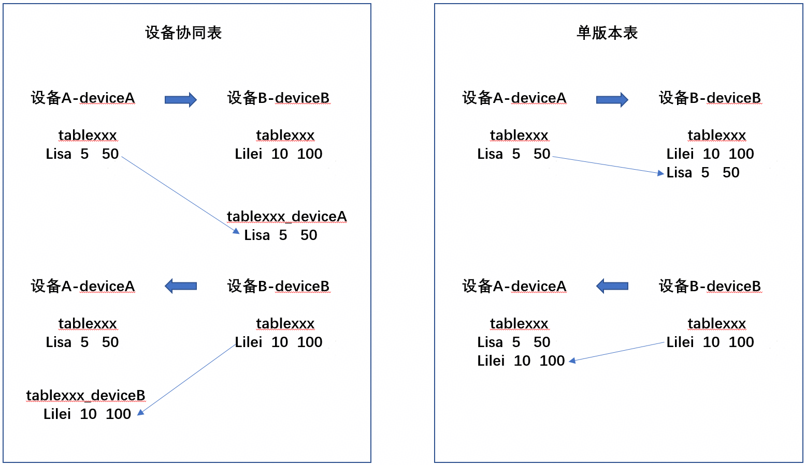

# 关系型数据库跨设备数据同步 (ArkTS)
<!--Kit: ArkData-->
<!--Subsystem: DistributedDataManager-->
<!--Owner: @baijidong-->
<!--Designer: @widecode; @htt1997-->
<!--Tester: @yippo; @logic42-->
<!--Adviser: @ge-yafang-->


## 场景介绍

当应用程序本地存储的关系型数据存在跨设备同步的需求时，可以将需要同步的表数据迁移到新的支持跨设备的表中，当然也可以在刚完成表创建时设置其支持跨设备。


## 基本概念

关系型数据库跨设备数据同步，支持应用在多设备间同步存储的关系型数据。

- 分布式表：支持组网内多设备间数据同步的数据库表。来自其他设备的数据将同步至本地，通过
  [DistributedTableType](../reference/apis-arkdata/arkts-apis-data-relationalStore-e.md#distributedtabletype23)配置数据写入对端的存储方式，
  参考（开发步骤中3<默认:[DEVICE_COLLABORATION](../reference/apis-arkdata/arkts-apis-data-relationalStore-e.md#distributedtabletype23)>，4<[DEVICE_COLLABORATION](../reference/apis-arkdata/arkts-apis-data-relationalStore-e.md#distributedtabletype23)>，5<[SINGLE_VERSION](../reference/apis-arkdata/arkts-apis-data-relationalStore-e.md#distributedtabletype23)>）。
- 数据同步：将设备上数据库中分布式表发生的变更，同步至组网内其他设备。有推送数据和拉取数据两种方式触发同步。
- 数据变化通知：组网内其他设备数据发生的变化同步至当前设备时，会执行已注册的回调函数。

## 运作机制

底层通信组件完成设备发现和认证，会通知上层应用程序设备上线。收到设备上线的消息后数据管理服务可以在两个设备之间建立加密的数据传输通道，利用该通道在两个设备之间进行数据同步。


### 数据跨设备同步机制


业务将数据写入关系型数据库后，向数据管理服务发起同步请求。

数据管理服务从应用沙箱内读取待同步数据，根据对端设备的deviceId将数据发送到其他设备的数据管理服务。再由数据管理服务将数据写入同应用的数据库内。

设备协作表与单版表的区别在于，单版表在数据同步至对端时由数据管理服务直接写入数据库本地表中；设备协作表在数据同步至对端时，由数据管理服务写入到对端创建的分布式表中，同步数据不会合并至数据库本地表，可通过接口obtainDistributedTableName查询分布式表名。



### 数据变化通知机制

增、删、改数据库时，会给订阅者发送数据变化的通知。主要分为本地数据变化通知和分布式数据变化通知。

- **本地数据变化通知**：本地设备的应用内订阅数据变化通知，数据库增删改数据时，会收到通知。

- **分布式数据变化通知**：同一应用订阅组网内其他设备数据变化的通知，其他设备增删改数据时，本设备会收到通知。


## 约束限制

- 每个应用程序最多支持同时打开16个关系型分布式数据库。

- 单个数据库最多支持注册8个订阅数据变化的回调。

- 不支持将含有复合键的表设置为分布式表。
  
- 设备协作表与单版表为库级配置，不支持分布式表类型升级转换，不支持同一数据库中不同表配置不同分布式表类型。
  
- 配置单版本表必须配置对应的dbschema文件，否则无法创建单版本表，且schema文件路径必须为/src/main/resources/rawfile/arkdata/schema/sync_schema.json。
  
- schema文件约束见开发步骤5，必须严格按照demo中格式配置，若违反约束则分布式表设置或者升级会出错，若有疑问请联系开发人员。
  
- 端端分布式表和端云分布式表不能同时配置。

## 接口说明

以下是关系型设备协同分布式数据库跨设备数据同步功能的相关接口，大部分为异步接口。异步接口均有callback和Promise两种返回形式，下表均以callback形式为例，更多接口及使用方式请见[关系型数据库](../reference/apis-arkdata/arkts-apis-data-relationalStore.md)。

| 接口名称 | 描述 | 
| -------- | -------- |
| setDistributedTables(tables: Array&lt;string&gt;, callback: AsyncCallback&lt;void&gt;): void | 设置分布式同步表。 | 
| sync(mode: SyncMode, predicates: RdbPredicates, callback: AsyncCallback&lt;Array&lt;[string, number]&gt;&gt;): void | 分布式数据同步。 | 
| on(event: 'dataChange', type: SubscribeType, observer: Callback&lt;Array&lt;string&gt;&gt;): void | 订阅分布式数据变化。 | 
| off(event:'dataChange', type: SubscribeType, observer: Callback&lt;Array&lt;string&gt;&gt;): void | 取消订阅分布式数据变化。 | 
| obtainDistributedTableName(device: string, table: string, callback: AsyncCallback&lt;string&gt;): void | 根据本地数据库表名获取指定设备上的表名。 | 
| remoteQuery(device: string, table: string, predicates: RdbPredicates, columns: Array&lt;string&gt; , callback: AsyncCallback&lt;ResultSet&gt;): void | 根据指定条件查询远程设备数据库中的数据。 | 


## 开发步骤

> **说明：**
>
> 数据只允许向数据安全标签不高于对端设备安全等级的设备同步数据，具体规则可见[跨设备同步访问控制机制](access-control-by-device-and-data-level.md#跨设备同步访问控制机制)。

1. 导入模块。
   <!--@[sync_import](https://gitcode.com/openharmony/applications_app_samples/blob/master/code/DocsSample/ArkData/RelationalStore/DataSyncAndPersistence/entry/src/main/ets/pages/datasync/RdbDataSync.ets)-->
   
   ``` TypeScript
   import { relationalStore } from '@kit.ArkData'; // 导入模块
   import { BusinessError } from '@kit.BasicServicesKit';
   import { distributedDeviceManager } from '@kit.DistributedServiceKit';
   import { hilog } from '@kit.PerformanceAnalysisKit';
   const DOMAIN = 0x0000;
   ```

2. 请求权限。

   1. 需要申请ohos.permission.DISTRIBUTED_DATASYNC权限，配置方式请参见[声明权限](../security/AccessToken/declare-permissions.md)。
   2. 同时需要在应用首次启动时弹窗向用户申请授权，使用方式请参见[向用户申请授权](../security/AccessToken/request-user-authorization.md)。

3. 创建关系型数据库，创建数据表，并将需要进行跨设备同步的数据表设置为分布式表，默认端端分布式表类型。
   <!--@[setDefaultDistributedTables](https://gitcode.com/openharmony/applications_app_samples/blob/master/code/DocsSample/ArkData/RelationalStore/DataSyncAndPersistence/entry/src/main/ets/pages/datasync/RdbDataSync.ets)-->

4. 创建关系型数据库，创建数据表，并将需要进行跨设备同步的数据表设置为分布式表，设备协作表。
   <!--@[setCollaborationDistributedTables](https://gitcode.com/openharmony/applications_app_samples/blob/master/code/DocsSample/ArkData/RelationalStore/DataSyncAndPersistence/entry/src/main/ets/pages/datasync/RdbDataSync.ets)-->

5. 创建关系型数据库，创建数据表，并将需要进行跨设备同步的数据表设置为分布式表，单版本表。
   配置单版本跨端分布式表时，需要将分布式表类型设置为[SINGLE_VERSION](../reference/apis-arkdata/arkts-apis-data-relationalStore-e.md#distributedtabletype)。且必须配置对应dbschema文件，用以描述数据库表结构信息以及要做跨端同步字段信息，schema文件路径必须为/src/main/resources/rawfile/arkdata/schema/sync_schema.json。
   <!--@[setSingleDistributedTables](https://gitcode.com/openharmony/applications_app_samples/blob/master/code/DocsSample/ArkData/RelationalStore/DataSyncAndPersistence/entry/src/main/ets/pages/datasync/RdbDataSync.ets)-->
   sync_schema.json文件示例：
   <(https://gitcode.com/openharmony/applications_app_samples/blob/master/code/DocsSample/ArkData/RelationalStore/DataSyncAndPersistence/entry/src/main/resources/rawfile/arkdata/schema/sync_schema.json)>
   schema文件中必须满足以下要求：
   - schema有变化时version需要增加；
   - 设备协作表模式不支持配置schema，设置设备协作表默认不读取schema文件；
   - 同步列变化时，存量数据会重新同步；
   - 指定同步列不能为空；
   - 自增字段，不能跨端同步；
   - 自增表下，不支持指定非主键列接冲突时又同步主键列（自增字段不允许跨端同步）；
   - 同步的列必须存在于表结构中；
   - 无主键表不支持指定列同步；
   - 不支持解冲突列变化；
   - special列只能有一个，如果主键列同步，则必须配置主键列为special列；
   - 非自增表下，不能配置非主键列解冲突，主键为非自增，必须配置主键列为special列；
   - 若主键为自增属性，必须配置一个非主键列为special列用以解冲突，且special列必须为unique列；
   - 表中非自增not null列必须有默认值，否则要指定同步；
   - 若数据库表中有多个unique列，所有unique列都必须同步；若存在多个unique列，数据同步至对端有可能会出现数据冲突现象而无法写入，请知晓！
   - schema升级时指定同步字段只能新增不能减少。
   schema文件结构：
   --dbSchema:schema名称，必须为"dbSchema"，不允许修改; 可配置多个数据库；<必填字段>
     --version: dbSchema版本号，每次修改dbSchema时需要增加；int类型；<必填字段>
     --bundleName: 应用包名；string类型；必须与应用bundle信息保持一致，否则读取schema失败；<必填字段>
     --dbName: 数据库名；string类型；如demo中数据库名为"RdbTest.db"，则该字段需配置为"RdbTest";<必填字段>
     --tables: 表结构信息，可以有多个table；<必填字段>
       --tableName: 表名；string类型；<必填字段>
       --deviceSyncFields: 跨端同步字段信息；不能为空，array<string>; 且配置的字段名必须存在与fields中；<必填字段>
       --cloudType: 表类型；array<string>，可选参数["Local", "Cloud DB", "Device DB"]; <必填字段>
       --fields: 字段信息，可以有多个field；<必填字段>
         --columnName: 字段名；string类型；<必填字段>
         --type: 字段类型；string类，可选参数["Text", "Integer", "Long", "Float", "Double", "Blob", "Asset"]；<必填字段>
         --primaryKey: 是否为special跨端同步解冲突列；bool类型；此处置为true，则表示该字段为同步至对端写入时指定解冲突列，与表中主键无关；<必填字段>
         --autoIncrement: 是否自增；bool类型；<必填字段>
         --notNull: 是否非空；bool类型；<非必填字段>

6. 订阅组网内其他设备的数据变化消息。
   1. 调用[on('dataChange')](../reference/apis-arkdata/arkts-apis-data-relationalStore-RdbStore.md#ondatachange)接口监听其他设备的数据变化，当数据变化同步至当前设备时，将执行订阅的回调方法，入参为数据发生变化的设备ID列表。
   2. 通过设备ID获取与设备对应的分布式表表名，查询对应设备分布式表中的数据。
   <!--@[on_data_change](https://gitcode.com/openharmony/applications_app_samples/blob/master/code/DocsSample/ArkData/RelationalStore/DataSyncAndPersistence/entry/src/main/ets/pages/datasync/RdbDataSync.ets)-->
   
   ``` TypeScript
   // 订阅组网内其他设备的数据变化消息
   if (store) {
     try {
       // 查询组网内的设备列表
       const deviceManager = distributedDeviceManager.createDeviceManager('com.example.rdbDataSync');
       const deviceList = deviceManager.getAvailableDeviceListSync();
       const devices: string[] = [];
       deviceList.forEach(item => {
         if (item.networkId) {
           devices.push(item.networkId);
         }
       });
       // 调用分布式数据订阅接口，注册数据库的观察者
       // 当分布式数据库中的数据发生更改时，将调用回调
       store.on('dataChange', relationalStore.SubscribeType.SUBSCRIBE_TYPE_REMOTE, async (devices) => {
         for (let i = 0; i < devices.length; i++) {
           let device = devices[i];
           if (!store) {
             return;
           }
           hilog.info(DOMAIN, 'rdbDataSync', `The data of device:${device} has been changed.`);
           // 获取device对应的分布式表名。
           const distributedTableName = await store.obtainDistributedTableName(device, 'EMPLOYEE');
           // 创建查询谓词，查询组网内设备分布式表的数据
           const predicates = new relationalStore.RdbPredicates(distributedTableName);
           const resultSet = await store.query(predicates);
           hilog.info(DOMAIN, 'rdbDataSync', `device ${device}, table EMPLOYEE rowCount is: ${resultSet.rowCount}`);
         }
       });
     } catch (err) {
       hilog.error(DOMAIN, 'rdbDataSync', `Failed to register observer. Code:${err.code},message:${err.message}`);
     }
   }
   ```

7. 同步当前设备数据变化至组网内其他设备。
   1. 当前设备分布式表中的数据发生变化后，调用RdbStore的[sync](../reference/apis-arkdata/arkts-apis-data-relationalStore-RdbStore.md#sync-1)接口传入[SYNC_MODE_PUSH](../reference/apis-arkdata/arkts-apis-data-relationalStore-e.md#syncmode)参数推送数据变化至其他设备。
   2. 通过谓词的[inDevices](../reference/apis-arkdata/arkts-apis-data-relationalStore-RdbPredicates.md#indevices)方法指定推送的目标设备。
  
   <!--@[data_sync_push](https://gitcode.com/openharmony/applications_app_samples/blob/master/code/DocsSample/ArkData/RelationalStore/DataSyncAndPersistence/entry/src/main/ets/pages/datasync/RdbDataSync.ets)-->
   
   ``` TypeScript
   // 同步当前设备数据变化至组网内其他设备
   if (store) {
     // 当前设备分布式数据表中插入新数据
     const ret = store.insertSync('EMPLOYEE', {
       name: 'sync_me',
       age: 18,
       salary: 666
     });
     hilog.info(DOMAIN, 'rdbDataSync', 'Insert to distributed table EMPLOYEE, result: ' + ret);
     // 查询组网内的设备列表
     const deviceManager = distributedDeviceManager.createDeviceManager('com.example.rdbDataSync');
     const deviceList = deviceManager.getAvailableDeviceListSync();
     const syncTarget: string[] = [];
     deviceList.forEach(item => {
       if (item.networkId) {
         syncTarget.push(item.networkId);
       }
     });
     if (syncTarget.length === 0) {
       hilog.error(DOMAIN, 'rdbDataSync', 'no device to sync');
     } else {
       // 构造用于同步分布式表的谓词对象
       const predicates = new relationalStore.RdbPredicates('EMPLOYEE');
       // 指定要同步的设备列表
       predicates.inDevices(syncTarget);
       try {
         // 调用同步数据的接口推送当前设备数据变化至组网内其他设备
         const result = await store.sync(relationalStore.SyncMode.SYNC_MODE_PUSH, predicates);
         hilog.info(DOMAIN, 'rdbDataSync', 'Push data success.');
         // 获取同步结果
         for (let i = 0; i < result.length; i++) {
           const deviceId = result[i][0];
           const syncResult = result[i][1];
           if (syncResult === 0) {
             hilog.info(DOMAIN, 'rdbDataSync', `device:${deviceId} sync success`);
           } else {
             hilog.error(DOMAIN, 'rdbDataSync', `device:${deviceId} sync failed, status:${syncResult}`);
           }
         }
       } catch (e) {
         hilog.error(DOMAIN, 'rdbDataSync', 'Push data failed, code: ' + e.code + ', message: ' + e.message);
       }
     }
   }
   ```

8. 拉取组网内其他设备的数据变化。
   1. 当前设备可调用RdbStore的[sync](../reference/apis-arkdata/arkts-apis-data-relationalStore-RdbStore.md#sync-1)接口传入[SYNC_MODE_PULL](../reference/apis-arkdata/arkts-apis-data-relationalStore-e.md#syncmode)参数拉取组网内其他设备的数据变化。
   2. 通过谓词的[inDevices](../reference/apis-arkdata/arkts-apis-data-relationalStore-RdbPredicates.md#indevices)方法指定拉取的目标设备。
   
   <!--@[data_sync_pull](https://gitcode.com/openharmony/applications_app_samples/blob/master/code/DocsSample/ArkData/RelationalStore/DataSyncAndPersistence/entry/src/main/ets/pages/datasync/RdbDataSync.ets)-->
   
   ``` TypeScript
   // 拉取组网内其他设备的数据变化
   if (store) {
     // 查询组网内的设备列表
     const deviceManager = distributedDeviceManager.createDeviceManager('com.example.rdbDataSync');
     const deviceList = deviceManager.getAvailableDeviceListSync();
     const syncTarget: string[] = [];
     deviceList.forEach(item => {
       if (item.networkId) {
         syncTarget.push(item.networkId);
       }
     });
     if (syncTarget.length === 0) {
       hilog.error(DOMAIN, 'rdbDataSync', 'no device to pull data');
     } else {
       // 构造用于同步分布式表的谓词对象
       const predicates = new relationalStore.RdbPredicates('EMPLOYEE');
       // 指定要同步的设备列表
       predicates.inDevices(syncTarget);
       try {
         // 调用同步数据的接口拉取其他设备数据变化至当前设备
         const result = await store.sync(relationalStore.SyncMode.SYNC_MODE_PULL, predicates);
         hilog.info(DOMAIN, 'rdbDataSync', 'Pull data success.');
         // 获取同步结果
         for (let i = 0; i < result.length; i++) {
           const deviceId = result[i][0];
           const syncResult = result[i][1];
           if (syncResult === 0) {
             hilog.info(DOMAIN, 'rdbDataSync', `device:${deviceId} sync success`);
           } else {
             hilog.error(DOMAIN, 'rdbDataSync', `device:${deviceId} sync failed, status:${syncResult}`);
           }
         }
       } catch (e) {
         hilog.error(DOMAIN, 'rdbDataSync', 'Pull data failed, code: ' + e.code + ', message: ' + e.message);
       }
     }
   }
   ```

9. 当数据未完成同步，或未触发数据同步时，可使用RdbStore的[remoteQuery](../reference/apis-arkdata/arkts-apis-data-relationalStore-RdbStore.md#remotequery-1)方法查询组网内指定设备上分布式表中的数据。
   <!--@[data_remote_query](https://gitcode.com/openharmony/applications_app_samples/blob/master/code/DocsSample/ArkData/RelationalStore/DataSyncAndPersistence/entry/src/main/ets/pages/datasync/RdbDataSync.ets)-->
   
   ``` TypeScript
   // 查询组网内指定设备上分布式表中的数据
   if (store) {
     // 查询组网内的设备列表
     const deviceManager = distributedDeviceManager.createDeviceManager('com.example.rdbDataSync');
     const deviceList = deviceManager.getAvailableDeviceListSync();
     const devices: string[] = [];
     deviceList.forEach(item => {
       if (item.networkId) {
         devices.push(item.networkId);
       }
     });
     if (devices.length === 0) {
       hilog.error(DOMAIN, 'rdbDataSync', 'no device to query data');
       return;
     }
     // 构造用于查询分布式表的谓词对象
     const predicates = new relationalStore.RdbPredicates('EMPLOYEE');
     try {
       // 查询组网内设备上的分布式表
       const resultSet = await store.remoteQuery(devices[0], 'EMPLOYEE', predicates, ['ID', 'NAME', 'AGE', 'SALARY', 'CODES']);
       hilog.info(DOMAIN, 'rdbDataSync', `ResultSet column names: ${resultSet.columnNames}, column count: ${resultSet.columnCount}`);
     } catch (e) {
       hilog.error(DOMAIN, 'rdbDataSync', 'Remote query failed, code: ' + e.code + ', message: ' + e.message);
     }
   }
   ```

## 相关实例

针对关系型数据库开发，有以下相关实例可供参考：

- [分布式组网认证（ArkTS）（Full SDK）（API10）](https://gitcode.com/openharmony/applications_app_samples/tree/master/code/SystemFeature/DistributedAppDev/DistributedAuthentication)

- [分布式关系型数据库（ArkTS）（Full SDK）（API10）](https://gitcode.com/openharmony/applications_app_samples/tree/master/code/SuperFeature/DistributedAppDev/DistributedRdb)

- [分布式账号（ArkTS）（Full SDK）（API10）](https://gitcode.com/openharmony/applications_app_samples/tree/master/code/SystemFeature/DistributedAppDev/DistributedAccount)