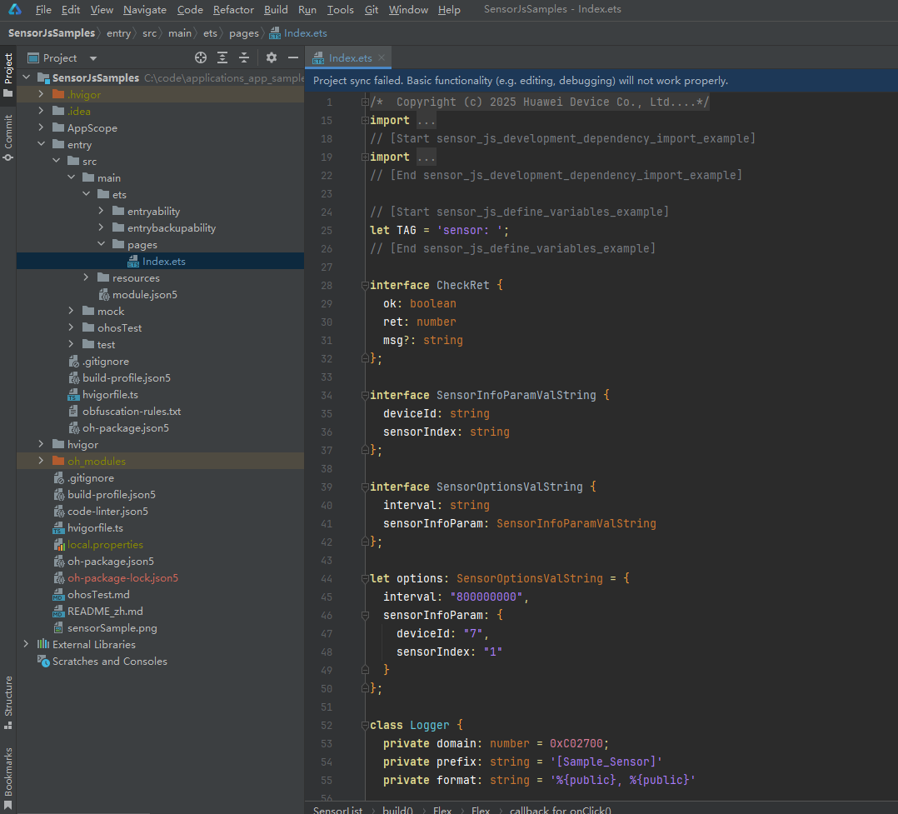

# 传感器开发指导(ArkTS)
<!--Kit: Sensor Service Kit-->
<!--Subsystem: Sensors-->
<!--Owner: @dilligencer-->
<!--Designer: @butterls-->
<!--Tester: @murphy84-->
<!--Adviser: @hu-zhiqiong-->

## 场景介绍

当设备需要获取传感器数据时，可以使用sensor模块，例如：通过订阅方向传感器数据感知用户设备当前的朝向，通过订阅计步传感器数据统计用户的步数等。

详细的接口介绍请参考[Sensor接口](../../reference/apis-sensor-service-kit/js-apis-sensor.md)。


## 接口说明

| 名称 | 描述                              |
| -------- |---------------------------------|
| sensor.on(sensorId, callback:AsyncCallback&lt;Response&gt;, options?: Options): void | 持续监听传感器数据变化。                    |
| sensor.on(type: 'sensorStatusChange', callback: Callback&lt;SensorStatusEvent&gt;): void | 监听传感器动态上下线的状态变化，callback返回传感器状态事件数据。 |
| sensor.once(sensorId, callback:AsyncCallback&lt;Response&gt;): void | 获取一次传感器数据变化。                    |
| sensor.off(sensorId, callback?:AsyncCallback&lt;void&gt;): void | 注销传感器数据的监听。                     |
| sensor.off(sensorId, sensorInfoParam?: SensorInfoParam, callback?:AsyncCallback&lt;void&gt;): void | 注销传感器数据的监听，可传入设置参数。             |
| sensor.off(type: 'sensorStatusChange', callback?: Callback&lt;SensorStatusEvent&gt;): void | 注销传感器动态上下线的状态变化的监听。             |
| sensor.getSensorList(callback: AsyncCallback\<Array\<Sensor>>): void| 获取设备上的所有传感器信息。                  |


## 开发步骤

开发步骤以加速度传感器ACCELEROMETER为例。

1. 新建一个工程。

   

2. 配置加速度传感器权限，具体配置方式请参考[声明权限](../../security/AccessToken/declare-permissions.md)。

   <!-- @[sensor_js_permission_example](https://gitcode.com/openharmony/applications_app_samples/blob/master/code/BasicFeature/DeviceManagement/Sensor/SensorJsSamples/entry/src/main/module.json5) --> 
   
   ``` JSON5
   "requestPermissions": [
     {
       "name":"ohos.permission.ACCELEROMETER"
     }
   ],
   ```

3. 导入模块。

   <!-- @[sensor_js_development_dependency_import_example](https://gitcode.com/openharmony/applications_app_samples/blob/master/code/BasicFeature/DeviceManagement/Sensor/SensorJsSamples/entry/src/main/ets/pages/Index.ets) --> 
   
   ``` TypeScript
   import { sensor } from '@kit.SensorServiceKit';
   import { BusinessError } from '@kit.BasicServicesKit';
   import hilog from '@ohos.hilog';
   ```

4. 定义常量。

   <!-- @[sensor_js_define_variables_example](https://gitcode.com/openharmony/applications_app_samples/blob/master/code/BasicFeature/DeviceManagement/Sensor/SensorJsSamples/entry/src/main/ets/pages/Index.ets) --> 
   
   ``` TypeScript
   let TAG = 'sensor: ';
   ```

5. 查询设备支持的所有传感器的参数，如果获取不到某个传感器则代表该传感器在此设备上不存在或不可用，如果订阅没查到的传感器时需要处理异常。

   <!-- @[sensor_js_get_sensor_list_example](https://gitcode.com/openharmony/applications_app_samples/blob/master/code/BasicFeature/DeviceManagement/Sensor/SensorJsSamples/entry/src/main/ets/pages/Index.ets) --> 
   
   ``` TypeScript
   try {
     sensor.getSensorList((error: BusinessError, data: Array<sensor.Sensor>) => {
         if (error) {
             console.error(TAG + 'getSensorList failed');
         } else {
             console.info('getSensorList success');
             for (let i = 0; i < data.length; i++) {
                 console.info(TAG + JSON.stringify(data[i]));
                 // ...
             }
         }
     });
   } catch (error) {
     console.error(TAG + 'get list exception, code:' + error.code + 'msg:' + error.message);
     console.error(TAG + 'get list exception, msg:' + JSON.stringify(error));
   }
   ```

   

   该传感器支持的最小采样周期为5000000纳秒，最大采样周期是200000000纳秒。不同传感器支持的采样周期范围也不同，interval应该设置在传感器支持范围内，大于最大值时以最大值上报数据，小于最小值时以最小值上报数据。设置数值越小数据上报越频繁，其功耗越大。

   根据设备Id查询传感器。

   <!-- @[sensor_js_get_sensor_list_by_device_example](https://gitcode.com/openharmony/applications_app_samples/blob/master/code/BasicFeature/DeviceManagement/Sensor/SensorJsSamples/entry/src/main/ets/pages/Index.ets) --> 
   
   ``` TypeScript
   try {
     this.deviceId = -1;
     // 第一个参数deviceId 非必填，缺省默认查询的为本地设备。
     const sensorList: sensor.Sensor[] = sensor.getSensorListByDeviceSync(this.deviceId);
     console.info(`sensorList length: ${sensorList.length}`);
     console.info(`sensorList: ${JSON.stringify(sensorList)}`);
     // ···
   } catch (error) {
     let e: BusinessError = error as BusinessError;
     console.error(`Failed to get sensorList. Code: ${e.code}, message: ${e.message}`);
   }
   ```

   根据设备Id和传感器类型查询传感器。

   <!-- @[sensor_js_get_single_sensor_by_device_sync_example](https://gitcode.com/openharmony/applications_app_samples/blob/master/code/BasicFeature/DeviceManagement/Sensor/SensorJsSamples/entry/src/main/ets/pages/Index.ets) --> 
   
   ``` TypeScript
   try {
     this.deviceId = -1;
     // 第二个参数deviceId 非必填
     const sensorList: sensor.Sensor[] = sensor.getSingleSensorByDeviceSync(sensor.SensorId.ACCELERO this.   deviceId);
     console.info(`sensorList length: ${sensorList.length}`);
     console.info(`sensorList Json: ${JSON.stringify(sensorList)}`);
     // ···
   } catch (error) {
     let e: BusinessError = error as BusinessError;
     console.error(`Failed to get sensorList. Code: ${e.code}, message: ${e.message}`);
   }
   ```

6. 注册监听。可以通过on()和once()两种接口监听传感器的调用结果。

   通过on()接口，实现对传感器的持续监听，传感器上报周期interval设置为100000000纳秒。

   <!-- @[sensor_js_on_accelerometer_example](https://gitcode.com/openharmony/applications_app_samples/blob/master/code/BasicFeature/DeviceManagement/Sensor/SensorJsSamples/entry/src/main/ets/pages/Index.ets) --> 
   
   ``` TypeScript
   try { 
     sensor.on(sensor.SensorId.ACCELEROMETER, (data: sensor.AccelerometerResponse) => {
           console.info("Succeeded in obtaining data. x: " + data.x + " y: " + data.y + " z: " + data.z);
           // ...
     }, { interval: 100000000 });
   } catch (error) {
       let e: BusinessError = error as BusinessError;
       console.error(`Failed to invoke on. Code: ${e.code}, message: ${e.message}`);
   }
   ```

   第三个参数还可以传入SensorInfoParam，传递deviceId、sensorIndex。

   <!-- @[sensor_js_on_accelerometer_use_sensor_info_param_example](https://gitcode.com/openharmony/applications_app_samples/blob/master/code/BasicFeature/DeviceManagement/Sensor/SensorJsSamples/entry/src/main/ets/pages/Index.ets) --> 
   
   ``` TypeScript
   try { 
     sensor.on(sensor.SensorId.ACCELEROMETER, (data: sensor.AccelerometerResponse) => {
           console.info("Succeeded in obtaining data. x: " + data.x + " y: " + data.y + " z: " + data.z);
           // ...
     }, { interval: 100000000, sensorInfoParam: { deviceId: -1 } });
   } catch (error) {
       let e: BusinessError = error as BusinessError;
       console.error(`Failed to invoke on. Code: ${e.code}, message: ${e.message}`);
   }
   ```

   

   通过once()接口，实现对传感器的一次监听。

   <!-- @[sensor_js_once_accelerometer_example](https://gitcode.com/openharmony/applications_app_samples/blob/master/code/BasicFeature/DeviceManagement/Sensor/SensorJsSamples/entry/src/main/ets/pages/Index.ets) --> 
   
   ``` TypeScript
   try {
     sensor.once(sensor.SensorId.ACCELEROMETER, (data: sensor.AccelerometerResponse) => {
         console.info("Succeeded in obtaining data. x: " + data.x + " y: " + data.y + " z: " + data.z);
         // ...
     });
   } catch (error) {
     let e: BusinessError = error as BusinessError;
     console.error(`Failed to invoke once. Code: ${e.code}, message: ${e.message}`);
   }
   ```

   

7. 取消持续监听。

   取消持续监听，此场景下未订阅而取消监听为异常行为，需处理异常。

   <!-- @[sensor_js_off_accelerometer_example](https://gitcode.com/openharmony/applications_app_samples/blob/master/code/BasicFeature/DeviceManagement/Sensor/SensorJsSamples/entry/src/main/ets/pages/Index.ets) --> 
   
   ``` TypeScript
   try {
     sensor.off(sensor.SensorId.ACCELEROMETER);
   } catch (error) {
     let e: BusinessError = error as BusinessError;
     console.error(`Failed to invoke off. Code: ${e.code}, message: ${e.message}`);
   }
   ```

   根据SensorInfoParam取消监听。

   <!-- @[sensor_js_off_accelerometer_use_sensor_info_param_example](https://gitcode.com/openharmony/applications_app_samples/blob/master/code/BasicFeature/DeviceManagement/Sensor/SensorJsSamples/entry/src/main/ets/pages/Index.ets) --> 
   
   ``` TypeScript
   try {
     sensor.off(sensor.SensorId.ACCELEROMETER, { deviceId: -1 });
   } catch (error) {
     let e: BusinessError = error as BusinessError;
     console.error(`Failed to invoke off. Code: ${e.code}, message: ${e.message}`);
   }
   ```

8. 动态传感器状态的监听，在收到设备下线事件通知时，用户应主动调用off关闭该设备上的传感器。 

   注册监听, SensorStatusEvent 会返回事件时间戳、传感器ID、传感器索引、上线或下线、设备id、设备名称等值。

   <!-- @[sensor_js_on_sensor_status_change_example](https://gitcode.com/openharmony/applications_app_samples/blob/master/code/BasicFeature/DeviceManagement/Sensor/SensorJsSamples/entry/src/main/ets/pages/Index.ets) --> 
   
   ``` TypeScript
   try {
     sensor.on('sensorStatusChange', (data: sensor.SensorStatusEvent) => {
         console.info(`timestamp: ${data.timestamp},
         deviceId: ${data.deviceId} deviceName: ${data.deviceName}
         sensorId: ${data.sensorId} sensorIndex:${data.sensorIndex} isSensorOnline: ${data.isSensorOnline}`);
     });
     // ···
   } catch (error) {
     let e: BusinessError = error as BusinessError;
     console.error(`Failed to invoke on. Code: ${e.code}, message: ${e.message}`);
   }
   ```

   取消监听。

   <!-- @[sensor_js_off_sensor_status_change_example](https://gitcode.com/openharmony/applications_app_samples/blob/master/code/BasicFeature/DeviceManagement/Sensor/SensorJsSamples/entry/src/main/ets/pages/Index.ets) --> 
   
   ``` TypeScript
   try {
     sensor.off('sensorStatusChange');
     // ···
   } catch (error) {
     let e: BusinessError = error as BusinessError;
     console.error(`Failed to invoke on. Code: ${e.code}, message: ${e.message}`);
   }
   ```

9. 获取某时刻地球上特定位置的地磁场信息

   使用callback方式。

   <!-- @[sensor_js_get_geomagnetic_info_callback_example](https://gitcode.com/openharmony/applications_app_samples/blob/master/code/BasicFeature/DeviceManagement/Sensor/SensorJsSamples/entry/src/main/ets/pages/Index.ets) -->
   
   ``` TypeScript
   try {
     sensor.getGeomagneticInfo({ latitude: 80, longitude: 0, altitude: 0 }, 1580486400000,
         (err: BusinessError, data: sensor.GeomagneticResponse) => {
       if (err) {
         console.error(`Failed to get geomagneticInfo. Code: ${err.code}, message: ${err.message}`);
         return;
       }
       console.info("Succeeded in getting geomagneticInfo x" + data.x);
       console.info("Succeeded in getting geomagneticInfo y" + data.y);
       console.info("Succeeded in getting geomagneticInfo z" + data.z);
       console.info("Succeeded in getting geomagneticInfo geomagneticDip" + data.geomagneticDip);
       console.info("Succeeded in getting geomagneticInfo deflectionAngle" + data.deflectionAngle);
       console.info("Succeeded in getting geomagneticInfo levelIntensity" + data.levelIntensity);
       console.info("Succeeded in getting geomagneticInfo totalIntensity" + data.totalIntensity);
     });
   } catch (error) {
     let e: BusinessError = error as BusinessError;
     console.error(`Failed to get geomagneticInfo. Code: ${e.code}, message: ${e.message}`);
   }
   ```

   使用promise方式。

   <!-- @[sensor_js_get_geomagnetic_info_promise_example](https://gitcode.com/openharmony/applications_app_samples/blob/master/code/BasicFeature/DeviceManagement/Sensor/SensorJsSamples/entry/src/main/ets/pages/Index.ets) --> 
   
   ``` TypeScript
   try {
     const promise = sensor.getGeomagneticInfo({ latitude: 80, longitude: 0, altitude: 0 }, 1580486400000);
     promise.then((data: sensor.GeomagneticResponse) => {
       console.info("Succeeded in getting geomagneticInfo x" + data.x);
       console.info("Succeeded in getting geomagneticInfo y" + data.y);
       console.info("Succeeded in getting geomagneticInfo z" + data.z);
       console.info("Succeeded in getting geomagneticInfo geomagneticDip" + data.geomagneticDip);
       console.info("Succeeded in getting geomagneticInfo deflectionAngle" + data.deflectionAngle);
       console.info("Succeeded in getting geomagneticInfo levelIntensity" + data.levelIntensity);
       console.info("Succeeded in getting geomagneticInfo totalIntensity" + data.totalIntensity);
     }, (err: BusinessError) => {
       console.error(`Failed to get geomagneticInfo. Code: ${err.code}, message: ${err.message}`);
     });
   } catch (error) {
     let e: BusinessError = error as BusinessError;
     console.error(`Failed to get geomagneticInfo. Code: ${e.code}, message: ${e.message}`);
   }
   ```

10. 根据气压值获取海拔高度

    使用callback方式。

    <!-- @[sensor_js_get_device_altitude_callback_example](https://gitcode.com/openharmony/applications_app_samples/blob/master/code/BasicFeature/DeviceManagement/Sensor/SensorJsSamples/entry/src/main/ets/pages/Index.ets) --> 
    
    ``` TypeScript
    try {
      let seaPressure = 1013.2;
      let currentPressure = 1500.0;
      sensor.getDeviceAltitude(seaPressure, currentPressure, (err: BusinessError, data: number) => {
        if (err) {
          console.error(`Failed to get altitude. Code: ${err.code}, message: ${err.message}`);
          return;
        }
        console.info('Succeeded in getting altitude: ' + data);
      });
    } catch (error) {
      let e: BusinessError = error as BusinessError;
      console.error(`Failed to get altitude. Code: ${e.code}, message: ${e.message}`);
    }
    ```

    使用promise方式。

    <!-- @[sensor_js_get_device_altitude_promise_example](https://gitcode.com/openharmony/applications_app_samples/blob/master/code/BasicFeature/DeviceManagement/Sensor/SensorJsSamples/entry/src/main/ets/pages/Index.ets) -->
    
    ``` TypeScript
    try {
      let seaPressure = 1013.2;
      let currentPressure = 1500.0;
      const promise = sensor.getDeviceAltitude(seaPressure, currentPressure);
      promise.then((data: number) => {
        console.info('Succeeded in getting sensor_getDeviceAltitude_Promise', data);
      }, (err: BusinessError) => {
        console.error(`Failed to get altitude. Code: ${err.code}, message: ${err.message}`);
      });
    } catch (error) {
      let e: BusinessError = error as BusinessError;
      console.error(`Failed to get altitude. Code: ${e.code}, message: ${e.message}`);
    }
    ```

11. 根据倾斜矩阵计算地磁倾角

    使用callback方式。

    <!-- @[sensor_js_get_inclination_callback_example](https://gitcode.com/openharmony/applications_app_samples/blob/master/code/BasicFeature/DeviceManagement/Sensor/SensorJsSamples/entry/src/main/ets/pages/Index.ets) --> 
    
    ``` TypeScript
    try {
      // inclinationMatrix可以为3*3，或者4*4
      let inclinationMatrix = [
        1, 0, 0,
        0, 1, 0,
        0, 0, 1
      ]
      sensor.getInclination(inclinationMatrix, (err: BusinessError, data: number) => {
        if (err) {
          console.error(`Failed to get inclination. Code: ${err.code}, message: ${err.message}`);
          return;
        }
        console.info('Succeeded in getting inclination: ' + data);
      })
    } catch (error) {
      let e: BusinessError = error as BusinessError;
      console.error(`Failed to get inclination. Code: ${e.code}, message: ${e.message}`);
    }
    ```

    使用promise方式。

    <!-- @[sensor_js_get_inclination_promise_example](https://gitcode.com/openharmony/applications_app_samples/blob/master/code/BasicFeature/DeviceManagement/Sensor/SensorJsSamples/entry/src/main/ets/pages/Index.ets) -->
    
    ``` TypeScript
    try {
      // inclinationMatrix可以为3*3，或者4*4
      let inclinationMatrix = [
        1, 0, 0,
        0, 1, 0,
        0, 0, 1
      ]
      const promise = sensor.getInclination(inclinationMatrix);
      promise.then((data: number) => {
        console.info('Succeeded in getting inclination: ' + data);
      }, (err: BusinessError) => {
        console.error(`Failed to get inclination. Code: ${err.code}, message: ${err.message}`);
      });
    } catch (error) {
      let e: BusinessError = error as BusinessError;
      console.error(`Failed to get inclination. Code: ${e.code}, message: ${e.message}`);
    }
    ```

12. 计算两个旋转矩阵之间的角度变化

    使用callback方式。

    <!-- @[sensor_js_get_angle_variation_callback_example](https://gitcode.com/openharmony/applications_app_samples/blob/master/code/BasicFeature/DeviceManagement/Sensor/SensorJsSamples/entry/src/main/ets/pages/Index.ets) --> 
    
    ``` TypeScript
    try {
      // 旋转矩阵可以为3*3，或者4*4
      let currentRotationMatrix = [
        1, 0, 0,
        0, 1, 0,
        0, 0, 1
      ];
      let preRotationMatrix = [
        1, 0, 0,
        0, 0.87, -0.50,
        0, 0.50, 0.87
      ];
      sensor.getAngleVariation(currentRotationMatrix, preRotationMatrix, (err: BusinessError, data: Array<number>) => {
        if (err) {
          console.error(`Failed to get angle variation. Code: ${err.code}, message: ${err.message}`);
          return;
        }
        if (data.length < 3) {
          console.error("Failed to get angle variation, length" + data.length);
          return;
        }
        console.info("Z: " + data[0]);
        console.info("X: " + data[1]);
        console.info("Y: " + data[2]);
      })
    } catch (error) {
      let e: BusinessError = error as BusinessError;
      console.error(`Failed to get angle variation. Code: ${e.code}, message: ${e.message}`);
    }
    ```

    使用promise方式。

    <!-- @[sensor_js_get_angle_variation_promise_example](https://gitcode.com/openharmony/applications_app_samples/blob/master/code/BasicFeature/DeviceManagement/Sensor/SensorJsSamples/entry/src/main/ets/pages/Index.ets) -->
    
    ``` TypeScript
    try {
      // 旋转矩阵可以为3*3，或者4*4
      let currentRotationMatrix = [
        1, 0, 0,
        0, 1, 0,
        0, 0, 1
      ];
      let preRotationMatrix = [
        1, 0, 0,
        0, 0.87, -0.50,
        0, 0.50, 0.87
      ];
      const promise = sensor.getAngleVariation(currentRotationMatrix, preRotationMatrix);
      promise.then((data: Array<number>) => {
        if (data.length < 3) {
          console.error("Failed to get angle variation, length" + data.length);
          return;
        }
        console.info("Z: " + data[0]);
        console.info("X: " + data[1]);
        console.info("Y: " + data[2]);
      }, (err: BusinessError) => {
        console.error(`Failed to get angle variation. Code: ${err.code}, message: ${err.message}`);
      });
    } catch (error) {
      let e: BusinessError = error as BusinessError;
      console.error(`Failed to get angle variation. Code: ${e.code}, message: ${e.message}`);
    }
    ```

13. 根据旋转矢量获取旋转矩阵

    使用callback方式。

    <!-- @[sensor_js_get_rotation_matrix_callback_example](https://gitcode.com/openharmony/applications_app_samples/blob/master/code/BasicFeature/DeviceManagement/Sensor/SensorJsSamples/entry/src/main/ets/pages/Index.ets) --> 
    
    ``` TypeScript
    try {
      let rotationVector = [0.20046076, 0.21907, 0.73978853, 0.60376877];
      sensor.getRotationMatrix(rotationVector, (err: BusinessError, data: Array<number>) => {
        if (err) {
          console.error(`Failed to get rotationMatrix. Code: ${err.code}, message: ${err.message}`);
          return;
        }
        for (let i = 0; i < data.length; i++) {
          console.info('Succeeded in getting data[' + i + ']: ' + data[i]);
        }
      })
    } catch (error) {
      let e: BusinessError = error as BusinessError;
      console.error(`Failed to get rotationMatrix. Code: ${e.code}, message: ${e.message}`);
    }
    ```

    使用promise方式。

    <!-- @[sensor_js_get_rotation_matrix_promise_example](https://gitcode.com/openharmony/applications_app_samples/blob/master/code/BasicFeature/DeviceManagement/Sensor/SensorJsSamples/entry/src/main/ets/pages/Index.ets) -->
    
    ``` TypeScript
    try {
      let rotationVector = [0.20046076, 0.21907, 0.73978853, 0.60376877];
      const promise = sensor.getRotationMatrix(rotationVector);
      promise.then((data: Array<number>) => {
        for (let i = 0; i < data.length; i++) {
          console.info('Succeeded in getting data[' + i + ']: ' + data[i]);
        }
      }, (err: BusinessError) => {
        console.error(`Failed to get rotationMatrix. Code: ${err.code}, message: ${err.message}`);
      });
    } catch (error) {
      let e: BusinessError = error as BusinessError;
      console.error(`Failed to get rotationMatrix. Code: ${e.code}, message: ${e.message}`);
    }
    ```

14. 根据指定坐标系映射旋转矩阵

    使用callback方式。

    <!-- @[sensor_js_transform_rotation_matrix_callback_example](https://gitcode.com/openharmony/applications_app_samples/blob/master/code/BasicFeature/DeviceManagement/Sensor/SensorJsSamples/entry/src/main/ets/pages/Index.ets) --> 
    
    ``` TypeScript
    try {
      let rotationMatrix = [
        1, 0, 0,
        0, 0.87, -0.50,
        0, 0.50, 0.87
      ];
      sensor.transformRotationMatrix(rotationMatrix, { x: 1, y: 3 }, (err: BusinessError, data: Array<number>) => {
        if (err) {
          console.error(`Failed to transform rotationMatrix. Code: ${err.code}, message: ${err.message}`);
          return;
        }
        for (let i = 0; i < data.length; i++) {
          console.info('Succeeded in getting data[' + i + '] = ' + data[i]);
        }
      })
    } catch (error) {
      let e: BusinessError = error as BusinessError;
      console.error(`Failed to transform rotationMatrix. Code: ${e.code}, message: ${e.message}`);
    }
    ```

    使用promise方式。

    <!-- @[sensor_js_transform_rotation_matrix_promise_example](https://gitcode.com/openharmony/applications_app_samples/blob/master/code/BasicFeature/DeviceManagement/Sensor/SensorJsSamples/entry/src/main/ets/pages/Index.ets) -->
    
    ``` TypeScript
    try {
      let rotationMatrix = [
        1, 0, 0,
        0, 0.87, -0.50,
        0, 0.50, 0.87
      ];
      const promise = sensor.transformRotationMatrix(rotationMatrix, { x: 1, y: 3 });
      promise.then((data: Array<number>) => {
        for (let i = 0; i < data.length; i++) {
          console.info('Succeeded in getting data[' + i + ']: ' + data[i]);
        }
      }, (err: BusinessError) => {
        console.error(`Failed to transform rotationMatrix. Code: ${err.code}, message: ${err.message}`);
      });
    } catch (error) {
      let e: BusinessError = error as BusinessError;
      console.error(`Failed to transform rotationMatrix. Code: ${e.code}, message: ${e.message}`);
    }
    ```

15. 根据旋转向量计算归一化四元数

    使用callback方式。

    <!-- @[sensor_js_get_quaternion_callback_example](https://gitcode.com/openharmony/applications_app_samples/blob/master/code/BasicFeature/DeviceManagement/Sensor/SensorJsSamples/entry/src/main/ets/pages/Index.ets) --> 
    
    ``` TypeScript
    try {
      let rotationVector = [0.20046076, 0.21907, 0.73978853, 0.60376877];
      sensor.getQuaternion(rotationVector, (err: BusinessError, data: Array<number>) => {
        if (err) {
          console.error(`Failed to get quaternion. Code: ${err.code}, message: ${err.message}`);
          return;
        }
        for (let i = 0; i < data.length; i++) {
          console.info('Succeeded in getting data[' + i + ']: ' + data[i]);
        }
      })
    } catch (error) {
      let e: BusinessError = error as BusinessError;
      console.error(`Failed to get quaternion. Code: ${e.code}, message: ${e.message}`);
    }
    ```

    使用promise方式。

    <!-- @[sensor_js_get_quaternion_promise_example](https://gitcode.com/openharmony/applications_app_samples/blob/master/code/BasicFeature/DeviceManagement/Sensor/SensorJsSamples/entry/src/main/ets/pages/Index.ets) -->
    
    ``` TypeScript
    try {
        let rotationVector = [0.20046076, 0.21907, 0.73978853, 0.60376877];
        const promise = sensor.getQuaternion(rotationVector);
        promise.then((data: Array<number>) => {
            for (let i = 0; i < data.length; i++) {
                console.info('Succeeded in getting data[' + i + ']: ' + data[i]);
            }
        }, (err: BusinessError) => {
            console.error(`Failed to get quaternion. Code: ${err.code}, message: ${err.message}`);
        });
    } catch (error) {
        let e: BusinessError = error as BusinessError;
        console.error(`Failed to get quaternion. Code: ${e.code}, message: ${e.message}`);
    }
    ```

16. 根据旋转矩阵计算设备方向

    使用callback方式。

    <!-- @[sensor_js_get_orientation_callback_example](https://gitcode.com/openharmony/applications_app_samples/blob/master/code/BasicFeature/DeviceManagement/Sensor/SensorJsSamples/entry/src/main/ets/pages/Index.ets) -->
    
    ``` TypeScript
    try {
      let preRotationMatrix = [
        1, 0, 0,
        0, 0.87, -0.50,
        0, 0.50, 0.87
      ];
      sensor.getOrientation(preRotationMatrix, (err: BusinessError, data: Array<number>) => {
        if (err) {
          console.error(`Failed to get orientation. Code: ${err.code}, message: ${err.message}`);
          return;
        }
        if (data.length < 3) {
          console.error("Failed to get orientation, length" + data.length);
        }
        console.info("Succeeded in getting data. Z: " + data[0]);
        console.info("Succeeded in getting data. X: " + data[1]);
        console.info("Succeeded in getting data. Y: " + data[2]);
      })
    } catch (error) {
      let e: BusinessError = error as BusinessError;
      console.error(`Failed to get orientation. Code: ${e.code}, message: ${e.message}`);
    }
    ```

    使用promise方式。

    <!-- @[sensor_js_get_orientation_promise_example](https://gitcode.com/openharmony/applications_app_samples/blob/master/code/BasicFeature/DeviceManagement/Sensor/SensorJsSamples/entry/src/main/ets/pages/Index.ets) -->
    
    ``` TypeScript
    try {
      let preRotationMatrix = [
        1, 0, 0,
        0, 0.87, -0.50,
        0, 0.50, 0.87
      ];
      const promise = sensor.getOrientation(preRotationMatrix);
      promise.then((data: Array<number>) => {
        for (let i = 0; i < data.length; i++) {
          console.info('Succeeded in getting data[' + i + ']: ' + data[i]);
        }
      }, (err: BusinessError) => {
        console.error(`Failed to getOrientation. Code: ${err.code}, message: ${err.message}`);
      });
    } catch (error) {
      let e: BusinessError = error as BusinessError;
      console.error(`Failed to getOrientation Code: ${e.code}, message: ${e.message}`);
    }
    ```

17. 根据重力矢量和地磁矢量计算旋转矩阵

    使用callback方式。

    <!-- @[sensor_js_get_rotation_matrix_two_param_callback_example](https://gitcode.com/openharmony/applications_app_samples/blob/master/code/BasicFeature/DeviceManagement/Sensor/SensorJsSamples/entry/src/main/ets/pages/Index.ets) -->
    
    ``` TypeScript
    try {
      let gravity = [-0.27775216, 0.5351276, 9.788099];
      let geomagnetic = [210.87253, -78.6096, -111.44444];
      sensor.getRotationMatrix(gravity, geomagnetic, (err: BusinessError, data: sRotationMatrixResponse) =>     {
        if (err) {
          console.error(`Failed to get rotationMatrix. Code: ${err.code}, message: ${err.message}`);
          return;
        }
        console.info('Succeeded in getting rotationMatrix' + JSON.stringify(data));
      })
    } catch (error) {
      let e: BusinessError = error as BusinessError;
      console.error(`Failed to get rotationMatrix. Code: ${e.code}, message: ${e.message}`);
    }
    ```

    使用promise方式。

    <!-- @[sensor_js_get_rotation_matrix_two_param_promise_example](https://gitcode.com/openharmony/applications_app_samples/blob/master/code/BasicFeature/DeviceManagement/Sensor/SensorJsSamples/entry/src/main/ets/pages/Index.ets) -->
    
    ``` TypeScript
    try {
      let gravity = [-0.27775216, 0.5351276, 9.788099];
      let geomagnetic = [210.87253, -78.6096, -111.44444];
      const promise = sensor.getRotationMatrix(gravity, geomagnetic);
      promise.then((data: sensor.RotationMatrixResponse) => {
        console.info('Succeeded in getting rotationMatrix' + JSON.stringify(data));
      }, (err: BusinessError) => {
        console.error(`Failed to get rotationMatrix. Code: ${err.code}, message: ${err.message}`);
      });
    } catch (error) {
      let e: BusinessError = error as BusinessError;
      console.error(`Failed to get rotationMatrix. Code: ${e.code}, message: ${e.message}`);
    }
    ```

18. 获取指定传感器类型的属性信息

    使用callback方式。

    <!-- @[sensor_js_get_single_sensor_callback_example](https://gitcode.com/openharmony/applications_app_samples/blob/master/code/BasicFeature/DeviceManagement/Sensor/SensorJsSamples/entry/src/main/ets/pages/Index.ets) -->
    
    ``` TypeScript
    try {
      sensor.getSingleSensor(sensor.SensorId.ACCELEROMETER, (err: BusinessError, data: sensor.Sensor) => {
        if (err) {
          console.error(`Failed to get singleSensor. Code: ${err.code}, message: ${err.message}`);
          return;
        }
        console.info('Succeeded in getting sensor: ' + JSON.stringify(data));
      });
    } catch (error) {
      let e: BusinessError = error as BusinessError;
      console.error(`Failed to get singleSensor. Code: ${e.code}, message: ${e.message}`);
    }
    ```

    使用promise方式。

    <!-- @[sensor_js_get_single_sensor_promise_example](https://gitcode.com/openharmony/applications_app_samples/blob/master/code/BasicFeature/DeviceManagement/Sensor/SensorJsSamples/entry/src/main/ets/pages/Index.ets) -->
    
    ``` TypeScript
    try {
      sensor.getSingleSensor(sensor.SensorId.ACCELEROMETER).then((data: sensor.Sensor) => {
        console.info('Succeeded in getting sensor: ' + JSON.stringify(data));
      }, (err: BusinessError) => {
        console.error(`Failed to get singleSensor . Code: ${err.code}, message: ${err.message}`);
      });
    } catch (error) {
      let e: BusinessError = error as BusinessError;
      console.error(`Failed to get singleSensor . Code: ${e.code}, message: ${e.message}`);
    }
    ```

    使用sync方式。

    <!-- @[sensor_js_get_single_sensor_sync_example](https://gitcode.com/openharmony/applications_app_samples/blob/master/code/BasicFeature/DeviceManagement/Sensor/SensorJsSamples/entry/src/main/ets/pages/Index.ets) -->
    
    ``` TypeScript
    try {
      let ret = sensor.getSingleSensorSync(sensor.SensorId.ACCELEROMETER);
      console.info('Succeeded in getting sensor: ' + JSON.stringify(ret));
    } catch (error) {
      let e: BusinessError = error as BusinessError;
      console.error(`Failed to get singleSensor . Code: ${e.code}, message: ${e.message}`);
    }
    ```
