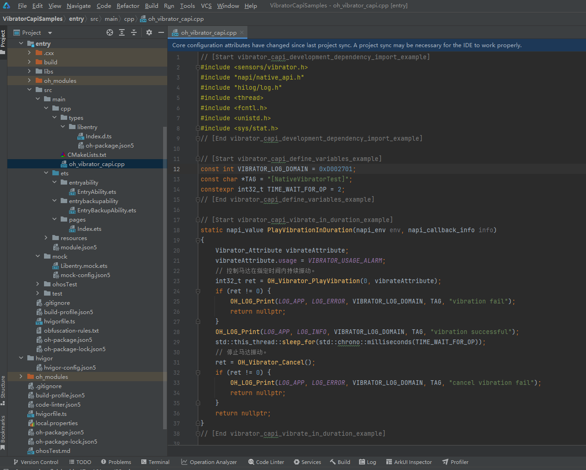

# 振动开发指导(C/C++)
<!--Kit: Sensor Service Kit-->
<!--Subsystem: Sensors-->
<!--Owner: @dilligencer-->
<!--Designer: @butterls-->
<!--Tester: @murphy84-->
<!--Adviser: @hu-zhiqiong-->

## 场景介绍

当设备需要设置不同的振动效果时，可以调用Vibrator模块，例如：设备的按键可以设置不同强度和不同时长的振动，闹钟和来电可以设置不同强度和时长的单次或周期振动。

详细的接口介绍请参考[Vibrator](../../reference/apis-sensor-service-kit/capi-vibrator.md)。


## 函数说明

| 名称                                                         | 描述                           |
| ------------------------------------------------------------ | ------------------------------ |
| OHOS::Sensors::OH_Vibrator_PlayVibration(int32_t duration, Vibrator_Attribute attribute) | 控制马达在指定时间内持续振动。 |
| OHOS::Sensors::OH_Vibrator_PlayVibrationCustom(Vibrator_FileDescription fileDescription, Vibrator_Attribute vibrateAttribute) | 播放自定义振动序列。           |
| OHOS::Sensors::OH_Vibrator_Cancel()                          | 停止马达振动。                 |

## 振动效果说明

目前支持两类振动效果，如下所示。

### 固定时长振动

传入一个固定时长，马达按照默认强度和频率触发振动。

### 自定义振动

自定义振动提供给用户设计自己所需振动效果的能力，用户可通过自定义振动配置文件，并遵循相应规则编排所需振动形式，使能更加开放的振感交互体验。


## 开发步骤

1. 新建一个Native C++工程。

   

2. 控制设备上的振动器，需要申请权限ohos.permission.VIBRATE。具体配置方式请参考[声明权限](../../security/AccessToken/declare-permissions.md)。

   <!-- @[vibrator_capi_permission_example](https://gitcode.com/openharmony/applications_app_samples/blob/master/code/BasicFeature/DeviceManagement/Vibrator/VibratorCapiSamples/entry/src/main/module.json5) --> 
   
   ``` JSON5
   "requestPermissions": [
     {
       "name": "ohos.permission.VIBRATE"
     }
   ]
   ```

3. CMakeLists.txt文件中引入动态依赖库。

   ```C
   target_link_libraries(entry PUBLIC libace_napi.z.so)
   target_link_libraries(entry PUBLIC libhilog_ndk.z.so)
   target_link_libraries(entry PUBLIC libohvibrator.z.so)
   target_link_libraries(entry PUBLIC librawfile.z.so)
   ```

4. 导入模块。

   <!-- @[vibrator_capi_development_dependency_import_example](https://gitcode.com/openharmony/applications_app_samples/blob/master/code/BasicFeature/DeviceManagement/Vibrator/VibratorCapiSamples/entry/src/main/cpp/oh_vibrator_capi.cpp) --> 
   
   ``` C++
   #include <sensors/vibrator.h>
   #include "napi/native_api.h"
   #include "hilog/log.h"
   #include <thread>
   #include <fcntl.h>
   #include <unistd.h>
   #include <sys/stat.h>
   #include <rawfile/raw_file_manager.h>
   ```

5. 定义常量。

   <!-- @[vibrator_capi_define_variables_example](https://gitcode.com/openharmony/applications_app_samples/blob/master/code/BasicFeature/DeviceManagement/Vibrator/VibratorCapiSamples/entry/src/main/cpp/oh_vibrator_capi.cpp) --> 
   
   ``` C++
   const int VIBRATOR_LOG_DOMAIN = 0xD002701;
   const char *TAG = "[NativeVibratorTest]";
   constexpr int32_t TIME_WAIT_FOR_OP = 2;
   ```

6. 控制马达在指定时间内持续振动和停止马达振动。

   <!-- @[vibrator_capi_vibrate_in_duration_example](https://gitcode.com/openharmony/applications_app_samples/blob/master/code/BasicFeature/DeviceManagement/Vibrator/VibratorCapiSamples/entry/src/main/cpp/oh_vibrator_capi.cpp) --> 
   
   ``` C++
   static napi_value PlayVibrationInDuration(napi_env env, napi_callback_info info)
   {
       Vibrator_Attribute vibrateAttribute;
       vibrateAttribute.usage = VIBRATOR_USAGE_ALARM;
       // 控制马达在指定时间内持续振动。
       int32_t ret = OH_Vibrator_PlayVibration(2000, vibrateAttribute);
       if (ret != 0) {
           OH_LOG_Print(LOG_APP, LOG_ERROR, VIBRATOR_LOG_DOMAIN, TAG, "vibration fail");
           return nullptr;
       }
       OH_LOG_Print(LOG_APP, LOG_INFO, VIBRATOR_LOG_DOMAIN, TAG, "vibration successful");
       std::this_thread::sleep_for(std::chrono::milliseconds(TIME_WAIT_FOR_OP));
       // 停止马达振动。
       ret = OH_Vibrator_Cancel();
       if (ret != 0) {
           OH_LOG_Print(LOG_APP, LOG_ERROR, VIBRATOR_LOG_DOMAIN, TAG, "cancel vibration fail");
           return nullptr;
       }
       return nullptr;
   }
   ```

7. 播放自定义振动序列。

   <!-- @[vibrator_capi_vibrate_in_custom_example](https://gitcode.com/openharmony/applications_app_samples/blob/master/code/BasicFeature/DeviceManagement/Vibrator/VibratorCapiSamples/entry/src/main/cpp/oh_vibrator_capi.cpp) --> 
   
   ``` C++
   static napi_value PlayVibrationCustom(napi_env env, napi_callback_info info)
   {
       size_t argc = 1;
       napi_value argv[1] = { nullptr };
       // 获取参数信息
       napi_get_cb_info(env, info, &argc, argv, nullptr, nullptr);
   
       // argv[0]即为函数第一个参数Js资源对象，OH_ResourceManager_InitNativeResourceManager转为Native对象
       NativeResourceManager *mNativeResMgr = OH_ResourceManager_InitNativeResourceManager(env, argv[0]);
       if (mNativeResMgr == nullptr) {
           OH_LOG_Print(LOG_APP, LOG_ERROR, VIBRATOR_LOG_DOMAIN, TAG, "Get native resource manager failed");
           return nullptr;
       }
       // 获取rawfile指针对象
       std::string fileName = "coin_drop.json";
       RawFile *rawFile = OH_ResourceManager_OpenRawFile(mNativeResMgr, fileName.c_str());
       if (rawFile == nullptr) {
           OH_ResourceManager_ReleaseNativeResourceManager(mNativeResMgr);
           OH_LOG_Print(LOG_APP, LOG_ERROR, VIBRATOR_LOG_DOMAIN, TAG, "Get native rawFile failed");
           return nullptr;
       }
       // 获取rawfile的描述符RawFileDescriptor {fd, offset, length}
       RawFileDescriptor descriptor;
       OH_ResourceManager_GetRawFileDescriptor(rawFile, descriptor);
       Vibrator_FileDescription fileDescription = {
           .fd = descriptor.fd,
           .offset = descriptor.start,
           .length = descriptor.length
       };
       Vibrator_Attribute vibrateAttribute = {
           .usage = VIBRATOR_USAGE_RING
       };
       // 播放自定义振动序列。
       int32_t ret = OH_Vibrator_PlayVibrationCustom(fileDescription, vibrateAttribute);
       bool isSuccess = ((ret == 0) || (ret == UNSUPPORTED));
       if (!isSuccess) {
           OH_LOG_Print(LOG_APP, LOG_INFO, VIBRATOR_LOG_DOMAIN, TAG, "Vibratecustom fail");
       } else {
           OH_LOG_Print(LOG_APP, LOG_INFO, VIBRATOR_LOG_DOMAIN, TAG, "Vibratecustom successful");
       }
       std::this_thread::sleep_for(std::chrono::milliseconds(TIME_WAIT_FOR_OP));
       // 停止马达振动。
       OH_Vibrator_Cancel();
       // 关闭打开的指针对象
       OH_ResourceManager_CloseRawFile(rawFile);
       OH_ResourceManager_ReleaseNativeResourceManager(mNativeResMgr);
       return nullptr;
   }
   ```

8. 在Init函数中补充接口。

   <!-- @[vibrator_capi_init_example](https://gitcode.com/openharmony/applications_app_samples/blob/master/code/BasicFeature/DeviceManagement/Vibrator/VibratorCapiSamples/entry/src/main/cpp/oh_vibrator_capi.cpp) --> 
   
   ``` C++
   EXTERN_C_START
   static napi_value Init(napi_env env, napi_value exports)
   {
       napi_property_descriptor desc[] = {
           {"playVibrationInDuration", nullptr, PlayVibrationInDuration, nullptr, nullptr, nullptr, napi_default, nullptr},
           {"playVibrationCustom", nullptr, PlayVibrationCustom, nullptr, nullptr, nullptr, napi_default, nullptr}
       };
       napi_define_properties(env, exports, sizeof(desc) / sizeof(desc[0]), desc);
       return exports;
   }
   EXTERN_C_END
   ```

9. 在types/libentry路径下index.d.ts文件中引入Napi接口。

   <!-- @[vibrator_capi_dependency_napi_example](https://gitcode.com/openharmony/applications_app_samples/blob/master/code/BasicFeature/DeviceManagement/Vibrator/VibratorCapiSamples/entry/src/main/cpp/types/libentry/Index.d.ts) --> 
   
   ``` TypeScript
   export const playVibrationInDuration: () => object;
   export const playVibrationCustom: (resmgr: object) => object;
   ```

10. 编写程序入口调用代码。

    <!-- @[vibrator_capi_index_example](https://gitcode.com/openharmony/applications_app_samples/blob/master/code/BasicFeature/DeviceManagement/Vibrator/VibratorCapiSamples/entry/src/main/ets/pages/Index.ets) --> 
    
    ``` TypeScript
    import { BusinessError } from '@kit.BasicServicesKit';
    import { hilog } from '@kit.PerformanceAnalysisKit';
    import { resourceManager } from '@kit.LocalizationKit';
    import vibratorCapi from 'libentry.so';
    
    const DOMAIN = 0xD002701;
    // ...
              try {
                vibratorCapi.playVibrationInDuration();
                // ...
              } catch (error) {
                let e: BusinessError = error as BusinessError;
                hilog.error(DOMAIN, 'testTag', `Failed to invoke playVibrationInDuration. Code: ${e.code}, message: ${e.message}`);
              }
              // ...
              try {
                vibratorCapi.playVibrationCustom(this.getUIContext().getHostContext()?.resourceManager);
                // ...
              } catch (error) {
                let e: BusinessError = error as BusinessError;
                hilog.error(DOMAIN, 'testTag', `Failed to invoke playVibrationCustom. Code: ${e.code}, message: ${e.message}`);
              }
    ```
