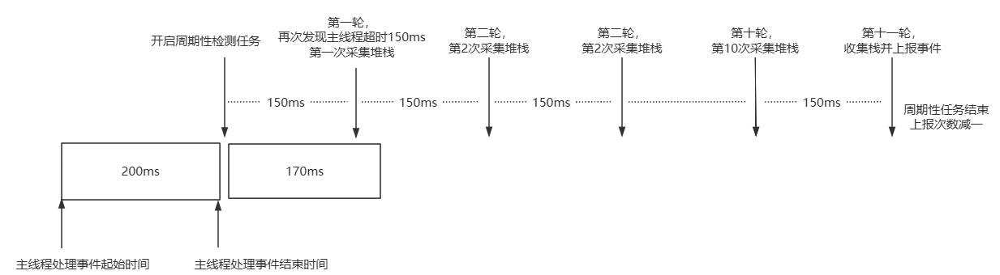
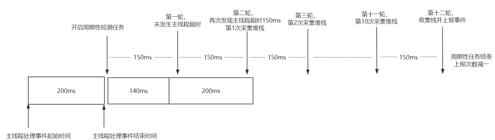
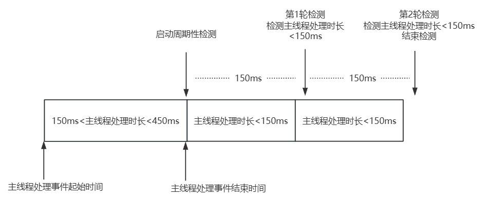
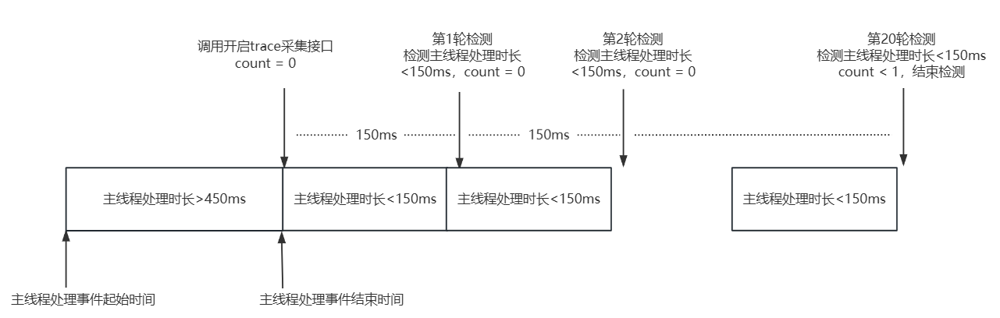
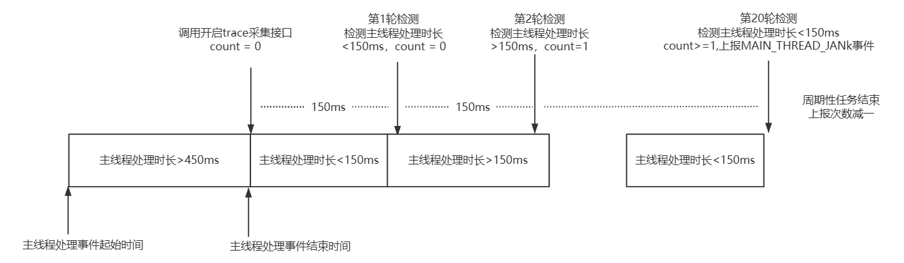
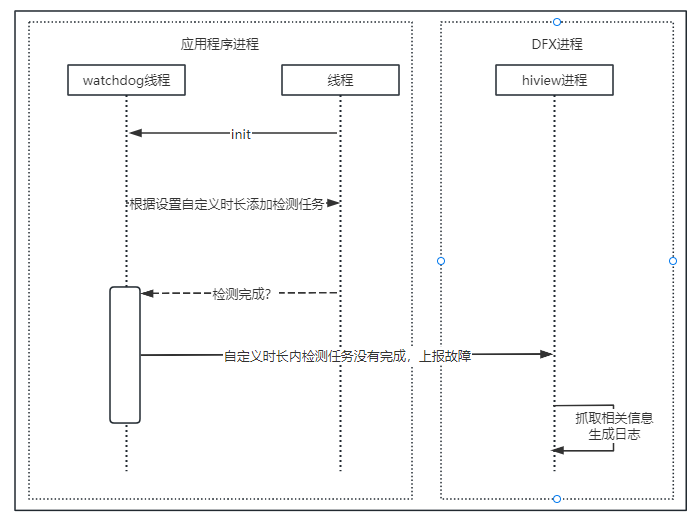

# 任务超时检测

<!--Kit: Performance Analysis Kit-->
<!--Subsystem: HiviewDFX-->
<!--Owner: @rr_cn-->
<!--Designer: @peterhuangyu-->
<!--Tester: @gcw_KuLfPSbe-->
<!--Adviser: @foryourself-->

## 简介

开发者在开发应用时，某一段业务逻辑期望执行一定时间，如果该业务逻辑执行时长超过预期时间，即为任务超时。

任务超时检测主要包括主线程超时检测和任务执行超时检测，二者均可使用HiCollie实现自定义时长来对开发者选择的业务逻辑进行主动检测，主线程超时也可采用默认时长进行检测。详见：[HiCollie使用指导](hicollie-guidelines-ndk.md)。

> **说明：**
>
> [AppFreeze（应用冻屏）检测](appfreeze-guidelines.md)相比任务超时检测，主要是由系统侧提供检测周期性检测逻辑，无需开发者感知和适配。

## 主线程超时检测

### 检测原理

检测主线程处理事件耗时情况，当任务时长超过阈值时，会触发日志采集流程，包含堆栈采集和trace采集两种流程。两种流程触发条件互斥，同一次超时只会触发一种采集流程。

根据主线程单次事件处理时长，触发不同的采集流程。具体的触发条件、采集日志格式及频率限制如下所示：

| 采集流程 | 触发条件 | 采集日志格式 | 前提条件与限制 |
| -------- | -------- | -------- | -------- |
| 堆栈采集 | 150ms &lt; 主线程处理时长 &lt; 450ms | 文件名格式：MAIN_THREAD_JANK_秒级时间_进程PID.txt。<br/>例如：MAIN_THREAD_JANK_20240613211739_40986.txt。| - **应用启动10s内不进行检测。** <br/> - **关闭[开发者选项](https://developer.huawei.com/consumer/cn/doc/harmonyos-guides/ide-developer-mode#section0736139111917)：应用在一个生命周期内，一天最多触发一次主线程超时事件堆栈采集流程。** <br/> - **启用[开发者选项](https://developer.huawei.com/consumer/cn/doc/harmonyos-guides/ide-developer-mode#section530763213432)：应用在一个生命周期内，一小时最多触发一次主线程超时事件采集堆栈采集流程。** |
| trace采集 | 主线程处理时长 > 450ms | 文件名格式：MAIN_THREAD_JANK_unix时间戳_进程PID.trace。<br/>例如：MAIN_THREAD_JANK_1762064185461_40986.trace。| - 触发trace采集的前提：**开发者使用[nolog](performance-analysis-kit-terminology.md#nolog版本)版本，并且关闭[开发者选项](https://developer.huawei.com/consumer/cn/doc/harmonyos-guides/ide-developer-mode#section530763213432)**。<br/> - **应用一天内，最多触发一次主线程超时事件trace采集流程。** |

> **注意：**
>
> 边界值（主线程处理时长等于450ms）不触发任何采集流程。
>
> 关闭开发者模式后，可能无法使用DevEco Studio。因此，可以提前安装应用，再关闭开发者模式。

1. 堆栈采集流程

   当主线程处理超时（150ms &lt; 主线程处理时长 &lt; 450ms）后，启动周期性检测任务，每隔150ms执行一次任务。前2轮检测中，至少有一轮检测到主线程处理时长超过150ms才会生成堆栈文件。分以下三种情况：

   （1）第1轮检测到主线程处理超时（主线程处理时长 > 150ms），开始执行堆栈采集，每隔150ms采集1次堆栈，共采集10次堆栈，第11轮收集堆栈并上报事件，结束检测。

   

   （2）第1轮未检测到主线程处理超时（主线程处理时长 > 150ms），第2轮检测到主线程处理超时（主线程处理时长 > 150ms），开始执行堆栈采集流程，每隔150ms采集1次，共采集10次堆栈，第12轮收集堆栈并上报事件，结束检测。

   

   （3）前2轮均未检测到主线程处理超时（主线程处理时长 > 150ms），结束检测。

   

2. trace采集流程

   当主线程处理超时（主线程处理时长 > 450ms），调用开启trace采集接口，启动周期性检测，每隔150ms检测主线程处理时长超过150ms（检测轮数 = 20）。分两种情况：

   （1）20轮均未检测到主线程处理超时（主线程处理时长 > 150ms），无trace文件生成，结束检测。

   

   （2）20轮检测至少有一轮检测发生主线程处理超时（主线程处理时长 > 150ms），生成trace文件并上报事件，结束检测。

   

### 日志获取

主线程超时日志保存在应用沙箱目录下，可通过以下方式获取

**通过HiAppEvent接口订阅**

HiAppEvent给开发者提供了故障订阅接口，详见[HiAppEvent介绍](hiappevent-intro.md)。参考[订阅主线程超时事件（ArkTS）](hiappevent-watcher-mainthreadjank-events-arkts.md)或[订阅主线程超时事件（C/C++）](hiappevent-watcher-mainthreadjank-events-ndk.md)完成主线程超时事件订阅，并通过事件的[external_log](hiappevent-watcher-mainthreadjank-events.md#事件字段说明)字段读取故障日志文件名。

### 日志规格

1. 主线程超时检测采集日志老化规格

   一般情况，栈文件的大小为7-10KB，trace大小为1-5MB。应用沙箱内的watchdog目录最大保存10M内容，超出后，会自动触发此目录老化机制，按照文件名顺序最多删除100文件。目录地址：/data/storage/el2/log/watchdog/。

2. 主线程超时检测采集堆栈规格

   抓栈功能目前只支持ARM64架构，抓栈结果为解析后的混合栈信息，包含native帧和JS帧。

   抓栈结果部分示例如下：

   ```text
   9 #00 pc 0000757c /system/bin/appspawn(55679d09bcdea35bb1e0d4e1d9a3e58f)
       9 #01 pc 000731c0 /system/lib/ld-musl-aarch64.so.1(add9e521e4eaf5cb009d4260f3b69ccd)
           9 #02 pc 000090a9 /system/bin/appspawn(main+396)(55679d09bcdea35bb1e0d4e1d9a3e58f)
               9 #03 pc 0000ab5d /system/bin/appspawn(AppSpawnRun+100)(55679d09bcdea35bb1e0d4e1d9a3e58f)
                   9 #04 pc 0000e7f1 /system/lib/chipset-pub-sdk/libbegetutil.z.so(RunLoop_+200)(52ace27d827ad482439bf32cc75bb17b)
                   ......
                                           9 #21 pc 00107aec /system/lib/ld-musl-aarch64.so.1(__pthread_cond_timedwait+628)(add9e521e4eaf5cb009d4260f3b69ccd)
   1 #00 pc 00032e67 /system/lib/platformsdk/libmmi-util.z.so(OHOS::MMI::UDSSocket::OnReadPackets(OHOS::MMI::CircleStreamBuffer&, std::__h::function<void (OHOS::MMI::NetPacket&)>)+158)(99e56bc765f9208f7b7ba8b268886a59)
       1 #01 pc 0000312e5 /system/lib/platformsdk/libmmi-client.z.so(OHOS::MMI::ClientMsgHandler::OnMsgHandler(OHOS::MMI::UDSClient const&, OHOS::MMI::NetPacket&)+340)(66ac85e964777ae89f0c26c339093cd1)
           1 #02 pc 0003016b /system/lib/platformsdk/libmmi-client.z.so(OHOS::MMI::ClientMsgHandler::OnPointerEvent(OHOS::MMI::UDSClient const&, OHOS::MMI::NetPacket&)+1222)(66ac85e964777ae89f0c26c339093cd1)
               1 #03 pc 0003b96b /system/lib/platformsdk/libmmi-client.z.so(OHOS::MMI::InputManagerImpl::OnPointerEvent(std::__h::shared_ptr<OHOS::MMI::PointerEvent>)+1370)(66ac85e964777ae89f0c26c339093cd1)
                   1 #04 pc 00095903 /system/lib/platformsdk/libwm.z.so(OHOS::Rosen::InputEventListener::OnInputEvent(std::__h::shared_ptr<OHOS::MMI::PointerEvent>) const+478)(9c40c5f416d6f830435126998fbcad42)
                   ......
                                           1 #21 pc 003f5c55 /system/lib/platformsdk/libark_jsruntime.so(4e6a2651ec80a7f639233f414d6486fe)
                                               1 #22 at anonymous (/entry/build/default/cache/default/default@CompileArkTS/esmodule/debug/entry/src/main/ets/pages/Index.js:67:17)
                                                   1 #23 at wait2 (/entry/build/default/cache/default/default@CompileArkTS/esmodule/debug/entry/src/main/ets/pages/Index.js:16:12)
                                                   ......
   ```

   每次抓栈拷贝16KB主线程调用栈信息进行回栈解析，所以每一次抓栈结果最多可以展示进程16KB调用信息，共进行10次，重复栈帧会聚合在一起，不同调用层次通过行缩进进行区分，最终以树型方式进行展示。当抓栈失败（如主线程阻塞在内核或信号被屏蔽等情况）时，将会输出“/proc/self/wchan”文件内容。

   展示结果中每一行表示一个栈信息，每一行栈帧信息所表示的意义可以按如下方式解读：

   native帧格式如下：

   ```text
   9 #02 pc 000090a9 /system/bin/appspawn(main+396)(55679d09bcdea35bb1e0d4e1d9a3e58f)
   ^  ^       ^               ^              ^                   ^ 
   1  2       3               4              5                   6
   
   1 表示采样到此帧的次数。
   2 表示帧的调用层级，行缩进大小与该层级对应，所有同一层级帧采样到的次数和不大于10次，#00采样次数和为10（设置采样的次数）。
   3 为native帧PC值。
   4 表示调用的文件路径。
   5 调用的函数名及代码行偏移。
   6 so文件md5值。
   ```

   JS帧格式如下：

   ```text
   1 #23 at wait2 (/entry/build/default/cache/default/XXX/entry/src/main/ets/pages/Index.js:16:12)
   ^  ^    ^               ^
   1  2    3               4
   
   1 表示采样到此帧的次数，同样最大为采样次数。
   2 表示帧的调用层级，与native帧意义相同。
   3 表示调用函数名wait2。
   4 表示调用函数所在的路径，文件及行列号。
   ```

3. 主线程超时检测采集trace规格

   trace文件大小约为1-5M左右。trace文件可以通过[HiSmartPerf](https://gitcode.com/openharmony/developtools_smartperf_host)工具进行可视化分析。工具下载链接：[developtools_smartperf_host官方发行版](https://gitcode.com/openharmony/developtools_smartperf_host/releases)。

   trace文件说明参考：[web端加载trace说明](https://gitcode.com/openharmony/developtools_smartperf_host/blob/master/smartperf_host/ide/src/doc/md/quickstart_systemtrace.md)。

## 任务执行超时检测

### 检测原理

**概述**：业务逻辑超出预期时间即为任务超时。

**检测原理**：开发者自定义超时时间，随后在执行业务逻辑时，如果业务逻辑超出预期时间即为任务执行超时。

检测原理如下图：



### 日志获取

任务执行超时日志可通过以下方式获取：

**通过HiAppEvent接口订阅**

HiAppEvent给开发者提供了故障订阅接口，详见[HiAppEvent介绍](hiappevent-intro.md)。参考[订阅任务执行超时事件（ArkTS）](hiappevent-watcher-apphicollie-events-arkts.md)或[订阅任务执行超时事件（C/C++）](hiappevent-watcher-apphicollie-events-ndk.md)完成任务执行超时事件订阅，并通过事件的[external_log](hiappevent-watcher-apphicollie-events.md#事件字段说明)字段读取故障日志文件名。

### 日志规格

任务执行超时事件日志规格与应用冻屏日志相同，可详见[应用冻屏日志规格](appfreeze-guidelines.md#日志规格)。
