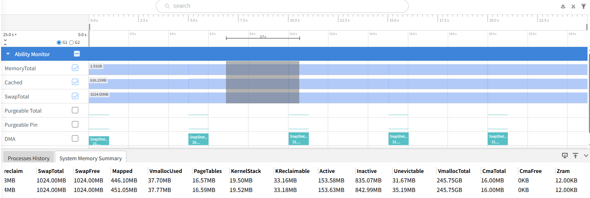
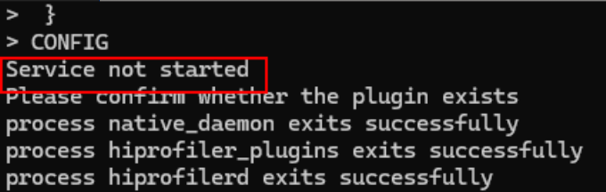

# hiprofiler

<!--Kit: Performance Analysis Kit-->
<!--Subsystem: HiviewDFX-->
<!--Owner: @zyxzyx-->
<!--Designer: @Maplestroy91-->
<!--Tester: @gcw_KuLfPSbe-->
<!--Adviser: @foryourself-->


## Hiprofiler简介


HiProfiler调优组件旨在为开发者提供一系列调优能力，可以用来帮助分析内存、性能等问题。


整体架构包括PC端和设备端。主体部分是PC端的数据展示页面和设备端的性能调优服务。PC端和设备端服务采用C/S模型，PC端的调优数据在[DevEco Studio](https://cbg.huawei.com/#/group/ipd/DevEcoToolsList)和[Smartperf](https://gitcode.com/openharmony/developtools_smartperf_host)网页中展示。设备端程序运行在系统环境中，包含多个部分，其中hiprofilerd进程负责与DevEco通信，作为调优服务。设备端还包括命令行工具hiprofiler_cmd和数据采集进程hiprofiler_plugins。调优服务控制数据采集进程获取调优数据，数据最终流向DevEco Studio，整个过程可抽象为生产者-消费者模型。目前已完成多个插件，包括nativehook、CPU、ftrace、GPU、hiperf、xpower和memory数据采集，实现了CPU、GPU、内存和能耗等多维度调优。


Hiprofiler工具对标业界调优工具，并提供更多能力，比如[跨语言回栈、能耗数据获取、长时间堆内存抓栈功能](#插件参数说明)等。


## 环境要求

- 根据hdc命令行工具指导，完成[环境准备](hdc.md#环境准备)。

- 确保设备已正常连接，并执行hdc shell。


## 架构简介

1. PC端通过DevEco或Smartperf调用hiprofiler_cmd命令行工具；

2. hiprofiler_cmd进程启动hiprofilerd调优服务和hiprofiler_plugins插件进程；

3. hiprofiler_plugins开启对应插件，将获取到的调优数据汇总至hiprofilerd进程；

4. hiprofilerd进程将调优数据以proto格式存储到文件，或者实时返回给PC端；

5. PC端解析数据，生成泳道，展示获取到的调优数据。


## 命令行说明

使用hiprofiler_cmd命令行工具可以调用不同插件并输入不同参数，以满足不同的调优需求。示范命令如下：

```shell
$ hiprofiler_cmd \
  -c - \
  -o /data/local/tmp/hiprofiler_data.htrace \
  -t 30 \
  -s \
  -k \
<<CONFIG
 request_id: 1
 session_config {
  buffers {
   pages: 16384
  }
 }
 plugin_configs {
  plugin_name: "ftrace-plugin"
  sample_interval: 1000
  config_data {
   hitrace_categories: "binder"
   buffer_size_kb: 204800
   flush_interval_ms: 1000
   flush_threshold_kb: 4096
   trace_period_ms: 200
  }
 }
CONFIG
```


| 命令 | 命令说明 | 
| -------- | -------- |
| -c | 设置该选项后，需要将配置文件放入/data/local/tmp目录下，将路径作为参数输入。 | 
| -o | 自定义文件保存路径（需要以/data/local/tmp开头）。若不设置路径，则调优数据自动保存至/data/local/tmp/hiprofiler_data.htrace。重复调优会覆盖原来路径的文件。 | 
| -k | 杀掉已存在的调优服务进程。 | 
| -s | 拉起调优服务进程。 | 
| -t | 设置调优持续时间，单位：s。 | 


输入完hiprofiler_cmd参数后，需要输入插件配置信息，以&lt;&lt;CONFIG开头，CONFIG结尾，中间内容以json格式输入。


以下是session config字段介绍：


| 字段 | 字段说明 | 
| -------- | -------- |
| buffers | 共享内存页的数量。 | 
| split_file | 是否拆分文件。true代表拆分文件；false代表不拆分文件。 | 
| split_file_max_size_mb | 设置split_file为true的情况下，定义每个拆分文件的最大大小。 | 


plugin_configs字段介绍：


| 字段 | 字段说明 | 
| -------- | -------- |
| plugin_name | 开启插件的名字。 | 
| sample_interval | 插件获取调优数据的间隔，单位：ms。 | 
| config_data | 插件具体参数。每个插件需要的参数不同，参考各插件proto定义。<br/>（代码路径：developtools/profiler/protos）。 | 


生成的trace文件通过hdc file recv命令导到本地，然后上传到smartperf网站或者DevEco Studio进行解析。


## 支持插件列表

| 插件名字 | 简介 | 规格说明 |
| -------- | -------- | -------- |
| [native hook](#native-hook插件) | 获取堆内存分配的调用栈信息。 | 采集的进程仅支持[使用调试证书签名的应用](#使用调试证书签名的应用)。|
| [ftrace plugin](#ftrace-plugin插件) | 获取内核打点的trace事件，以及hitrace打点的数据。 | - |
| [cpu plugin](#cpu-plugin插件) | 获取进程CPU使用率信息，包括进程级和线程级的使用率。 | - |
| [gpu plugin](#gpu-plugin插件) | 获取进程GPU使用率信息。 | - |
| [xpower plugin](#xpower-plugin插件) | 获取进程能耗使用情况的数据。 | - |
| [memory plugin](#memory-plugin插件) | 获取进程内存占用情况，主要是获取进程smaps节点的数据。 | - |
| [diskio plugin](#diskio-plugin插件) | 获取进程磁盘空间占用情况。 | - |
| network profiler | 通过进程内打点，获取进程HTTP请求的详细信息。 | 采集的进程仅支持[使用调试证书签名的应用](#使用调试证书签名的应用)。|
| [network plugin](#network-plugin插件) | 获取进程网络流量统计信息。 | - |
| [hisysevent plugin](#hisysevent-plugin插件) | 通过hisysevent命令，获取hisysevent的事件记录数据。 | - |
| [hidump plugin](#hidump-plugin插件) | 通过SP_daemon命令获取相关数据。 | - |


## 使用调试证书签名的应用


> **注意：**
>
> 确认命令指定的应用是否为可调试应用，可执行hdc shell "bm dump -n bundlename | grep appProvisionType"查询，预期返回信息为"appProvisionType": "debug"。

以包名com.example.myapplication为例，可执行如下命令查询：

```shell
hdc shell "bm dump -n com.example.myapplication | grep appProvisionType"
```

如果包名对应的应用是可调试应用，预期返回信息如下：

```shell
"appProvisionType": "debug",
```

构建可调试应用需要使用调试证书进行签名，申请调试证书及签名可参考：[申请调试证书](https://developer.huawei.com/consumer/cn/doc/app/agc-help-add-debugcert-0000001914263178)。


## 插件参数说明


### native hook插件

获取堆内存分配的调用栈信息（通过malloc、mmap、calloc或realloc等基础库函数分配堆内存的调用栈），包括跨语言堆内存分配信息（如在ArkTS语言中调用napi分配native堆内存），还能展示内存泄漏未释放堆内存调用栈信息。

**参数介绍**

| 参数名字 | 类型 | 参数含义 | 详细介绍 | 
| -------- | -------- | -------- | -------- |
| fp_unwind | bool | true表示使用fp回栈方式进行回栈；<br/>false表示使用dwarf回栈方式进行回栈。 | fp回栈是利用了x29寄存器保存的fp指针，函数的fp指针始终指向父函数（调用方）的fp指针，调优服务根据这一特点进行回栈，根据ip计算相对PC，然后查找maps对应区间来进行符号化。<br/>由于现在编译期越来越优化，出现寄存器重用或者编译禁用fp，会导致fp方式回不出相应的栈；混合栈情况下，fp不会记录多重混合，于是便需要dwarf回栈方式做更精确的回栈。<br/>dwarf回栈是根据pc寄存器在map表中查找对应的map信息，由于dwarf是逐级解析调用栈，所以其性能会比fp有劣化。<br/>注意：fp回栈暂不支持调优非aarch64架构的设备。 | 
| statistics_interval | int | 统计间隔，表示将一个统计周期内的栈进行汇总，单位：s。 | 为实现长时间轻量化采集，提供统计模式抓栈。如果更关注调优时的性能，只需要知道每个调用栈出现的次数和总大小，不需要知道每一次具体时间，可以使用统计模式。 | 
| startup_mode | bool | 是否抓取进程启动阶段内存。默认不抓取启动阶段内存。 | 记录进程从被appspawn拉起到调优结束这个期间内堆内存分配的信息。如果抓的是一个sa服务，需要在sa对应的cfg文件中找到拉起sa的进程名（如sa_main），将之加到此参数。 | 
| js_stack_report | int | 是否开启跨语言回栈。<br/>0：不抓取js栈。<br/>1：开启抓取js栈。 | 为方舟环境提供跨语言回栈功能。 | 
| malloc_free_matching_interval | int | 匹配间隔，单位：s，指在相应时间间隔内，将malloc和free进行匹配。匹配到的就不进行落盘。 | 在匹配间隔内，分配并释放了的调用栈不被记录，减少了抓栈服务进程的开销。此参数设置的值大于0时，就不能将statistics_interval参数设置为true。 | 
| offline_symbolization | bool | 是否开启离线符号化。<br/>true：使用离线符号化。<br/>false：使用在线符号化。 | 使用离线符号化时，根据IP匹配符号的操作在网页端（smartperf）完成，优化了native daemon的性能，减少了调优时的进程卡顿。但离线符号化会将符号表写入trace文件，导致文件大小比在线符号化时更大。 |
| sample_interval | int | 采样大小。 | 设置此参数时开启采样模式。采样模式下对于malloc size小于采样大小进行概率性统计。调用栈分配内存大小越大，出现次数越高，被统计的几率越大。 | 

**结果分析**

开启fp回栈+跨语言回栈（其中绿色部分为js栈）：


开启dwarf回栈和跨语言回栈（可以展示出native -&gt; js -&gt;native的栈）：


开启统计模式，在此模式下，栈数据会周期性展示：


开启非统计模式，在此模式下，栈数据不会周期性展示：


### ftrace plugin插件

**参数介绍**

| 参数名字 | 类型 | 参数含义 | 详细介绍 | 
| -------- | -------- | -------- | -------- |
| ftrace_events | string | 抓取的trace event。 | 记录内核打点的trace event。 | 
| hitrace_categories | string | 抓取的hitrace打点信息。 | 调用hitrace能力，获取数据以proto格式写入文件。 | 
| hitrace_apps | string | 抓取的hitrace信息的进程。 | 设置此参数时，只有对应进程的trace信息会被记录。添加此参数时， hitrace_categories不支持添加binder，否则会导致trace数据解析异常。| 
| buffer_size_kb | int | buffer缓存大小，单位：kB。 | hiprofiler_plugins进程读取内核事件所需要的缓存大小。推荐使用默认数值：204800。 | 
| flush_interval_ms | int | 采集数据频率，单位：ms。 | 推荐使用默认数值：1000。 | 
| flush_threshold_kb | int | 刷新数据大小。 | 超过threshold刷新一次数据至文件。用smartperf默认数值即可。 | 
| parse_ksyms | bool | 是否获取内核数据。 | true：获取内核数据；false：不获取内核数据。 | 
| trace_period_ms | int | 读取内核数据的频率。 | 用smartperf默认数值即可。 | 

**结果分析**

示例命令：

```shell
$ hiprofiler_cmd \
  -c - \
  -o /data/local/tmp/hiprofiler_data.htrace \
  -t 10 \
  -s \
  -k \
<<CONFIG
request_id: 1
session_config {
  buffers {
  pages: 16384
  }
}
plugin_configs {
  plugin_name: "ftrace-plugin"
  sample_interval: 1000
  config_data {
  ftrace_events: "binder/binder_transaction"
  ftrace_events: "binder/binder_transaction_received"
  buffer_size_kb: 204800
  flush_interval_ms: 1000
  flush_threshold_kb: 4096
  parse_ksyms: true
  clock: "boot"
  trace_period_ms: 200
  debug_on: false
  }
}
CONFIG
```

此命令读取的内核binder_transaction和binder_transaction_received数据，这两个字段同时使用，才能完整展示binder两端数据。执行命令后，通过hdc file recv /data/local/tmp/hiprofiler_data.htrace命令将文件导出到当前目录，然后用smartperf将该文件打开并解析。结果示例如下图：

点击binder transaction右边的箭头，可以跳转到binder对端的进程或线程。


### memory plugin插件

**参数介绍**

| 参数名字 | 类型 | 参数含义 | 详细介绍 | 
| -------- | -------- | -------- | -------- |
| report_sysmem_vmem_info | bool | 是否读取虚拟内存数据。 | 从/proc/vmstat节点读取内存数据。 | 
| report_process_mem_info | bool | 是否获取进程详细内存数据，如rss_shmem，rss_file，vm_swap等。 | 从/proc/${pid}/stat节点读取内存数据。| 
| report_smaps_mem_info | bool | 是否获取进程smaps内存信息。 | 从/proc/${pid}/smaps节点获取进程smaps内存数据。| 
| report_gpu_mem_info | bool | 是否获取进程GPU使用情况。 | 读取/proc/gpu_memory节点数据。 | 
| parse_smaps_rollup | bool | 是否从smaps_rollup节点读取smaps统计数据。| 读取/proc/{pid}/smaps_rollup节点的smaps统计数据，相比使用report_smaps_mem_info参数调优服务性能会更好（如CPU，内存使用优化）。| 

内存信息包含如下：
- MemTotal：总内存大小。
- MemFree：空闲内存大小。
- Buffers：文件的缓冲大小。
- Cached：缓存的大小。
- Shmem：已被分配的共享内存大小。
- Slab：内核数据缓存大小。
- SUnreclaim：不可回收的Slab大小。
- SwapTotal：交换空间的总大小。
- SwapFree：未被使用交换空间的大小。
- Mapped：设备和文件等映射的大小。
- VmallocUsed：已被使用的虚拟内存大小。
- PageTables：管理内存分页的索引表大小。
- KernelStack：Kernel消耗的内存。
- Active： 在经常使用中的缓冲或高速缓冲存储器页面文件的大小。
- Inactive：在不经常使用中的缓冲或高速缓冲存储器页面文件的大小。
- Unevictable：不能被释放的内存页。
- VmallocTotal：vmalloc虚拟内存总大小。
- CmaTotal：总的连续可用内存。
- CmaFree：空闲的可用内存。
- Zram：Zram的使用大小。
- ZramTotal：Zram的总大小。

>**注意：**
>
> Active和Inactive的区别在于内存空间中是否包含最近被使用过的数据。当物理内存不足，需要释放正在使用的内存空间时，会优先释放Inactive的内存空间。

**结果分析**

通过hiprofiler_cmd 命令获取memory数据。

示例命令：

```shell
$ hiprofiler_cmd \
  -c - \
  -o /data/local/tmp/hiprofiler_data.htrace \
  -t 30 \
  -s \
  -k \
<<CONFIG
request_id: 1
session_config {
  buffers {
  pages: 16384
  }
}
plugin_configs {
  plugin_name: "memory-plugin"
  sample_interval: 5000
  config_data {
  report_process_tree: true
  report_sysmem_mem_info: true
  sys_meminfo_counters: PMEM_MEM_TOTAL
  sys_meminfo_counters: PMEM_MEM_FREE
  sys_meminfo_counters: PMEM_BUFFERS
  sys_meminfo_counters: PMEM_CACHED
  sys_meminfo_counters: PMEM_SHMEM
  sys_meminfo_counters: PMEM_SLAB
  sys_meminfo_counters: PMEM_SWAP_TOTAL
  sys_meminfo_counters: PMEM_SWAP_FREE
  sys_meminfo_counters: PMEM_MAPPED
  sys_meminfo_counters: PMEM_VMALLOC_USED
  sys_meminfo_counters: PMEM_PAGE_TABLES
  sys_meminfo_counters: PMEM_KERNEL_STACK
  sys_meminfo_counters: PMEM_ACTIVE
  sys_meminfo_counters: PMEM_INACTIVE
  sys_meminfo_counters: PMEM_UNEVICTABLE
  sys_meminfo_counters: PMEM_VMALLOC_TOTAL
  sys_meminfo_counters: PMEM_SLAB_UNRECLAIMABLE
  sys_meminfo_counters: PMEM_CMA_TOTAL
  sys_meminfo_counters: PMEM_CMA_FREE
  sys_meminfo_counters: PMEM_KERNEL_RECLAIMABLE
  sys_meminfo_counters: PMEM_ACTIVE_PURG
  sys_meminfo_counters: PMEM_INACTIVE_PURG
  sys_meminfo_counters: PMEM_PINED_PURG
  report_sysmem_vmem_info: true
  report_process_mem_info: true
  report_app_mem_info: false
  report_app_mem_by_memory_service: false
  report_purgeable_ashmem_info: true
  report_dma_mem_info: true
  report_gpu_mem_info: true
  }
}
CONFIG
```

此命令读取系统的内存的基本统计信息。执行命令后，通过hdc file recv /data/local/tmp/hiprofiler_data.htrace命令将文件导出到当前目录，然后通过smartperf打开并解析。结果示例如下图：



通过DevEco Studio 的工具获得内存的数据：


通过DevEco-&gt;profiler-&gt;Allocation工具，选择Memory泳道，可以使用profiler的memory plugin功能。上图展示了框选时间段的进程smaps内存信息。

### xpower plugin插件

**参数介绍**

| 参数名字 | 类型 | 参数含义 | 详细介绍 | 
| -------- | -------- | -------- | -------- |
| bundle_name | string | 需要进行能耗调优的进程名。 | 和/proc/节点下的进程名一致。 | 
| message_type | XpowerMessageType | 需要获取能耗数据的类型。 | 数据类型包括：REAL_BATTERY、APP_STATISTIC、APP_DETAIL、COMPONENT_TOP、ABNORMAL_EVENTS和THERMAL_REPORT。 | 

**结果分析**


通过DevEco-&gt;profiler-&gt;real time monitor工具，可以获取相关进程能耗数据。


### GPU plugin插件

获取GPU使用率相关信息的数据。

**参数介绍**

| 参数名字 | 类型 | 参数含义 | 详细介绍 |
| -------- | -------- | -------- | -------- |
| pid | int | 需要进行调优的进程ID，与/proc/节点下的进程ID一致。 | - |
| report_gpu_info | bool | 是否展示指定进程的GPU使用率信息。| true: 展示指定进程的GPU数据，需要设置pid。false: 不展示指定进程的GPU数据。 |


### CPU plugin插件

获取CPU使用率的相关信息。

**参数介绍**

| 参数名字 | 类型 | 参数含义 | 详细介绍 | 
| -------- | -------- | -------- | -------- |
| pid | int | 需要进行调优的进程ID。 | 和/proc/节点下的进程ID一致。 |
| report_process_info | bool | 是否展示指定进程的CPU使用率信息。| true：展示指定进程的数据，需要设置pid参数；<br/>false：不展示指定进程的数据，仅展示系统级CPU使用率数据。 | 
| skip_thread_cpu_info | bool | 是否跳过线程CPU使用率数据。| true：不展示每个线程CPU使用率的信息，开启此参数时可以降低调优服务的开销；<br/>false：展示每个线程CPU使用率的信息。 | 

CPU 基本信息包含如下：
- Start Time：采集时间的时间戳。
- Duration：前一次采集到本次采集的时间差。
- TotalLoad%：总的CPU使用率。
- UserLoad%：CPU在用户态空间运行的使用率。
- SystemLoad%：CPU在内核空间运行的使用率。
- Process：进程号。

**结果分析**

示例命令：

```shell
$ hiprofiler_cmd \
  -c - \
  -o /data/local/tmp/hiprofiler_data.htrace \
  -t 30 \
  -s \
  -k \
<<CONFIG
request_id: 1
session_config {
  buffers {
  pages: 16384
  }
}
plugin_configs {
  plugin_name: "cpu-plugin"
  sample_interval: 1000
  config_data {
  report_process_info: true
  }
}
CONFIG
```

此命令读取cpu的基本统计信息。执行命令后，通过hdc file recv /data/local/tmp/hiprofiler_data.htrace命令将文件导出到当前目录，然后通过smartperf打开并解析。结果示例如下图：


### diskio plugin插件

获取整机磁盘I/O使用率的相关信息。

**参数介绍**

| 参数名字 | 类型 | 参数含义 | 详细介绍 | 
| -------- | -------- | -------- | -------- |
| report_io_stats | IoReportType | 磁盘I/O统计类型。| 该类型为枚举类型，目前支持：IO_REPORT。| 

当设置成IO_REPORT时，会获得如下磁盘IO信息：
- Data Read：从磁盘读取到内存的总字节数。
- Data Read/sec：每秒从磁盘读取到内存的字节数。
- Data Write：从内存写入磁盘的总字节数。
- Data Write/sec：每秒从内存写入磁盘的字节数。
- Reads In：读入的字节数。
- Reads In/sec：每秒读取的字节数。
- Write Out：写入的字节数。
- Write Out/sec：每秒写入的字节数。

**结果分析**

示例命令：

```shell
$ hiprofiler_cmd \
  -c - \
  -o /data/local/tmp/hiprofiler_data.htrace \
  -t 30 \
  -s \
  -k \
<<CONFIG
request_id: 1
session_config {
  buffers {
  pages: 16384
  }
}
plugin_configs {
  plugin_name: "diskio-plugin"
  sample_interval: 1000
  config_data {
  report_io_stats: IO_REPORT
  }
}
CONFIG
```

此命令读取disk io的基本统计信息。执行命令后，通过hdc file recv /data/local/tmp/hiprofiler_data.htrace将文件导出到当前目录，然后通过smartperf打开并解析。结果示例如下图：


### hidump plugin插件

获取应用进程的fps帧率的数据。

**参数介绍**

| 参数名字 | 类型 | 参数含义 | 详细介绍 | 
| -------- | -------- | -------- | -------- |
| report_fps | bool | 是否报告帧率数据。| true：报告应用进程的帧率数据；<br/>false：不报告帧率数据。 |
| sections | uint32 | 每1秒上报多少次帧率数据。| 默认值为10，即每隔100毫秒上报一次帧率数据。 |

**结果分析**

该插件暂时不支持smartperf工具方式的trace数据解析，只支持DevEco Studio模式下的trace数据解析。如下图所示：


### hisysevent plugin插件

获取系统事件记录的数据。

**参数介绍**

| 参数名字 | 类型 | 参数含义 | 详细介绍 | 
| -------- | -------- | -------- | -------- |
| msg | string | 自定义的字符串。| 该字符串作为保留字段，并未实际使用。使用时可传入空字符串 |
| subscribe_domain | string | 订阅的domain。| 该字段用来订阅具体的domain下的所有事件。如果为空串，则订阅所有domain下的所有事件。 |
| subscribe_event | string | 订阅的event。| 该字段用来订阅具体的event。如果为空串，则订阅所有event。 |

**结果分析**

示例命令：

```shell
$ hiprofiler_cmd \
  -c - \
  -o /data/local/tmp/hiprofiler_data.htrace \
  -t 30 \
  -s \
  -k \
<<CONFIG
request_id: 1
session_config {
  buffers {
  pages: 16384
  }
}
plugin_configs {
  plugin_name: "hisysevent-plugin"
  config_data {
  msg: "hisysevent-plugin"
  subscribe_domain: ""
  subscribe_event: ""
  }
}
CONFIG
```
此命令示例抓取所有hisystem event订阅事件信息。执行命令后，通过hdc file recv /data/local/tmp/hiprofiler_data.htrace将文件导出到当前目录，然后通过smartperf打开并解析。结果示例如下图：


### network plugin插件
 
获取网络上行下载相关的数据。

**参数介绍**

| 参数名字 | 类型 | 参数含义 | 必选 | 详细介绍 | 
| -------- | -------- | -------- | -------- | -------- |
| pid | int32 | 进程ID。 | 否 | 获取指定进程的网络数据。可以传入多个参数。参数缺省时，则抓取整机的网络数据。 |
| startup_process_name | string | 启动的进程名。 | 否 | 如果需要抓取指定进程启动的网络数据，则需要指定此参数。 |
| restart_process_name | string | 重启的进程名。 | 否 | 如果需要抓取指定进程重启的网络数据，则需要指定此参数。 |

>**注意：**
>
> startup_process_name和restart_process_name不能同时为空。

网络信息数据包含如下：
- StartTime：采集时间的时间戳。
- Duration：前一次采集到本次采集的时间差。
- Data Received：接收的网络数据总字节数。
- Data Received/sec：每秒接收的网络数据字节数。
- Data Send：发送的网络数据总字节数。
- Data Send/sec：每秒发送的网络数据字节数。
- Packets In：接收的网络总数据包数。
- Packets In/sec：每秒接收的网络数据包数。
- Packets Out：发送的网络总数据包数。
- Packets Out/sec：每秒发送的网络数据包数。

**结果分析**

示例命令：

```shell
$ hiprofiler_cmd \
  -c - \
  -o /data/local/tmp/hiprofiler_data.htrace \
  -t 30 \
  -s \
  -k \
<<CONFIG
request_id: 1
session_config {
  buffers {
  pages: 16384
  }
}
plugin_configs {
  plugin_name: "network-plugin"
  sample_interval: 1000
  config_data {
  }
}
CONFIG
```
此命令示例抓取整机网络数据信息。执行命令后，通过hdc file recv /data/local/tmp/hiprofiler_data.htrace将文件导出到当前模板，然后通过smartperf打开并解析。结果示例如下图：


## 常用命令

### 堆内存分配调用栈数据采样记录


对com.example.insight_test_stage进程的堆内存分配操作进行抓栈，并开启fp回栈、离线符号化和统计模式。

```shell
$ hiprofiler_cmd \
  -c - \
  -t 30 \
  -s \
  -k \
<<CONFIG
request_id: 1
session_config {
  buffers {
  pages: 16384
  }
}
plugin_configs {
  plugin_name: "nativehook"
  sample_interval: 5000
  config_data {
  save_file: false
  smb_pages: 16384
  max_stack_depth: 20
  process_name: "com.example.insight_test_stage"
  string_compressed: true
  fp_unwind: true
  blocked: true
  callframe_compress: true
  record_accurately: true
  offline_symbolization: true
  startup_mode: false
  statistics_interval: 10
  sample_interval: 256
  js_stack_report: 1
  max_js_stack_depth: 10
  }
}
CONFIG
```


采集的数据会被保存至/data/local/tmp/hiprofiler_data.htrace文件中，该文件包含了内存泄漏分析所需的函数调用信息、线程和动态库维度内存分配情况，以及调用栈次数和分配大小聚类信息。开启离线符号化，fp回栈，统计模式均可以提升调优服务处理数据速率。


抓取指定进程CPU使用率。


对进程号为1234的进程采集CPU数据，采集时长为30s，采样周期为1000ms，调优数据传输的共享内存大小是16384个内存页，采集的数据会被保存至/data/local/tmp/hiprofiler_data.htrace文件中。


```shell
$ hiprofiler_cmd \
  -c - \
  -o /data/local/tmp/hiprofiler_data.htrace \
  -t 30 \
  -s \
  -k \
<<CONFIG
 request_id: 1
 session_config {
  buffers {
   pages: 16384
  }
 }
 plugin_configs {
  plugin_name: "cpu-plugin"
  sample_interval: 1000
  config_data {
   pid: 1234
   report_process_info: true
  }
 }
CONFIG
```


## 常见问题

### 调优出现异常

**现象描述**

使用hiprofiler_cmd命令时，显示Service not started。



**可能原因&amp;解决方法**

调优服务未能开启，说明正在使用DevEco Studio调优或者上次调优异常退出，需要执行hiprofiler_cmd -k之后再重新执行调优命令。

### 抓取到的trace文件为空

**现象描述**

抓取到的trace文件是空的

**可能原因&amp;解决方法**

需要检查生成文件的路径是否在/data/local/tmp/目录下。如果目标路径是/data/local/tmp下的一个文件夹，则尝试对文件夹执行chmod 777操作。如果是user版本使用nativehook或者network profiler抓取no debug应用，也抓不到数据（参考changelog https://gitcode.com/openharmony/docs/pulls/57419）。

### 调优数据疑似不准确

**现象描述**

hiprofiler抓取到的native heap和hidumper查看的native heap有差异。

**可能原因&amp;解决方法**

hidumper抓取的是进程维度内存使用情况，hiprofiler抓取到的是进程用户态通过基础库函数（malloc，mmap，realloc等，operator new也是调用的malloc）分配堆内存的数据。两者之间会有差异，差异存在于线程的内存缓存，堆内存延迟释放，加载器使用内存等。


### 调优时目标进程卡顿

**现象描述**

使用hiprofiler_cmd命令抓取应用进程的内存trace，采用FP回栈或者dwarf回栈时，出现应用进程卡顿。

**可能原因&amp;解决方法**

可以通过hiprofiler_cmd命令中config参数配置来进行调整。
hiprofiler_cmd命令中config参数的调整方法如下：
 - 适当减小max_stack_depth和max_js_stack_depth参数的值，减少回栈深度，减少调用栈信息的采集。
 - 适当增大smb_pages参数的值，增大调优数据传输的共享内存大小。默认值为16384个页大小，即：16384*4096=67108864字节（64M）。可以调整到128M。
 - 适当增加sample_interval参数的值，增大采样线程栈的大小。默认值为256，可以调整到512。
