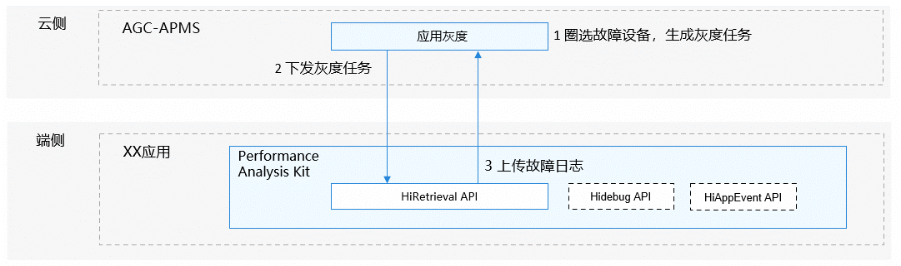

# 应用灰度采集介绍

<!--Kit: Performance Analysis Kit-->
<!--Subsystem: HiviewDFX-->
<!--Owner: @ljy_love_code-->
<!--Designer: @jiangwenhao-->
<!--Tester: @gcw_KuLfPSbe-->
<!--Adviser: @jinqiuheng-->

## 简介

从版本26.0.0开始，系统支持应用灰度采集功能，本功能在运维态使用，用于采集故障日志。功能需端云配合，应用开发者在端侧应用中集成此功能后，在APMS云侧平台完成注册认证等操作后，可以在APMS云侧启用具体故障类别的灰度任务。

APMS云侧平台根据任务类别，采用特定算法在所有参与灰度活动的设备中，圈选出一部分设备执行灰度任务。

当被圈选的设备发生对应故障后，系统可以精准采集故障日志并上报到APMS云侧平台，供开发者查阅，方便开发者解决问题。

> **说明：**
>
> 此功能会在采集故障日志时降低性能表现并增加功耗。

## 基本概念

**灰度采集**：云侧平台在创建灰度任务时，选取部分设备打开故障日志的采集和上传。这些日志通常包括重载日志，采集和上传有额外的开销，不适宜在所有设备上开启，通过选取少量设备开启的方式实现故障定位和性能功耗的折中。在Performance Analysis Kit的上下文中，有时也简称灰度。

**灰度任务**：灰度任务是灰度采集的单次实现载体。一次灰度任务规定了在特定的时间段内，针对特定故障类型，在某些被选取设备上开启故障日志采集和上传。灰度任务的发布需要开发者在云侧平台进行操作，经过圈选算法后选中部分设备执行。开发者可以在云侧查看某次任务的状态，所采集到的故障日志等信息，辅助故障定位。

## 实现原理

### 整体架构

### 集成步骤

1. 应用开发者在APMS云侧平台注册账户，并通过应用开发者的认证。
2. 应用开发者在端侧的应用开发中集成应用灰度能力，并做适当的初始化使得应用能力功能开始运行。
3. 应用开发者在APMS云侧平台登录账号以后，在平台发起灰度任务。通过填写任务时间，故障类型等信息，执行圈选算法，最终圈定参与此次任务的设备。随后任务会从云侧下发到这些设备。
4. 上述圈选设备在收到任务以后，在任务激活时间内如果该应用处于运行状态，并且发生了对应的故障，设备会抓取各项故障日志（包括一些正常商用版本不会采集的重载日志）并上传到云侧。在任务结束时，还会发送一份任务报告至云侧。
5. 应用开发者可以随时在APMS云侧平台查看和下载上报的故障日志和任务报告，也可以查看平台智能分析的故障根因，以更好的分析定位问题。

## 约束与限制

应用隐私声明中需要包含Performance Analysis Kit个人数据处理说明。