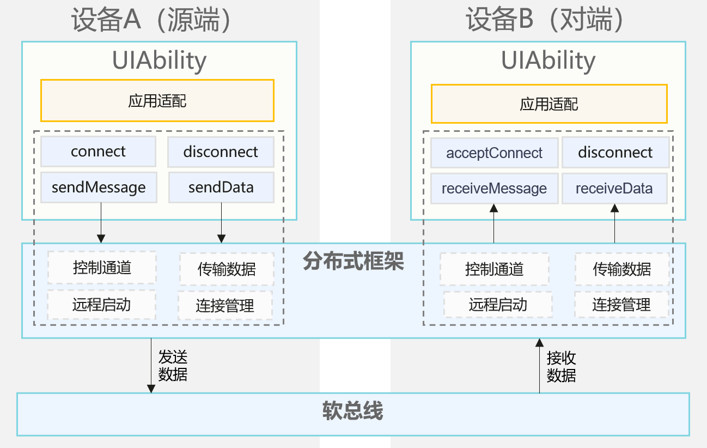

# UIAbility与UIAbility连接开发指南
<!--Kit: Distributed Service Kit-->
<!--Subsystem: DistributedSched-->
<!--Owner: @hobbycao-->
<!--Designer: @gsxiaowen-->
<!--Tester: @hanjiawei-->
<!--Adviser: @w_Machine_cc-->


## 简介

自API version 18起，系统新增支持应用跨设备协同连接与通信能力（含数据传输）。该特性通过分布式组件管理框架实现多端应用协作（即多个终端设备上的应用协同完成同一业务场景），成为分布式能力体系的核心功能之一。典型应用场景如智能手表端的拍照控制应用，可远程调用手机端相机功能并实现跨设备的实时双向数据交互。


### 能力范围

- 跨设备拉起应用：支持在分布式组网环境下拉起关联应用，实现多端业务协同（需应用适配开发）
- 跨设备数据交互：实现跨设备数据传输，跨设备数据交互能力随不同应用类型存在差异。具体为系统应用可传输文本、字节流、图片及传输流，三方应用仅支持文本信息。

### 基本概念

在进行应用跨设备连接管理开发前，开发者应了解以下基本概念：

- **DMS**
  
  DMS（Distributedsched Management Service）是分布式组件管理框架，提供分布式组件的管理能力。

- **UIAbility**

  [UIAbility](https://developer.huawei.com/consumer/cn/doc/harmonyos-guides/uiability-overview)描述应用程序的界面交互能力，负责管理应用界面的生命周期、用户交互以及界面渲染等任务。

<!--Del-->
- **字节流**
  
  字节流是数据类型为[ArrayBuffer](../arkts-utils/arraybuffer-object.md)类型的数据。可以被用于存储二进制数据，例如图像或音频数据。

- **传输流**

  可进行图片、视频流传输的媒体流。
<!--DelEnd-->
### 实现原理

应用跨设备连接管理依托分布式组件管理框架，在分布式组件管理框架上进行了JS对象型的封装，能通过分布式组件管理框架服务建立协同关系并进行应用间的连接，数据的交互能力由系统支持。

**图1** 应用跨设备连接运行机制




### 约束与限制

- 仅限于API version 18及以上版本设备，设备间需要登录相同的华为账号。

- 不同设备间只有相同bundleName的UIAbility应用才能进行协同。
<!--Del-->
- 字节流、图片以及传输流的能力仅支持系统应用。
<!--DelEnd-->
- 业务协同完毕后需及时结束协同状态。为了系统的安全和资源合理利用考虑，未申请长时任务的应用，在锁屏或退至后台5秒以上，会被结束掉协同生命周期。

- 分布式组件管理框架在协同过程中不会对传输内容进行审查。涉及隐私敏感数据时，建议业务通过弹框提醒等方式提醒用户。


## 环境准备

### 环境要求

可登录华为账号的设备A和设备B，设备间需要组网成功（设备组网通过调用[Device Manager](https://developer.huawei.com/consumer/cn/doc/harmonyos-guides/devicemanager-guidelines)的接口实现）。


### 搭建环境

1. 在PC上安装[DevEco Studio](https://developer.huawei.com/consumer/cn/download/deveco-studio)，要求版本在4.1及以上。
2. 将public-SDK更新到API 18或以上<!--Del-->，更新SDK的具体操作可参见[更新指南]( ../tools/openharmony_sdk_upgrade_assistant.md)<!--DelEnd-->。
3. 用USB线缆将两台调测设备（设备A和设备B）连接到PC。
4. 打开设备A和设备B的蓝牙，互相识别，实现组网。


### 检验环境是否搭建成功

PC上执行shell命令：

```shell
hdc shell
hidumper -s 4700 -a "buscenter -l remote_device_info"
```

组网成功时可显示组网设备数量的信息，如“remote device num = 1”。


## 开发指导

应用跨设备连接管理可以通过分布式组件管理框架，拉起对端设备并发送消息。具体案例提供如下。

### 接口说明

应用跨设备连接管理接口如下表所示。具体API说明详见API参考：[abilityConnectionManager](../reference/apis-distributedservice-kit/js-apis-distributed-abilityConnectionManager.md)。

**表1** abilityConnectionManager接口功能介绍

| 接口名 | 描述 |
| -------- | -------- |
| createAbilityConnectionSession(serviceName:&nbsp;string,&nbsp;context:&nbsp;Context,&nbsp;peerInfo:&nbsp;PeerInfo,&nbsp;connectOptions:&nbsp;ConnectOptions):&nbsp;number; | 创建应用间的会话。 |
| destroyAbilityConnectionSession(sessionId:&nbsp;number):&nbsp;void; | 销毁应用间的会话。 |
| connect(sessionId:&nbsp;number):&nbsp;Promise&lt;ConnectResult&gt;; | source侧进行ability的连接。 |
| acceptConnect(sessionId:&nbsp;number,&nbsp;token:&nbsp;string):&nbsp;Promise&lt;void&gt;; | sink侧进行ability的连接。 |
| disconnect(sessionId:&nbsp;number):&nbsp;void; | 断开ability的连接。 |
| on(type:&nbsp;'connect'&nbsp;\| &nbsp;'disconnect'&nbsp;\| &nbsp;'receiveMessage'&nbsp;\| &nbsp;'receiveData',&nbsp;sessionId:&nbsp;number,&nbsp;callback:&nbsp;Callback&lt;EventCallbackInfo&gt;):&nbsp;void | 监听<!--Del-->connect/disconnect/receiveMessage/receiveData<!--DelEnd-->事件。 |
| off(type:&nbsp;'connect'&nbsp;\| &nbsp;'disconnect'&nbsp;\| &nbsp;'receiveMessage'&nbsp;\| &nbsp;'receiveData',&nbsp;sessionId:&nbsp;number,&nbsp;callback?:&nbsp;Callback&lt;EventCallbackInfo&gt;):&nbsp;void | 取消<!--Del-->connect/disconnect/receiveMessage/receiveData<!--DelEnd-->事件的监听。 |
| sendMessage(sessionId:&nbsp;number,&nbsp;msg:&nbsp;string):&nbsp;Promise&lt;void&gt;; | 发送文本信息。 |
|<!--DelRow--> sendData(sessionId:&nbsp;number,&nbsp;data:&nbsp;ArrayBuffer):&nbsp;Promise&lt;void&gt;; | 发送字节流（仅支持系统应用调用）。 |
|<!--DelRow--> sendImage(sessionId:&nbsp;number,&nbsp;image:&nbsp;image.PixelMap):&nbsp;Promise&lt;void&gt;; | 发送图片（仅支持系统应用调用）。 |
|<!--DelRow--> createStream(sessionId:&nbsp;number,&nbsp;param:&nbsp;StreamParam):&nbsp;Promise&lt;number&gt;; | 创建传输流（仅支持系统应用调用）。 |
|<!--DelRow--> destroyStream(sessionId:&nbsp;number):&nbsp;void; | 关闭传输流（仅支持系统应用调用）。 |


### 开发步骤

通过应用跨设备管理模块，设备A拉起并连接设备B上的应用。连接成功后，设备A和设备B通过on接口注册相应事件的回调监听。设备A或设备B通过sendMessage<!--Del-->、sendData、sendImage、createStream等<!--DelEnd-->接口发送消息<!--Del-->、字节流、传输流<!--DelEnd-->。对端通过监听到的回调信息进行后续协同业务。

**导入AbilityConnectionManager模块文件**

<!-- @[import_abilityConnectionManager](https://gitcode.com/openharmony/applications_app_samples/blob/master/code/DocsSample/DistributedCollab/entry/src/main/ets/pages/Index.ets) -->

``` TypeScript
import {abilityConnectionManager, distributedDeviceManager } from '@kit.DistributedServiceKit';
```


**发现设备**

设备A上的应用，需要发现并选择设备B的netWorkId来作为协同接口的入参。可调用分布式设备管理模块接口，进行对端设备的发现和选择，详情可参考[分布式设备管理模块](devicemanager-guidelines.md)进行开发。


**应用间创建会话并进行连接**

设备A和设备B在创建会话和连接时要执行的操作不同，接下来的开发步骤中，以设备A作为连接发起方，设备B作为连接接收端。

**1.设备A**

应用主动调用createAbilityConnectionSession()接口创建会话，获得sessionId。之后调用connect()方法启动ability会话连接（此时设备B上应用会被拉起）。

<!-- @[source_1](https://gitcode.com/openharmony/applications_app_samples/blob/master/code/DocsSample/DistributedCollab/entry/src/main/ets/pages/Index.ets) -->

``` TypeScript
let dmClass: distributedDeviceManager.DeviceManager;

function initDmClass(): void {
  // 其中createDeviceManager接口为系统API
  try {
    dmClass = distributedDeviceManager.createDeviceManager('com.example.remotephotodemo');
  } catch (err) {
    hilog.info(0x0000, 'testTag', 'createDeviceManager err');
  }
}

// 获取设备B的设备ID
function getRemoteDeviceId(): string | undefined {
  initDmClass();
  if (typeof dmClass === 'object' && dmClass !== null) {
    hilog.info(0x0000, 'testTag', 'getRemoteDeviceId begin');
    let list = dmClass.getAvailableDeviceListSync();
    if (typeof (list) === 'undefined' || typeof (list.length) === 'undefined') {
      hilog.info(0x0000, 'testTag', 'getRemoteDeviceId err: list is null');
      return;
    }
    if (list.length === 0) {
      hilog.info(0x0000, 'testTag', 'getRemoteDeviceId err: list is empty');
      return;
    }
    // 弹框选择设备
    return list[0].networkId;
  } else {
    hilog.info(0x0000, 'testTag', 'getRemoteDeviceId err: dmClass is null');
    return;
  }
}
```

<!-- @[source_2](https://gitcode.com/openharmony/applications_app_samples/blob/master/code/DocsSample/DistributedCollab/entry/src/main/ets/pages/Index.ets) -->

``` TypeScript
  createSession(): void {
    // 定义peer信息
    const peerInfo: abilityConnectionManager.PeerInfo = {
      deviceId: getRemoteDeviceId()!,
      bundleName: 'com.example.myapplication',
      moduleName: 'entry',
      abilityName: 'EntryAbility',
    };
    const myRecord: Record<string, string> = {
      'newKey1': 'value1',
    };

    // 定义连接选项
    const connectOption: abilityConnectionManager.ConnectOptions = {
      needSendData: true,
      startOptions: abilityConnectionManager.StartOptionParams.START_IN_FOREGROUND,
      parameters: myRecord
    };
    console.info(TAG + JSON.stringify(peerInfo))
    console.info(TAG + JSON.stringify(connectOption))
    let context = this.getUIContext().getHostContext();
    try {
      this.sessionId = abilityConnectionManager.createAbilityConnectionSession('collabTest', context, peerInfo, connectOption);
      hilog.info(0x0000, 'testTag', 'createSession sessionId is', this.sessionId);
      abilityConnectionManager.connect(this.sessionId).then((connectResult) => {
        if (!connectResult.isConnected) {
          hilog.info(0x0000, 'testTag', 'connect failed');
          return;
        }
      }).catch(() => {
        hilog.error(0x0000, 'testTag', 'connect failed');
      })
    } catch (error) {
      hilog.error(0x0000, 'testTag', error);
    }
  }
```


**2.设备B**

设备A的应用调用connect()后，设备B的应用会通过协同的方式被拉起，拉起时会触发协同生命周期函数onCollaborate()，可在该接口中配置createAbilityConnectionSession()接口以及acceptConnect()接口的调用。

<!-- @[collab](https://gitcode.com/openharmony/applications_app_samples/blob/master/code/DocsSample/DistributedCollab/entry/src/main/ets/entryability/EntryAbility.ets) -->

``` TypeScript
onCollaborate(wantParam: Record<string, Object>): AbilityConstant.CollaborateResult {
  hilog.info(0x0000, 'testTag', '%{public}s', 'on collaborate');
  let param = wantParam['ohos.extra.param.key.supportCollaborateIndex'] as Record<string, Object>
  this.onCollab(param);
  return 0;
}

onCollab(collabParam: Record<string, Object>) {
  const sessionId = this.createSessionFromWant(collabParam);
  if (sessionId == -1) {
    return;
  }
  this.registerSessionEvent(sessionId);
  const collabToken = collabParam['ohos.dms.collabToken'] as string;
  abilityConnectionManager.acceptConnect(sessionId, collabToken).then(() => {
    AppStorage.setOrCreate<number>('sessionId', sessionId);
  }).catch(() => {
    console.error(TAG + `acceptConnect failed` );
  })
}

createSessionFromWant(collabParam: Record<string, Object>): number {
  let sessionId = -1;
  const peerInfo = collabParam['PeerInfo'] as abilityConnectionManager.PeerInfo;
  if (peerInfo == undefined) {
    return sessionId;
  }
  // 定义连接选项
  const options = collabParam['ConnectOption'] as abilityConnectionManager.ConnectOptions;
  try {
    sessionId = abilityConnectionManager.createAbilityConnectionSession('collabTest', this.context, peerInfo, options);
  } catch (error) {
    console.error(error);
  }
  return sessionId;
}
```


**注册事件监听**

在应用创建会话成功并获得sessionId后，开发者可调用on()方法进行对应事件的监听，通过触发回调函数的方式通知监听者，以便执行对应业务。
<!--RP1-->
<!-- @[abilityconnectionmanager_on](https://gitcode.com/openharmony/applications_app_samples/blob/master/code/DocsSample/DistributedCollab/entry/src/main/ets/entryability/EntryAbility.ets) -->

``` TypeScript
  registerSessionEvent(sessionId: number) {
    abilityConnectionManager.on('connect',sessionId,(callbackInfo) => {
      AppStorage.setOrCreate<boolean>('isConnected', true);
      AppStorage.setOrCreate<string>('receiveMessage', 'connect success');
    });
    abilityConnectionManager.on('disconnect',sessionId,(callbackInfo) => {
      abilityConnectionManager.destroyAbilityConnectionSession(sessionId)
      AppStorage.setOrCreate<boolean>('isConnected', false);
      AppStorage.setOrCreate<string>('receiveMessage', 'session disconnect');
    })
    abilityConnectionManager.on('receiveMessage',sessionId,(callbackInfo) => {
      AppStorage.setOrCreate<string>('receiveMessage', callbackInfo.msg);
      if (callbackInfo.msg == 'startStream') {
        hilog.info(0x0000, 'testTag', 'startStream');
      }
    })
    abilityConnectionManager.on('receiveData',sessionId,(callbackInfo) => {
      let decoder = util.TextDecoder.create('utf-8');
      let str = decoder.decodeWithStream(new Uint8Array(callbackInfo.data));
      AppStorage.setOrCreate<string>('receiveMessage', str);
    })
  }
```


<!--RP1End-->  
<!--Del-->
**发送数据**
<!--DelEnd-->
**<!--Del-->1.<!--DelEnd-->发送消息**

应用连接成功后，开发者可在设备A或者设备B上调用sendMessage()方法给对端应用发送文本信息。

  ```ts
  import { abilityConnectionManager } from '@kit.DistributedServiceKit';
  import { hilog } from '@kit.PerformanceAnalysisKit';

  abilityConnectionManager.sendMessage(this.sessionId, "message send success").then(() => {
    hilog.info(0x0000, 'testTag', "sendMessage success");
  }).catch(() => {
    hilog.error(0x0000, 'testTag', "connect failed");
  })
  ```
<!--Del-->
**2.发送字节流数据**

应用连接成功后，开发者可在设备A或者设备B上调用sendData()方法给对端应用发送字节数据（仅支持系统应用调用）。

  ```ts
  import { abilityConnectionManager } from '@kit.DistributedServiceKit';
  import { hilog } from '@kit.PerformanceAnalysisKit';
  import { util } from '@kit.ArkTS';
  
  let textEncoder = util.TextEncoder.create("utf-8");
  const arrayBuffer  = textEncoder.encodeInto("data send success");

  abilityConnectionManager.sendData(this.sessionId, arrayBuffer.buffer).then(() => {
    hilog.info(0x0000, 'testTag', "sendMessage success");
  }).catch(() => {
    hilog.info(0x0000, 'testTag', "sendMessage failed");
  })
  ```

**3.发送图片**

应用连接成功后，开发者可在设备A或者设备B上调用sendImage()方法给对端应用发送图片（仅支持系统应用调用）。

  ```ts
  import { abilityConnectionManager } from '@kit.DistributedServiceKit';
  import { hilog } from '@kit.PerformanceAnalysisKit';
  import { photoAccessHelper } from '@kit.MediaLibraryKit';
  import { image } from '@kit.ImageKit';
  import { fileIo as fs } from '@kit.CoreFileKit';

  try {
    let photoSelectOptions = new photoAccessHelper.PhotoSelectOptions();
    photoSelectOptions.MIMEType = photoAccessHelper.PhotoViewMIMETypes.IMAGE_TYPE;
    photoSelectOptions.maxSelectNumber = 5;
    let photoPicker = new photoAccessHelper.PhotoViewPicker();
    photoPicker.select(photoSelectOptions).then((photoSelectResult) => {
      if (!photoSelectResult) {
        hilog.error(0x0000, 'testTag', 'photoSelectResult = null');
      return;
      }

      let file = fs.openSync(photoSelectResult.photoUris[0], fs.OpenMode.READ_ONLY);
      hilog.info(0x0000, 'testTag', 'file.fd:' + file.fd);

      let imageSourceApi: image.ImageSource = image.createImageSource(file.fd);
      if (imageSourceApi) {
        imageSourceApi.createPixelMap().then((pixelMap) => {
          abilityConnectionManager.sendImage(this.sessionId, pixelMap)
        });
      } else {
        hilog.info(0x0000, 'testTag', 'imageSourceApi is undefined');
      }
    })
  } catch (error) {
    hilog.error(0x0000, 'testTag', 'photoPicker failed with error: ' + JSON.stringify(error));
  }
  ```

**4.发送传输流**

应用连接成功后，开发者可在设备A或者设备B上调用createStream()方法创建传输流(仅支持系统应用调用)，之后调用startStream()方法传输流给对端设备。

  ```ts
  import { abilityConnectionManager } from '@kit.DistributedServiceKit';
  import { hilog } from '@kit.PerformanceAnalysisKit';

  hilog.info(0x0000, 'testTag', 'startStream');
  abilityConnectionManager.createStream(this.sessionId ,{name: 'receive', role: 0}).then(async (streamId:number) => {
    let surfaceParam: abilityConnectionManager.SurfaceParam = {
      width: 640,
      height: 480,
      format: 1
    }
    let surfaceId = abilityConnectionManager.getSurfaceId(streamId, surfaceParam);
    hilog.info(0x0000, 'testTag', 'surfaceId is'+surfaceId);
    AppStorage.setOrCreate<string>('surfaceId', surfaceId);
    abilityConnectionManager.startStream(streamId);
  })
  ```
<!--DelEnd-->
**结束协同**

业务协同完毕后需及时结束协同状态。若是后续短期内还有协同需要，可调用disconnect()方法断开应用间的连接，保留sessionId，以便下次继续使用该sessionId进行连接。若是短期无需使用协同业务，可直接调用destroyAbilityConnectionSession()接口销毁会话，此时会自动断开连接。

  ```ts
  import { abilityConnectionManager } from '@kit.DistributedServiceKit';
  import { hilog } from '@kit.PerformanceAnalysisKit';

  hilog.info(0x0000, 'testTag', 'disconnectRemoteAbility begin');
  if (this.sessionId == -1) {
    hilog.info(0x0000, 'testTag', 'Invalid session ID.');
  return;
  }
  abilityConnectionManager.disconnect(this.sessionId);

  hilog.info(0x0000, 'testTag', 'destroyAbilityConnectionSession called');
  abilityConnectionManager.destroyAbilityConnectionSession(this.sessionId);
  ```


### 调测验证

应用侧开发完成后，可在设备A和设备B上安装应用，测试步骤如下：

1. 点击设备A应用的“连接”按钮，此时设备B上的应用被拉起。
2. 点击设备A应用的“sendMessage”按钮，此时设备B上的应用会触发on()方法的回调，接收该字符串。
<!--Del-->
3. 点击设备A应用的“sendData”按钮，此时设备B上的应用会触发on()方法的回调，接收该字节流。
4. 点击设备A应用的“sendImage”按钮，此时设备B上的应用会触发on()方法的回调，接收该图片。
5. 点击设备A应用的“启动传输流”按钮，此时设备B上的应用会触发on()方法的回调，接收传输流内容。
<!--DelEnd-->
6. 点击设备A或设备B应用的“disconnect”按钮，此时双端会断开连接，触发connect()接口的回调，将断连信息上报给双端应用。

## 常见问题

### 设备A应用无法拉起设备B应用

**可能原因**

- 【原因1】：设备间没有相互组网，导致设备A发起连接时，createAbilityConnectionSession()接口中的peerInfo.deviceId属性未设置正确。

- 【原因2】：有多台设备相互组网，设备A发起连接时，createAbilityConnectionSession()接口中的peerInfo.deviceId属性设置为其他设备的deviceId，未正确指定到B设备上。

**解决措施**

- 针对原因1，设备A和设备B开启USB调试功能，用USB线连接设备和PC。执行shell命令：
   
  ```shell
  hdc shell
  hidumper -s 4700 -a "buscenter -l remote_device_info"
  ```
  回显信息为“remote device num = 0”即为组网失败，请确保登录同一华为账号并使用蓝牙连接。组网成功时可显示组网设备数量的信息，如“remote device num = 1”。

- 针对原因2，查询并选择指定设备时，添加设备选择列表，确保指定到期望的设备。

### 应用锁屏或者退后台一段时间后，正在执行的协同业务被断开

**可能原因**

应用在协同过程中，DMS会对应用的生命周期进行监听。发生锁屏、退后台操作持续五秒后，未申请长时任务的应用会被结束协同状态。

**解决措施**

应用[申请长时任务](../task-management/continuous-task.md)，消除此限制。