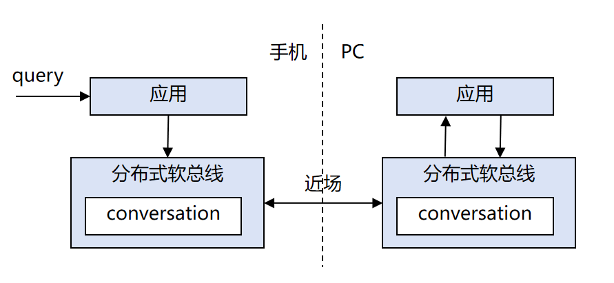

# 跨设备唤醒与消息传输开发指导
<!--Kit: Distributed Service Kit-->
<!--Subsystem: DistributedSched-->

## 简介

随着分布式场景的发展，智能体间的消息通信需求日益增长。OpenHarmony提供了分布式软总线跨设备智能体唤醒与消息传输能力，基于分布式软总线能力，实现跨设备智能体的唤醒和消息传递。该模块提供了设备查询、快速设备唤醒和消息监听与发送等核心能力，使应用能够在同账号可信设备智能体之间进行高效、可靠的消息交互。

### 实现原理

分布式软总线跨设备智能体唤醒与消息传输模块实现跨设备精准执行用户意图：



应用通过注册会话监听器，可以接收来自其他设备的消息；通过发送会话数据接口，可以向指定设备的特定能力发送消息。整个通信过程依赖于设备的network ID或UDID进行寻址，确保消息能够准确投递到目标设备的目标应用能力。

### 约束与限制

- 需要配置`ohos.permission.DISTRIBUTED_DATASYNC`和`ohos.permission.sec.ACCESS_UDID`权限。
- 不同设备间只有相同`bundleName`的应用才能进行消息交互。
- 目标设备必须是同账号可信设备。
- 支持系统原生的快速唤醒能力，设备在插电合盖状态下依然可达。
- 该能力从API 26.1.0开始支持。

## 环境准备

### 环境要求

确保设备是同账号设备。

### 搭建环境

1. 在开发PC上安装[DevEco Studio](https://developer.huawei.com/consumer/cn/download/deveco-studio)，版本要求在4.1及以上。
2. 将public-SDK更新到API 26.1.0或以上，具体操作参见[更新指南](../tools/openharmony_sdk_upgrade_assistant.md)。
3. 用USB线缆将两台调测设备（设备A和设备B）连接到开发PC。
4. 确保两台设备已开启网络连接，并登录相同账号。

## 接口说明

常用接口说明如下表。具体API说明详见API参考：[@ohos.distributedSoftBus.conversation](../reference/apis-distributedservice-kit/js-apis-conversation.md)。

| 接口名                                      | 功能描述                                                                                               |
| ------------------------------------------ | ------------------------------------------------------------------------------------------------------ |
| getTrustedDevices()                        | 获取所有可信设备列表。                                                                               |
| postConversationData(deviceId, bundleName, abilityName, msg) | 向指定设备发送会话消息。                                                                                     |
| registerConversationListener(bundleName, abilityName, dataCallback) | 注册会话监听器，接收来自其他设备的消息。                                                                              |
| unregisterConversationListener(bundleName, abilityName) | 注销会话监听器，停止接收消息。                                                                                  |

## 分布式软总线会话开发指导

- 接收端调用[registerConversationListener()接口](../reference/apis-distributedservice-kit/js-apis-conversation.md#registerconversationlistener)注册会话监听器，监听来自其他设备的消息。
- 发送端调用[getTrustedDevices()接口](../reference/apis-distributedservice-kit/js-apis-conversation.md#gettrusteddevices)获取可信设备列表，选择目标设备后调用[postConversationData()接口](../reference/apis-distributedservice-kit/js-apis-conversation.md#postconversationdata)发送消息。
- 不再需要接收消息时，调用[unregisterConversationListener()接口](../reference/apis-distributedservice-kit/js-apis-conversation.md#unregisterconversationlistener)注销监听器。

### 接收端开发指导

1. 导入所需的模块。
    ```ts
    import { conversation } from '@kit.DistributedServiceKit';
    import { BusinessError } from '@kit.BasicServicesKit';
    ```
2. 在module.json5配置文件中配置分布式数据同步权限和UDID访问权限。

   ```json
   {
     "module" : {
       "requestPermissions":[
         {
           "name" : "ohos.permission.DISTRIBUTED_DATASYNC",
           "reason": "$string:distributed_permission",
           "usedScene": {
             "abilities": [
               "EntryAbility"
             ],
             "when": "always"
           }
         },
         {
           "name" : "ohos.permission.sec.ACCESS_UDID",
           "reason": "$string:access_udid_permission",
           "usedScene": {
             "abilities": [
               "EntryAbility"
             ],
             "when": "always"
           }
         }
       ]
     }
   }
   ```
3. 注册会话监听器，接收来自其他设备的消息。
    ```ts
    const TAG = 'TEST';
    registerListener(bundleName: string, abilityName: string) {
      console.info(TAG + 'register conversation listener');
      try {
        let dataCallback = (networkId: string, msg: ArrayBuffer): void => {
          console.info(TAG + 'receive message from device: ' + networkId);
          console.info(TAG + 'message content: ' + new TextDecoder().decode(msg));
        };
        conversation.registerConversationListener(bundleName, abilityName, dataCallback);
        console.info(TAG + 'register listener success');
      } catch (err) {
        console.error(TAG + 'register listener errCode: ' + (err as BusinessError).code + ', errMessage: ' +
        (err as BusinessError).message);
      }
    }
    ```
4. 注销会话监听器。
    ```ts
    unregisterListener(bundleName: string, abilityName: string) {
      console.info(TAG + 'unregister conversation listener');
      try {
        conversation.unregisterConversationListener(bundleName, abilityName);
        console.info(TAG + 'unregister listener success');
      } catch (err) {
        console.error(TAG + 'unregister listener errCode: ' + (err as BusinessError).code + ', errMessage: ' +
        (err as BusinessError).message);
      }
    }
    ```

### 发送端开发指导

1. 导入所需的模块。
    ```ts
    import { conversation } from '@kit.DistributedServiceKit';
    import { BusinessError } from '@kit.BasicServicesKit';
    ```
2. 在module.json5配置文件中配置分布式数据同步权限和UDID访问权限。
   ```json
   {
     "module" : {
       "requestPermissions":[
         {
           "name" : "ohos.permission.DISTRIBUTED_DATASYNC",
           "reason": "$string:distributed_permission",
           "usedScene": {
             "abilities": [
               "EntryAbility"
             ],
             "when": "always"
           }
         },
         {
           "name" : "ohos.permission.sec.ACCESS_UDID",
           "reason": "$string:access_udid_permission",
           "usedScene": {
             "abilities": [
               "EntryAbility"
             ],
             "when": "always"
           }
         }
       ]
     }
   }
   ```
3. 获取可信设备列表，选择目标设备。
    ```ts
    const TAG = "testDemo";
    getDevices(): conversation.DeviceNodeInfo[] | undefined {
      console.info(TAG + 'get trusted devices');
      try {
        let devices = conversation.getTrustedDevices();
        console.info(TAG + 'device count: ' + devices.length);
        for (let device of devices) {
          console.info(TAG + 'device networkId: ' + device.networkId);
          console.info(TAG + 'device name: ' + device.deviceName);
          console.info(TAG + 'device type: ' + device.deviceTypeId);
          console.info(TAG + 'device nearby: ' + device.nearby);
          console.info(TAG + 'device udid: ' + device.udid);
        }
        return devices;
      } catch (err) {
        console.error(TAG + 'get devices errCode: ' + (err as BusinessError).code + ', errMessage: ' +
        (err as BusinessError).message);
        return undefined;
      }
    }
    ```
4. 向指定设备发送会话消息。
    ```ts
    async sendMessage(deviceId: string, bundleName: string, abilityName: string, msg: string) {
      console.info(TAG + 'send message to device: ' + deviceId);
      try {
        await conversation.postConversationData(deviceId, bundleName, abilityName, new TextEncoder().encode(msg));
        console.info(TAG + 'send message success');
      } catch (err) {
        console.error(TAG + 'send message errCode: ' + (err as BusinessError).code + ', errMessage: ' +
        (err as BusinessError).message);
      }
    }
    ```