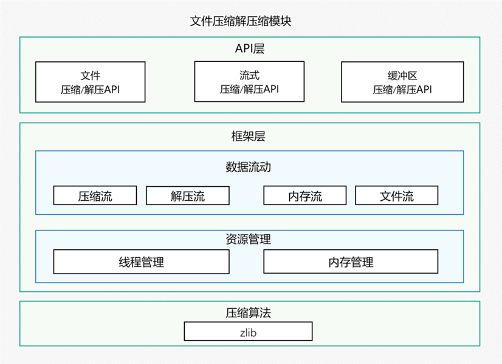

# 压缩解压缩概述

<!--Kit: Core File Kit-->
<!--Subsystem: FileManagement-->
<!--Owner: @rl123567-->
<!--Designer: @selina_jiang; @RainbowLLL-->
<!--Tester: @zheng1368-->
<!--Adviser: @jinqiuheng-->

从API版本26.0.0开始支持压缩解压缩模块，为应用提供了数据压缩和解压缩的能力，可用于文件打包分发、减少存储占用、加速网络传输等场景。根据数据来源和处理方式的不同，模块提供了以下三种压缩解压缩方式：

- **[文件归档类压缩解压缩](archive-file-compression-guidelines.md)**：将多个文件或目录打包为一个归档文件，或从归档中解压文件到指定目录。适合文件级别的打包和分发场景，支持目录结构保留和进度回调。如果需要对文件进行归档打包或从归档中解压文件，建议使用此方式。
- **[流式压缩解压缩](archive-stream-compression-guidelines.md)**：对连续数据流（如日志、网络数据流、实时传输数据）进行分段压缩或解压。适合数据量较大或数据边生成边处理的场景，支持分批次输入数据，内存占用可控。如果数据是流式产生的（如实时日志采集、网络传输），或数据量较大无法一次性加载到内存，建议使用此方式。
- **[缓冲区压缩解压缩](archive-buffer-compression-guidelines.md)**：对内存中的整块数据进行一次性压缩或解压。适合数据量较小且完整的场景，接口简单，操作快捷。如果数据已经在内存缓冲区中且数据量较小，建议使用此方式，开发更为简便。

## 架构原理

如图所示，文件压缩解压缩模块的架构分为以下三层：

- **API层**：提供三类压缩解压缩接口。
- **框架层**：实现数据流及资源管理的能力。
- **压缩算法层**：基于zlib等压缩算法实现数据的编解码，处理实际的数据压缩和解压缩逻辑。

采用分层设计，使模块具备良好的扩展性，开发者可以根据实际需求选择合适的压缩解压缩方式。

## 与相关模块的关系

Basic Services Kit还提供了基于ArkTS的[@ohos.zlib (Zip模块)](../reference/apis-basic-services-kit/js-apis-zlib.md)，用于文件和数据的压缩解压缩。二者主要差异如下：

| 模块 | Archive模块 | zlib模块 |
|---|---|---|
| **本质** | 面向高性能场景的自研压缩框架 | zlib C库的ArkTS封装及少量高层文件接口 |
| **适用场景** | 使用Native接口开发，对性能有要求，需要使用进度回调和取消操作接口[OH_Archive_Reader_SetProgressHandlerWithData](../reference/apis-core-file-kit/capi-oh-archive-h.md#oh_archive_reader_setprogresshandlerwithdata)，大数据流场景 | 仅使用ArkTS开发，需使用zlib全套底层能力 |